# 技术人员的经济学——均衡(第三部分)

> 原文：<https://towardsdatascience.com/economics-for-tech-people-equilibrium-part-3-74d3126b8c41?source=collection_archive---------42----------------------->

## *使用 R 和 ggplot2* 了解均衡经济学


rupixen.com 在 [Unsplash](https://unsplash.com?utm_source=medium&utm_medium=referral) 上[的照片](https://unsplash.com/@rupixen?utm_source=medium&utm_medium=referral)

欢迎来到技术人员经济学系列的第 3 部分！

本系列旨在帮助人们更好地理解经济学的基本原理，同时也培养使用 R 语言的技能。我注意到关于经济学有相当多的误解和完全错误的信息，所以这里的目标是澄清这些模糊的领域。

在这篇文章中，我们将探讨这样的问题:什么是均衡？如何找到均衡价格和数量？当数字计算不完美时会发生什么？我能期望获得多少收入？

本文假设你已经很好地理解了前面的两个部分，即[技术人员经济学—需求(第一部分)](/economics-for-tech-people-demand-part-1-44a9eb9a576a)和[技术人员经济学—供给(第二部分)](/economics-for-tech-people-supply-part-2-600fdce12cf2)。这里的大部分内容都是基于这两篇文章中的代码以及对概念的解释。如果你想要完整的故事，在开始之前先看看这些。

# 介绍

今天，我们将利用我在 Excel 文件中创建的一些真实数据，使用 R 编程语言来探索需求和供应数据的交集。

就像前两篇文章一样，我们使用一个软件即服务(SaaS)应用程序的 10 个假设的供应商和 10 个假设的需求者，该应用程序为每个许可证收取月费。这些公司是各种规模的良好组合，并且都有不同的弹性。

这里的目标是将曲线相互叠加，找出市场在什么价格和什么数量下会达到均衡

在这项工作中，我在 Mac 电脑上使用 RStudio，带有 R Markdown (RMD)文件。

所有的数据和完成的 RMD 文件都可以在我的 GitHub 这里获得。

注:如果您使用的是 Mac，请不要打开这些带有数字的文件。它会自动改变文件的编码，R 会不高兴的。如果发生这种情况，请删除您打开的文件，并下载一份新的 Excel 文件。

我还假设您可以设法在本地机器上设置一个 R 环境。最好将所有文件放在一个文件夹中，以简化工作流程。

我们开始吧！

# 代码

## 加载库

为了完成这个项目，我们需要 [*readxl*](https://readxl.tidyverse.org/) 和 [*tidyverse*](https://www.tidyverse.org/) 包。如果您的 R 环境中没有安装它们，只需删除代码[1]中“ *install.packages…* ”行前的“ *#* ”符号。一旦安装了它们，您就不需要在您的机器上再次安装它们。

代码如下:

```
# Load Libraries# If you do not have readxl or tidyverse installed, uncomment the following lines
# install.packages("readxl")
# install.packages("tidyverse")require(readxl)
require(tidyverse)
```

## 检查数据导入

有时候 Excel 文件和 R 交互的时候是有气质的，尤其是 RStudio。使用下面的代码导入数据，并检查数据是否正常。

代码如下:

```
# Import Data
Supply_Data <- read_excel("Supply_Data.xlsx")
Demand_Data <- read_excel("Demand_Data.xlsx")# Check data import
head(Supply_Data)
head(Demand_Data)
```

以下是输出结果:

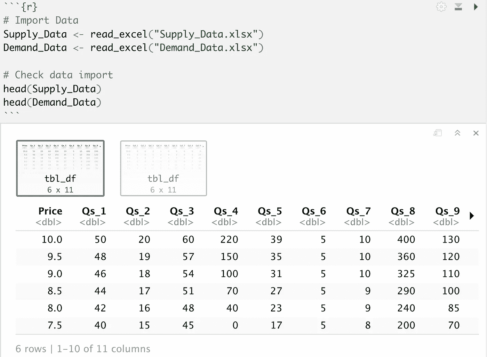

Mac 上 RStudio 中供应数据前六行的屏幕截图

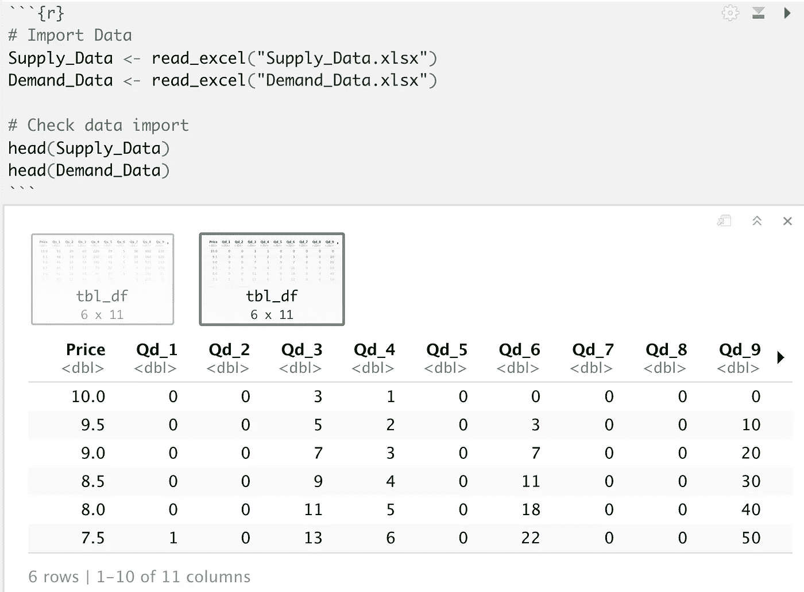

Mac 上 RStudio 中需求数据前六行的屏幕截图

如果你导入数据，而*价格*和 *Qs_#* 或 *Qd_#* 不是列标签，是数据的第一行，你大概会看到类似 *X1 X2 X3 等。*作为列标题。如果发生这种情况，你可以遵循我在上一篇文章[科技人的经济学——需求(第一部分)](/economics-for-tech-people-demand-part-1-44a9eb9a576a)的“*设置”*部分描述的相同过程。这将向您展示如何以不同的方式导入数据，从而跟上本文。

## 赶上进度

一旦有了数据，就应该复制/粘贴需求和供应代码的相关部分来完成繁重的工作。请参考这两篇文章，了解以下代码块的作用。

代码如下:

```
# Demand first# Wrangle the data into a ggplot friendly structure
Wrangled_Data <- data.frame(Price = Demand_Data$Price, stack(Demand_Data[2:11]))
names(Wrangled_Data)[2] <- "Quantity"
names(Wrangled_Data)[3] <- "Qd_num"# Create market demand
Market_Demand <- data.frame(Price = Demand_Data$Price, Market_Demand = rowSums(Demand_Data[2:11]))# Add Elasticity zones
# 10-6.5 zone 1
# 6-4 zone 2
# 3.5-2 zone 3
# 1.5-0 zone 4
Market_Demand$Elasticity_Zone <- as.character(c(1,1,1,1,1,1,1,1,2,2,2,2,2,3,3,3,3,4,4,4,4))# Supply second# Wrangle the data into a ggplot friendly structure
Wrangled_Supply_Data <- data.frame(Price = Supply_Data$Price, stack(Supply_Data[2:11]))
names(Wrangled_Supply_Data)[2] <- "Quantity"
names(Wrangled_Supply_Data)[3] <- "Qs_num"# Create market supply
Market_Supply <- data.frame(Price = Supply_Data$Price, Market_Supply = rowSums(Supply_Data[2:11]))# Add Elasticity zones
# 10-5.5 zone 1
# 5-4 zone 2
# 3.5-0 zone 3
Market_Supply$Elasticity_Zone <- as.character(c(1,1,1,1,1,1,1,1,1,1,2,2,2,3,3,3,3,3,3,3,3))
```

## 绘制均衡图

现在我们赶上了，让我们画出均衡图。

为此，我们将再次使用 ggplot。这一次有一点不同的是，代码将从第一行开始，然后一次添加一行来构建图形，而不是先将所有内容合并在一起，然后尝试用困难的方式来完成。

代码的 *geom_line()* 部分将声明我们使用的数据、美学，并分配几个其他样式参数。为了让它看起来更好，这段代码添加了垂直线和水平线来勾勒出轴的轮廓。我还决定用 *xlim()* 函数限制数据范围，因为我们实际上不会对太靠右的数据做任何事情。最后，应用一些标签。

代码如下:

```
# Plot the equilibrium
ggplot() +
  geom_line(data = Market_Supply, aes(x = Market_Supply, y = Price), color = "darkred", size = 1) +
  geom_line(data = Market_Demand, aes(x = Market_Demand, y = Price), color = "steelblue", size = 1) +
  geom_vline(xintercept = 0) +
  geom_hline(yintercept = 0) +
  xlim(0, 1150) +
  ggtitle("Market Equlibrium") +
  theme(plot.title = element_text(hjust = 0.5)) + 
  xlab("Quantity") +
  ylab("Price")
```

以下是输出结果:

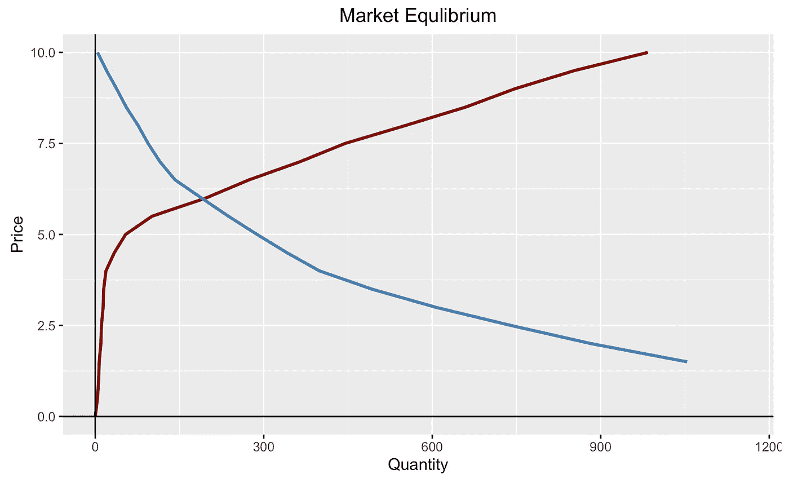

Mac 上 RStudio 中平衡图的屏幕截图

嗯，成功了！

在经济学中，运行良好的市场在需求数量等于供给数量的平衡点上运行[2]。这通常也被称为*市场清算价格*，因为所有生产的数量都是需求[2]。换句话说，没有短缺，也没有过剩[2]。

目测一下上面的图，看起来我们有一个大约 6 美元的市场清算价格和大约 200 个单位的平衡数量。

让我们确认一下这些数字，再精确一点。

## 找出均衡数量和市场清算价格

首先，我要说的是，我们可能至少有十几种方法可以做到这一点。为了简单起见，并使本文的范围易于理解，我们将避免使用微积分，并采用一种“对谁来说足够好”的方法，这种方法无论如何都会产生几乎相同的答案。

> 无关注意:短语“对谁来说足够好”是引用自一个承包商的话，当我还是个孩子的时候，他为我的房子工作。这是一个小问题，但据我所知，房子仍然是完整的！

无论哪种方式，我们都将采用这种心态。

我们将从将需求和供应数据连接到一个对象开始。我是使用 *inner_join()* 函数和通过 *Price* 加入的粉丝，因为它简单。它还能确保一切正常。由于我们在每个数据集中有一个相同行数的公共列， *inner_join()* 基本上充当一个“拉链”函数，将数据集组合成一个干净的产品[1]。

代码如下:

```
# Join data together
Merged_data <- inner_join(Market_Demand, Market_Supply, by = "Price")
head(Merged_data)
```

以下是输出结果:

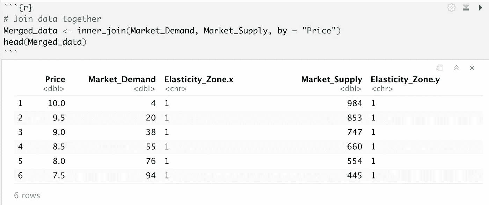

在 Mac 上合并 RStudio 中的需求和供应数据的 *inner_join()函数的屏幕截图*

接下来，让我们找出供给数量和需求数量之间的差异最小的地方。我们知道它们因为图形而相交，所以对应于最小差异的价格应该是我们的市场出清价格[2]。

代码如下:

```
# Find difference between supply and demand
Merged_data$Diff <- Merged_data$Market_Supply - Merged_data$Market_Demand
Merged_data
```

以下是输出结果:

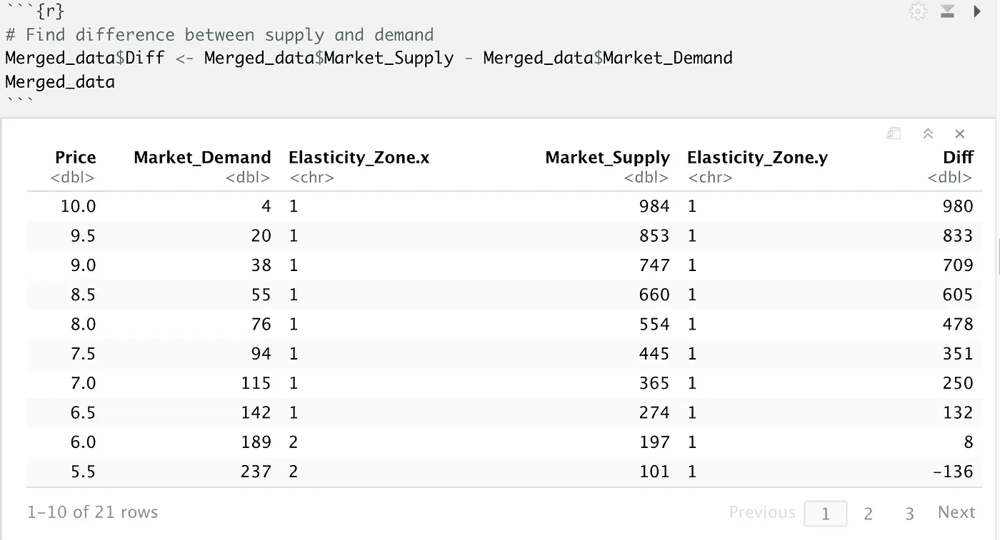

Mac 上 RStudio 中带有数量差异栏的合并数据的屏幕截图

只要看一下图表，我们就可以知道，在 6 美元的价格下，我们看到的最小差异是 8 个单位。然而，如果我们有更多的数据，并且很难直观地分辨，会发生什么呢？

我们可以使用 *which.min()* 函数的组合来找到我们想要的最小值，在本例中是 *Diff* ，并使用 *abs()* 函数来获得*Diff*【1】的绝对值。绝对值函数是必要的，因为它不是像我们想要的那样给我们一个最小的差值，而是一个最大的负数，这不是我们想要的。函数末尾的逗号指定我们需要整行[1]。对于加分，试着去掉它，看看有什么不同。

代码如下:

```
# Find row of minimum difference
min_diff_1 <- Merged_data[which.min(abs(Merged_data$Diff)),]
min_diff_1
```

以下是输出结果:

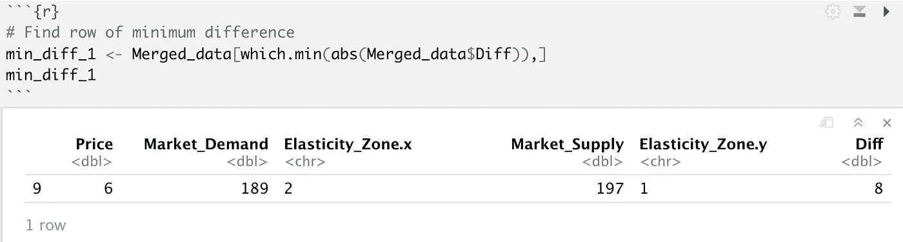

Mac 上 RStudio 中需求和供应差异最小的行的屏幕截图

## 修改情节

接下来，我们将从几个方面修改前面的情节。首先，让我们更改 *xlim()* 函数中的值，以便我们可以放大到更接近交叉点的位置。第二，我们可以在市场结算价格和数量上添加一些线，以便更好地可视化我们的数据。为最小差异行创建专用对象的一个优点是，我们可以在这里引用它，而不必手动输入数字或以另一种方式重复计算。

代码如下:

```
# Add lines to previous graph based on the min_diff_1 numbers# Plot the equilibrium
ggplot() +
  geom_line(data = Market_Supply, aes(x = Market_Supply, y = Price), color = "darkred", size = 1) +
  geom_line(data = Market_Demand, aes(x = Market_Demand, y = Price), color = "steelblue", size = 1) +
  geom_vline(xintercept = 0) +
  geom_hline(yintercept = 0) +
  xlim(0, 300) + ### ZOOM IN A BIT ###
  ggtitle("Market Equlibrium") +
  theme(plot.title = element_text(hjust = 0.5)) + 
  xlab("Quantity") +
  ylab("Price") +
  ### NEW LINES ###
  geom_hline(yintercept = min_diff_1$Price) +
  geom_vline(xintercept = min_diff_1$Market_Demand) + 
  geom_vline(xintercept = min_diff_1$Market_Supply)
```

以下是输出结果:

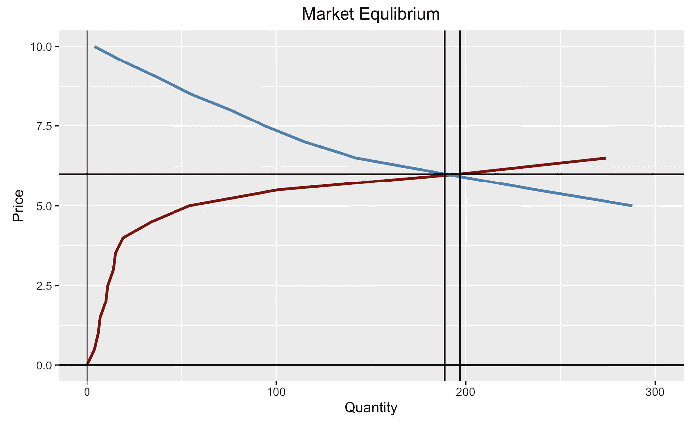

Mac 上 RStudio 中带有市场清算价格和近似平衡数量线的平衡图的屏幕截图

那么，为什么有两条竖线而不是一条呢？

事实证明，我们的数据精度导致了一个小问题，我们没有一个完全完美的交集。我选择将两者都放在图表上，以使这一点变得明显。

这就是说，我们应该对市场出清价格为 6 美元，真正的均衡数量在 190 年代的某个地方感觉良好[2]。

## 总收入

经济学中最直接的计算方法之一是总收入，因为它就是价格乘以单位总数[2]。当处于均衡时，它是市场清算价格和在该价格下的需求量[2]。

对我们来说，我们将再次引用 *min_diff_1* 对象，因为它包含我们的市场清算价格和数量。在计算中，我选择用 *mean()* 函数对需求和供应数据进行平均，然后乘以价格。这使我们在该市场的总收入达到 1，134 美元。

代码如下:

```
# Calculate total revenue
total_revenue <- min_diff_1$Price * mean(min_diff_1$Market_Demand, min_diff_1$Market_Supply)
total_revenue
```

以下是输出结果:

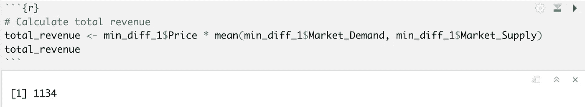

Mac 上 RStudio 中按市场出清价格计算的市场总收入截图

## 比较和对比结果

请记住，在本系列的前两部分中，供应商希望以更高的价格销售更多的产品。

对于我们拥有的数据，当以每单位 10 美元的价格销售时，供应方的最大总收入是 9，840 美元。

在需求方面，我们的最高总收入为 1，850 美元，单价为 2.50 美元。

当我们在真实的市场场景中结合我们的数据时，市场的妥协变得很明显。市场出清价格是商品和服务的供需双方在中间相遇的地方[2]。当然，双方都没有达到理想或理论上的最大值，但这就是市场的本质。

## 额外材料—用线性模型预测平衡

我们有非常接近的数据，这当然很好，但是如果我们研究一些更理论化的东西，会发生什么呢？从这篇文章和前两篇文章中我们知道，我们有不同的弹性区域。从图形上看，我们可以看到非常接近 6 美元的价格是正确的，但如果我们只有几个数据点，并对线的斜率有很好的猜测，会怎么样呢？

我们将借用第一篇文章中的一些代码，创建一些线性模型，看看它们在哪里相交。这里重要的是，我们的模型解释了 99%以上的因变量，预测能力非常重要，因为我们在以下两个模型中的 p 值都非常小[1]。

关于 R 平方值和 p 值的含义的更完整的讨论，请参考前两篇文章，因为我在这里假设当我引用这些值时，您知道我的意思。

当我们查看我们的 *min_diff_1* 对象时，我们可以看到需求在弹性区 2 下降，而供应在弹性区 1。考虑到这一点，我们只需要建立线性模型。

先说供给。

代码如下:

```
# Create Supply linear model# Filter Data
supply_lm_data <- Market_Supply %>%
  filter(Elasticity_Zone == 1)# Create linear model
Supply_Zone_1_lm <- lm(Market_Supply ~ Price, data = supply_lm_data)# Create and print summary
summary(Supply_Zone_1_lm)
```

以下是输出结果:

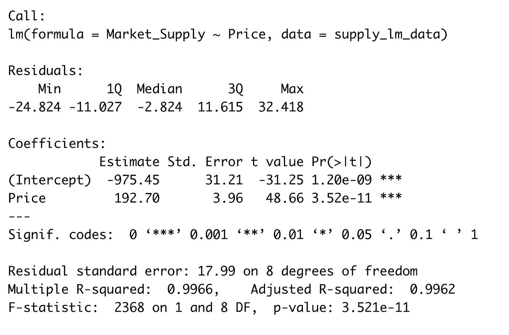

Mac 上 RStudio 中 1 区供应数据线性模型的汇总统计屏幕截图

需求是下一个。

代码如下:

```
# Create Demand linear model# Filter Data
demand_lm_data <- Market_Demand %>%
  filter(Elasticity_Zone == 2)# Create linear model
Demand_Zone_2_lm <- lm(Market_Demand ~ Price, data = demand_lm_data)# Create and print summary
summary(Demand_Zone_2_lm)
```

以下是输出结果:

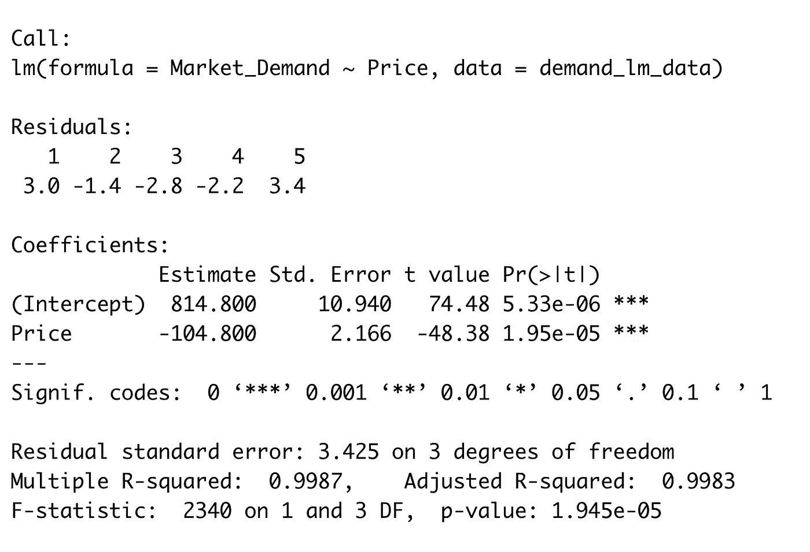

Mac 上 RStudio 中 2 区需求数据线性模型的汇总统计屏幕截图

接下来，我们将创建一个快速的数字序列作为新的价格数据。我将价格从 5.50 美元调整到 6.50 美元，因为这个范围正好符合供给和需求数据的弹性区域。我们将它增加 0.01 美元，这样我们可以得到更精确的结果。

代码如下:

```
# new price data
new_price_data <- data.frame(Price = seq(5.5, 6.5, by = 0.01))
```

之后，我们将使用经典的代数公式 *y=mx + b* 来整合我们的新数据。这将把我们的线性模型的截距加上斜率乘以价格加到一个大数据框架中。我们也可以用 *round()* 函数将这个数字四舍五入到小数点后 0 位，因为如果你考虑一下，出售一小部分 SaaS 订阅是没有多大意义的。

代码如下:

```
# Use coefficient and intercept data to fill in the blanks# Supply first
new_price_data$supply <- round(Supply_Zone_1_lm$coefficients[1] + (Supply_Zone_1_lm$coefficients[2] * new_price_data$Price), 0)# Demand next
new_price_data$demand <- round(Demand_Zone_2_lm$coefficients[1] + (Demand_Zone_2_lm$coefficients[2] * new_price_data$Price), 0)
```

最后，我们将做同样的基本减法，得到需求和供给之间的差异的 *Diff* 列，就像我们之前做的那样。我们也可以检查数据，以确保它是正确的。

代码如下:

```
# Find difference between supply and demand
new_price_data$Diff <- new_price_data$demand - new_price_data$supply# Check the data
head(new_price_data)
```

以下是输出结果:

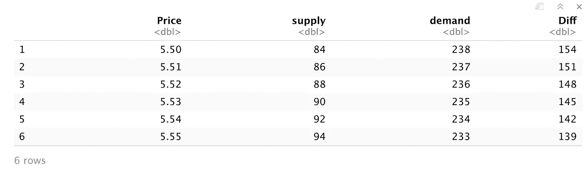

Mac 上 RStudio 中每个新价格的预测供应、需求和差值表的屏幕截图

总结一下，我们将再次找到最小的绝对值差，以获得价格和数量。

代码如下:

```
# Find row of minimum difference
min_diff_2 <- new_price_data[which.min(abs(new_price_data$Diff)),]
min_diff_2
```

以下是输出结果:

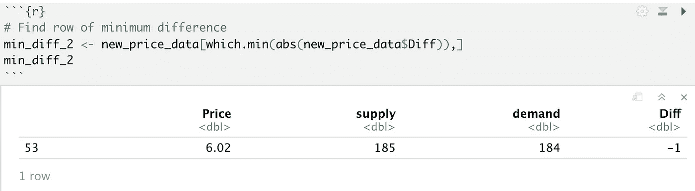

Mac 上 RStudio 中预测数据的最小绝对值差异的屏幕截图

这里的结果非常相似。预测值给出了 6.02 美元的市场清算价格和 184 或 185 的均衡数量，这与真实数据非常接近。

在商业现实中，只要把价格定为 6 美元，并对结果感到满意，这就是巨大的支持。

# 结论

读完这三篇文章后，希望你对供给、需求和均衡在经济学意义上的含义有了更好的理解。具体到这里的均衡，我们的工作更多的是图形化的，而不是数学化的，因为我们在以前的文章中做了大量的数字运算。幸运的是，我们已经为 6 美元的市场出清价格建立了一个坚实的案例，并且很有可能销售不到 200 单位的 SaaS 产品。在现实生活中，这些数字可能会在两个方向上有所波动，但对于从个人原始数据开始的均衡分析来说，这肯定是一个现实的结果，一直到了解一项服务的整个有效运营市场。

# 参考

[1] R. Kabacoff， *R 在行动(第二版。)* (2015)，纽约州谢尔特岛:曼宁出版公司。

[2] F .米什金，*《货币经济学》，银行学，&《金融市场》(第 9 版。)* (2010)，马萨诸塞州波士顿:培生教育有限公司。