# 技术人员的经济学——供应(下)

> 原文：<https://towardsdatascience.com/economics-for-tech-people-supply-part-2-600fdce12cf2?source=collection_archive---------59----------------------->

## *使用 R 和 ggplot2* 了解需求经济学


在 [Unsplash](https://unsplash.com?utm_source=medium&utm_medium=referral) 上[科学高清](https://unsplash.com/@scienceinhd?utm_source=medium&utm_medium=referral)摄影

欢迎来到技术人员经济学系列的第二部分！

这个项目旨在帮助人们同时学习基本的经济学概念和 R 编程。我注意到关于经济学有相当多的误解和完全错误的信息，所以这里的目标是澄清这些模糊的领域。

什么是供给？谁提供东西？供应量和供应量之间有什么区别？我应该对我的商品或服务做多少评价？怎么才能算出最大总收入？

我将引用我以前的文章[技术人员的经济学——需求(第一部分)](/economics-for-tech-people-demand-part-1-44a9eb9a576a)中的许多观点，所以在开始这个项目之前，请确保您已经看过了。我将把这篇文章作为一个独立的项目来写，但是随着时间的推移，这个系列将建立在它自己的基础上。

# 介绍

今天，我们将使用 R 编程来分析和可视化我在 Excel 文件中创建的一些真实数据，从而探索供应方面的概念。

我们将使用 10 家假设的公司来分析对我们假设的新软件即服务(SaaS)应用程序的需求，该应用程序对每个许可证收取月费。这里有各种各样的公司，从小型到大型，他们愿意以什么价格出售多少许可证。

然后，我们将检查市场供应以及打破需求弹性的概念，试图找到我们最大化总收入的地方。

在这项工作中，我在 Mac 电脑上使用 RStudio，带有 R Markdown (RMD)文件。

所有的数据和完成的 RMD 文件都可以在我的 GitHub 这里获得。

注意:如果您使用的是 Mac，请不要打开带有数字的文件。它会自动改变文件的编码，R 会不高兴的。如果发生这种情况，请删除该文件并下载一份新的 Excel 文件。

我还假设您可以设法在本地机器上设置一个 R 环境。最好将所有文件放在一个文件夹中，以简化工作流程。

我们开始吧！

# 代码

## 加载库

为了完成这个项目，我们需要 [*readxl*](https://readxl.tidyverse.org/) 和 [*tidyverse*](https://www.tidyverse.org/) 包。如果您的 R 环境中没有安装它们，只需删除代码[1]中“ *install.packages…* ”行前的“ *#* ”符号。一旦安装了它们，您就不需要在您的机器上再次安装它们。

代码如下:

```
# Load Libraries# If you do not have readxl or tidyverse installed, uncomment the following lines
# install.packages("readxl")
# install.packages("tidyverse")# Load Libraries
require(readxl)
require(tidyverse)
```

## 检查数据导入

有时候 Excel 文件和 R 交互的时候是有气质的，尤其是 RStudio。使用下面的代码导入数据，并检查数据是否正常。

代码如下:

```
# Import Data
Supply_Data <- read_excel("Supply_Data.xlsx")# Check data import
head(Supply_Data)
```

以下是输出结果:

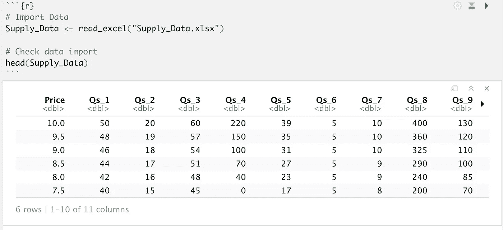

Mac 上 RStudio 中供应数据前六行的屏幕截图

如果您导入数据，并且*价格*和 *Qs_#* 不是列标签，而是数据的第一行，您可能会看到类似于 *X1 X2 X3 等内容。*作为列标题。如果发生这种情况，你可以遵循我在上一篇文章[科技人的经济学——需求(第一部分)](/economics-for-tech-people-demand-part-1-44a9eb9a576a)的“*设置”*部分描述的相同过程。这将向您展示如何以不同的方式导入数据，从而跟上本文。

## 快速测试图

做一个快速的图表总是一个好主意，只是为了让数据看起来很好，并且是合作的。它不一定要漂亮，但它可以帮助早期诊断问题。因为我们在看供给曲线，我们应该看到一个总的趋势，即根据供给定律，随着价格的增加，供给量(Qs_#)值会增加。让我们选择一家假设的公司来看看。

代码如下:

```
# Test plot
plot(Supply_Data$Qs_2, Supply_Data$Price, type = "l", main = "Test Plot", xlab = "Quantity", ylab = "Price")
```

以下是输出结果:

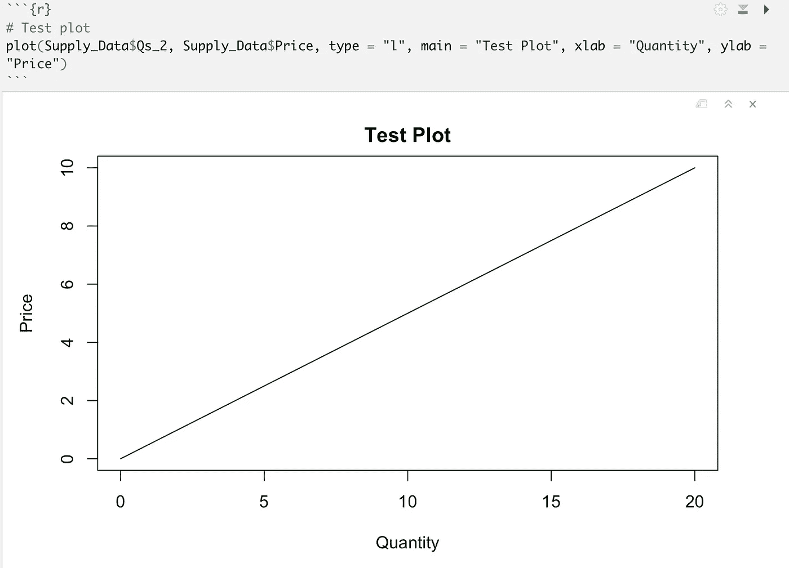

快速绘制其中一个数量列与价格的关系图，以便在 Mac 上检查 RStudio 中的数据

为了加分，你可以试着改变公司编号，自己制作不同公司的图表。我在这里选择了公司 2，但 1 到 10 之间的任何数字都可以，并给出不同的曲线。

## 绘制所有单个供应曲线

好代码的美妙之处在于它可以被快速、轻松地重用和修改。为了实现绘制所有单个供应曲线的目标，我们将在 ggplot2 [1]内的 *facet_wrap()* 函数内结合数据框对象类使用相同的 *stack()* 函数。重命名列有助于我们的理智和可读性，因为 R 会自动将列重命名为我们不希望它们被称为[1]的名称。

我们这样做是因为 ggplot2 以某种方式喜欢数据，所以我们可以获得更好的数据结构来利用它的函数，而不是试图让函数直接做一些它们不打算做的事情。

代码如下:

```
# Wrangle the data into a ggplot friendly structure
Wrangled_Supply_Data <- data.frame(Price = Supply_Data$Price, stack(Supply_Data[2:11]))
names(Wrangled_Supply_Data)[2] <- "Quantity"
names(Wrangled_Supply_Data)[3] <- "Qs_num"# Check the data
head(Wrangled_Supply_Data)
```

以下是输出结果:

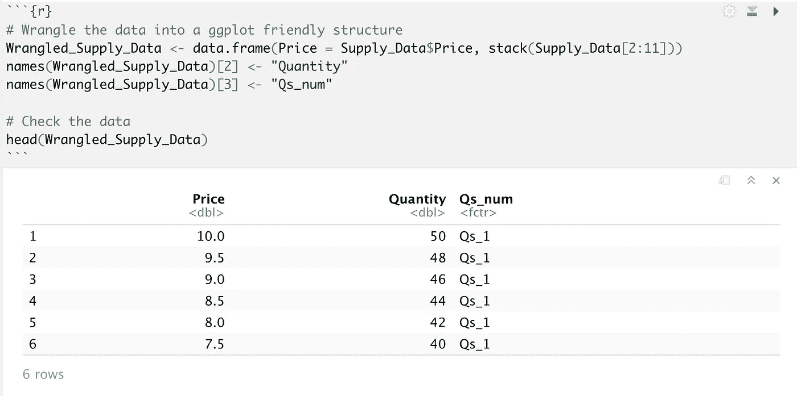

Mac 上 RStudio 中 ggplot 友好结构中的前六行争论和标记供应数据

既然我们已经将数据整理成了一个合适的结构， *facet_wrap()* 将会更好地与我们合作。

代码如下:

```
# Plot the individual supply curves
ggplot(data = Wrangled_Supply_Data, aes(x = Quantity, y = Price)) +
  geom_line(color = "darkred", size = 1) +
  geom_point(color = "darkred") +
  facet_wrap(. ~ Qs_num)
```

以下是输出结果:


Mac 上 RStudio 中数据集中所有单个电源曲线的绘图屏幕截图

让我们思考一下，在这个市场上有许多公司提供类似的 SaaS 解决方案的背景下，这意味着什么。这 10 家公司中的每一家在每一价格下都有不同的供应量组合[2]。

根据供应定律，随着价格的上涨，供应商希望供应更多的单位[2]。直觉上这是有道理的。做生意的全部目的就是赚钱，所以以更高的价格卖出更多的产品将是任何追求利润的企业的计划。我们反映了每个公司的情况。

我们也看到，我们的公司通常只会在某个价格后才开始供货。追求利润的企业不是慈善机构，所以他们只会在对公司来说值得的时候才开始供应设备。

企业，尤其是那些在竞争市场中提供 SaaS 服务的企业，在开始销售时有一定的成本水平，并且随着时间的推移成本会增加，这就是为什么需要更高的价格来证明提供更多单位的合理性[2]。

## 市场供应

就像上一篇文章中的市场需求一样，市场供给是所有个体企业供给曲线的总和[2]。对于每个价格，我们将所有 10 家公司的数量加在一起，得到市场供应曲线的最终数字[2]。

代码如下:

```
# Create market supply
Market_Supply <- data.frame(Price = Supply_Data$Price, Market_Supply = rowSums(Supply_Data[2:11]))# Check the data
head(Market_Supply)
```

以下是输出结果:

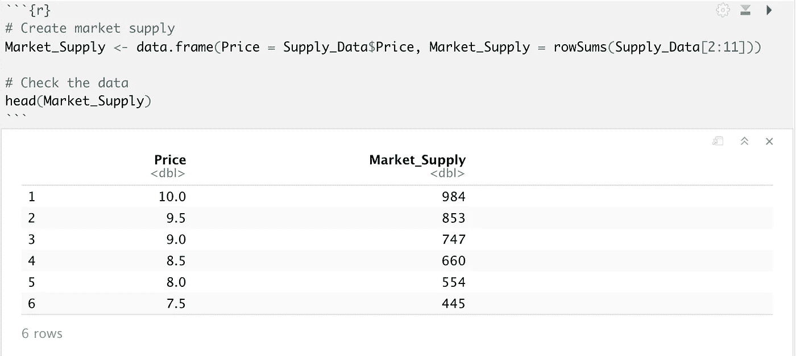

Mac 上 RStudio 中的市场供应截图

## 绘制市场供应图

我们将继续使用 ggplot 并添加一些样式组件来可视化市场供应。

代码如下:

```
# Plot market supply curve
ggplot(data = Market_Supply, aes(x = Market_Supply, y = Price)) +
  geom_line(color = "darkred", size = 1) +
  geom_point(color = "darkred") +
  geom_vline(xintercept = 0) +
  geom_hline(yintercept = 0) +
  ggtitle("Market Supply Curve") +
  theme(plot.title = element_text(hjust = 0.5))
```

以下是输出结果:

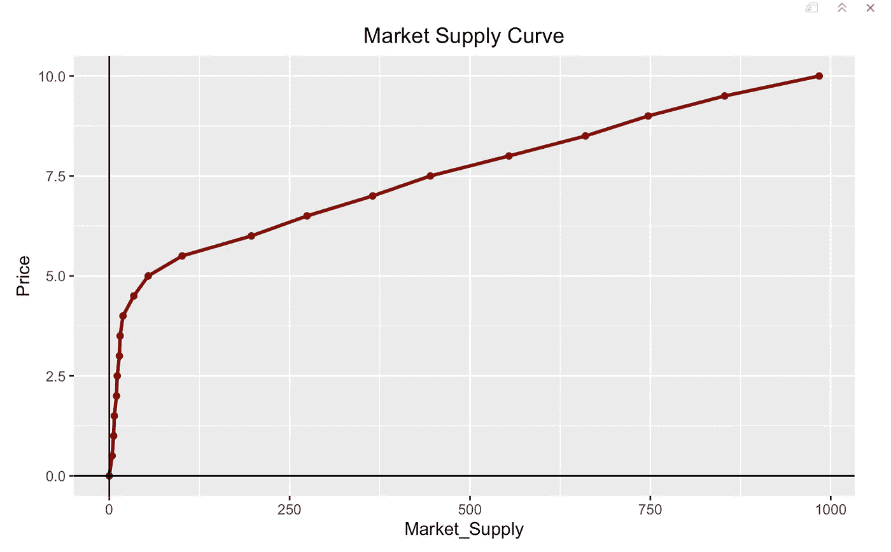

Mac 上 RStudio 中的市场供应图截图

就像第一篇文章中的市场需求曲线一样，我在曲线上看到了三个不同的区域，价格的变化以显著不同的方式改变了供应量。

这就引出了弹性的概念。

## 弹性

弹性的基本思想就是决定每单位价格变化时的供给量变化[3]。在关于需求的第一篇文章中，数学解释得更加详细。我们现在要做的是看看曲线的不同区域。

当供给曲线相对*无弹性*时，意味着单位供给量的变化小于价格的变化【3】。当供给曲线相对*弹性*时，单位供给量的变化大于价格的变化【3】。

这条曲线有三个不同的区域。在开始时有一个相对无弹性的区域，在过渡发生的中间部分，在较高的量处有一个相对有弹性的区域[3]。

同样，就像按需文章一样，我指定了弹性区域来简明地说明这一点。

代码如下:

```
# Add Elasticity zones
# 10-5.5 zone 1
# 5-4 zone 2
# 3.5-0 zone 3Market_Supply$Elasticity_Zone <- as.character(c(1,1,1,1,1,1,1,1,1,1,2,2,2,3,3,3,3,3,3,3,3))
Market_Supply
```

以下是输出结果:

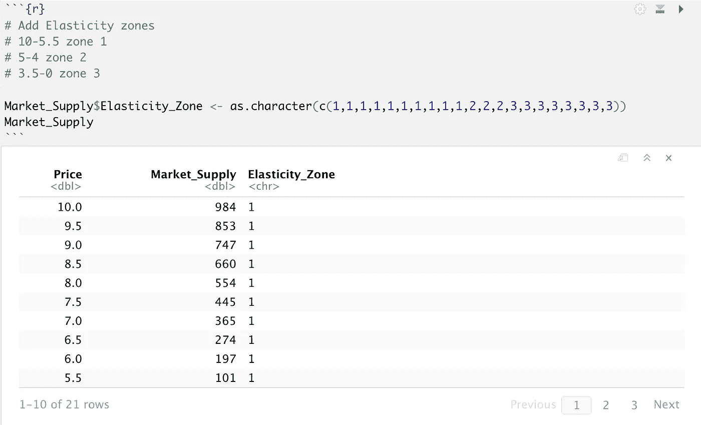

Mac 上 RStudio 中弹性区域的市场供应截图

这里我最喜欢的一个小技巧是用 *as.character()* 函数将弹性区域指定为字符而不是数字。这将使 ggplot 与区域合作，因为它意识到它们不是用来做数学运算的数字，而是本质上是分类的[1]。

## 用弹性区域绘制市场供给图

我们将通过在 *aes()* 函数中添加 *color = Elasticity_Zone* 来增加之前的市场供应代码，以便 ggplot 知道为每个区域分配不同的颜色[1]。我们还将添加带有 *method = "lm"* 参数的 *geom_smooth()* 函数，使其为每个弹性区域建立线性模型[1]。

代码如下:

```
# Plot market supply with elasticity
ggplot(data = Market_Supply, aes(x = Market_Supply, y = Price, color = Elasticity_Zone)) +
  geom_line(size = 1) +
  geom_point() +
  geom_smooth(method = "lm") +
  geom_vline(xintercept = 0) +
  geom_hline(yintercept = 0) +
  ggtitle("Market Supply with Elasticity Zones") +
  theme(plot.title = element_text(hjust = 0.5))
```

以下是输出结果:

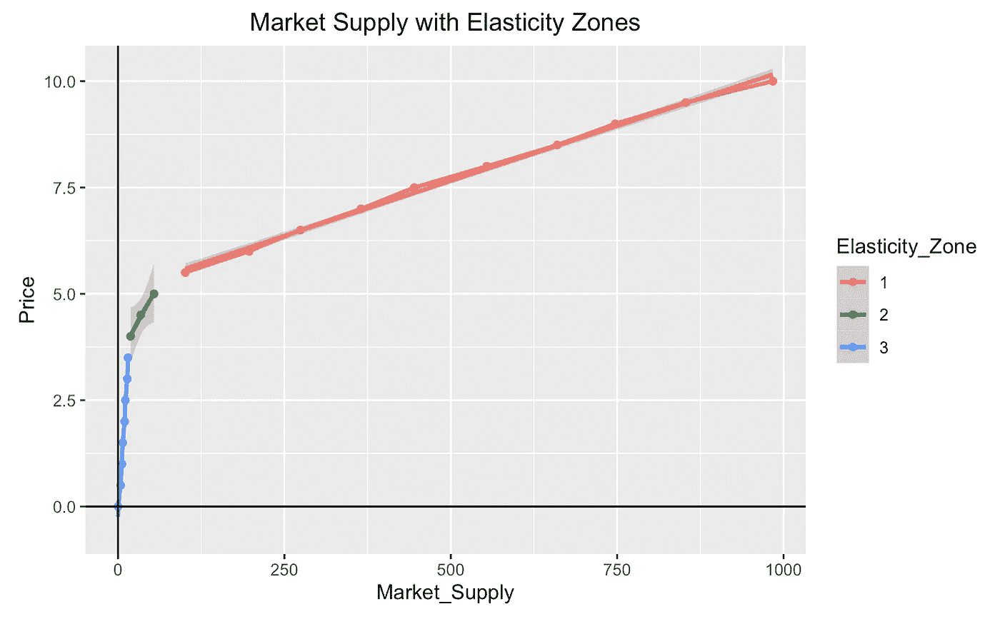

Mac 上 RStudio 中市场供应的弹性区域截图

## 线性模型和弹性

由于我们在关于需求的文章中研究了使用 *lm()* 函数的线性模型的细节，这次我们将使用使用 *glm()* 函数的广义线性模型来检查关于三个弹性区域的质量。

让我们看一下三个弹性区域的代码和输出，以及整个曲线的广义线性模型，以便更好地理解这个概念。

代码如下:

```
### Create Linear Models #### Filter Data
Zone_1_glm_data <- Market_Supply %>%
  filter(Elasticity_Zone == 1)# Create linear model
Zone_1_glm <- glm(Market_Supply ~ Price, data = Zone_1_glm_data)# Create and print summary
summary(Zone_1_glm)
```

以下是输出结果:


Mac 上 RStudio 中弹性区域 1 的广义线性模型的汇总统计屏幕截图

代码如下:

```
# Filter Data
Zone_2_glm_data <- Market_Supply %>%
  filter(Elasticity_Zone == 2)# Create linear model
Zone_2_glm <- glm(Market_Supply ~ Price, data = Zone_2_glm_data)# Create and print summary
summary(Zone_2_glm)
```

以下是输出结果:

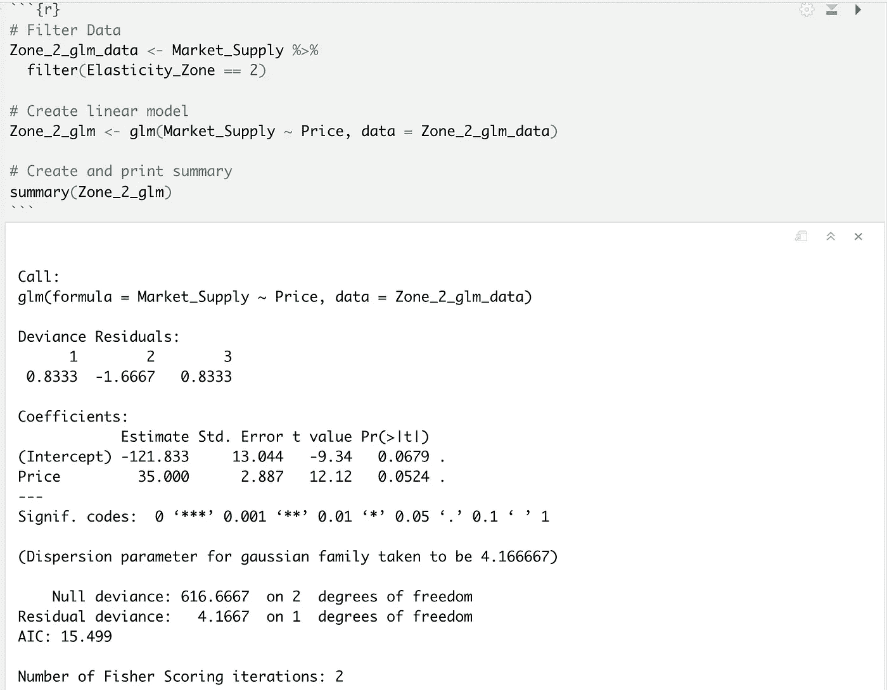

Mac 上 RStudio 中弹性区域 2 的广义线性模型的汇总统计数据截图

代码如下:

```
# Filter Data
Zone_3_glm_data <- Market_Supply %>%
  filter(Elasticity_Zone == 3)# Create linear model
Zone_3_glm <- glm(Market_Supply ~ Price, data = Zone_3_glm_data)# Create and print summary
summary(Zone_3_glm)
```

以下是输出结果:

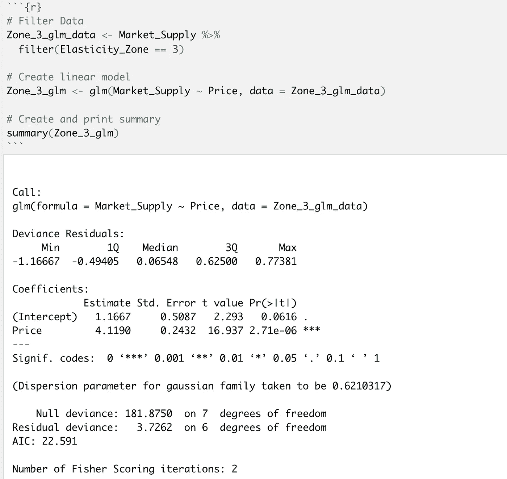

Mac 上 RStudio 中弹性区域 3 的广义线性模型的汇总统计屏幕截图

代码如下:

```
# Compare against a GLM for the entire market supply# Create linear model
All_supply_glm <- glm(Market_Supply ~ Price, data = Market_Supply)# Create and print summary
summary(All_supply_glm)
```

以下是输出结果:

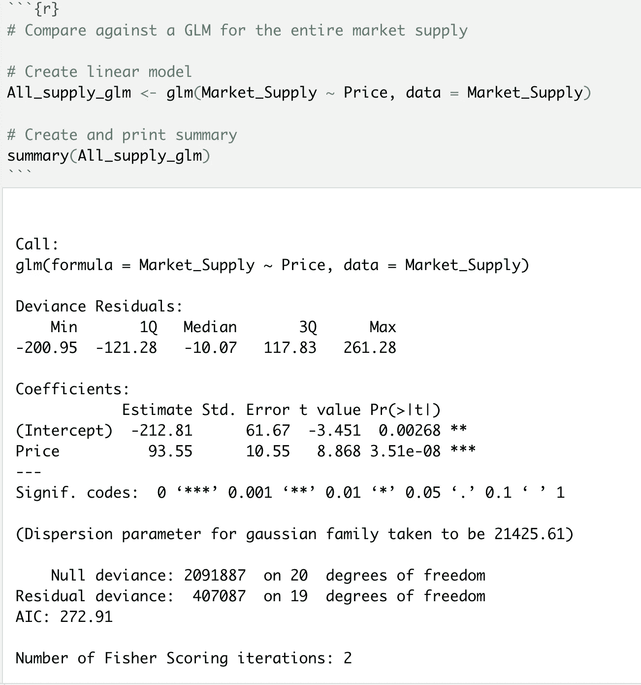

Mac 上 RStudio 中所有市场供应的广义线性模型的汇总统计屏幕截图

我们想看看所有这些输出中的两个组成部分。

首先，*价格*系数的*估算*栏告诉我们直线的斜率。简单地说，数字越大，曲线就越没有弹性[1][3]。数字越小，曲线相对弹性越大[1][3]。当参考前三个输出时，我们对曲线[1]不同部分的供应量有很好的预测能力。**

其次，我们想看看底部的 *AIC* (阿凯克信息准则)值。AIC 越接近 0，我们的模型就越适合。在前三个弹性区，我们有极小的 AIC 值，表明模型与线[1]密切相关。当试图获得所有数据的线性模型时，AIC 值要高 10-15 倍。这意味着我们有一个明显更差的拟合[1]。

我们可以看到，在处理非教科书数据时，假设整个市场的弹性是多么荒谬。

代码如下:

```
# Look at the linear model line on the graph without looking at elasticity of different parts of the curve
# Plot market supply with elasticity
ggplot(data = Market_Supply, aes(x = Market_Supply, y = Price)) +
  geom_line(size = 1) +
  geom_point() +
  geom_smooth(method = "lm", color = "darkred") +
  geom_vline(xintercept = 0) +
  geom_hline(yintercept = 0) +
  ggtitle("Linear Model of Market Supply without Elasticity Zones") +
  theme(plot.title = element_text(hjust = 0.5))
```

以下是输出结果:

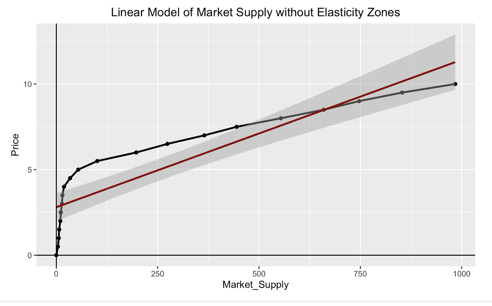

Mac 上 RStudio 中市场供应数据的线性模型可视化效果不佳

## 最大化总收入

与我们在需求文章中得到的答案不同，从供应商的角度来看，最大化总收入就是以更高的价格销售更多的产品[3]。当我们看一看在每个价格水平上产生的总收入时，我们可以看到这一思想反映了供给定律及其预测[3]。

代码如下:

```
# Maximize Total Revenue
Market_Supply$Total_Revenue = Market_Supply$Price * Market_Supply$Market_Supply# Check the data
Market_Supply
```

以下是输出结果:

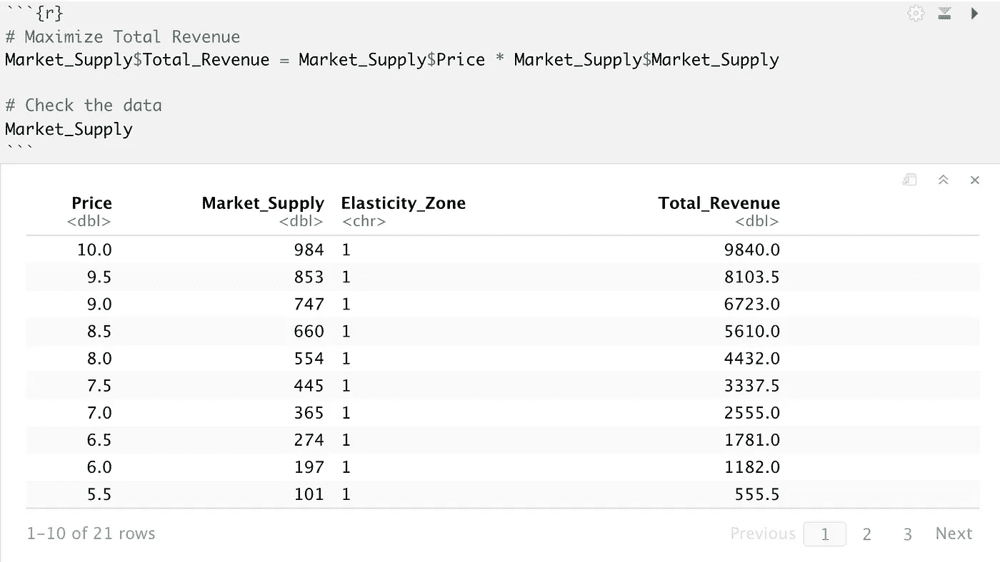

Mac 上 RStudio 中市场供应数据的总收入屏幕截图

## 绘制总收入曲线

当可视化这些数据时，很明显，一旦我们达到供应曲线的相对弹性部分，随着我们以更高的价格销售更多的单位，总收入会显著增加[3]。

代码如下:

```
# Plot market supply with elasticity
ggplot(data = Market_Supply, aes(x = Price, y = Total_Revenue, color = Elasticity_Zone)) +
  geom_line(size = 1) +
  geom_point() +
  geom_vline(xintercept = 0) +
  geom_hline(yintercept = 0) +
  ggtitle("Total Revenue Curve for Market Supply with Elasticity Zones") +
  theme(plot.title = element_text(hjust = 0.5))
```

以下是输出结果:

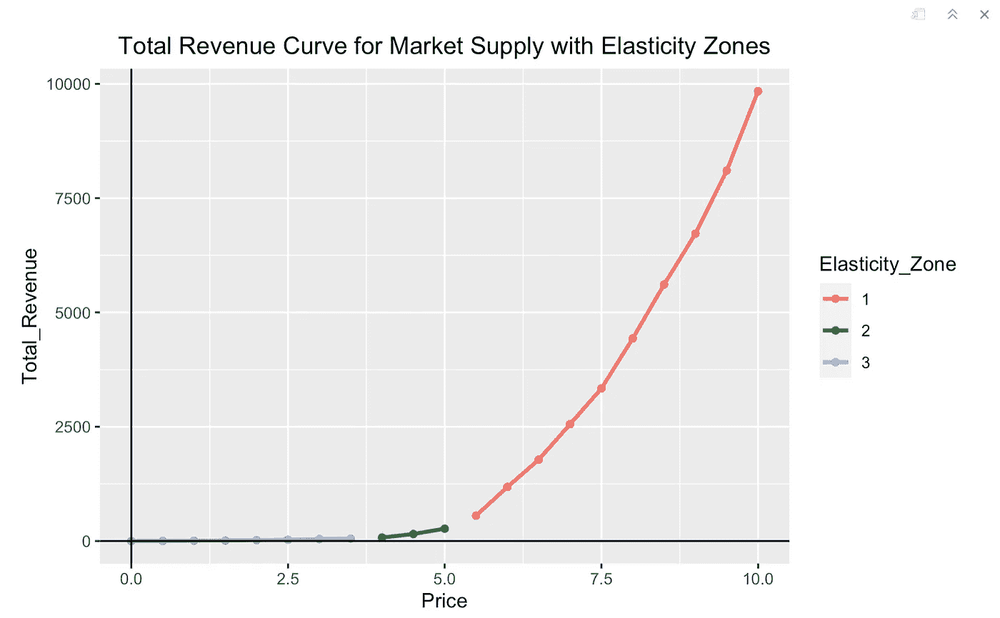

Mac 上 RStudio 中市场数据的总收入曲线截图

# 结论

这里的要点是，市场是由许多公司组成的[2]。这些企业都有自己的能力在整个市场内生产商品和服务[2]。由于成本和定价的诸多因素，大多数公司只有在价格足够高时才会开始生产[2]。

供应法则告诉我们，随着价格上涨，供应商将供应更多的单位。当我们根据弹性将整个市场供给曲线分解成不同的部分时，我们可以看到，在曲线相对无弹性的部分提高价格对供给量的影响很小[3]。在曲线相对更有弹性的部分，供应商愿意以相对较小的价格增长供应更多的单位[3]。

综上所述，我们发现“供应”一词有细微差别。希望在本文结束时，您能更好地理解供应方面的关键术语，以及供应商必须如何响应市场。在本系列的下一部分中，我们将根据这篇文章和上一篇关于需求的文章来看看供应和需求之间的相互作用！

# 参考

[1] R .卡巴科夫， *R 在行动(第 2 版。)* (2015)，纽约州谢尔特岛:曼宁出版公司

[2] F .米什金，*《货币经济学》，银行业，&《金融市场》(第 9 版。)* (2010)，马萨诸塞州波士顿:培生教育公司。

[3]明尼苏达大学， *5.3 供给价格弹性*(未注明)[https://open . lib . umn . edu/principles economics/chapter/5-3-供给价格弹性/](https://open.lib.umn.edu/principleseconomics/chapter/5-3-price-elasticity-of-supply/)