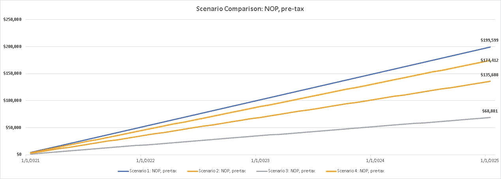
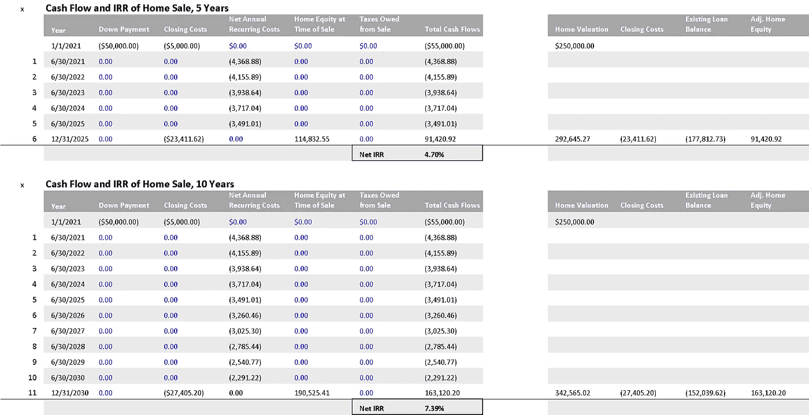

# 房屋所有权经济学深潜

> 原文：<https://towardsdatascience.com/economics-of-home-ownership-deep-dive-427fd1b17a95?source=collection_archive---------47----------------------->

## 评估购房情景和相关的投资机会成本。

照片由 Breno Assis 在 Unsplash 上拍摄。

***注来自《走向数据科学》的编辑:*** *虽然我们允许独立作者根据我们的* [*规则和指导方针*](/questions-96667b06af5) *发表文章，但我们不认可每个作者的贡献。你不应该在没有寻求专业建议的情况下依赖一个作者的作品。详见我们的* [*读者术语*](/readers-terms-b5d780a700a4) *。*

第一部分的经济学置业深潜。

# 引言。

对于那些以前考虑过或正在考虑买房的人来说，这篇文章旨在帮助你定制你的场景，并努力实现你的选择。我希望你会发现这里提供的[金融模型](https://github.com/kdboller/Home-Purchase-Scenarios/blob/master/Home%20Ownership%20Scenarios%20Model_vFor_Post.xlsx)(选择“查看原始数据”或点击下载)，对你评估潜在的购房选择很有用。在这篇文章和这个模型的帮助下，你将更好地理解与房屋所有权相关的成本，以及不将首付和持续维护成本投资于其他资产(如被动市场 ETF)的内在机会成本。

鉴于我对投资的浓厚兴趣，以及我和妻子在 2018 年购买了一套房子，我最近修改了我的方法，以模拟我们的每月支出、长期储蓄计划，并预测我们将不得不分配给我们家庭投资策略的额外资金。此外，随着新冠肺炎局势的持续，这个话题很及时，因为更多的千禧一代现在正在考虑拥有自己的房子。这在很大程度上是由于许多人经历了不断发展的观点，考虑到对原地住所的要求，预计从大城市向郊区/住宅区的迁移，以及对许多家庭负担得起的东西越来越多的渴望，例如院子和更好的 WFH 办公空间。

在这篇文章中，我提供了背景和一个基于场景的模型，您可以用它来评估不同的房屋购买选项，包括可变的购买价格、首付金额和贷款条款等。基于场景的模型具有灵活的输入，允许你根据你当前的收入、月支出、个人财务状况和投资偏好进行定制。

请注意，该模型尚未考虑所有因素，例如 1)您是否应该再融资以及如何评估多个选项，2)它没有提供完整的租金与购买分析(我链接到一个有用的资源，它在房屋所有权 IRR 中考虑了净经常性成本)，3)评估最常见的 15 年和 30 年固定贷款类型，但不评估其他贷款类型，例如， ARM 和 4)它没有考虑承担 PMI(低于 20%的首付)和消除 PMI，一旦贷款价值比成为<= 80%. In true product management fashion, I’ll iterate on future posts if there’s enough interest for features like this.

**个人痛点和构建此基于场景的模型的原因。**

虽然有许多有用的在线资源可以帮助你做出购房决定，其中一些我将在稍后分享，但我认为这篇文章的独特之处在于，它将这些分析向前推进了几个步骤，并可以根据你的决策集进行个性化。这篇文章分享了一个框架，让你在权衡投资房产还是其他潜在投资时，思考相关的机会成本。换句话说，根据你的个人假设，它将帮助你预测出你没有投入大房子的钱在市场上的回报(或你选择的其他资产)；并允许你测试购买某一特定房屋与将资金投资于其他地方相比，你的情况更好/更差。

在我将根据对这篇文章的兴趣完成的后续工作中，我的计划是再次转向模式分析(这里的[老例子](/scaling-analytical-insights-with-python-part-2-73b45ce9584e))。在第 2 部分中，您将进一步提高您的数据科学分析和仪表板开发技能，创建一个交互式仪表板，它将您的财务模型根据您的个性化输入生成的各种场景绘制成图表。对于未来帖子，该模型将生成一个 CSV 文件，该文件可以用作交互式模式分析仪表板的平面文件数据源。

在这篇文章之后，我的其他相关文章进一步讨论了利用 Python 建立投资系统，包括:

1.  [第 1 部分:](/python-for-finance-stock-portfolio-analyses-6da4c3e61054)从 Yahoo！Jupyter 笔记本中的财务 API
2.  [第 2 部分:](/python-for-finance-dash-by-plotly-ccf84045b8be)扩展第 1 部分的分析和可视化，提供获取生成的数据集所需的代码，并在 Dash by Plotly (Dash) web 应用程序中将它们可视化；
3.  [第三部分:](/python-for-finance-dash-by-plotly-ccf84045b8be)建立在股票投资组合分析和 Dash by Plotly 方法的基础上，了解你的总股东回报(TSR)，包括股息，并跟踪类似 Robo Advisor 的投资组合。

**披露:**本帖内容不应被视为投资建议。过去的表现不一定代表未来的回报。我写的是一般性的例子，并展示了如何评估家庭购买场景和将部分/全部资本分配给其他投资机会的相对机会成本。你应该向你的财务顾问提出所有与投资相关的问题，并对本文中提到的任何投资进行尽职调查。因此，我对使用本文中描述的方法可能遭受的任何损失不承担任何责任，并且在此明确否认任何此类责任。

# 在房屋所有权经济学上变得更聪明。

正如在简介中提到的，我的方法有四个限制(我知道):1)不评估再融资，2)没有完整的租金与购买分析，3)只关注固定利率抵押贷款(例如，15 年和 30 年)和 4)模型不考虑 PMI 情景。下面我分享解决# 1 和# 2 的资源。如果根据反馈对第四点感兴趣，那么我会考虑更新模型，加入 PMI。我的个人情况没有涉及 PMI，但这个决定是个人的，如果人们需要额外的指导，我会重新评估。

**再融资评估。**我真的很喜欢 Zillow 的所有工具，并且发现[他们的再融资计算器](https://www.zillow.com/mortgage-calculator/refinance-calculator/)在很高的层面上很有帮助，因为我已经评估了潜在的再融资。作为一般指导，简短的经验法则是了解你的成交成本是多少，也就是你完成再融资的费用是多少；假设这些是 2000 美元。然后看看你每月的储蓄和当前的月供；假设每月 100 美元。这意味着你需要大约 20 个月的时间(每月节省 2000 美元)才能赚回你的前期再融资成本。不用说，你应该在你的房子里呆 20 个月以上，这才开始有意义。

**租与买。**在考虑租房还是买房时，我相信 Travis Devitt 整理了一个有用的资源，这形成了我的一些想法，并帮助我更明智地考虑:[链接到 Travis 的推文](https://twitter.com/travisdevitt/status/1106668029369290755)。

**资源。**在你开始阅读本帖中的模型之前，我建议你通读下面的前两个资源，以便更好地掌握房屋所有权的经济学和途径。值得注意的是，改善职位是非常详细和有益的；我用这篇文章中的数据建立了我的模型的几个基本假设。最后一个资源展示了美国持续存在的房屋所有权差距的数据和地址。不幸的是，我不是专家，也不知道所有的答案，但我愿意为事业做出贡献，并尽我所能提供帮助/答案，以支持缩小这一差距。请随时在推特上联系我， [@kevinboller](https://twitter.com/kevinboller) ，或者给这个帖子留下回复，如果你有什么原因建议我去调查，或者有什么问题我可以帮助回答。

1.  [财富前线家居规划指南](https://www.wealthfront.com/home-guide)。
2.  改善——买房是一项好的投资吗？
3.  [关于美国房屋所有权差距的文章](https://www.nbcnews.com/specials/american-dream-while-black-homeownership/amp-index.html)。

# 使用基于场景的模型。

# 输入工作表。

当您打开模型时，您将从输入工作表开始，该工作表将驱动整个过程中的其余公式。每月模型表上的时间表提供了 10 年的预测。如果你愿意，你当然可以进一步延长，但我很难相信普通人会做出 30 年的决定，我更喜欢评估更短的时间段；这尤其是因为[所有的模型都是错的](https://en.wikipedia.org/wiki/All_models_are_wrong)，试图预测未来 30 年的模型可能比未来 10 年更错。

输入表上的 C2 单元是整个模型中最重要的单元。此表中 C 列中的所有内容也不应修改，因为输入将根据在 C2 选择的选定方案进行填充，这将从 C 列的第 1 列扩展到第 n 列。在 C 列右侧的列中，如果愿意，您可以在右侧添加更多方案，您可以根据正在评估的方案更改假设。请注意，任何蓝色字体的单元格都意味着它们可以被修改，而任何黑色字体的单元格都不应该被修改，因为它们是基于公式的，并且与场景无关。虽然提供的场景都是积极的情况，例如，3.2%的房屋升值，你当然可以用多种不同的方式评估同一场景。例如，也许你想比较 3.2%的年房屋升值和 7%的年投资回报与 0%的房屋升值和 4%的投资增长的基本情况，以查看随着时间的推移对你的调整后净值的影响。

**要点:**始终要认识到，当您对场景 1-4 进行任何调整时，您应该始终返回并循环通过单元 C2 中的场景—将 1、2、3、4 输入到 C2，以便循环通过这些场景，并让它们的输入流过模型；一旦你习惯了剩下的工作表，这一点就会变得很明显。

如果你读过上面提到的参考资料，那么**购房** **细节**和**贷款细节**部分应该很简单。在 D-G 列中，我包含了 4 个模板化的场景。**收入**和**费用**具有占位符值，应进行调整以反映您的个人收入和费用。我会输入税后收入数字，这样你就能更好地估算出扣除每月支出后的现金流；以及在支付这些费用后你可以用来投资的资本。对于 HOA 之后的剩余支出，比如房屋维护，我建议保持原样，因为它们是基于《改善邮报》的数据。同样的建议适用于房屋销售输入假设，包括销售和成交成本。

对于**的投资表现**，投资%的超额现金意味着，对于你在支付每月费用后保留的钱，你会将其中的多少投资于被动型 ETF、股票等。然后你必须估算一下你的名义回报率，我把它定为 7%。你可以选择比这更积极/更不积极。你的可用现金储备，你可能不需要，是在你需要更多现金来支持某个月的支出(支出超过收入)时留出的钱；如果你的月支出超过收入，但你在一年中管理现金流，预计有更多的现金流入，例如，RSU 每年两次授权，你可能会这样做；但这不一定是明智的，也不可能适用于大多数人。

**净值输入**，最后一部分，你将如何直接比较你的家庭投资和其他投资，以查看对你的净值的影响。同样，每年 3.2%的房屋升值是一个改善后的假设。首付机会成本是指，在你支付的首付比基础方案(总是在 D 列有基础)多的情况下，我们将扣除这笔资本如果投资在其他地方将会得到的回报(而不是用于更大的首付)。由于额外的首付优势反映在你购买更大的房子和/或支付更多预付款的情况下的房屋价值回报中，这将显示你相对于基础的净回报。在比较具有更高前期房屋成本的场景时，它还应该对所有场景进行比较。

# 月度模型工作表。

在 C1 单元格中，您将看到基于您在输入工作表中输入到 C2 的方案进行评估的当前方案。该模型显示了 10 年间的月度细分，并将这些细分累计到这 10 年的年度总计。第 37 行显示的是税前净营业利润，这是你的税后收入，并扣除你的每月开支。虽然我建议输入税后收入，但电子表格不能说明你的实际纳税情况；因此，我称之为税前，因为当你申报/纳税时，会发生进一步的调整。下面是你的债务偿还额(第 45-49 行)和一个时间表，其中列出了将投资的多余现金、这些投资的预计回报以及将随着时间推移而积累的现金储备(未投资的资金)。

你会在第 65-67 行看到你的可投资现金随着时间的积累。对于相关的较高成本场景，通过购买较小的房屋/支付较少的首付款，你本可以获得回报的机会成本也会以同样的方式随着时间的推移而增值。值得注意的是，这种模型中的投资回报提供了一个简化的、线性的视角，来观察你的资金随时间的增长。没有一项投资会以你的年预期回报率除以 12 个月来线性增长；此外，由于这是一种美元成本平均法，即当你每月有可用资本时进行投资，你的实际回报将比简化的模型框架表现出更大的波动性。无论如何，你不应该陷入月度回报，并认识到 1)平均而言，你的可投资资产(住房和 ETF 等)每年都会升值，2)这个模型旨在帮助你采取更长远的观点。理想情况下，考虑到交易和结算成本中的摩擦，在决定搬家/购买不同的房子之前，你会给自己留有 5 到 10 年的时间。

**一段时间内的净值**首先评估房屋净值的增长。这是由每年房屋升值的投入(根据投入的每月增长率进行调整)和基于抵押贷款条款的债务偿还所驱动的。为了最终确定净值计算，扣除了超出基本方案的额外首付款，增加了投资增长，您可以手动输入您想要的任何额外资产和负债。我个人的模型时间表比这个更详细，包括退休资产(Roth，401k 等。).准备好之后，如果你想了解你的净资产的完整情况，以及这些账户的预计贡献和随时间的相关增长，你应该考虑将这些构建到你的模型中。

虽然房屋净值随着时间的推移而增长，增加了你的总净值，但《改善》这篇文章很好地强调了“计算投资回报的问题”。为了简洁起见，除了房屋升值之外，还有三个核心驱动因素会影响你的房屋投资回报:1)交易成本，2)现金流，包括持续成本(注意，这些都反映在我们的模型中，见投入工作表中的第 49 行)，以及杠杆，又称抵押贷款，增加了上行收益，但也增加了下行风险。因此，为了进行真正的比较，在图表和经常性成本+ IRR 工作表中，我们将看到您需要如何扣除估计的交易成本，以反映您的真实净值和您的住宅投资的预计 IRR。

# 图表工作表。

在图表工作表上，我们比较了前 5 年期间跨场景的一些核心指标。如果您对开发和扩展模型有所了解，那么将这一时间延长到 10 年或更长时间(如果您进一步扩展模型的话)应该很简单。

在第一张图中，我们比较了不同情景下的预计净营业利润(NOP，收入减去费用)。在这种情况下，您可以看到场景 1 中的 NOP 最大，场景 4 中的 NOP 次之。在场景 4 中，您选择支付与场景 1 相同的房屋，但是您选择了 15 年期抵押贷款而不是 30 年期抵押贷款。每个人都有自己的看法，但我赞同里克·埃德尔曼的 30 年抵押贷款理论——我更喜欢更大的流动性和多样化。使用这些情景，您可以在情景 2 中看到，您将拥有情景 1 中大约 70%的 NOP，在情景 3 中，您将拥有情景 1 中大约 35%的 NOP(在这种情景中，您购买的房屋价格是情景 1 的 3 倍)。

NOP，跨场景税前对比。

在第二个图表中，转到单元格 K101，该图表显示了所选方案的投资详细信息，下表对这些方案进行了细分。给定回报的线性度和关于投资多少(80%)的相同假设，您将看到您的总投资余额+方案 1 之后的超额现金将反映方案之间的 NOP 差异。您可以决定是否要修改方案的假设；例如，如果你买了一个较小的房子，也许你会将更多的资金用于投资(90%？)和/或更积极地进行其他投资，期望回报率高于 7%。

在第三张图中，转到 J160，你会在第二个 y 轴上看到你一段时间内的净值和债务偿还额。对于前三种情况，现有贷款余额占原始抵押贷款的百分比，以及房屋净值占房屋估价的比例相对一致。唯一的区别是，我已经假设了更大的房屋购买量/更大的借款额会有更高的利率。你还会看到，在情景 1 中，你的房屋净值反映了你净资产的 30%,在情景 2 和 3 中增加到约 60%和 90%+,在情景 4 中达到 40%(其中你选择了 15 年的抵押贷款；高于给定的场景 1)。虽然你可能会在第 O 列(单元格 0160)中得出结论，你对各种情景都不感兴趣，你的净值也相对相同，但这并不完全正确。在扣除预计结算成本(见 U161)后，预计结算成本估计了你出售房屋可获得的净实现价值，你会看到，5 年后，情景 2 和 3 实际上落后于情景 1 的调整后净值；而在场景 1 和场景 4 中，你实际上处于相同的位置(相同的购买，不同的抵押期限)。情景 1 和情景 4 之间的紧密联系表明，根据你的投资机会集，你相对不愿意在你的房子(期限较短的抵押贷款)上投资更多，而不是在多样化的 ETF 上投资更多(假设 7%的年化回报率)——税收后果，如抵押贷款利息的扣除或股息税，没有被考虑到这个框架中，但可能会影响这个比较。关于如何评估你的潜在房屋投资回报的最终细节，我们将进入最后一张工作表。

# 经常性成本+ IRR 工作表。

如前所述，改善的文章是很详细的，非常有助于变得更加了解房屋所有权的机制和含义。然而，读完这篇文章后，你仍然没有办法根据你的个人情况或决策来定制学习内容。鉴于我同意作者的退货方法，我在最后一张工作表中重新创建了那篇文章中的两个表。好处是你可以调整场景和输入，它们将基于与文章相同的结构流过这些表。

在房屋所有权年度经常性成本表中，列出了如何计算您正在评估的特定场景的净年度经常性成本(租金与购买成本)。关于这方面的详细信息，请参见《改善邮报》中的《房屋所有权的持续成本》。由于这可能会引起问题，我将指出我的帖子中的模型和改善的表格之间的差异。在增值表中，每年的财产税随着房屋价值的增长而增长，房主的保险随着通货膨胀而增长。虽然这更准确，但在模型的 10 年预测中，我让每个场景的满载每月抵押贷款付款(包括财产税和保险)保持不变。这是为了减少我们所覆盖的认知超载，并使其更容易理解相对于在线抵押计算器和估计付款的模型。由于我没有随着时间的推移适度增加财产税和保险，这意味着房屋所有权的回报被稍微夸大了；然而，由于这在不同的场景中是一样的，我相信这对你的评估没有实质性的影响。为了强调这种微小的差异，你会注意到在《改善邮报》的**年度经常性房屋拥有成本**表中，10 年后，**年度财产税和购买 25 万美元房屋的房屋保险成本分别只增加了约 500 美元和 200 美元。**

我还展示了两个 IRR 时间表，一个是五年投资期，另一个是十年投资期。你会注意到情景 4 的 IRR 最高，在情景 4 中，你支付的首付最低(与情景 1 相同),而且由于你有 15 年期而不是 30 年期的抵押贷款，你支付贷款的速度更快。在这种情况下，虽然情景 4 中的净年度经常性成本比情景 1 中的高，但是通过支付更多的债务本金所产生的更大的股权价值推动了更高的 IRR。当你能够从房屋升值中获益时，这展示了房屋所有权杠杆化回报的好处。

场景 1:5 年和 10 年持有期的房屋销售的现金流和内部收益率。

然而，我已经简化了年度经常性成本表中的一些内容，例如年度租金节省假设。对于您的所有个性化场景，节省的年租金应该是相同的(请随意在您自己的评估中反映这一点)，但鉴于我假设不支付抵押贷款，在场景 4 和其他成本更高的场景中，节省的租金实际上更高。我需要考虑这是否可以用不同的方式表达，但结果是场景 4 的 IRR 可能被夸大了。现在，我将这些表作为跨场景的回报概况的概括说明。如果您愿意，可以很容易地覆盖第一个表格中关于经常性成本+ IRR 的 H 列和 I 列中的公式。你可以只输入你特定的房租储蓄和租房者保险储蓄，然后按通货膨胀率增长。

正如预期的那样，情景 2 和情景 3 的 IRR 比情景 1 略低，因为你看到了与情景 1 相同的价格升值，由于更大的利息成本，债务偿还略慢，并且由于更高的抵押贷款支付，你的净年度经常性成本更高。最后，与增值文章类似，你会发现，在更长的持有期内(10 年对 5 年)，回报会有所提高，因为从购买房屋中收回前期交易成本需要时间。

我最后要指出的是，这个模型并没有对你的全部资产进行整体回报分析；在最终的工作表上，房屋所有权内部收益率是独立完成的。我在这里的建议是，少关注回报，而是关注产生最高调整后净值的结果，同时平衡你愿意为实现这一调整后净值而承担的风险。这是一个更复杂的话题，如果有相关的反馈和问题，我会考虑跟进。

# 结论。

总结这篇文章，我希望你能发现这个框架在评估你的个人机会方面是有用的，包括潜在的购买房屋，相关的购买价格和关键变量，如首付比例，抵押贷款利率和贷款期限。虽然我已经指出了一些非常有帮助的资源，我发现这些资源可以更好地理解房屋所有权的经济学，但我还没有找到另一种资源，它 1)个性化每月现金流，2)预测你随着时间推移积累的净值，包括房屋净值，以及 3)提供定制的时间表来评估潜在的投资回报、机会成本和你的房屋的潜在 IRR。

这一模型中的情景基本上得出与改善后的情景相似的结论。平均需要 4-5 年才能收回你的平仓成本，一套房子可能是一项合理的投资，甚至表现出与整个股市 ETF 相当的回报率(如 [Vanguard 的 VTI](https://investor.vanguard.com/etf/profile/fees/vti) )。这种情况并不总是如此，而《改善》这篇文章很好地指出了哪里可能会出错。

结合我所链接的资源，现在你有了一个可定制的模型，可以评估你在住房和投资机会方面的决策，你应该会感到完全知情，你会做出一个经过充分研究的决定，睁大眼睛进入房屋所有权阶段。这样做，我相信拥有一个家可以是一个伟大的地方；你会很好地理解它是如何融入你的整体个人财务状况以及你的预测投资和退休策略的。

如果你喜欢这篇文章，如果你点击“拍手”图标(不止一次)会很棒！)让我了解并帮助增加我作品的发行量。如果您想在后续帖子中对任何建议的编辑、功能请求或兴趣发表评论，也请让我知道。

你也可以在推特上联系我， [@kevinboller](https://twitter.com/kevinboller) ，我的个人博客可以在这里找到。感谢阅读！