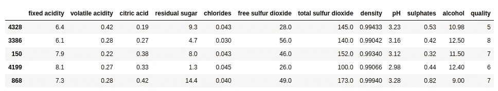
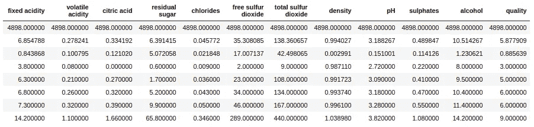
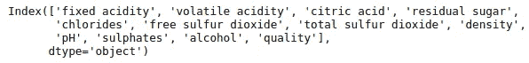
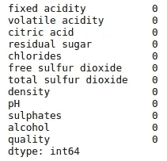
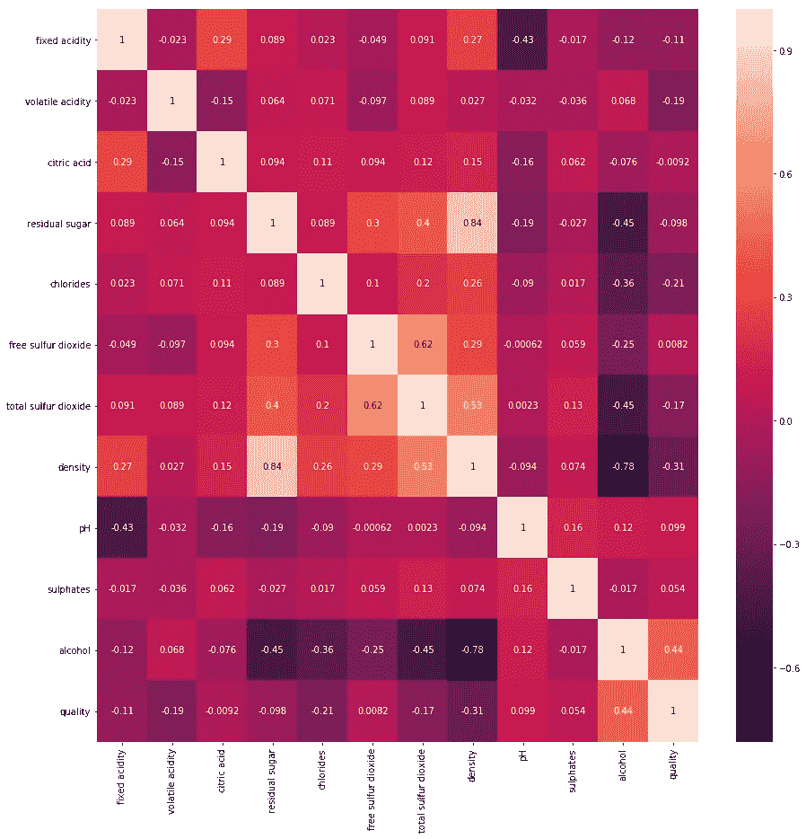
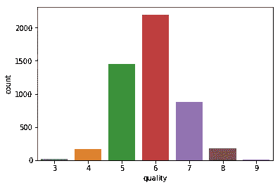
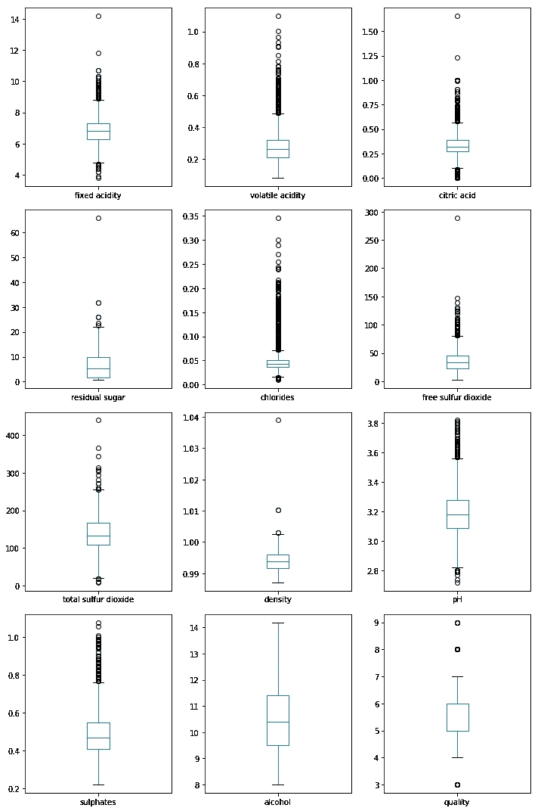
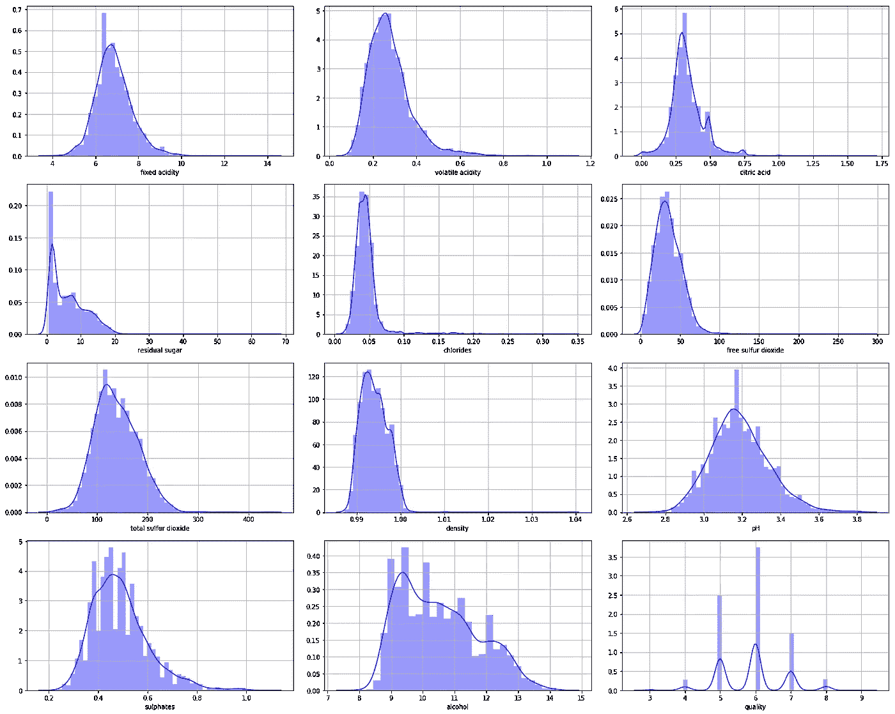
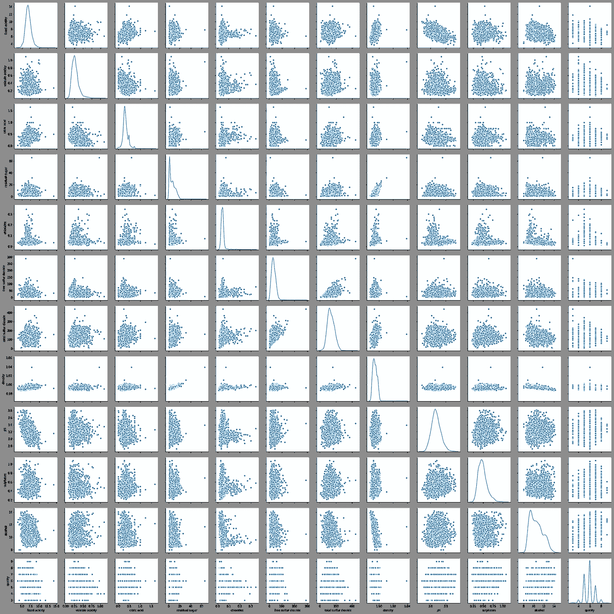

# EDA(探索性数据分析)——获得更多的数据洞察

> 原文：<https://towardsdatascience.com/eda-exploratory-data-analysis-to-get-more-insight-into-the-data-b2fb74dabb82?source=collection_archive---------25----------------------->

作者图片

## 目录

1.  介绍
2.  图书馆
3.  可视化的重要性
4.  编码部分
5.  结论

# 介绍

当我刚刚开始机器学习之旅时，我遇到了许多机器学习教程书籍、视频和课程。这教会了我不同类型的机器学习算法以及它们是如何工作的。所以，在完成这些教程后，我想我现在知道机器学习了。因此，我试图做一些简单的项目，但结果是不同的，就像我没有得到我期望的模型的准确性，我不知道哪里出错了。因此，我在互联网上搜索，寻找提高模型精度的方法，当然，我找到了很多方法，但我认为我错过的最重要的部分是对我的数据执行 EDA。

在我看来，对数据进行 EDA 就像在购买任何笔记本电脑、手机或平板电脑之前观看评论和拆箱视频，或者在购买汽车之前观看汽车评论者的视频，以了解更多关于我们将要购买的产品的信息。所以，现在我想你应该已经知道我们为什么要进行 EDA 了。在使用数据训练模型之前，我们将获得关于数据的见解。

我们这里要用的数据集是[葡萄酒质量数据集](https://archive.ics.uci.edu/ml/datasets/wine+quality)。该数据集包含 12 个特征，即*固定酸度、挥发性酸度、柠檬酸、残糖、氯化物、游离二氧化硫、总二氧化硫、密度、pH、硫酸盐、酒精和质量*。在这些特征之外，我们需要预测代表葡萄酒质量的*质量*特征。

# 图书馆

Python 有大量的库，让我们在执行这些任务时更加舒适。为了对数据执行 EDA，我们将使用以下库:

*   [熊猫](https://pandas.pydata.org/docs/)
*   [Numpy](https://numpy.org/doc/)
*   [Matplotlib](https://matplotlib.org/3.3.1/contents.html)
*   [Seaborn](https://seaborn.pydata.org/)

Pandas 构建在 Numpy 之上，Numpy 用于处理和操作数据集。

Numpy 用于对数据执行数学运算，并处理多维数组和矩阵。

Matplotlib 基本上是一个绘图库，允许我们可视化我们的数据，以便我们可以获得更多关于它的见解。

Seaborn 也是一个构建在 matplotlib 之上的绘图库，允许创建有吸引力的绘图。

# 可视化的重要性

众所周知，为了更好地学习，我们需要将它形象化。你越能想象它，你对它就越有洞察力。因为我们的最终目标是更多地了解数据，所以我们尝试将数据可视化。它还帮助非技术人员更深入地了解数据。

因此，如果我们使用绘图、图表和其他可视化工具来可视化数据，而不是查看行和列形式的实际数据，那么我们就可以轻松地获得有关数据的更多信息。

有几种类型的图可用，但我们在这里只使用其中的几种。具体如下:

*   计数图
*   热图
*   箱线图
*   距离图
*   配对图

除了这些，我们还有小提琴情节，群体情节，联合情节等。为此我们将只讨论它的用法。但是这里我们将只使用这些列出的图。

# 让我们开始编码部分

在这一节中，我们实际上将使用我前面提到的库在给定的数据集上执行 EDA。那么，让我们开始吧。

**导入库**

我们将导入所有必需的库。

**导入数据集**

我们将使用 pandas 的 read_csv()函数导入数据集。因为我们的数据集使用“；”作为分隔符，我们将把它指定为方法的一个参数。

df.sample(5)将显示数据集的随机 5 个样本。这样我们就可以知道什么类型的特性和它们的价值。

上述代码的输出如下所示:

作者图片

**描述数据集**

pandas 的 describe()方法显示数据集的所有统计值，如计数、平均值、标准差、最小值、最大值等。分别是。

上述代码的输出如下所示:

作者图片

要查看数据集中的所有列，我们可以使用 pandas 的以下方法:

作者图片

**检查缺失值**

我们有几种方法来处理缺失值，但为此，我们需要知道有多少要素有缺失值。为了检查缺失值，pandas 有一个名为 isnull()的方法。我们将汇总要素的所有缺失值，以便了解有多少要素有缺失值以及有多少缺失值。

作者图片

因此，正如我们可以看到的，我们的数据集中没有任何缺失值，因此我们可以继续。

**各列之间的相关性**

找到所有特征之间的相关性有助于丢弃高度相关的特征。使用热图，我们可以看到所有功能之间的相关性，如下所示:

作者图片

正如我们在热图中看到的，高度相关的要素以较浅的颜色显示，而负相关的要素以较深的颜色显示。我们可以在热图中看到，特征*密度*和*残糖*高度相关，因此我们可以删除其中一个，我们还可以看到*游离二氧化硫*和*总二氧化硫*也高度相关，因此我们也可以删除其中一个。因为添加这两个特征不会产生任何新信息。

**检查葡萄酒质量数据的分布**

在这里，我们检查葡萄酒质量值范围的频率。通过这样做，我们可以了解数据集是如何分布的。因此，如果需要，我们可以决定重采样的策略。

我们创建计数图如下:

这样做的结果如下:

作者图片

从计数图中我们可以看到，质量为 6 的数据较多，质量为 3 和 9 的数据很少。

**使用箱线图检测异常值**

我们可以使用箱线图来绘制数据，以检测数据中的异常值，并了解我们的数据是否有偏差。

箱形图只是一个简单的矩形方框，显示最小值、最大值、中间值、第一和第三四分位数(分别为 25%和 75%)。使用方框外的圆圈显示异常值。如果中位数不在方框的中间，则数据是偏斜的。如果中位数接近顶部，则数据是正偏的，如果接近底部，则数据是负偏的。

我们可以创建如下的箱形图:

该数据集的箱线图如下:

作者图片

**估计每个特征的 PDF**

我们可以使用 dist plot 获得关于每个特征遵循的 PDF 的信息，如下所示:

作者图片

从图中可以看出 *pH* 服从正态分布。

**探索所有特性之间的关系**

为了探究所有特征之间的关系，我们可以使用配对图。它可以按如下方式创建:

葡萄酒质量白色数据集的配对图如下:

作者图片

# 结论

所以最后，我们在文章的最后。当然，EDA 中的内容远不止我在这里介绍的内容。总结 EDA，我们可以说，在你用它来训练你的模型之前，了解你的数据真的很有帮助。

你可以在我的 Github [repo](https://github.com/vyashemang/Wine-quality-EDA) 中找到我的笔记本和数据集。

不要犹豫，在下面的评论区说出你的想法。

如果你觉得这篇文章有用，请分享。

感谢您阅读这篇文章。

# 参考资料:

 [## 使用 Seaborn 进行探索性数据分析

### 由 Coursera 项目网提供。制作可视化是探索和分析的重要的第一步…

www.coursera.org](https://www.coursera.org/projects/exploratory-data-analysis-seaborn)  [## 什么是探索性数据分析？

### 当我在考虑我应该开始写博客的第一个话题是什么的时候，EDA 突然出现了…

towardsdatascience.com](/exploratory-data-analysis-8fc1cb20fd15) 

# 查看我的其他文章:

 [## 使用 flask 部署机器学习模型

### 作为机器学习的初学者，任何人都可能很容易获得足够的关于所有算法的资源…

towardsdatascience.com](/deploy-a-machine-learning-model-using-flask-da580f84e60c)  [## 使用 MoviePy 在 Python 中创建自己的基本视频编辑软件

### 伟大的图书馆创建自己的视频编辑软件

medium.com](https://medium.com/analytics-vidhya/create-your-own-basic-video-editing-software-in-python-using-moviepy-fcb229153f5c)  [## 不使用 scikit-Learn 使用 Python 实现简单线性回归

### 使用基本库的分步教程

medium.com](https://medium.com/better-programming/simple-linear-regression-using-only-python-5c86af200bca)  [## 用 Python 编写你自己的基于流行度的推荐系统，不需要库

### 推荐系统现在无处不在，像亚马逊、网飞和 Airbnb。所以，那可能会让你…

medium.com](https://medium.com/hackernoon/popularity-based-song-recommendation-system-without-any-library-in-python-12a4fbfd825e)