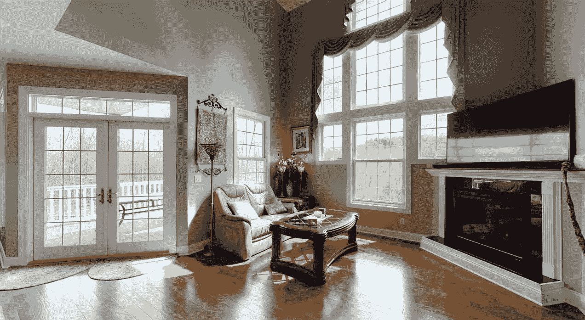
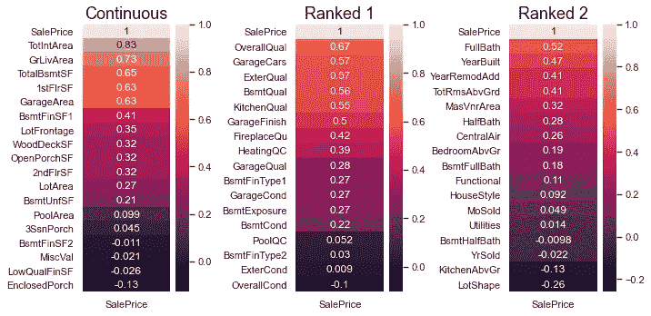

# EDA:特征工程和分类数据编码

> 原文：<https://towardsdatascience.com/eda-feature-engineering-and-encoding-categorical-data-75bed7af8692?source=collection_archive---------33----------------------->

## [初学者回归技巧](https://medium.com/tag/regression-for-beginners)

## 房地产预测的回归技术——第二部分



我从我认识的最好的房地产经纪人那里偷了这张照片:我的妈妈！妈妈，生日快乐！

[*上周*](https://medium.com/@wesley.neill/end-to-end-regression-techniques-for-real-estate-predictions-be98e689fca5) *，我们开始了回归技术系列，使用散点图和条形图探索了爱荷华州艾姆斯的房地产数据集。这些技术是为了在我们的数据中建立关于模式的基本直觉。绘制我们的数据也允许我们筛选并了解我们正在处理的变量。在这个数据集中，有 79 个不同的变量用于预测房屋销售价格。太多了！*

*然后，我们总结了一些评估和填充缺失数据的方法。如果你想阅读全文，你可以在这里找到*[](https://medium.com/@wesley.neill/end-to-end-regression-techniques-for-real-estate-predictions-be98e689fca5)**。**

*现在，把上周的 Jupyter 笔记本装上，让我们开始吧！你可以在这里找到我的 [*完整的笔记本*](https://github.com/wcneill/jn-kaggle/blob/master/house%20prices/sales.ipynb) *，但是像上次一样，我鼓励你在本教程中发展你自己的。**

*在我们开始之前，请确保您已经完成了我们的第一个练习:*

**** * * * * * * * * * * * * * * * * * * * * * * * * * * * * * * * * * * * * * * * * * * * * * * * * * * * * * * * * * * * * * * * * * *
*练习 1:*** 如果您还没有，请使用上周概述的技术[填写数据集中任何缺失的数据。然后你就可以开始钻研特性工程了。 **** * * * * * * * * * * * * * * * * * * * * * * * * * * * * * * * * * ****](https://medium.com/@wesley.neill/end-to-end-regression-techniques-for-real-estate-predictions-be98e689fca5)*

# *特征工程*

*特征工程背后的理念是首先发现数据中可能驱动预测变量的模式，然后将其带到表面。这个由两部分组成的过程从探索我们的直觉开始。*

*什么赋予了家庭价值？*

*这是我的候选名单:*

1.  *尺寸。我说的是总的可用内部空间。*
2.  *房子坐落在多大的地产上？我喜欢园艺！*
3.  *它有像棚子这样的外部结构吗？*
4.  *游泳池怎么样？*

*请注意，其中一些问题有“是”或“否”的答案，回答“是”的简单行为会在您的脑海中推动销售价格上涨。当涉及到机器学习时，这并不一定有什么不同。*

**

*罗伯特·尼克森在 [Unsplash](https://unsplash.com?utm_source=medium&utm_medium=referral) 上的照片*

*现在想象一个机器学习算法，它只能根据它所拥有的数据来回答问题。如果我们查看我们的[数据字典](https://raw.githubusercontent.com/wcneill/jn-kaggle/master/house%20prices/data_description.txt)，我们只看到两个与家庭泳池相关的变量:*

1.  ***PoolArea** —以平方英尺为单位的面积。*
2.  ***泳池质量控制** —泳池质量。*

*一个人可以从一个给定的具有“极好”游泳池质量的家跳到“这个家必须有一个游泳池”。但是，不能保证您的算法或模型能够做到。因此，我们必须 ***通过特征工程将这种模式带到表面上来。****

*是写代码的时候了！我假设您已经准备好笔记本，并加载了数据集。*

```
*df['HasPool'] = df.PoolArea.apply(**lambda** x: 1 **if** x > 0 **else** 0)*
```

*这一行代码将特性 **HasPool** 添加到您的 Pandas 数据框中。*

*想知道一个家有没有大棚子怎么办？我想知道我潜在的新房子有没有网球场怎么办？好吧，我不想知道，但是有人想知道。让我们再来看看我们最好的朋友，数据字典。我看到一个名为**mischaracter**的变量，它有以下可能值:*

```
 *Elev	Elevator
       Gar2	2nd Garage (if not described in garage section)
       Othr	Other
       Shed	Shed (over 100 SF)
       TenC	Tennis Court
       NA	None*
```

*嗯，那很简单。我们现在可以提取几个可能会或不会影响房屋价值的特征:*

```
*df['HasShed'] = 
    f.MiscFeature.apply(**lambda** x: 1 **if** x == 'Shed' **else** 0)
df['HasTennis'] = 
    df.MiscFeature.apply(**lambda** x: 1 **if** x == 'TenC' **else** 0)
df['HasGar2'] = 
    df.MiscFeature.apply(**lambda** x: 1 **if** x == 'Gar2' **else** 0)*
```

*请记住，您在训练集中设计的任何变量也需要在测试集中创建。*

**** * * * * * * * * * * * * * * * * * * * * * * * * * * * * * * * * * * * * * * * * * * * * * * * * * * * * * * * * * *
*练习二:*** 回答问题“房子有多少地上居住面积？”有描述这个量的变量吗？如果没有，使用你所拥有的数据和上面的技术，找出如何设计一个变量。*

*处理特征工程的另一种方法是“试着用不同的方式说同样的事情”。你可以把现有的信息分成更小的部分。想象一下，向不理解的人更详细地解释一个概念。或者，您可以组合现有的变量，这类似于用更宽泛的笔画来解释一个概念。*

*在我们离开特性工程之前，我只想说:不要相信你的直觉。直觉通常是由经验和实验建立起来的。当直觉由于缺乏经验而失效时，研究是一个很好的替代品。例如，我不知道一个完工的地下室每平方英尺增加的价值比一个地上房间少。*

# *编码分类数据*

*在我们能够从数据中获得任何统计见解之前，我们需要将其全部编码成数字格式。这将允许我们对我们的数据进行计算。为了获得如何做到这一点的直觉，我们需要考虑有两种类型的分类变量:序数和名词性。*

***序数:**序数变量的可能值是不连续的，但有一个潜在的等级结构。序数变量的一个例子是将大学生分为四类:大一、大二、大三或大四。这些离散的类别有一个潜在的顺序。*

***名义上的:**名义上的变量是没有明显的潜在等级或顺序的变量。颜色就是一个很好的例子。红色'，'蓝色'，'绿色'也可以列为'蓝色'，'绿色'，'红色'，因为它们没有内在属性来给它们排名。*

*当我们想要将分类数据转换成数字时，定义这两个类别是很重要的。如果我们的类别是有序的，我们必须提供一个方法来保持底层的等级结构。*

**** * * * * * * * * * * * * * * * * * * * * * * * * * * * * * * * * * * * * * * * * * * * * * * * * * * * * * * * *
*练习 3:*** 将您的分类数据排序到 2 个列表中，如下所示:*

```
*ordinal = ['ExterQual', 'BsmtQual', 'GarageQual', 
           'KitchenQual', 'FireplaceQu', 'PoolQC',  
           'OverallQual', 'ExterCond', ... ]nominal = ['Neighborhood', 'MSZoning', 'Condition1', 
           'Condition2', 'RoofStyle', ... ]*
```

**** * * * * * * * * * * * * * * * * * * * * * * * * * * * * * * * * * * * * * * * * * * * * * * * * * * * * * ****

*一旦我们把序数/排序数据分开，我们必须弄清楚它到底是如何排序的。同样，我们必须参考我们的[数据字典](https://raw.githubusercontent.com/wcneill/jn-kaggle/master/house%20prices/data_description.txt)来做到这一点。如果你还没有注意到，数据字典是一个必要的工具，你应该随时打开。例如，让我们以变量 **BsmtExposure:***

```
*BsmtExposure: Refers to walkout or garden level walls (split levels or foyers typically score average or above) Gd	Good Exposure
       Av	Average Exposure 	
       Mn	Mimimum Exposure
       No	No Exposure
       NA	No Basement*
```

*这个变量描述了地下室暴露在外面的程度。许多错层住宅都有带家具的地下室，有外部通道和露台或门廊。这被认为是“良好的暴露”，我们在对变量进行编码时必须考虑到这一点。*

*可能有许多方法可以将序数数据编码成数字，但我喜欢使用字典或映射。*

```
*BsmtExposure_map = {
    'Gd':4,
    'Av':3,
    'Mn':2,
    'No':1,
    'NA':0
}df.BsmtExposure = df.BsmtExposure.map(BsmtExposure_map)*
```

*注意[熊猫的用法。Series.map](https://pandas.pydata.org/pandas-docs/stable/reference/api/pandas.Series.map.html) 转换我们的变量，秩保持不变。*

*同样，我们可以用变量 **Functional，**做同样的事情，它描述了房子的任何主要损坏或其他问题。值的范围从 **Sal** 到 **Typ** ，其中 **Sal** 表示房屋经历了灾难性的破坏，无法居住。 **Typ** 表示正常磨损。*

```
*Functional_map = {
    'Sal': 0,
    'Sev': 1,
    'Maj2': 3,
    'Maj1': 4,
    'Mod': 5,
    'Min2': 6,
    'Min1': 7,
    'Typ': 8
}df.Functional = df.Functional.map(Functional_map)*
```

**** * * * * * * * * * * * * * * * * * * * * * * * * * * * * * * * * * * * * * * * * * * * * * * * * * * * * * * * * * * * * * *
*练习 3:*** 用和上面两个例子一样的方式转换你所有的序数变量。**请记住，您的训练集和测试集都需要这样做。* * * * * * * * * * * * * * * * * * * * * * * * * * * * * * * * * * * * * * * * * * * * * * * * * * * * * * * * ****

*好吧，每个人都喜欢相关矩阵的热图。我和其他人一样内疚，我为花了太多时间选择完美的彩色地图来搭配我笔记本的其他部分而内疚。因此，下面是我们在下一篇文章中将要做的一个例子(在我们讨论了为什么我们不能相信漂亮的脸蛋…或热图之后):*

**

*这将把我们带到统计测试…如果第一次约会是一个热图，那么进行统计测试就是深入挖掘，以发现你的新迷恋对象的内在是否像她的外在一样美丽。*

*在此之前，请随时留下您的任何问题、评论或更正！*