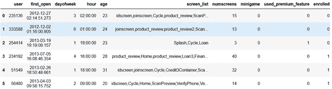
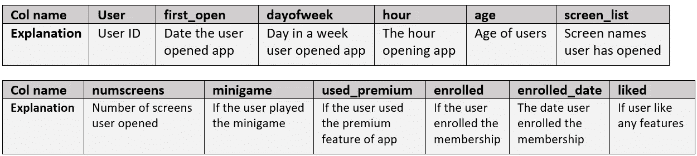
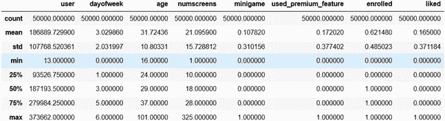
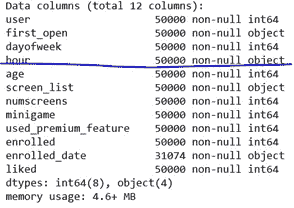
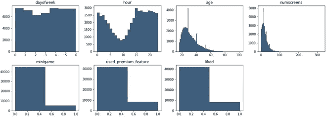
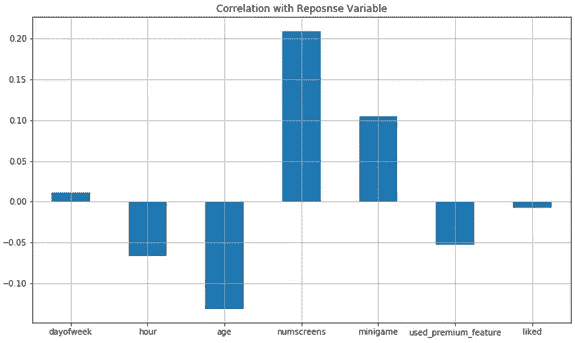
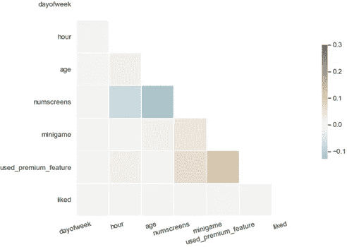

# 使用探索性数据分析解读移动应用用户行为

> 原文：<https://towardsdatascience.com/eda-how-to-on-app-behavior-data-77fde7384a70?source=collection_archive---------50----------------------->

## 关于使用移动应用程序数据进行探索性数据分析的方法和思维过程的分步走查


来自 Unsplash 的 Img 通过[链接](https://unsplash.com/photos/aVvZJC0ynBQ)

在本文中，我将解释关于如何使用移动应用程序行为数据执行探索性数据分析(EDA)的方法和思维过程。EDA 是任何机器学习建模之前的关键步骤。

> 你期望学习的是**如何从零开始，通过分析未清理的原始数据，挖掘出有趣的数据模式。**它被分成 4 部分。

1.  数据审查
2.  数据可视化
3.  相关分析
4.  摘要

现在让我们开始吧🏃‍♂️🏃‍♀️.

1.  **数据回顾**

> 获得原始数据后，第一步是理解每一列。

图 1 显示了原始数据的一个片段。有五万条记录。



图 1 原始数据片段

表 1 是所有列的简要总结。很快，你会发现这些数据包括应用程序安装的日期和时间，以及用户使用的功能。应用程序行为包括关于用户查看的应用程序屏幕列表的数据，用户是否玩过金融迷你游戏以及用户是否喜欢任何功能。



表 1 列说明摘要

> 第二步是以稳健的方式审查数据分布，重点是数字变量。具体来说，使用

```
dataset.describe()
```

图 2 有助于快速了解每个数值变量的最小值、最大值和平均值。有趣的是，用户的平均年龄是 31.7 岁，用户玩的平均屏幕数是 21。11%的用户玩过迷你游戏，17%的用户使用了高级功能，62%的用户最终注册成为会员。



图 2 列分布汇总

> 第三步是检查每个变量的数据类型，并在必要时进行类型转换。

具体来说，

```
dataset.info()
```



图 3 可变数据类型概述

我们发现列*小时*被当作一个*字符串*，如图 3 所示。因此，让我们只对小时进行切片，并转换为 *int* 类型。

```
dataset[“hour”] = dataset.hour.str.slice(1, 3).astype(int)
```

2.**数据可视化**

> 作为一名数据科学家，不仅要展示模型，还要直观地展示和解释发现。可视化是不可避免的一步。

具体来说，

```
dataset2 = dataset.copy().drop(columns = [‘user’, ‘screen_list’, ‘enrolled_date’, ‘first_open’, ‘enrolled’])
f = plt.figure(figsize=(15,6))
for i in range(1, dataset2.shape[1] + 1):
    plt.subplot(2, 4, i)
    f = plt.gca()
    vals = np.size(dataset2.iloc[:, i — 1].unique())
    plt.hist(dataset2.iloc[:, i — 1], bins=vals, color=’#3F5D7D’)
```

上面，我们将直方图仓的数量设置为等于每列中唯一值的数量。

如图 4 所示，可以看到一些有趣的模式。例如，年龄分布是正偏的，在 30 岁左右有一个很强的峰值。大多数用户不玩迷你游戏，使用高级功能，喜欢任何功能。



图 4 数值变量直方图

3.**相关性分析**

> ***显然，上面的可视化只是关于单个变量的分布。但是我们需要知道每个变量是如何相互关联的。***

3.1 自变量和因变量之间

第一步是理解自变量和因变量之间的相关性。自变量是列'*'登记的【T1 '，自变量是所有其他列。所以，具体来说，*

```
dataset2.corrwith(dataset.enrolled).plot.bar(figsize=(15, 6),title = ‘Correlation with Reposnse variable’, fontsize = 15, rot = 15,grid = True)
```

图 5 显示了相关图。同样，一些有趣的发现。例如，屏幕数量与用户注册之间存在较强的正相关关系。**总体而言，自变量和因变量之间没有很强的相关性。**



图 5 自变量和因变量之间的相关条形图

3.2 自变量之间

第二步是理解独立变量之间的相关性。这有助于选择独立的特征，因为我们只训练具有独立变量的模型。所以我们需要确保变量之间没有很强的相关性。具体来说，

```
corr = dataset2.corr()
```

图 6 说明了相关矩阵。注意，我们只显示了下面的三角形，因为整个矩阵是对称的。由于最大相关性接近 0.3，我们可以得出结论，数值变量彼此不相关。



图 6 自变量之间的相关图

4.**总结**

使用一个小应用程序的行为数据，我们进行了数据审查，数据可视化和相关性分析。幸运的是，这些数据不需要太多的手工和琐碎的工作。但是我们发现了一些有趣的模式，可以作为你主菜前的开胃菜。

**太好了！如果你觉得这篇文章有帮助，请随意点击👏s！如果您需要源代码，请随时访问我的**[**Github**](https://github.com/luke4u/Customer_Behaviour_Prediction/tree/main/enrollment_prediction)**页面🤞🤞。**下一篇文章将介绍**特征工程、数据处理和模型构建**。