# 使用 SmartEDA 开发的 EDA

> 原文：<https://towardsdatascience.com/eda-in-r-with-smarteda-eae12f2c6094?source=collection_archive---------39----------------------->

## 最少的代码和全面的探索性数据分析


由 [Rosan Harmens](https://unsplash.com/@rooszan?utm_source=unsplash&utm_medium=referral&utm_content=creditCopyText) 在 [Unsplash](https://unsplash.com/s/photos/explore?utm_source=unsplash&utm_medium=referral&utm_content=creditCopyText) 拍摄的照片

在从事数据科学或机器学习项目或任务时，我们都有快进到模型构建和预测阶段的冲动。然而，正如我们的导师和专家重申的那样，初始探索性数据分析(EDA)阶段对于从训练模型和预测的后期阶段获得更好的结果至关重要。估计花费在 EDA 和数据准备上的时间占数据科学项目总时间的 60–80%。

考虑到这一点，R 中有没有一些包可以让我们在加速 EDA 的同时还能做好它的工作？嗯，看起来有！

在本文中，我将展示 R 包 **SmartEDA** 的功能，它让我们在 EDA 领域的生活变得更加轻松。使用 **SmartEDA、**中的方法，只需一行代码，我们就可以获得以下各项:

*   更丰富的信息
*   可读性更好的格式化输出
*   日期集中每个要素的多点综合摘要
*   可视化单变量和双变量分析

**SmartEDA** 的所有上述功能都非常方便，尤其是在处理具有大量功能的数据集时。尝试使用传统的`**str()**`和`**summary()**`函数来处理超过 10 个特征的数据集！

现在让我们试驾一下 SmartEDA..

我们将使用来自 Kaggle 的泰坦尼克号数据集。你可以从[这里](https://www.kaggle.com/c/titanic/data)下载。这包含了命运多舛的泰坦尼克号乘客的数据，以及他们是否在灾难中幸存。

```
#install.packages("SmartEDA")
library(SmartEDA)
data = read.csv("titanic.csv")
```

以下是数据集前几行的示例。

```
head(data)
```

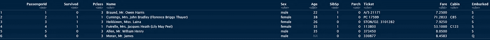

数据集包含乘客信息，包括旅行等级、姓名、性别、年龄、船上兄弟姐妹和配偶的数量、船上父母和子女的数量、票价和出发港口等。

`ExpData()`方法给出了关于数据集的顶级元数据信息。

```
ExpData(data, type=1)
```

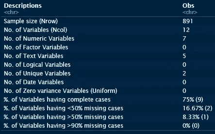

使用`type = 2`参数的相同方法给出了数据集中每个要素的简洁摘要，包括每个要素的变量类型、缺失案例百分比和唯一值数量。

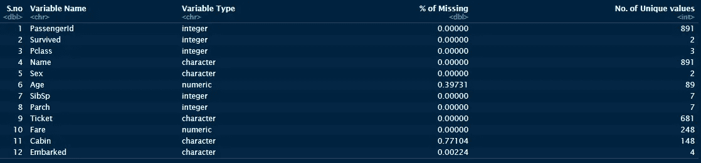

厉害！对吗？等待..越来越好了。

**连续特征总结**

`**ExpNumStat()**` 方法生成数据集中所有连续要素的多点综合统计摘要，其中包含大量信息，包括负值、零值和正值的数量、缺失值的数量以及百分比、最小值、最大值、平均值、中值、标准差、变异系数、IQR、偏斜度、峰度和异常值的数量…咻！！

另外，`**ExpNumStat()**`会自动识别数据集中的连续要素。在这里，下面我们只选取了可用于输出的所有概要点的一个子集。您可以通过删除列索引号来查看完整的输出，并只为您感兴趣的统计信息指定列索引。

```
ExpNumStat(data,by ="A",Outlier=TRUE,round= 2)[,c(1,2,4:6,9:10,12:15,18,23)]
```


```
ExpNumStat(data, by = "A", Outlier = TRUE, round = 2)[,c(1,2,9,16:22)]
```


此外，将`by`参数设置为 G 或 GA，我们可以通过在 group 参数中指定一个分类特性来获得按“group”和“group plus all”划分的摘要。这在分类问题中特别有用，就像我们在这里遇到的问题，我们可以获得分类响应变量每个级别的连续特征的汇总(在这个数据集中为“幸存”)。

```
ExpNumStat(data[,-1],by = "GA",Outlier=TRUE,round= 2,gp = "Survived")[,c(1,2,4:6,9:10,12:15,18,23)]
```

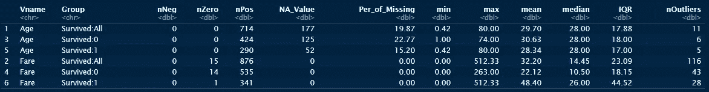

在这种情况下，我们可以清楚地看到，票价特征对乘客是否幸存起着很大的作用。

**分类特征总结**

分类特征总结呢？这里使用的是`**ExpCatStat()**` 方法。

```
ExpCatStat(data, Target = "Survived")
```

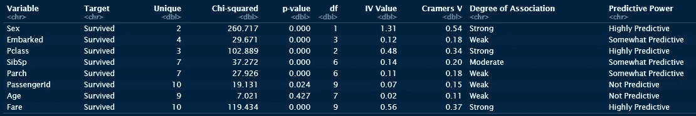

上面的单行代码不仅提供了每个分类特征和目标特征之间的卡方统计和 p 值，还提供了每个特征的信息值(IV ),以及它与目标特征的关联程度和它的预测能力的有用标签。说到超越使命召唤！！

**可视化**

有了`**SmartEDA**`、**、**就不全是数字输出了。无论是通过`**ExpNumViz**`和`**ExpCatViz**`方法进行单变量或双变量分析，它都可以提供可视化的探索数据。

**双变量分析:连续特征对之间**

将`scatter = TRUE`参数传递给`ExpNumViz()`会给出日期集的所有连续特征对之间的散点图。在这里，我们通过选择图的指数来绘制 Pclass 对 Fare 和年龄对 SibSp(船上兄弟姐妹/配偶的数量)。

```
ExpNumViz(data[,-1], scatter = TRUE)[4:5]
```

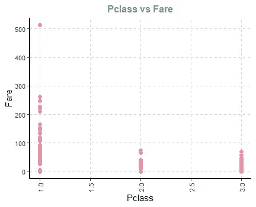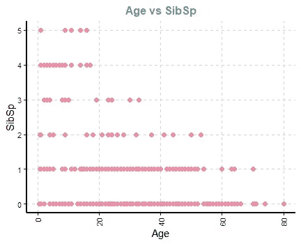

仅将数据集传递给方法会绘制每个连续要素的密度分布。

**双变量分析:连续特征与分类反应特征**

同样，只需要一行代码就可以生成箱线图，显示分类反应特征的不同水平的分布(“用 1 编码的存活”和用 0 编码的未存活”)。下面我们列举其中的两个例子。

```
ExpNumViz(data = data,target = "Survived")[4:5]
```

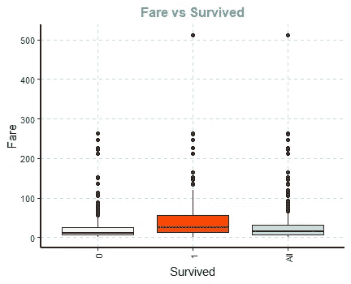

幸存乘客的票价中值更高(因此等级也更高)

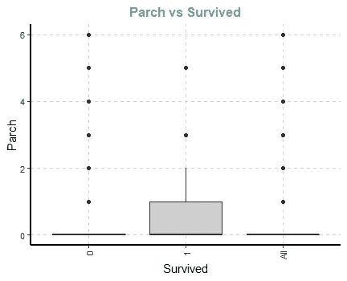

有父母/孩子在车上的乘客有更高的生还机会

**分类特征:单变量分析**

`ExpCatViz`除数据集外，没有任何其他参数，绘制每个分类特征中级别计数的%条形图。我们在下面列举了一些例子。

```
ExpCatViz(data)
```

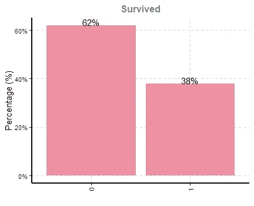

只有 38%幸存下来

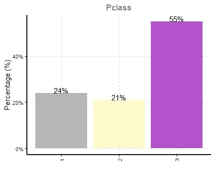

三等舱乘客比例最高，为 55%

**分类特征:具有目标特征的双变量分析**

`ExpCatViz`方法采用 2 个附加参数`target`和`margin`，并生成数据集中所有分类特征与“幸存”目标分类特征的每个级别的柱状图。


照片由[руслангамзалиев](https://unsplash.com/@gambler_94?utm_source=unsplash&utm_medium=referral&utm_content=creditCopyText)在 [Unsplash](https://unsplash.com/s/photos/titanic?utm_source=unsplash&utm_medium=referral&utm_content=creditCopyText) 上拍摄

```
ExpCatViz(data, margin = 2, target = "Survived", 
          col = c("red","green"))[c(1,3:5)]
```

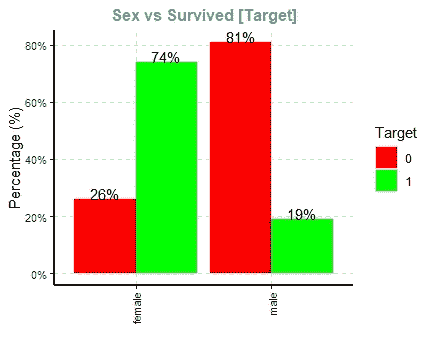

女性乘客的存活率更高

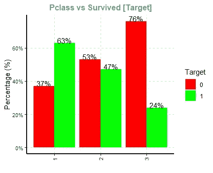

三等舱乘客的待遇。

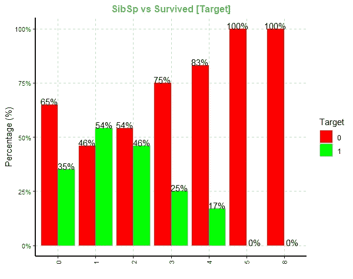

冷却..更大的家庭没有存活下来。更好的生存变化与更小的家庭群体

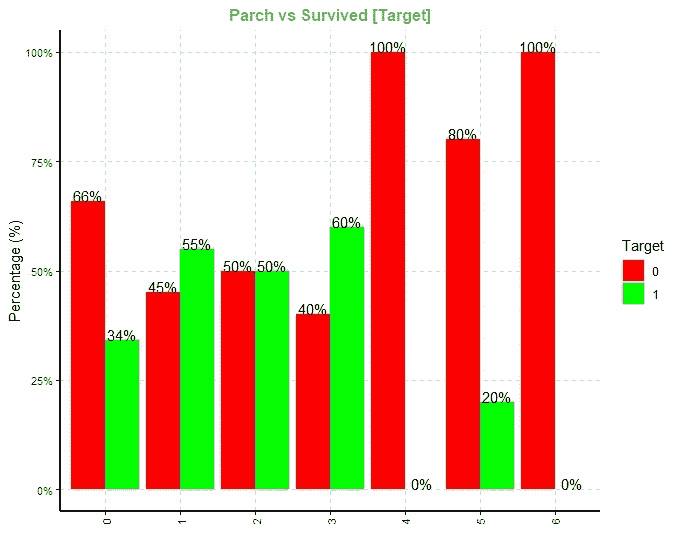

机上儿童/父母人数较多的乘客存活率低/无存活率

上述两个情节可能指出了在一个有更多兄弟姐妹、父母和配偶的更大的家庭团体中旅行的乘客所面临的悲惨困境，即不能离开家人。看看存活率的悬殊！

总而言之，我们只用了不到六行代码就能完成大量的 EDA 数字运算和可视化。请给出你的反馈和意见，以及哪个是你最喜欢的 EDA 包，为什么。

感谢阅读！