# 又一个艾瑞斯·埃达

> 原文：<https://towardsdatascience.com/eda-of-the-iris-dataset-190f6dfd946d?source=collection_archive---------15----------------------->

## 从超级流行的虹膜数据集中提取有用见解的尝试


在 [Unsplash](https://unsplash.com?utm_source=medium&utm_medium=referral) 上由[zdenk macha ek](https://unsplash.com/@zmachacek?utm_source=medium&utm_medium=referral)拍摄的照片

# 介绍

在这本笔记本中，我对著名的 **Iris** 数据集进行了探索性的数据分析，并试图从数据中获得有用的见解。

数据集中存在的要素有:

*   萼片宽度
*   萼片长度
*   花瓣宽度
*   花瓣长度

## 导入库

```
import pandas as pd
import numpy as np
import matplotlib
import matplotlib.pyplot as plt
import seaborn as sns
%matplotlib inline

sns.set_style('darkgrid')
matplotlib.rcParams['font.size'] = 14
matplotlib.rcParams['figure.figsize'] = (9, 5)
matplotlib.rcParams['figure.facecolor'] = '#00000000'
```

## 加载数据

```
iris_df = pd.read_csv("IRIS.csv")
```

## 理解数据

```
iris_df.head()
```

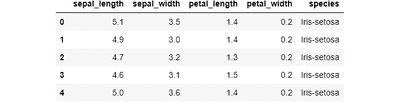

```
iris_df.shape(150, 5)
```

从上面这条线我们可以看到，我们的数据集有 150 行和 5 列

```
iris_df.columnsIndex(['sepal_length', 'sepal_width', 'petal_length', 'petal_width',
       'species'],
      dtype='object')# Further inspecting the dataframe
def inspect_data(data):
    return pd.DataFrame({"Data Type":data.dtypes,"No of Levels":data.apply(lambda x: x.nunique(),axis=0), "Levels":data.apply(lambda x: str(x.unique()),axis=0)})
inspect_data(iris_df)
```

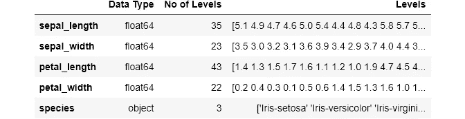

让我们获得更多关于数据集的信息

```
iris_df.info()<class 'pandas.core.frame.DataFrame'>
RangeIndex: 150 entries, 0 to 149
Data columns (total 5 columns):
 #   Column        Non-Null Count  Dtype  
---  ------        --------------  -----  
 0   sepal_length  150 non-null    float64
 1   sepal_width   150 non-null    float64
 2   petal_length  150 non-null    float64
 3   petal_width   150 non-null    float64
 4   species       150 non-null    object 
dtypes: float64(4), object(1)
memory usage: 6.0+ KB
```

我们看到数据集的所有列都没有空值，其中四列是数字列，一列是分类列，这也是 dtypes 函数可以看到的。

```
iris_df.dtypessepal_length    float64
sepal_width     float64
petal_length    float64
petal_width     float64
species          object
dtype: object
```

## 统计见解

```
iris_df.describe(include='all')
```

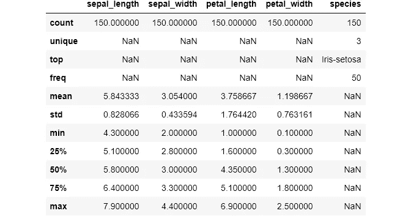

```
iris_df.describe() #Performing just for numeric columns
```

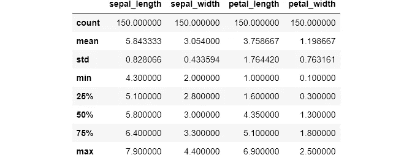

## 检查重复值

```
iris_df.duplicated().sum() # Total no of duplicates in the dataset3iris_df[iris_df.duplicated()] #This shows the actual duplicate rows
```

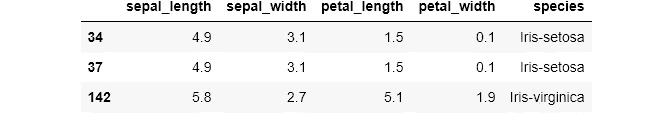

我们的数据集中有 3 个重复项，但是删除它们可能会打破我们数据集的平衡，因为我们看到我们的数据集是平衡的，在 describe 函数中，对于 species 列，我们看到频率为 50，这可以通过下面的代码行进一步证明。

```
iris_df['species'].value_counts()Iris-setosa        50
Iris-versicolor    50
Iris-virginica     50
Name: species, dtype: int64
```

因此，我们可以让重复值保持原样并继续。

## 检查缺失值

我们通过 info 函数确认了我们的数据集没有空值，但是让我们进一步证明它。

```
iris_df.isnull().sum(axis=0)sepal_length    0
sepal_width     0
petal_length    0
petal_width     0
species         0
dtype: int64
```

## 估计偏度和峰度

```
iris_df.skew()sepal_length    0.314911
sepal_width     0.334053
petal_length   -0.274464
petal_width    -0.104997
dtype: float64iris_df.kurt()sepal_length   -0.552064
sepal_width     0.290781
petal_length   -1.401921
petal_width    -1.339754
dtype: float64
```

## 目标列上的可视化

我们的目标列是物种列，因为最终我们想要预测正确的花卉物种。

```
plt.title('Species Count')
sns.countplot(iris_df['species']);
```

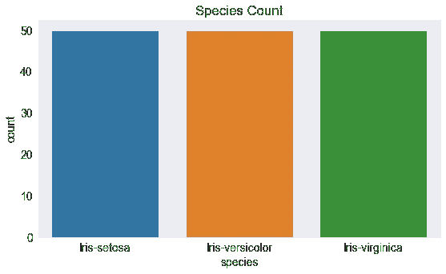

这进一步表明，我们的数据集是平衡的，所有三个物种的记录相等。

## 可视化变量之间的关系

让我们比较萼片长度和萼片宽度列。

```
plt.title('Comparison between sepal width and length')
sns.scatterplot(iris_df['sepal_length'], iris_df['sepal_width']);
```

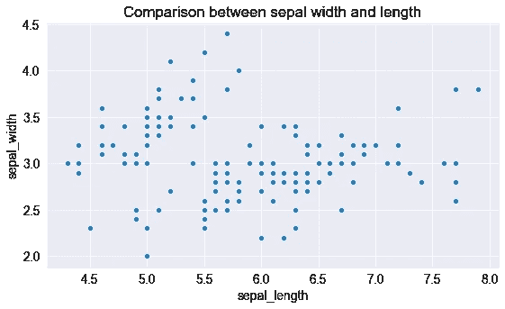

让我们再来比较一下，但这次我们也要在物种的基础上进行比较。

```
plt.figure(figsize=(16,9))
plt.title('Comparison between sepal width and length on the basis of species')
sns.scatterplot(iris_df['sepal_length'], iris_df['sepal_width'], hue = iris_df['species'], s= 50);
```

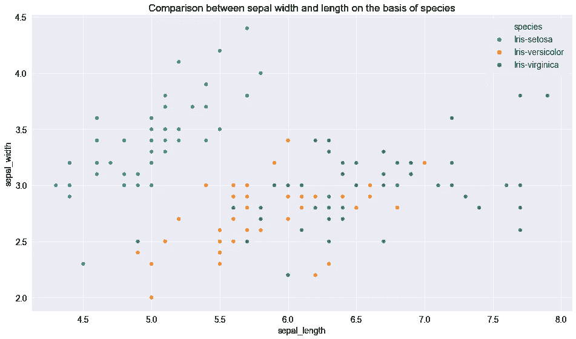

从上面的图像中，我们可以看出鸢尾属物种的萼片长度较小，但宽度较大。而我们看到云芝几乎位于长度和宽度的中间。而海滨锦鸡儿的萼片长度较长，宽度较小。

让我们比较花瓣长度和花瓣宽度列。

```
plt.title('Comparison between petal width and length')
sns.scatterplot(iris_df['petal_length'], iris_df['petal_width']);
```

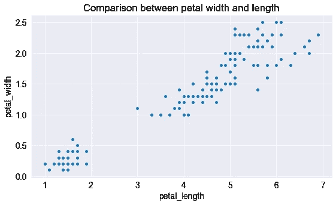

我们可以看到两个独立的集群，但不确定物种，所以让我们把物种也纳入方程。

```
plt.figure(figsize=(16,9))
plt.title('Comparison between petal width and length on the basis of species')
sns.scatterplot(iris_df['petal_length'], iris_df['petal_width'], hue = iris_df['species'], s= 50);
```

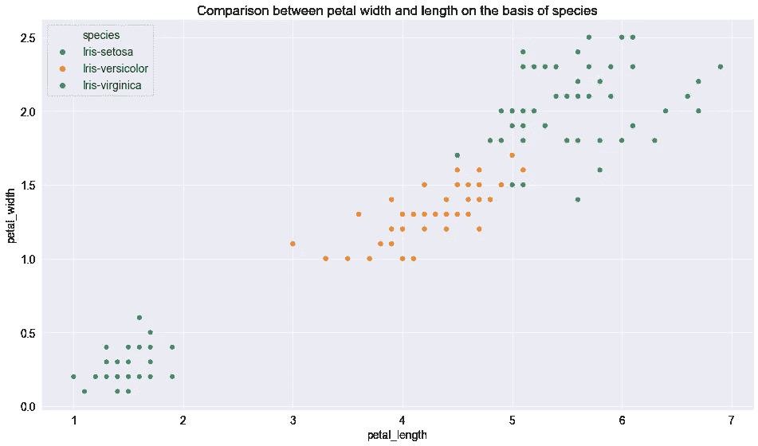

我们看到 setosa 具有最小的花瓣长度和花瓣宽度，而 Versicolor 具有平均的花瓣长度和花瓣宽度，而 virginica 物种具有最高的花瓣长度和花瓣宽度。

现在让我们使用配对图来可视化所有列的关系。

```
sns.pairplot(iris_df,hue="species",height=3);
```

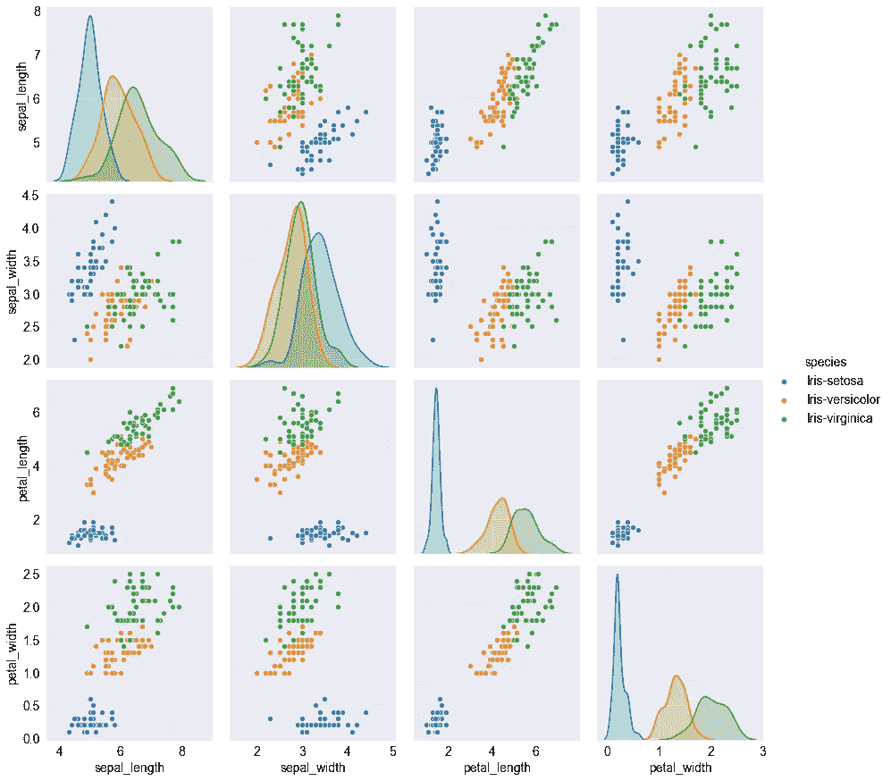

配对图代表我们的目标和变量之间的关系。我们可以看到，与其他物种相比，刚毛物种的特征有很大的差异，它具有较小的花瓣宽度和长度，而其萼片宽度高而其萼片长度低。类似的结论也可以从其他物种中得出，如花斑物种通常具有平均尺寸，无论是萼片还是瓣片。而海滨锦鸡儿具有高的花瓣宽度和长度，而它具有小的萼片宽度和大的萼片长度。

## 区分数字变量和分类变量

```
categorical_columns = iris_df.dtypes[iris_df.dtypes == 'object'].index
print('No of categorical fetures:',len(categorical_columns),'\n')
print(categorical_columns)
print('*'*100)

numerical_columns = iris_df.dtypes[iris_df.dtypes != 'object'].index
print('No of numerical fetures:',len(numerical_columns),'\n')
print(numerical_columns)No of categorical fetures: 1 

Index(['species'], dtype='object')
****************************************************************************************************
No of numerical fetures: 4 

Index(['sepal_length', 'sepal_width', 'petal_length', 'petal_width'], dtype='object')
```

这个函数进一步支持了我们之前的观察。

## 数字特征概述

```
iris_df[numerical_columns].describe()
```


我们可以看到，平均值和中值之间没有很大的差异，因此不需要进行数据转换。

## 变量之间的相关性

```
iris_df.corr()
```

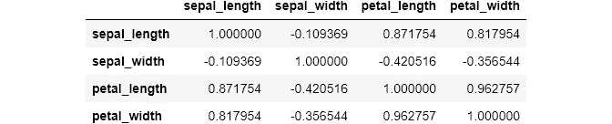

此外，我们可以使用热图来可视化这种相关性。

```
fig = plt.figure(figsize = (15,9))
sns.heatmap(iris_df.corr(), cmap='Blues', annot = True);
```

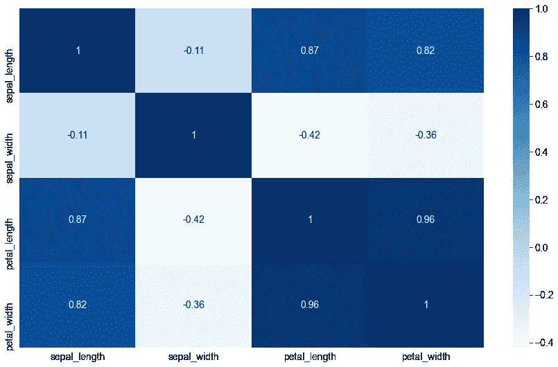

从上面的热图中，我们看到花瓣长度和花瓣宽度有很高的相关性，花瓣宽度和萼片长度有很好的相关性，花瓣长度和萼片长度也有很好的相关性。

```
cols = ['sepal_width', 'sepal_length', 'petal_width', 'petal_length']
plt.figure(figsize=(20,4), dpi=100)
i = 1
for col in cols:
    plt.subplot(1,11,i)
    sns.distplot(iris_df[col])
    i = i+1
plt.tight_layout()
plt.show()
```

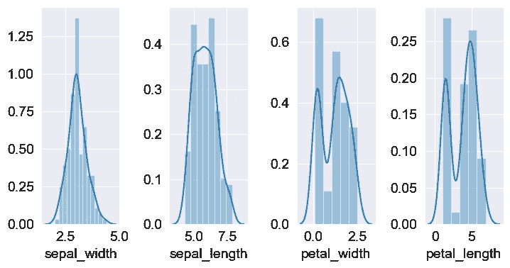

我们可以通过这个 distplot 观察我们的列的分布，它显示遵循正态分布。

## 直方图

让我们来看看数据集各列的数据分布。

```
fig, axes = plt.subplots(2, 2, figsize=(16,9))
axes[0,0].set_title("Distribution of Sepal Width")
axes[0,0].hist(iris_df['sepal_width'], bins=5);
axes[0,1].set_title("Distribution of Sepal Length")
axes[0,1].hist(iris_df['sepal_length'], bins=7);
axes[1,0].set_title("Distribution of Petal Width")
axes[1,0].hist(iris_df['petal_width'], bins=5);
axes[1,1].set_title("Distribution of Petal Length")
axes[1,1].hist(iris_df['petal_length'], bins=6);
```

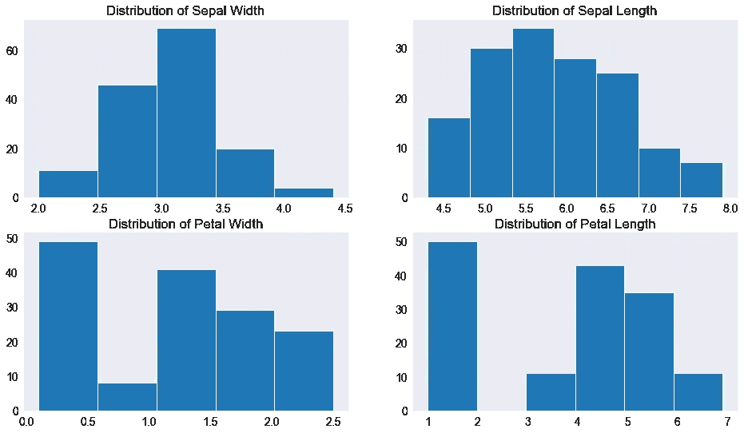

*   萼片宽度的最高频率在 3.0 至 3.5 之间，约为 70。
*   萼片长度的最高频率在 5.5 和 6.0 之间，约为 35。
*   花瓣宽度的最高频率在 0 到 0.5 之间，约为 50。
*   花瓣长度的最高频率在 0 到 0.5 之间，约为 50。

## 我们的列的单变量分析

```
sns.FacetGrid(iris_df,hue="species",height=5).map(sns.distplot,"petal_width").add_legend();
```

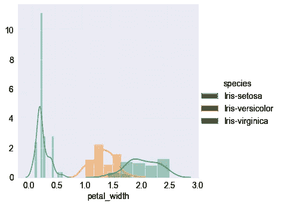

我们看到刚毛藻很容易分离，而杂色和海滨锦鸡儿的一些部分是混合的。

```
sns.FacetGrid(iris_df,hue="species",height=5).map(sns.distplot,"petal_length").add_legend();
```

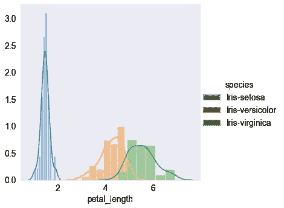

我们再次看到，在花瓣长度的基础上，setosa 是可分离的，而其他两个仍然重叠。

```
sns.FacetGrid(iris_df,hue="species",height=5).map(sns.distplot,"sepal_length").add_legend();
```

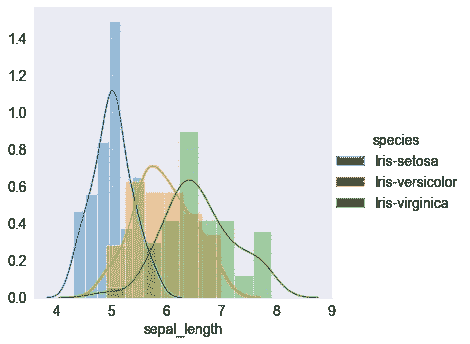

我们看到，仅仅根据萼片长度来区分物种是很困难的。

```
sns.FacetGrid(iris_df,hue="species",height=5).map(sns.distplot,"sepal_width").add_legend();
```

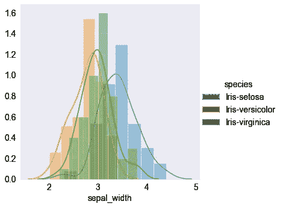

而在萼片宽度的情况下，物种的重叠更为强烈。

```
fig, axes = plt.subplots(2, 2, figsize=(16,9))
sns.boxplot(  y="petal_width", x= "species", data=iris_df,  orient='v' , ax=axes[0, 0])
sns.boxplot(  y="petal_length", x= "species", data=iris_df,  orient='v' , ax=axes[0, 1])
sns.boxplot(  y="sepal_length", x= "species", data=iris_df,  orient='v' , ax=axes[1, 0])
sns.boxplot(  y="sepal_length", x= "species", data=iris_df,  orient='v' , ax=axes[1, 1])
plt.show()
```

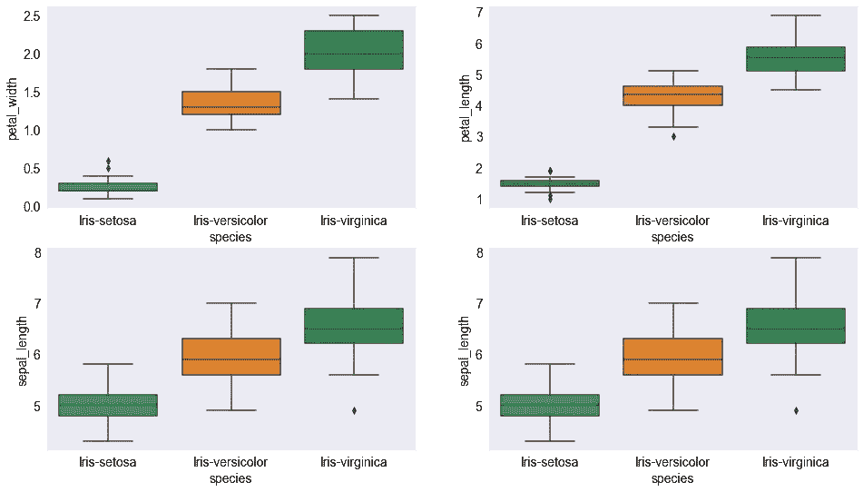

*   此外，我们可以看到，箱线图描述了 setosa 通常具有较小的特征，很少有异常值。
*   杂色种具有一般的特征
*   与其他种类相比，海滨锦鸡儿拥有最长的特征宽度和长度。

我们可以使用数据集上的小提琴图进一步查看分布

```
fig, axes = plt.subplots(2, 2, figsize=(16,9))
sns.violinplot(y="petal_width", x= "species", data=iris_df,  orient='v' , ax=axes[0, 0])
sns.violinplot(y="petal_length", x= "species", data=iris_df,  orient='v' , ax=axes[0, 1])
sns.violinplot(y="sepal_length", x= "species", data=iris_df,  orient='v' , ax=axes[1, 0])
sns.violinplot(y="sepal_length", x= "species", data=iris_df,  orient='v' , ax=axes[1, 1])
plt.show()
```

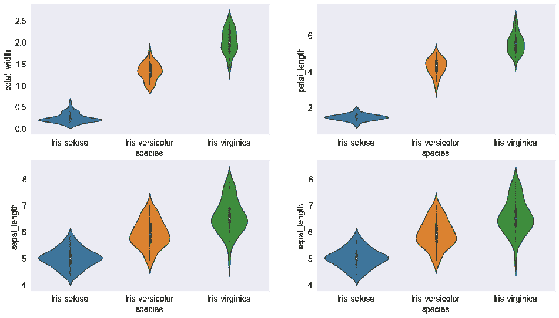

数据的核心密度以及数据的完整分布通过 violin 图显示。我们可以看到各种特征的概率密度。

## 结论

*   数据集是平衡的，即所有三个物种都有相同的记录。
*   我们有四个数字列，而只有一个分类列，这又是我们的目标列。
*   花瓣宽度和花瓣长度之间存在很强的相关性。
*   刚毛物种是最容易区分的，因为它的特征尺寸很小。
*   杂色和海滨种通常是混合的，有时很难分开，而杂色通常具有平均特征尺寸，海滨种具有较大的特征尺寸。