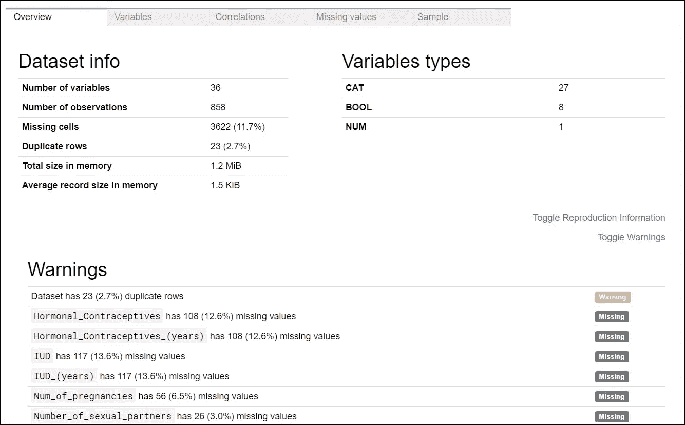
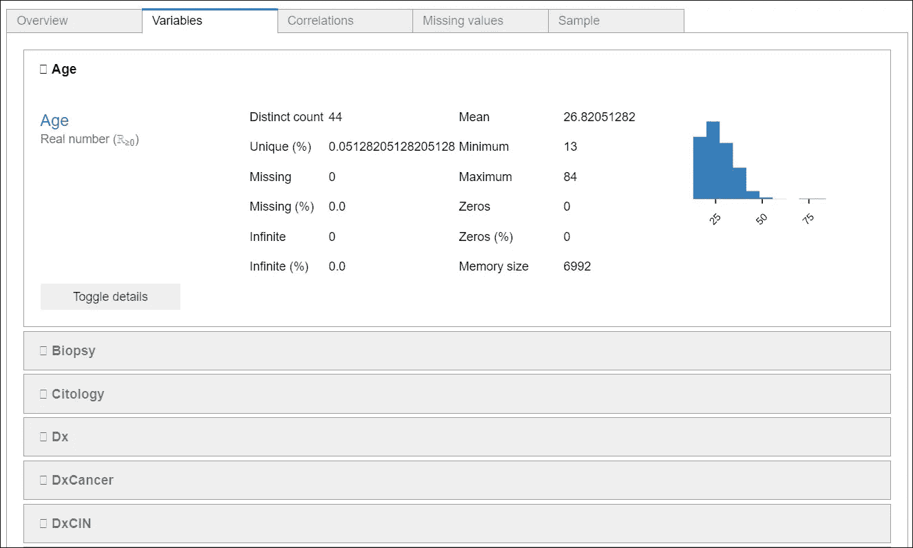
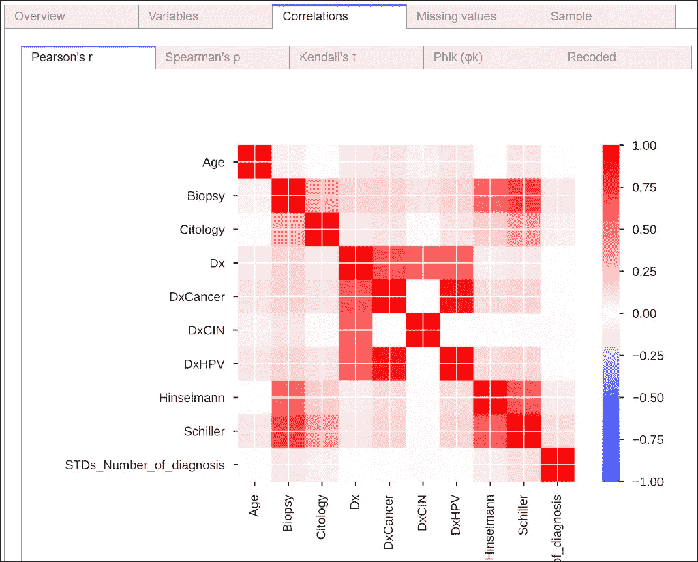
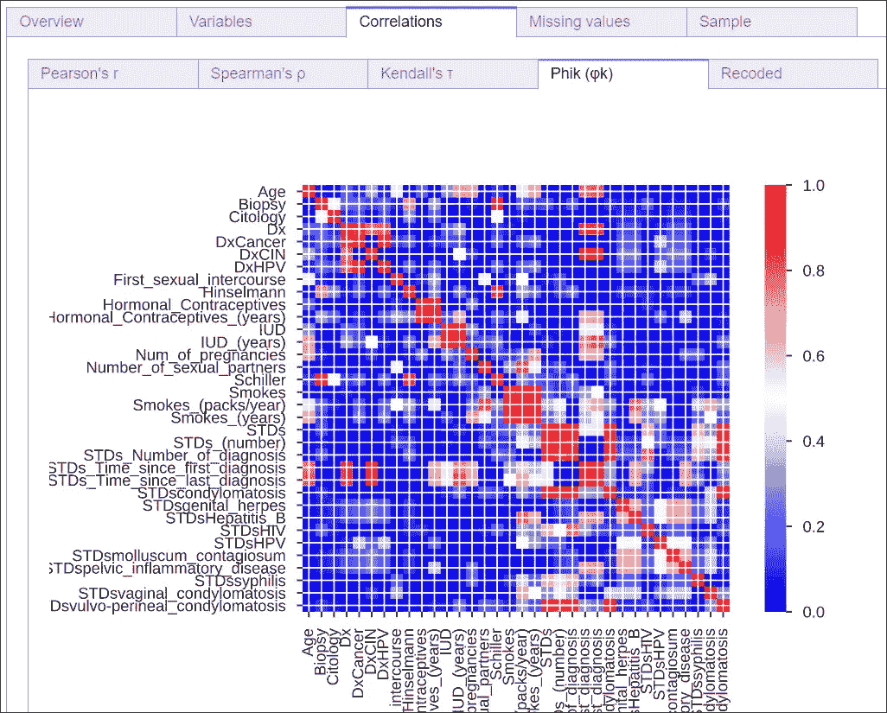
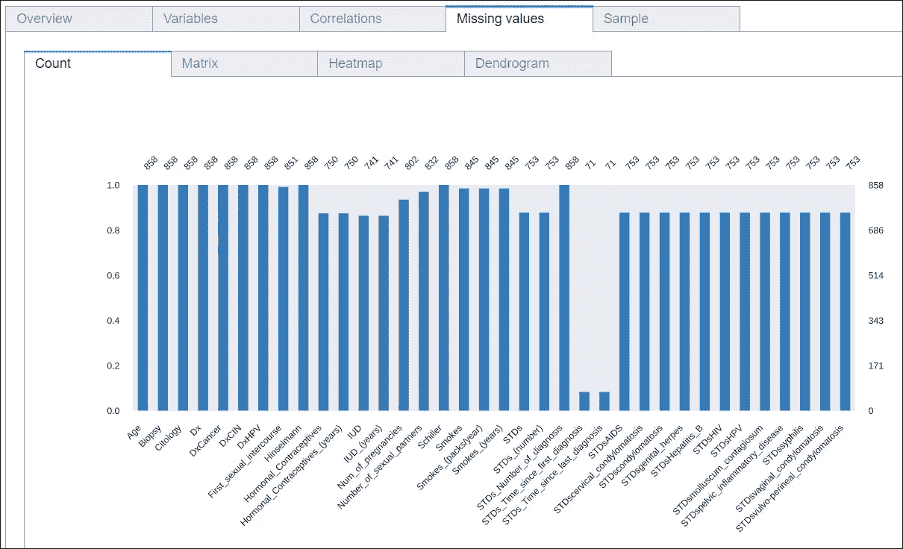
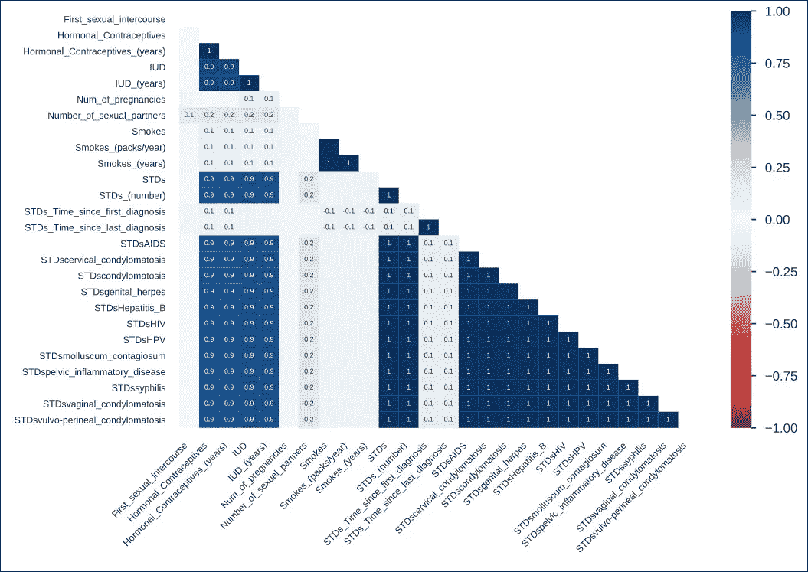
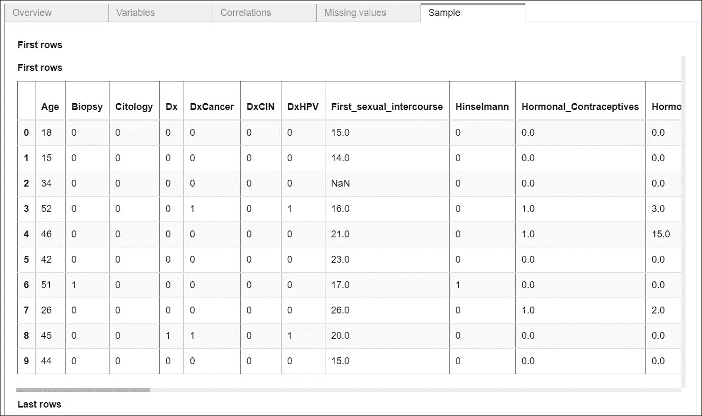

# 使用 Panda 分析的 EDA

> 原文：<https://towardsdatascience.com/eda-using-pandas-profiling-3291d6e856bb?source=collection_archive---------27----------------------->

## 用一行代码生成详细的数据分析报告

探索性数据分析是任何数据科学问题的关键方面。理解数据及其模式是建立模型的基础。做 EDA 有很多方法。为此，我最近偶然发现了一个神奇的熊猫图书馆，名为**“熊猫档案”**。

这个库的美妙之处在于，只需一次点击，您就可以获得整个数据集的非常全面的报告。它生成一个结构整齐的 HTML 文件，包含图表和汇总数据的组合。我在 Kaggle 数据集(宫颈癌风险分类)上使用了这个库，并将向您展示输出结果。使用下面的代码片段，我已经使用**熊猫档案报告模块**生成了一份详细的数据报告。

```
# import the pandas profile library
from pandas_profiling import ProfileReport

# load the data from Kaggle
train1=pd.read_csv("/kaggle/input/cervical-cancer-risk-classification/kag_risk_factors_cervical_cancer.csv")

# data cleaning
train2 = train1.replace('?', np.nan)

# creating profile report
report = ProfileReport(train2, title='Profile Report', html={'style':{'full_width':True}})
```

以下是输出的快照:



概观

正如您从快照中看到的，您可以一次性获得所有重要的数据推断。这只是概述。点击**变量选项卡**，可以深入了解每个变量的特性。



变量

这里我们得到了数据及其分布的描述。该输出是针对数据中的每个变量分别给出的。接下来是**相关性选项卡**。为变量提供了五种类型的相关性。您可以分析每个相关性，以了解目标变量和因变量之间的关系。



相关



下一个选项卡用于**缺失值**。缺失值分析以五种不同的输出格式显示。计数条形图可快速查看每个变量缺失值的数量。还有矩阵、热图和树状图，为数据中所有缺失的值提供了一个很好的图形表示。



缺少值



热图

profile 报告中的最后一个选项卡提供了数据集的第一行和最后几行的**样本**。



样品

**总体而言，pandas 的剖析模块减少了数据探索的工作量，**因为所有关键的 EDA 结果都是剖析报告的一部分。基于该报告，可以执行进一步的数据探索。我在使用这个模块时发现的唯一缺点是，对于巨大的数据集，生成报告需要很长时间。我使用这个模块来了解变量之间的相关性，这给了我一个关于目标变量的可能强预测因子的想法。然后，我选择了最佳特征选择技术来理解哪些特征对目标变量贡献最大。您可以在下面的 Kaggle 笔记本中查看代码，

[](https://www.kaggle.com/krrai77/eda-cervical-cancer-risk) [## EDA -宫颈癌风险

### 使用 Kaggle 笔记本探索和运行机器学习代码|使用来自宫颈癌风险分类的数据

www.kaggle.com](https://www.kaggle.com/krrai77/eda-cervical-cancer-risk)