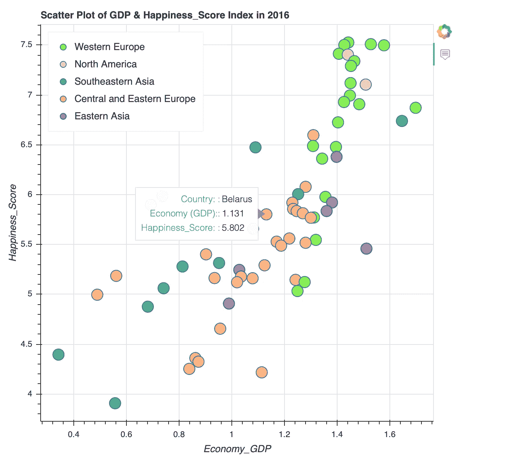
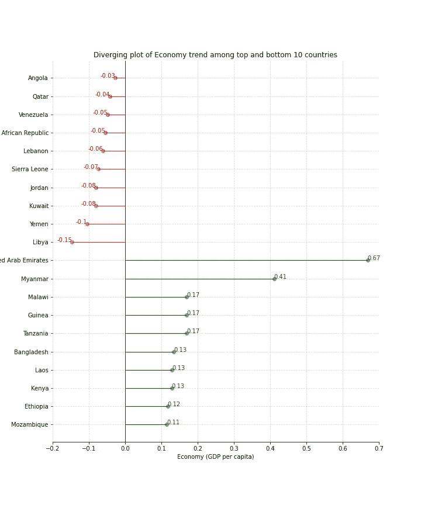
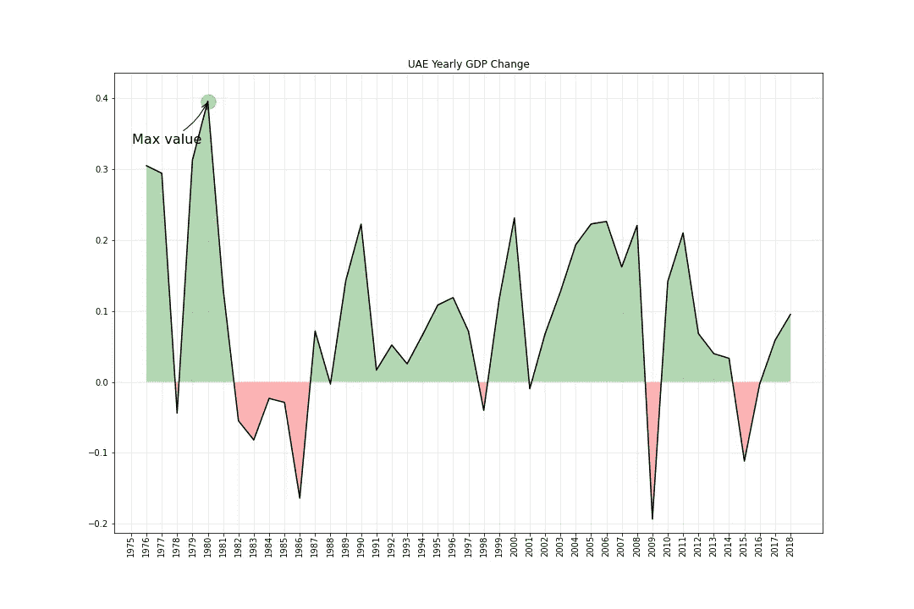

# EDA:geo pandas、Matplotlib 和 Bokeh 中的可视化

> 原文：<https://towardsdatascience.com/eda-visualization-in-geopandas-matplotlib-bokeh-9bf93e6469ec?source=collection_archive---------54----------------------->


来自 tdwi.org[的詹姆斯·鲍威尔](https://tdwi.org/articles/2019/03/26/adv-all-analytics-at-the-edge.aspx)

如今，每个人都沉浸在来自新闻来源、手机、笔记本电脑、工作场所等等的大量数据中。数据传递来自不同数据变量的大量信息，如日期、字符串、数字和地理格式。如何从庞大的数据集里有效地抓住核心价值，并让用户容易解读？答案是探索性数据分析(EDA)。EDA 是一种可视化和分析数据的工具，可以从数据集中提取洞察力。观众能够从通过 EDA 过程总结的重要特征中更好地理解数据集。

在本文中，您将了解到:

(1)带有 Geopandas 和 Bokeh 的动态地理图

(2)对 2016 年至 2019 年全球数据集的分析

(Matplotlib 和 Bokeh 中的可视化

# 动态 choropleth 图

Choropleth 地图提供了地理区域(即国家)的各种模式和符号，很好地展示了跨区域的测量结果。为了绘制全球幸福地图，我们将关注全球幸福状况调查，该调查根据 155 个国家的幸福水平进行排名，在联合国 ***发布。***ka ggle 网站链接:[世界幸福报告](https://www.kaggle.com/unsdsn/world-happiness?select=2019.csv)。情节的创建使用了 Python 库和包——Pandas、Geopandas 和 Bokeh。

## 下载世界地图文件

要渲染世界地图，需要有一个带有世界坐标的 shapefile。 [Natural Earth](https://www.naturalearthdata.com/) 是下载地理空间数据的绝佳来源，其中充满了各种公共领域地图数据集。对于动态地理图的生成，[1–110m 小比例尺数据](https://www.naturalearthdata.com/downloads/110m-cultural-vectors/)是一个很好的地图数据集。

## 将 shp 文件转换为 Geopandas 数据帧

Geopandas 可以通过`read_file`函数将 ESRI shapefile 转换为 GeoDataframe 对象。使用返回地理数据框架对象的`read_file`命令，Geopandas 可以读取几乎任何基于矢量的空间数据格式，包括 ESRI shapefile。您可以在使用 geopands 函数读取数据集时指定列。

地理数据框架的代码片段

## 2015 年静态 choropleth 地图

首先，我们创建一个世界幸福报告的数据框架，并指定 2015 年。然后，可以将生成的数据框 df_2015 合并到地理数据框 gdf 中。为了以后使用散景创建可视化，我们需要 geojson 格式的数据作为绘图源。要素集合包含 GeoJSON 数据中的点、线和面。所以我们把数据帧转换成 JSON，转换成类字符串对象。

合并后的文件是一个 GeoDataframe 对象，可以使用 geopandas 模块进行渲染。然而，由于我们想加入数据可视化的交互性，我们将使用散景库。散景使用 GeoJSON 格式，用 JSON 表示地理要素。GeoJSON 将点、线和多边形(在散景中称为面片)描述为要素的集合。因此，我们将合并后的文件转换为 GeoJSON 格式。

Json 数据的代码片段

然后，我们准备用散景模块创建一个静态 choropleth 映射。我们首先用`GeoJSONDataSource`包读入 geojson 数据。接下来，我们将调色板指定为“YlGnBu ”,并颠倒颜色顺序以匹配最高幸福分数的最暗颜色。然后，我们为颜色条应用自定义刻度标签。对于颜色条，我们将颜色映射器、方向和标记标签映射到颜色条包中。

choropleth 映射的代码段

我们使用指定的地块高度和宽度创建图形对象。然后，我们用 x 和 y 坐标为图形添加补丁，并在 fill_colors 参数中指定字段和转换列。要在 Jupyter 笔记本中显示散景图，我们需要放入 output_notebook()模块，并让图形显示在 show()模块中。

choropleth 映射的代码段

## 分析:

从下图中，我们看到加拿大、墨西哥和澳大利亚等国家的幸福指数更高。对于南美和欧洲国家，总得分分布在指数 5 和 6 附近。相比之下，尼日尔、乍得、马里和贝宁等非洲国家的幸福指数要低得多。


图 1:2015 年静态 choropleth 图

## 2015 年至 2019 年交互式 choropleth 地图

交互式 choropleth 地图增加了两个部分。一个是悬停工具的创建。我们为图表上显示的信息指定列。另一个是回调函数的创建。对于绘图交互，我们通过滑块指定年份来更新数据。我们将滑块值传递给回调函数，并调整数据。然后，我们将 slider 对象传递给 bokeh 列类中的 widgetbox 参数。最后，我们添加了`curdoc`类来创建交互式 web 应用程序，该应用程序可以将前端 UI 事件连接到真实的、正在运行的 Python 代码。

choropleth 映射的代码段

对于那些在 Jupyter 笔记本中运行 choropleth 地图出错的人来说，有一个在终端中运行脚本的替代方法。

```
bokeh serve --show EDA_Plot.py
```

互动 choropleth 地图视频

# 2015 年至 2019 年世界幸福报告的分析图

## 2016 年 GDP 与幸福指数散点图

散点图的代码片段

## 分析:

我们研究了 2016 年 GDP 增长和幸福水平得分的相关性。由于这些国家按地区进行了颜色编码，我们可以看到东南部国家的 GDP 增长较低，其次是潜在的幸福得分。大多数中欧和东欧国家的 GDP 增长率在 0.8 到 1.4 之间，幸福指数在 5 到 6 之间。对于西欧地区来说，它们往往显示出较高的经济增长幅度和幸福指数。



图 2:2016 年 GDP 与幸福指数散点图

## 经济指数排名前 10 位和后 10 位的国家(人均 GDP)

## 分析:

对于前 10 大经济趋势国家，“阿拉伯联合酋长国”显示出增长趋势，2015 年至 2018 年经济增长 0.68%。缅甸是唯一一个人均 GDP 增长率为 0.41 的亚洲国家。令人惊讶的是，像“马拉维”、“几内亚”、“坦桑尼亚”这样的撒哈拉以南非洲国家是经济呈上升趋势的前 5 名国家。

我们可以看到，经济趋势下降的国家大多在非洲。从 2015 年到 2018 年，像'利比亚'，'也门'，'科威特'，'约旦'，'塞拉利昂'这样的倒数 5 个国家的经济指数较低。其中四个国家位于中东和北非。



图表 3:经济指数最高和最低的 10 个国家

## 阿联酋年度 GDP 变化

## 分析:

看到经济指数(人均 GDP 增长)排名前 10 位和后 10 位的国家，我们密切关注阿拉伯联合酋长国的经济趋势。1980 年，阿联酋出现了 40 年来最大的 GDP 增长值。然而，在 1982 年至 1986 年期间，增长率变成了负数。在未来 10 年，阿联酋的国内生产总值表现出相当稳定的增长，约为 0.1-0.2 个百分点。2009 年，受金融危机的影响，国内生产总值大幅下滑。



图 4:阿联酋年度 GDP 变化

## 总之:

*   要创建 choropleth 地图，geopands 可以将 shp 文件转换为数据框对象。对于可视化的创建，散景与 geopandas 包配合得很好。但是，最好记住，在合并两个数据集时，需要将发货文件中的国家/地区与外包数据进行匹配。
*   Matplotlib 和 Bokeh 是 Python 中可视化工具的两个很好的包。散点图更好地显示了两个变量与数值的相关性。就发散图而言，它更好地显示了数据集的下降和上升趋势。对于 DateTime 格式变量，最好在绘图创建时注意缺少值的 date。线形图显示了时间序列数据的明显趋势。