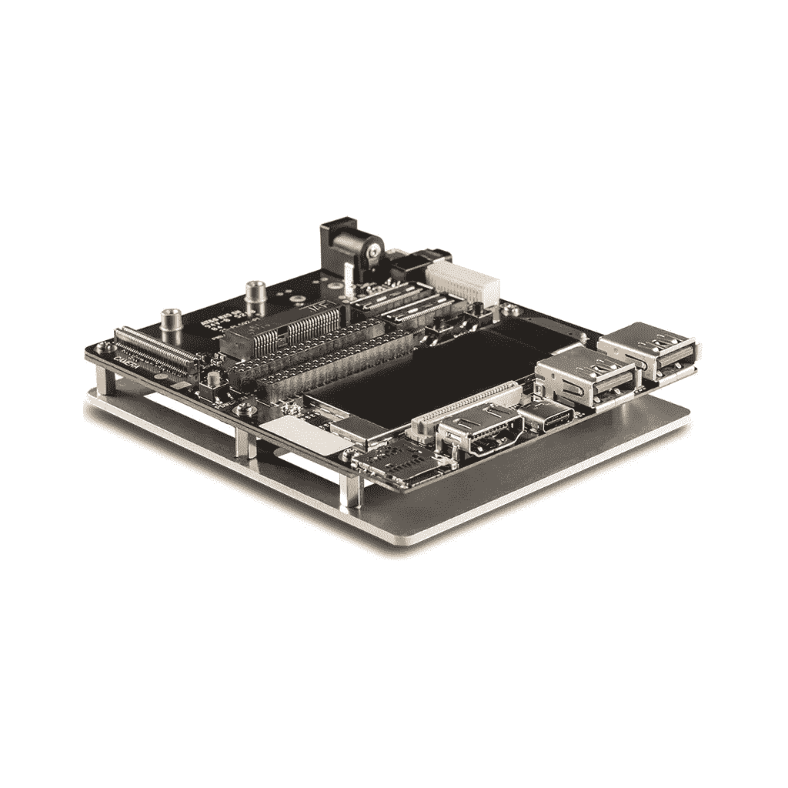
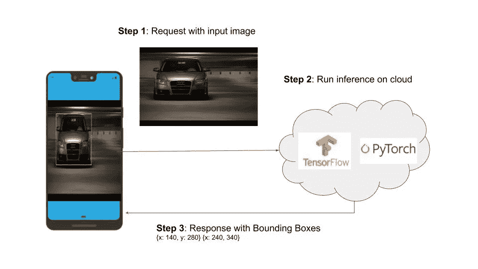
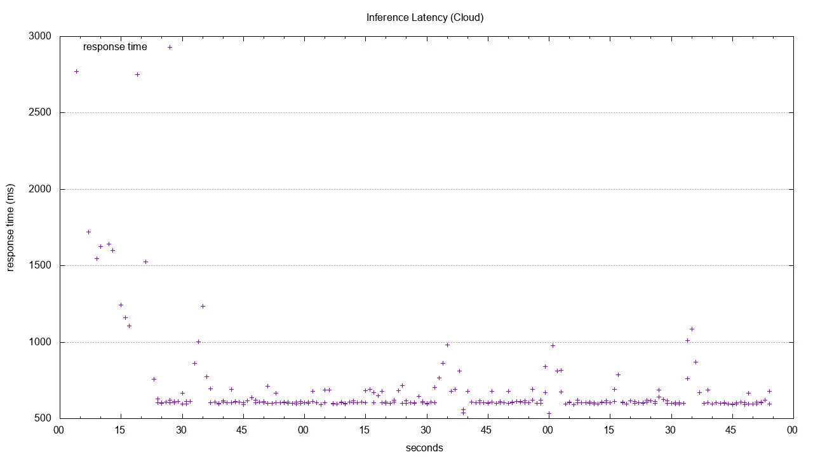
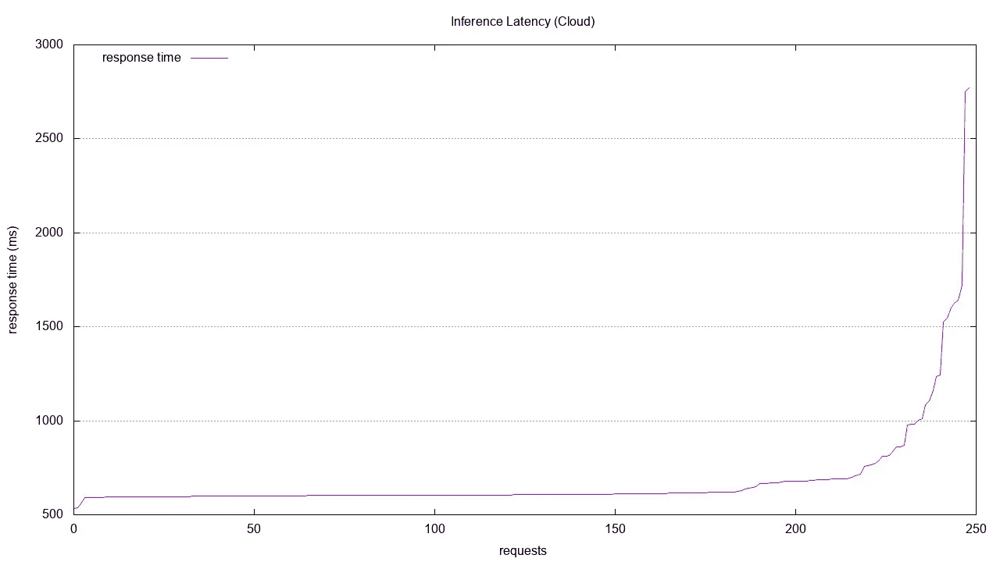
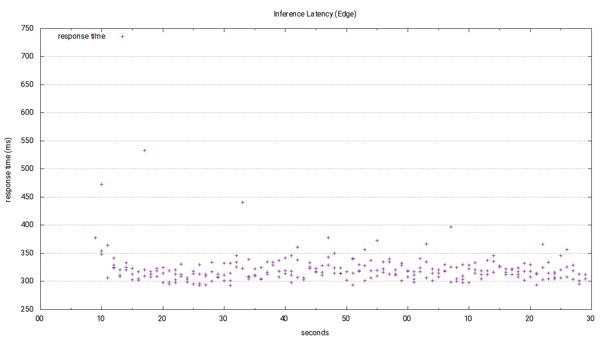
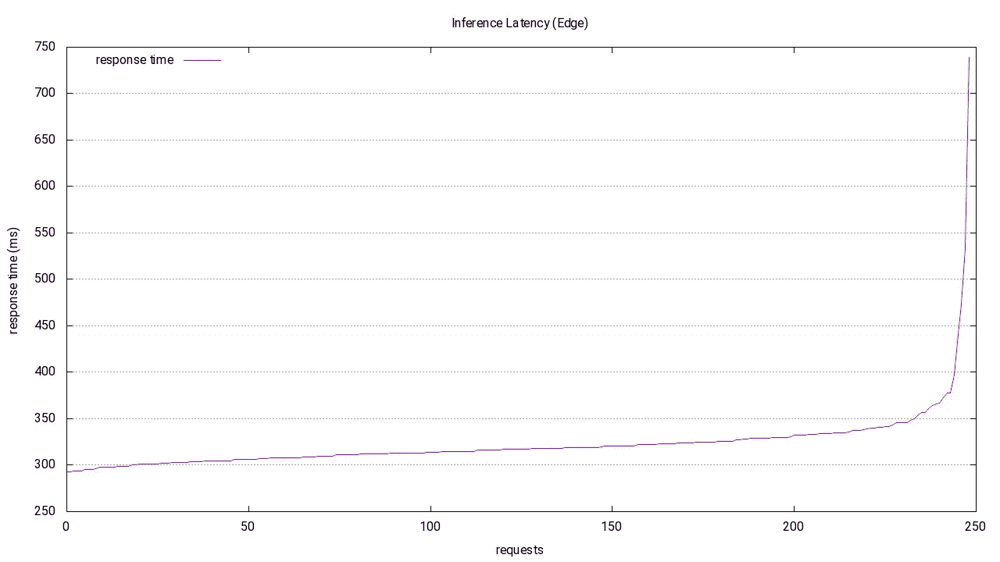

# 边缘人工智能

> 原文：<https://towardsdatascience.com/edge-ai-cc478f9fbb5a?source=collection_archive---------17----------------------->


亚历山大·戈德罗在 [Unsplash](https://unsplash.com?utm_source=medium&utm_medium=referral) 上拍摄的照片

Edge AI 到底是什么意思？这个问题我被问了好几次，我决定分享一下我对这个话题的想法。边缘人工智能通常指在设备上本地运行人工智能算法所需的组件，也称为设备上人工智能。最近，这意味着在设备上运行深度学习算法，大多数文章倾向于只关注一个组件，即推理。这篇文章将揭示这个难题的其他部分。

# 实验装置

边缘设备在成本/性能方面差异很大，为了使讨论更加具体，下面是本系列中使用的实验设置:



高通骁龙 855 开发套件[ [4](https://www.intrinsyc.com/snapdragon-embedded-development-kits/snapdragon-855-hdk/)

*   高通骁龙 855 开发套件。
*   对象检测作为要在边缘设备上运行的深度学习模型。有很多很好的文章描述了物体检测的最新技术[[调查](https://arxiv.org/pdf/1905.05055.pdf)论文]。在本系列中，我们将使用 [Mobilenet SSD](https://storage.googleapis.com/tfjs-models/tfjs/mobilenet_v1_0.25_224/model.json) 模型进行对象检测。
*   [Tensorflowjs](https://www.tensorflow.org/js/) 在 nodejs 环境中快速运行对象检测模型

# 为什么要在 Edge 上运行人工智能算法

为什么不能依靠云端运行 AI 算法？毕竟，在云上扩展资源以运行人工智能/深度学习模型来满足您的性能需求更容易。那么，为什么要担心在计算和功耗受限的边缘设备上运行它们呢？为了回答这个问题，让我们考虑两种情况:

a)基于云的架构，其中推理发生在云上。

b)基于边缘的架构，其中推断在设备上本地发生。

(*为了尽可能公平地进行比较，在这两种情况下，都将使用 nodejs 服务器以及*[*【tensorflowjs】*](https://www.tensorflow.org/js/guide/nodejs#vanilla_cpu)*【仅 cpu】，唯一的区别在于，在* ***情况 a)*** *中，web 服务器将在 EC2 实例上运行，而在* ***情况 b)*** *中，web 服务器将在边缘设备上本地运行【T19 这里的目标*不是拥有一个平台(云或边缘)的优化实现，而是拥有一个框架来进行公平的比较。)**

## 基于云的架构

这是基于云的设置的样子，它将包括下面详细描述的步骤:



用于推理的纯云架构。(结尾的图像参考)。

## 步骤 1:请求输入图像

这里有两种可能的选择:

*   我们可以从边缘设备发送从相机捕获的原始图像(RGB 或 YUV)。原始图像总是更大，发送到云需要更长时间。
*   我们可以在发送之前将原始图像编码为 JPEG/PNG 或其他一些有损格式，在运行推理之前在云上将它们解码回原始图像。这种方法将涉及解码压缩图像的额外步骤，因为大多数深度学习模型都是用原始图像训练的。在本系列的后续文章中，我们将涉及更多关于不同 raw 图像格式的内容。

为了使设置简单，使用第一种方法[RGB 图像]。HTTP 也被用作向 REST 端点发送图像的通信协议(http:// <ip-address>: <port>/detect)。</port></ip-address>

## 步骤 2:在云上运行推理

*   [tensorflowjs](https://www.tensorflow.org/js/guide/nodejs) 用于在 EC2 (t2.micro)实例上运行推理，仅使用单个 nodejs 工作实例(*无负载平衡、无故障转移等*)。
*   使用的 Mobilenet 版本在这里托管[。](https://storage.googleapis.com/tfjs-models/tfjs/mobilenet_v1_0.25_224/model.json)
*   [Apache Bench](https://httpd.apache.org/docs/2.4/programs/ab.html)(**ab**)用于收集 HTTP 请求的延迟数。为了使用 **ab** ，RGB 图像被 base64 编码并发布到端点。 [express-fileupload](https://www.npmjs.com/package/express-fileupload) 用于处理发布后的图像。

*总延迟(RGB) = Http 请求+推理时间+ Http 响应*

```
**ab -k -c 1 -n 250 -g out_aws.tsv -p post_data.txt -T "multipart/form-data; boundary=1234567890"** [**http://<ip-address>:<port>/detect**](http://10.221.1.231/detect)This is ApacheBench, Version 2.3 <$Revision: 1843412 $>
Copyright 1996 Adam Twiss, Zeus Technology Ltd, [http://www.zeustech.net/](http://www.zeustech.net/)
Licensed to The Apache Software Foundation, [http://www.apache.org/](http://www.apache.org/)Benchmarking <ip-address> (be patient)
Completed 100 requests
Completed 200 requests
Finished 250 requestsServer Software:
Server Hostname:        <ip-address>
Server Port:            <port>Document Path:          /detect
Document Length:        22610 bytesConcurrency Level:      1
Time taken for tests:   170.875 seconds
Complete requests:      250
Failed requests:        0
Keep-Alive requests:    250
Total transferred:      5705000 bytes
Total body sent:        50267500
HTML transferred:       5652500 bytes
Requests per second:    1.46 [#/sec] (mean)
Time per request:       683.499 [ms] (mean)
Time per request:       683.499 [ms] (mean, across all concurrent requests)
Transfer rate:          32.60 [Kbytes/sec] received
                        287.28 kb/s sent
                        319.89 kb/s totalConnection Times (ms)
              min  mean[+/-sd] median   max
Connect:        0    0   5.0      0      79
Processing:   530  683 258.2    606    2751
Waiting:      437  513 212.9    448    2512
Total:        530  683 260.7    606    2771Percentage of the requests served within a certain time (ms)
  50%    606
  66%    614
  75%    638
  80%    678
  90%    812
 **95%   1084**
  98%   1625
  99%   1720
 100%   2771 (longest request)
```



基于云的架构的端到端推理延迟直方图(桶大小为 1s)。它显示了 Apache Bench (ab)在给定时间内生成的请求的推理延迟。



基于云的体系结构的端到端推理延迟按响应时间(毫秒)排序。这篇文章解释了这两个情节的区别。

正如我们在这里看到的，95%的请求延迟大约为**1084 毫秒**。

## 基于边缘的架构

Web 服务器(运行 tensorflowjs)在本地边缘设备上运行(高通骁龙 855 开发套件[ [4](https://www.intrinsyc.com/snapdragon-embedded-development-kits/snapdragon-855-hdk/) ])。我们使用 Apache Bench 重复相同的步骤(这次是对本地主机而不是远程服务器的 http 请求),结果如下。

```
**ab -k -c 1 -n 250 -g out_device.tsv -p post_data.txt -T "multipart/form-data; boundary=1234567890"** [**http://localhost:3000/detect**](http://10.221.1.231/detect)This is ApacheBench, Version 2.3 <$Revision: 1843412 $>
Copyright 1996 Adam Twiss, Zeus Technology Ltd, [http://www.zeustech.net/](http://www.zeustech.net/)
Licensed to The Apache Software Foundation, [http://www.apache.org/](http://www.apache.org/)Benchmarking localhost (be patient)
Completed 100 requests
Completed 200 requests
Finished 250 requestsServer Software:        
Server Hostname:        localhost
Server Port:            3000Document Path:          /detect
Document Length:        22610 bytesConcurrency Level:      1
Time taken for tests:   80.689 seconds
Complete requests:      250
Failed requests:        0
Keep-Alive requests:    250
Total transferred:      5705000 bytes
Total body sent:        50267750
HTML transferred:       5652500 bytes
Requests per second:    3.10 [#/sec] (mean)
Time per request:       322.755 [ms] (mean)
Time per request:       322.755 [ms] (mean, across all concurrent requests)
Transfer rate:          69.05 [Kbytes/sec] received
                        608.38 kb/s sent
                        677.43 kb/s totalConnection Times (ms)
              min  mean[+/-sd] median   max
Connect:        0    0   0.1      0       2
Processing:   290  323  36.0    317     737
Waiting:      290  322  36.0    316     736
Total:        290  323  36.1    317     739Percentage of the requests served within a certain time (ms)
  50%    317
  66%    323
  75%    328
  80%    331
  90%    341
 ** 95%    357**
  98%    397
  99%    473
 100%    739 (longest request)
```



基于边缘的架构的端到端推理延迟直方图(桶大小为 1s)。它显示了 Apache Bench (ab)在给定时间内生成的请求的推理延迟。



基于边缘的体系结构的端到端推理延迟按响应时间(毫秒)排序。这篇文章解释了这两块地的区别。

正如我们在这里看到的，95%的请求延迟大约为**357 毫秒**。

# 优化机会

正如您所看到的，延迟数字相当高，我们在这里获得的数字更像是上限延迟，有许多优化机会，其中一些详述如下:

基于云的架构:

*   拥有多个 nodejs worker 实例，并在它们之间实现负载平衡。
*   有多个部署(美国东部、美国西部等)并将请求发送到最近的部署。
*   批量处理多个输入图像，并在云上运行批量推理。
*   拥有一个基于 [gpu 的 EC2 实例](https://aws.amazon.com/ec2/instance-types/p3/)并使用 [tensorflow-node-gpu](https://www.npmjs.com/package/@tensorflow/tfjs-node-gpu) 来加速推理
*   使用不同的通信协议，如 [MQTT](http://mqtt.org/) 更适合 IOT /云连接，以避免 HTTP 的开销。

基于边缘的架构:

*   针对您的边缘设备进行优化实施。在这种情况下，对于高通骁龙 855 开发套件[ [4](https://www.intrinsyc.com/snapdragon-embedded-development-kits/snapdragon-855-hdk/) ]推理将在 GPU / DSP 或其 [NPU](https://www.qualcomm.com/news/releases/2019/02/25/artificial-intelligence-engine-qualcomm-snapdragon-855-mobile-platform) 上加速。
*   最有可能的是，在设备上的实现将通过供应商框架依赖于本地库，如 [SNPE](https://developer.qualcomm.com/docs/snpe/overview.html) 或 [tensorflow-lite](https://www.tensorflow.org/lite) 。
*   优化数据路径，包括从相机捕捉图像到输入深度学习模型以运行推理。

# 结论

我们详细研究了决定您是否需要基于边缘的解决方案的一个因素，因为我们发现如果您的应用能够容忍云延迟，那么基于云的推理将是最快的方式。但是，如果您的应用对延迟敏感，那么您可以考虑基于边缘的解决方案。请确保对您的特定用例进行基准测试，从中选择一个。除了延迟之外，考虑基于边缘的解决方案还有其他一些原因:

*   您已经部署了边缘设备，并希望利用它来节省云计算成本。
*   隐私，你不希望数据离开边缘设备。
*   与云没有完全连接或连接性差的设备，基于边缘的解决方案成为必然

## 参考

[1][https://storage . Google APIs . com/open images/web/visualizer/index . html？set = train&type = detection&c = % 2Fm % 2f 0k 4j&id = 101 C3 faac 77 e 2e 29](https://storage.googleapis.com/openimages/web/visualizer/index.html?set=train&type=detection&c=%2Fm%2F0k4j&id=101c3faac77e2e29)—来自[开放图像数据集 V5](https://storage.googleapis.com/openimages/web/index.html) 的汽车覆盖图像

[2][https://C2 . static Flickr . com/7/6021/6005573548 _ 11 b 7 b 17 c 9 b _ o . jpg](https://c2.staticflickr.com/7/6021/6005573548_11b7b17c9b_o.jpg)—原车图片

[3][https://pix abay . com/illustrations/Google-Pixel-3-Google-cell-Phone-3738925/](https://pixabay.com/illustrations/google-pixel-3-google-cell-phone-3738925/)—Pixel 手机图片。

[4][https://www . Intrinsyc . com/snapdragon-embedded-Development-kits/snapdragon-855-hdk/](https://www.intrinsyc.com/snapdragon-embedded-development-kits/snapdragon-855-hdk/)—Intrinsyc 开发套件

[5][http://www . bradlanders . com/2013/04/15/Apache-bench-and-gnuplot-you-possible-do-it-wrong/](http://www.bradlanders.com/2013/04/15/apache-bench-and-gnuplot-youre-probably-doing-it-wrong/)