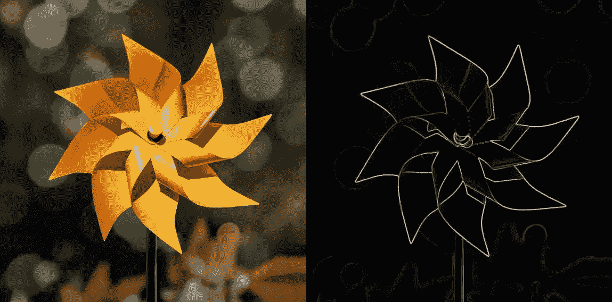
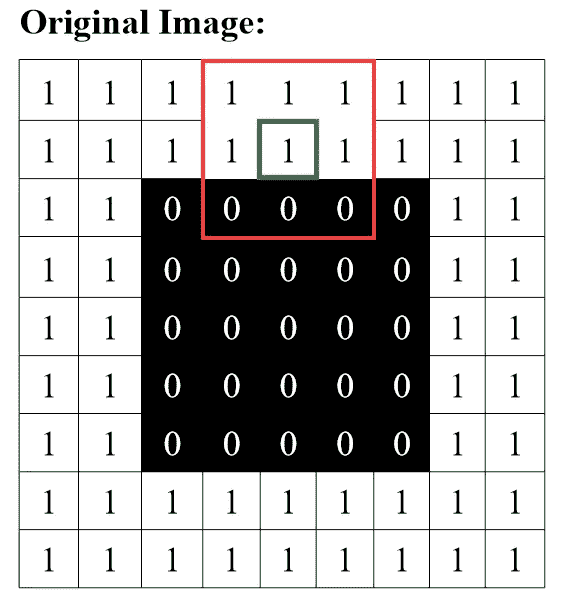
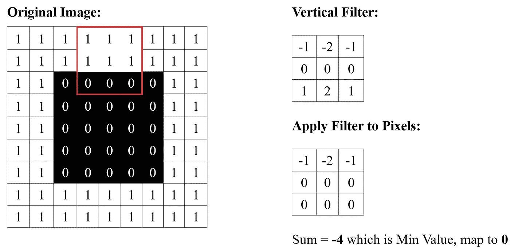
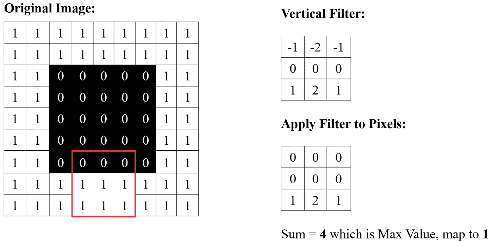
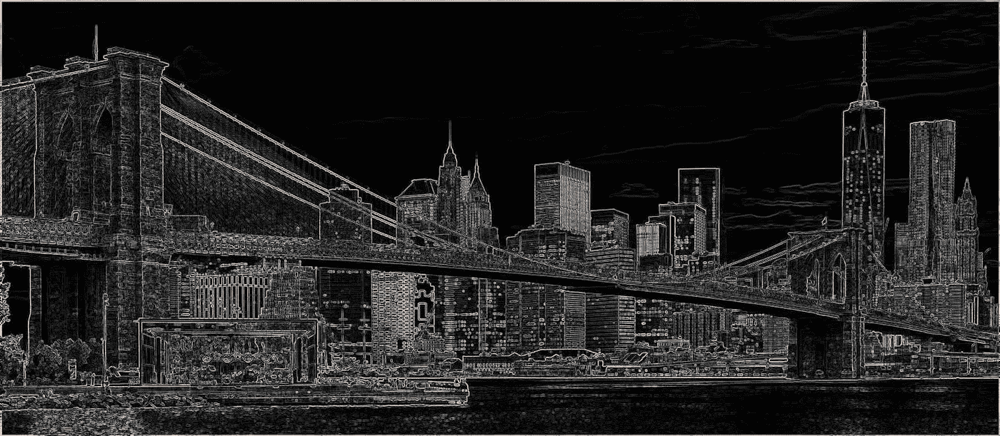

# Python 中的边缘检测

> 原文：<https://towardsdatascience.com/edge-detection-in-python-a3c263a13e03?source=collection_archive---------3----------------------->

上个季度，我在大学里帮助教授 Python 课程，结果学到了很多关于图像处理的知识。我想在本文中继续分享这些知识，因为我们讨论了使用 Python 进行边缘检测的**理论和执行**！

## 为什么要检测边缘？

我们真正应该问的第一个问题是*“为什么要麻烦边缘检测？”*。除了很酷之外，为什么它是一种有用的技术？为了激发这一点，考虑下面的纸风车图像及其“仅边缘”对应物:

风车(左)及其边缘(右)的图像

我们可以看到左边的原始图像有各种颜色和阴影，而右边的“仅边缘”表示是黑白的。如果问哪个图像需要更多的数据存储，我打赌你会说原始图像。这是有意义的。通过检测图像的边缘，我们去掉了很多细节，从而使图像“更轻”。

因此，在我们不需要保持图像的所有复杂细节，而是 ***只关心整体形状*** 的情况下，边缘检测会非常有用。

## 如何执行边缘检测—数学

在讨论代码之前，让我们快速看一下边缘检测背后的数学原理。作为人类，我们非常擅长识别图像的“边缘”，但我们如何教会计算机做同样的事情呢？

首先，考虑一个在白色背景中有一个黑色正方形的非常无聊的图像:

我们的工作形象

在这个例子中，我们认为每个像素的值在 **0(黑色)**和 **1(白色)**之间，因此现在只处理黑白图像。完全相同的理论将适用于彩色图像。

现在，假设我们正在尝试确定绿色高亮像素是否是该图像边缘的一部分。作为人类，我们会说**是的**，但是我们如何使用相邻像素来帮助计算机得出相同的结论呢？

让我们取一个小的 3×3 的局部像素框，以所讨论的绿色像素为中心。这个框显示为红色。然后，让我们对这个小盒子“应用”一个过滤器:

将垂直滤镜应用于局部像素框

我们将“应用”的过滤器如上所示，乍一看很神秘，但是让我们看看它是如何工作的。现在，当我们说 ***“将过滤器应用于像素的小局部框”*** 时，我们的意思是将红色局部框中的每个像素乘以过滤器元素中的每个像素。因此，红框中的左上角像素为 1，而滤镜中的左上角像素为-1，所以将这些像素相乘得到-1，这就是我们在结果的左上角像素中看到的。结果中的每个像素都是以完全相同的方式实现的。

下一步是对结果中的像素求和，得到-4。注意-4 实际上是我们通过应用这个滤镜可以得到的*最小*值(因为原始图像中的像素只能在 0 到 1 之间)。因此，我们知道所讨论的像素是顶部垂直边缘的**的一部分，因为我们获得了最小值-4。**

为了掌握这种变换，让我们看看如果我们对正方形底部的像素应用滤镜会发生什么:

我们看到我们得到了一个类似的结果，除了结果中的值之和是 4，这是我们通过应用这个过滤器可以得到的*最高*值。因此，我们知道我们在图像的底部垂直边缘找到了一个像素，因为我们得到了最大值 4。

要将这些值映射回 0–1 范围，我们只需将 4 相加，然后除以 8，将-4 映射到 0 ( **黑色**)，将 4 映射到 1 ( **白色**)。因此，使用这种称为*垂直索贝尔滤波器*的滤波器，我们能够非常简单地检测图像中的垂直边缘。

水平边缘呢？我们简单地采用垂直滤波器的**转置(关于它的对角线翻转)，并将这个新的滤波器应用于图像以检测水平边缘。**

现在，如果我们想要检测水平边缘、垂直边缘和介于两者之间的边缘，我们可以**组合垂直和水平分数**，如下面的代码所示。

希望理论清楚！现在让我们通过查看代码来结束。

## 如何执行边缘检测—代码

首先是一些设置:

*   把“pinwheel.jpg”替换成你想找到边缘的任何有趣的图片！确保它在同一个工作目录中。

以及边缘检测码本身:

需要注意一些事情:

*   图像周围将会有一个小边界，因为我们无法在边界像素上完全创建本地 3 x 3 框。
*   由于我们在水平和垂直边缘上都进行检测，所以我们只是将原始分数除以 4(而不是加上 4 然后除以 8)。这不是一个重大的变化，但它将更好地突出我们的形象的优势。
*   组合水平和垂直分数可能会导致最终边缘分数超出 0–1 范围，因此我们通过重新归一化分数来结束。

在更复杂的图像上运行上面的代码:

边缘检测的结果:

仅此而已！希望你学到了什么，敬请关注更多数据科学文章~