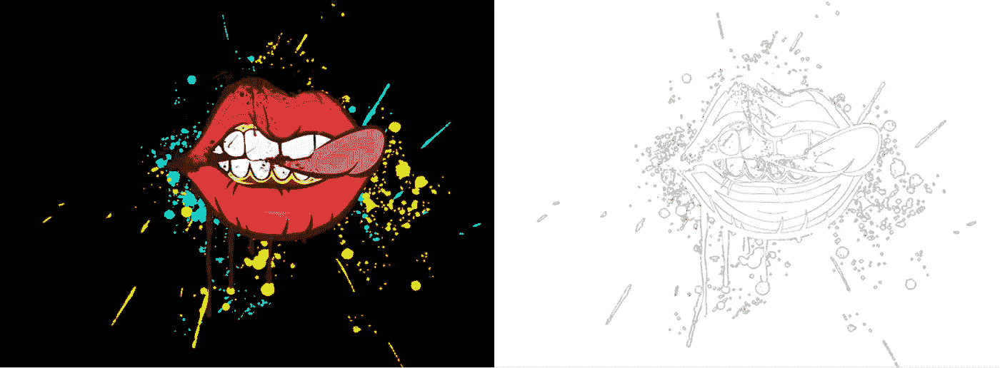

# OpenCV 的边缘和轮廓基础知识

> 原文：<https://towardsdatascience.com/edges-and-contours-basics-with-opencv-66d3263fd6d1?source=collection_archive---------8----------------------->

## 如何使用 Python 和 OpenCV 从图像中提取轮廓

我一直在尝试用 OpenCV 学习计算机视觉，在这篇文章中，我将探索边缘检测和轮廓。

上次我讲了内核和卷积的基础知识。这些方法被广泛用于不同的目的；其中一个引起了我的注意，我觉得这应该是学习计算机视觉的一个极好的下一步。

边缘检测和轮廓用于定位图像中颜色或亮度有很大变化的点。



原图由 [Stefano](https://pixabay.com/illustrations/lips-art-painting-design-teeth-3164202/) 提供。

对我们来说，这看起来很简单直观，但对计算机来说，这可能会很棘手。

## 谨慎的

Canny 边缘检测是一种用于从图像中提取边缘的算法，由于它看起来非常简单，我相信我们可以从它开始。

该算法有四个阶段:

*   **第一个** —用高斯模糊进行降噪；
*   **第二个** —用 [Sobel 核](https://en.wikipedia.org/wiki/Sobel_operator)得到梯度方向和大小；
*   **第三** —应用非最大抑制，去除不属于轮廓的多余像素；
*   **第四个** —应用使用最小值和最大值的滞后阈值，通过强度梯度过滤轮廓。

尽管看起来不那么容易，但是用 OpenCV 实现 Canny 检测还是很舒服的。

我们从导入库开始。

```
import cv2
import numpy as np
import matplotlib.pyplot as plt
```

现在我们可以看看我们想要提取轮廓的图像。

```
image = cv2.imread('Images/12.png')
image = cv2.cvtColor(image,cv2.COLOR_BGR2RGB)fig, ax = plt.subplots(1, figsize=(12,8))
plt.imshow(image)
```


插图由 [Stefano](https://pixabay.com/illustrations/lips-art-painting-design-teeth-3164202/) 绘制。

要使用 Canny，我们需要将图像转换为灰度，然后使用方法。小心处理图像，以及最小和最大阈值。

我建议您尝试这些阈值，看看结果如何变化。

```
g = cv2.cvtColor(image,cv2.COLOR_RGB2GRAY)
edge = cv2.Canny(g, 60, 180)fig, ax = plt.subplots(1, figsize=(12,8))
plt.imshow(edge, cmap='Greys')
```


轮廓。

很好，我们现在可以使用。寻找轮廓和。绘制轮廓，获取并绘制用 Canny 检测发现的外部轮廓。

```
contours = cv2.findContours(edge, 
                            cv2.RETR_EXTERNAL,
                            cv2.CHAIN_APPROX_NONE)cv2.drawContours(image, contours[0], -1, (0,0,255), thickness = 2)fig, ax = plt.subplots(1, figsize=(12,8))
plt.imshow(image)
```


图像上的轮廓。

酷，轮廓变量是一个包含所有 Canny 检测到的轮廓的列表——这意味着我们可以像这样访问和操作它们。

我们可以对这个列表进行排序，并传递 OpenCV 函数。countourArea 作为关键字，它将根据大小对所有检测到的轮廓进行排序。

让我们试着只画最大的等高线。

```
image = cv2.imread('Images/12.png')
image = cv2.cvtColor(image,cv2.COLOR_BGR2RGB)contours, h = cv2.findContours(edge, 
                               cv2.RETR_EXTERNAL,
                               cv2.CHAIN_APPROX_NONE)contours = sorted(contours, key=cv2.contourArea, reverse=True)cv2.drawContours(image, contours[0], -1, (0,0,255), thickness = 5)fig, ax = plt.subplots(1, figsize=(12,8))
plt.imshow(image)
```

*请注意，我重新加载了原始图像，因为我们绘制了最后一个图像。


面积最大的等高线。

有意思，我想我期待的是别的东西，比如整个嘴唇，甚至是舌头。相反，最突出的轮廓是嘴的一部分，不知何故与牙齿相连。

我想这向我们表明，这些方法要么需要以前的操作，要么需要更直观的图像来达到预期的结果。以现在的方式，我们的轮廓在正确的位置，但它们太颗粒化，无法恢复一个完整的形状。

尽管如此，该方法允许我们选择我们正在寻找的特定轮廓，甚至过滤一些范围的值。

还有其他寻找轮廓的方法；例如，简单的二值化也可以完成这项工作。

```
image = cv2.imread('Images/12.png')
image = cv2.cvtColor(image,cv2.COLOR_BGR2RGB)gray = cv2.cvtColor(image, cv2.COLOR_RGB2GRAY)
r, t = cv2.threshold(gray, 200, 255, cv2.THRESH_BINARY_INV)contours, h = cv2.findContours(t, cv2.RETR_LIST, cv2.CHAIN_APPROX_NONE)
contours = sorted(contours, key=cv2.contourArea, reverse=True)cv2.drawContours(image, contours, -1, (0,0,255), thickness = 5)fig, ax = plt.subplots(1, figsize=(12,8))
plt.imshow(image)
```


具有阈值和二值化的轮廓。

同样，您可以尝试更改阈值，看看会发生什么。

## 凸包

轮廓的典型应用是检测图像中的几何形状，这对于简化涉及分类或对象检测的问题非常有用。

问题是，根据质量、角度、噪声和许多其他因素，轮廓很少是简单的多边形。这就是凸包出现的原因。这里的想法是简化由我们以前的边缘检测方法生成的多边形。

看看[维基百科对凸包的定义](https://en.wikipedia.org/wiki/Convex_hull):

> 在几何学中，一个形状的凸包或凸包络或凸闭包是包含它的最小凸集。

相当复杂，但是 OpenCV 用函数. convexHull 简化了这一步。

```
image = cv2.imread('Images/14.jpg')
image = cv2.cvtColor(image,cv2.COLOR_BGR2RGB)g = cv2.cvtColor(image,cv2.COLOR_RGB2GRAY)
edge = cv2.Canny(g, 140, 210)contours, hierarchy = cv2.findContours(edge, cv2.RETR_LIST, cv2.CHAIN_APPROX_NONE)for c in contours:
    hull = cv2.convexHull(c)
    cv2.drawContours(image, [hull], 0, (0, 255, 0), 2)fig, ax = plt.subplots(1, figsize=(12,8))
plt.imshow(image)
```


[漫游者创作的插图](https://pixabay.com/illustrations/watercolor-rain-weather-paint-1244885/)

很好，我们可以看到轮廓并不完全符合图纸，而是简化了水滴的形状。

我认为这是一个良好的开端，边缘检测，轮廓，以及不同的操作和步骤，我们可以添加到这个过程中。我鼓励你尝试边缘检测的参数、阈值和不同方法。

感谢阅读我的文章。我希望你喜欢它。

**往期文章** :
[核与卷积基础知识](/basics-of-kernels-and-convolutions-with-opencv-c15311ab8f55)；
[变换基础知识](/transformations-with-opencv-ff9a7bea7f8b)；
[OpenCV 入门](/getting-started-with-opencv-249e86bd4293)；

**资源:** [OpenCV Canny](https://docs.opencv.org/trunk/da/d22/tutorial_py_canny.html)；
[OpenCV 特征检测](https://docs.opencv.org/trunk/dd/d1a/group__imgproc__feature.html#ga04723e007ed888ddf11d9ba04e2232de)；
[OpenCV 凸包](https://docs.opencv.org/3.4/d7/d1d/tutorial_hull.html)；
[求简单多边形的凸包——罗纳德·l·格雷厄姆](http://www.math.ucsd.edu/~fan/ron/papers/83_09_convex_hull.pdf)；
[OpenCV 结构分析和形状描述](https://docs.opencv.org/2.4/modules/imgproc/doc/structural_analysis_and_shape_descriptors.html?highlight=convexhull)；