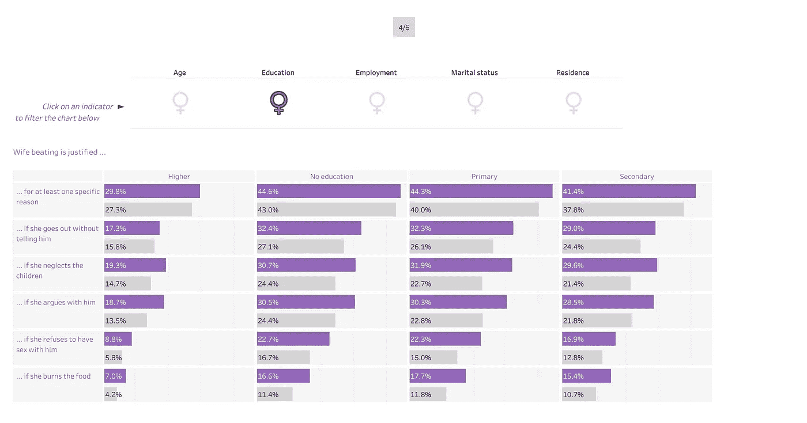

# 减少对妇女暴力的教育。

> 原文：<https://towardsdatascience.com/education-to-diminish-violence-against-women-bf599b350426?source=collection_archive---------56----------------------->

## 非洲家庭暴力信息图。

> “对妇女和女孩的暴力行为(VAWG)是当今世界上最普遍、最持久和最具破坏性的侵犯人权行为之一，由于有罪不罚、沉默、耻辱和耻辱，这种行为在很大程度上仍未被报道。”

# 背景

在我提交的#改头换面星期一的文章中，我通过使用 Tableau 将补充图表绘制成故事点，改进了一个名为“[消除对妇女暴力国际日](https://public.tableau.com/profile/operation.fistula6589#!/vizhome/Internationaldayfortheeliminationofviolenceagainstwomen/Violenceagainstwomen)”的 Viz。

不幸的是，Medium 不允许来自 Tableau 的交互式 Viz 块或代码嵌入，因此对于本演练，将使用静态屏幕截图来传达相关和重要的信息。

这是最初的[，即](https://public.tableau.com/profile/bryan.tan.jun.wei#!/vizhome/ViolenceAgainstWomen_15853280846490/Story1)。请随意在幻灯片/故事点上悬停，因为它们是交互式的！

# 数据源

人口和健康调查(DHS)是具有全国代表性的家庭调查，为人口、健康和营养领域的广泛监测和影响评价指标提供数据。

DHS 在非洲国家进行了一项关于妇女和男子如何为暴力侵害妇女行为辩护的调查。然后，数据集被分类为国家、参与者的人口统计数据、问题类型和同意率(认为在某些情况下暴力侵害妇女和女孩是合理的人的百分比)。

数据集特征的定义如下:

数据集的 Excel 文件或 Web 数据连接器 URL 可以从 [data.world](https://data.world/makeovermonday/2020w10/workspace/file?filename=20200306+Data+International+Women%27s+Day+Viz5+Launch.csv) 获得。

静态故事点 1

# 应对非洲普遍存在的暴力侵害妇女行为

联合国对暴力侵害妇女行为的定义是"对妇女造成或可能造成身体、性或心理伤害或痛苦的任何基于性别的暴力行为，包括威胁实施这种行为、胁迫或任意剥夺自由，无论发生在公共生活还是私人生活中"。

从历史上看，非洲家庭明显重男轻女；非洲社会认为儿子是他们家庭的荣誉，而只有女儿的家庭会被打上烙印。儿子通常断奶较晚，吃得更好，更有可能入学。这些社会规范使女孩成长为低自我价值和低自尊的妇女，从而使永无休止的暴力循环永久化。因此他们认为在某些情况下殴打妇女是正当的。虽然这种错误的心态将很快被废黜。

联合国妇女署开展了一系列实质性和有效的区域努力，以扩大在非洲的外联范围，结束基于性别的暴力，并动员问责要求。民间社会团体为当地记者组织了关于性别暴力的讲习班；私营公司对性别歧视和性骚扰实行“零容忍”政策；中小学和大学已将提高认识活动纳入其课程。

在这项研究中，我们将深入探讨为什么我们会得出教育是消除暴力侵害妇女行为的关键促进因素这一结论，探究被调查妇女的哪些类型的行为会煽动男子做出身体上的冷酷行为，以及使用平均协议率作为 KPI，根据对妇女的家庭暴力对非洲国家进行排名。

按平均协议价值排名，厄立特里亚居首位，其次是阿富汗。

为了了解被调查女性导致她们受到男性同事身体虐待的行为，绘制了一个水平条形图——针对女性和男性平均认同值的调查问题。

女性和男性的平均一致值分别用紫色和银灰色进行颜色编码。

最站不住脚的虐待理由是当女人烧糊食物时。在另一个极端，参与者的男女都认为**忽视他们的孩子**为殴打提供了强有力的理由。

**总体而言，与男性相比，更多的女性认为针对她们的暴力是正当的。**这一事实有效地描述了这些国家的社会标准——对妇女的歧视以及在她们中间播下低自我价值和低自尊的种子——是如何使这种暴力循环永久化的。

静态故事点 4

深入研究参与调查的妇女的人口统计数据，可以发现，就教育背景而言，大多数受过高等教育的妇女似乎认为殴打的情况是不合理的。

静态故事点 5

高等教育似乎是根除对妇女和女童的不公正暴力的最大潜在因素。所有国家的平均同意率仅为 9.5%！显然，随着妇女的教育水平从高等教育倒退到未受教育，平均认同率大幅上升。如气泡图右侧所示，与教育水平较低的国家相比，多米尼加共和国的平均认同率仅为 0.3%。

就居住地而言，农村地区的妇女比城市人口更有可能认为暴力侵害她们是正当的。

尽管百分比差异不明显，但年轻妇女和女孩往往认为对她们的虐待是合理的。可以对这一年龄组进行进一步的研究。

# 结论

利用从上述信息图表的解释性分析中获得的洞察力，妇女赋权计划可以有效地分配资源，增加妇女接受高等教育的机会，以期大幅减少对她们的暴力行为，特别是在这些非洲国家。

VAWG 的不良心理后果影响到妇女一生的各个阶段。在这方面，教育劣势不仅是普及教育和女孩受教育权的主要障碍；这有可能转化为妇女在劳动力市场的有限机会。

虽然基于性别的暴力可能发生在任何人、任何地方，但一些妇女和女孩特别容易受到伤害——例如，年轻女孩、被认为是同性恋或双性恋的妇女、移民和难民、土著妇女和少数民族，以及经历人道主义危机的妇女。

**对妇女的暴力行为**仍然是实现平等、发展、和平以及实现妇女和女童人权的障碍。

# 参考

[1]阅读更多关于消除对妇女暴力的信息:【https://www.un.org/en/events/endviolenceday/ 

[2]以上故事点我的互动画面:[https://public.tableau.com/profile/bryan.tan.jun.wei#!/viz home/violence against woman _ 15853280846490/story 1](https://public.tableau.com/profile/bryan.tan.jun.wei#!/vizhome/ViolenceAgainstWomen_15853280846490/Story1)

[3]原文即:[https://public.tableau.com/profile/operation.fistula6589#!/viz home/international day for the elimination of violence against women/violence against women](https://public.tableau.com/profile/operation.fistula6589#!/vizhome/Internationaldayfortheeliminationofviolenceagainstwomen/Violenceagainstwomen)