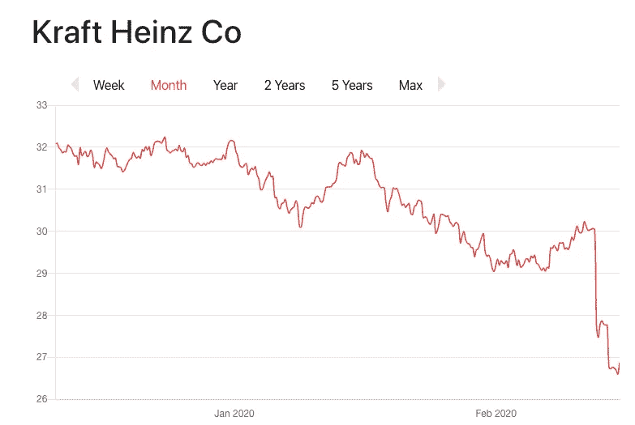
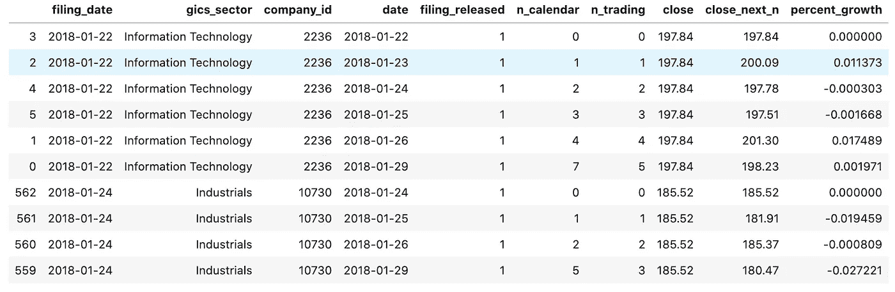
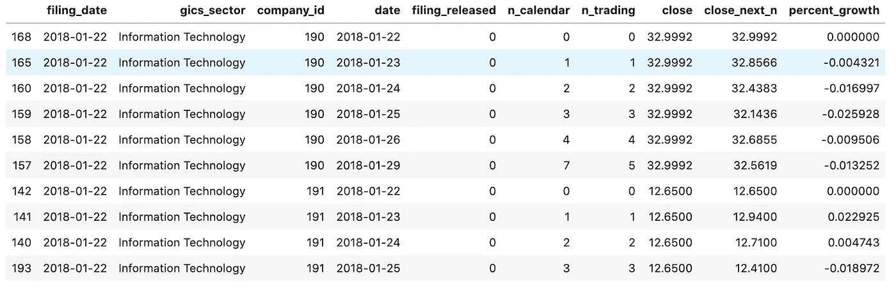
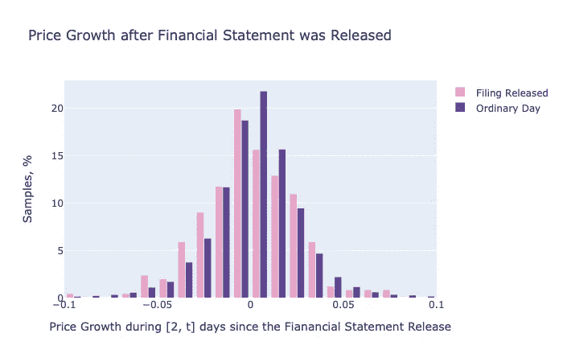
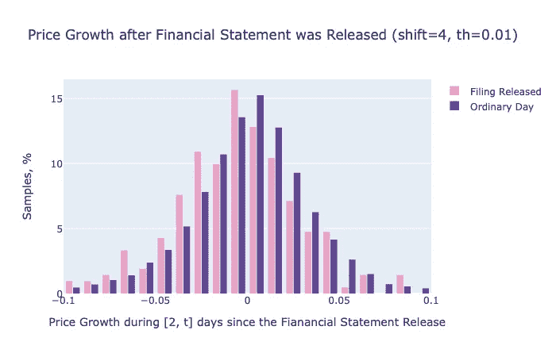
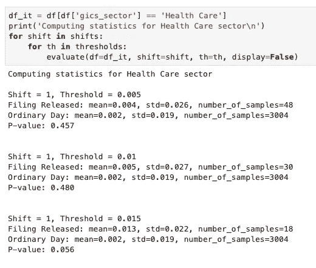

# 财务报表发布对股票价格的影响

> 原文：<https://towardsdatascience.com/effect-of-financial-statement-release-on-stock-prices-97932b2cb05?source=collection_archive---------10----------------------->

## 亨尼投资

## 一项研究分析了美国公司向美国证券交易委员会提交财报时的股价行为

[图片](https://stock.adobe.com/ca/images/finance-trade-manager-analysing-stock-market-indicators-for-best-investment-strategy-financial-data-and-charts-with-business-buildings-in-background/302181503)由[尼科埃尔尼诺](https://stock.adobe.com/ca/contributor/203824024/nicoelnino?load_type=author&prev_url=detail)拍摄

在正确的时间购买正确的股票是成功投资的基础。作为一名数据科学家，我相信在数据中发现模式，这在投资领域是非常有利可图的。在这篇文章中，我将探讨“关于公司的好消息引发股价上涨”的模式，并与您分享我的观察。

# 机会

我们中许多看图表的人可能已经注意到，财务报表的发布会对股票价格产生直接影响。下面是一个从 www.vhinny.com[借来的例子，关于 KHC 股票对该公司 10 季度报告的反应。](http://www.vhinny.com)

[https://www.vhinny.com/display/KHC](https://www.vhinny.com/display/KHC)

在公司发布业绩后，你可以看到几乎任何股票的价格都会立即发生变化(下跌或上涨)。看到这种行为，投资者可能会想到两个问题。**首先**，有没有办法在价格变动发生之前预测它的走向？**第二个**，一旦发生变动，股票会继续朝着可预测的方向移动吗？

虽然一些投资者可能会发现第一个挑战很有吸引力，并在预测价格波动中看到机会，但我会站在以沃伦巴菲特为首的伟人一边，他可以说是有史以来最伟大的投资者，并简单地说:“我不知道怎么做”。为了使股价在财务报表发布后立即上涨，不仅要超过公司过去的收益，还要超过分析师对当前收益的预期。我认为，预测这两个事件中的任何一个都是一个挑战，由于缺乏可靠的信息，散户投资者无法应对。因此，避免一起尝试这种挑战可能是值得的。

另一方面，预测股价变化的第二个挑战是普通投资者可以用他或她拥有的工具应对的挑战。在本文中，我将探讨年度财务报表(10-K)的发布是否包含可操作的信号，投资者可以使用这些信号来决定是否有机会在购买时获利。

# 资源

为了进行这项研究，我使用了包含 www.vhinny.com[的 10k 发行日期和 www.alphavantage.co](http://www.vhinny.com)[的股票价格的金融数据。你可以在我的](http://www.alphavantage.co) [GitHub](https://github.com/vhinny-investing/effect-of-earnings-on-stock-price) 页面上找到本文讨论的分析的完整参考代码。

# 问题陈述和范围

**目标:**在本研究中，我将调查一旦财务报表发布，市场对此做出初步反应，是否存在做出投资决策的机会。

**澄清:**许多财务报表在闭市期间发布。在 KHC 的例子中(见上图)，市场在 2020 年 2 月 12 日以 30 美元收盘，财务报表(10-Q)在盘后时间发布，市场在 2 月 13 日开盘，定价 KHC 下跌 10%，当天收盘时为 27 美元。在这项研究中，问题不是价格是否会下降 10%。确切地说是以下内容。一旦价格下降了 10%，是否有证据表明会进一步下跌？

**数据集:**本研究使用的数据集由 S & P 500 指数覆盖的 479 家公司组成，代表 2018 年 1 月至 2019 年 12 月(2 年)评估的 11 个行业领域。

**方法:**为了生成这个数据集，我首先确定了调查期间发布的财务报表的所有(公司，日期)对。对于财务报表发布的每个特定日期，我都添加了(公司，日期)在该日期没有发布财务报表的公司对。为了保持数据集大小的可管理性，后一种公司配对是为与发布财务报表的公司在同一行业运营的公司创建的。例如，如果在 2020 年 2 月 19 日，只有公司 A(信息技术)和公司 B(医疗保健)发布了他们的声明(正面示例)，则在该日期将只介绍来自相同两个部门(信息技术和医疗保健)的公司(负面示例)。所有可用的(公司，日期)对都被夸大以覆盖“日期”和“日期+ 7 天”之间的时间段，以提供对股票价格行为的可见性。

**插图:**下面我举一个例子，一家公司于 2018 年 1 月 22 日发布了其财务报表(申报日期)。后续 7 个日历日(n_calendar)跟踪股价，一般相当于 5 个交易日(n_trading)。我还在“close”列中包含了“filing_date”时的股价，在“close_next_n”列中包含了“date”时的股价，以及表示“close”和“close_next_n”之间的百分比变化的“percent_growth”。列“归档 _ 发布”是指示该公司是否在“归档 _ 日期”发布财务报表的标志。如果“归档 _ 发布”为 0，则意味着该公司没有发布其财务报表，并用于与其他发布了财务报表的公司进行比较。

请注意 company_id=2236 在其财务报表于 2018 年 1 月 22 日发布后，如何从 2018 年 1 月 23 日的 197.84 美元涨到 200.09 美元

请注意，该公司(190)的提交日期与 2018 年 1 月 22 日相同，并且没有发布其申请(filing_released=0)。它也没有显示在这 7 天中任何有形的价格变化。

**评估:**我想评估一份“好消息”财务报表的发布是否对股价产生可操作的影响。为此，我将比较发布财报的公司(正面例子)和没有发布财报的公司(负面例子)的股价增长。为了消除市场趋势的影响，引入反面例子并进行比较分析而不是看绝对增长数字是很重要的。例如，如果一家公司属于“下降趋势”行业，积极的收益报告可能会阻止股价下跌，而不是显示积极的趋势。从绝对业绩来看，我们可以得出结论，该公司的财务报表没有影响，而与同行业的其他公司相比，该公司的业绩高于平均水平。

# 结果和讨论

该数据集包含 944 家公司的样本(每家公司 2 个样本，2018 年至 2019 年间每年 1 个样本)。财务报表一旦发布，我们需要一些时间来评估它对公司来说是“好消息”还是“坏消息”。我用财务报表发布后的第一天来决定它是正面还是负面的报表。如果第一天的价格增长超过了一定的阈值，我称之为信号，并得出结论，该声明具有积极的影响(购买该股票的信号)。为了说明这种方法，让我们考虑第一天价格增长 1%的阈值。这使我们有 257 家公司的样本(截至申请日)通过了这一门槛。相比之下，我们有 24315 家样本公司在相应的申报日期没有发布任何信息。接下来，让我们看看正面和负面例子的价格在第一天之后是如何变化的，看看它们的表现是否不同。下图显示了自财务报表发布后第一天，正面和负面示例的价格增长分布。

在该柱状图中，X 轴代表 n_trading=1(不含)和 n_trading=3(含)之间的价格增长百分比(从捕获即时价格增长后的 2 天开始)。粉色条柱(申报已发布)代表发布报告的公司；紫色柱(普通日)代表没有发布报告的公司。y 轴显示直方图上相应条柱内的样本百分比。

“备案发布”公司的样本分布在-0.001 均值附近，标准差为 0.025，“普通日”公司的样本分布在 0.002 均值附近，标准差为 0.026。计算这些分布的 p 值得到 0.072，这意味着缺乏证据来推断这些分布是不同的。然而，我们可以观察到，与“普通日”直方图相比,“申请释放”直方图向左移动。事实上，这与我的预期相反，即积极的财务报告会为价格在不久的将来向同一方向发展提供动力。

# 改变参数

现在我已经建立了实验，让我们看看阈值和偏移值的不同参数组合是否会产生不同的结果。我将使用 0.5%、1%和 1.5%的阈值来选择发布报告的公司的“正面例子”。我还将使用等于 1、2、3 和 4 的天数来评估股票价格的变化。这给了我们 3*4 = 12 种可能的参数组合。表现最好的组合(最低 p 值为 0.001)是阈值= 1%和移位= 4 天。下面是这个实验的分布。

“备案发布”公司的样本分布在-0.006 均值附近，标准差为 0.034，“普通日”公司的样本分布在 0.002 均值附近，标准差为 0.038。虽然这个实验确实具有较低的 p 值，这意味着分布中的差异具有统计学意义，但它使我们进一步远离了验证收益报告可以在财务报表发布后被用作积极信号，并且市场已经做出了最初的举动。

# 比较同一部门内的结果

到目前为止，该分析是针对数据集中不同行业的所有公司进行的。有人可能会说，不同的行业可能有不同的价格动态。因此，对我们“正面例子”来说，某些行业的上升趋势可能会超过报表驱动的运动。为了研究这个想法，我将每个实验的范围缩小到相同行业的公司，并进行相同的测试。下面是医疗保健部门的一项实验的摘录。

摘自 Jupyter 笔记本，补充本文

我鼓励读者参考本文附带的 [Jupyter 笔记本](https://github.com/vhinny-investing/effect-of-earnings-on-stock-price/blob/master/Effect%20of%20Earnings%20Reports%20on%20Stock%20Price.ipynb)了解详情。总之，这些测试没有提供令人信服的证据来支持财务报表发布事件具有作为投资者购买股票的信号的有形潜力的假设。

# 结论

在这项研究中，我旨在调查财务报表(10-K)的发布是否可以用作购买股票的信号。为了验证我的假设，我进行了一些实验，将发布财务报表的公司和不发布财务报表的公司的表现进行了比较。

这些实验没有显示支持本研究假设的证据，即看看投资者是否能在财报发布后观察到价格变化，并在趋势的方向和强度变得明确后加入趋势。

我请读者记住，这不是一个深入的分析，而是一个概念探索的快速证明。深入研究的机会包括调查公司年龄、市值、融资结构等各种细分。但是，作为一个投资者，我相信有更多有希望找到信号的地方应该首先探索。

 [## 新冠肺炎在股票市场上横冲直撞。机器学习来解释。

### 使用机器学习来识别新冠肺炎期间受打击最大的股票中的共同因素。

towardsdatascience.com](/covid-19-rampage-on-the-stock-market-machine-learning-comes-to-explain-3332707954af) 

# 我们连线吧！

我很高兴与和我有共同道路的人联系，这是对财务独立的追求。如果你也在寻求经济独立，或者你想和 T2 合作，交流想法，请随时联系我们！以下是一些可以找到我的地方:

*   【www.vhinny.com——投资研究平台，为您自己的分析提供金融数据
*   [https://www.linkedin.com/company/vhinny](https://www.linkedin.com/company/vhinny)——加入我们在 LinkedIn 上的社区，在那里我和其他贡献者分享与投资相关的内容

干杯！