# 用于神经网络训练的梯度下降优化器

> 原文：<https://towardsdatascience.com/effect-of-gradient-descent-optimizers-on-neural-net-training-d44678d27060?source=collection_archive---------24----------------------->

与 [Apurva Pathak](https://medium.com/u/c6fb3b9f100f?source=post_page-----d44678d27060--------------------------------) 合著

# 尝试梯度下降优化器

欢迎来到我们深度学习实验系列的另一部分，在这里我们进行实验来评估关于训练神经网络的常见假设。我们的目标是更好地理解影响模型训练和评估的不同设计选择。为了做到这一点，我们提出了关于每个设计选择的问题，然后运行实验来回答它们。

在本文中，我们试图更好地理解使用不同优化器的影响:

*   不同的优化器在实践中表现如何？
*   每个优化器对学习率或动量等参数选择的敏感程度如何？
*   每个优化器的收敛速度有多快？
*   选择一个好的优化器会带来多大的性能差异？

为了回答这些问题，我们评估了以下优化器:

*   随机梯度下降
*   带动量的 SGD
*   内斯特罗夫势头强劲的新加坡元
*   RMSprop
*   圣经》和《古兰经》传统中）亚当（人类第一人的名字
*   阿达格拉德
*   循环学习率

# 实验是如何设置的？

我们使用不同的优化器训练神经网络，并比较它们的性能。这些实验的代码可以在 Github 的[上找到。](https://github.com/darylchang123/ml-experiments/blob/master/Optimizer%20(new%20base%20model).ipynb)

*   数据集:我们使用猫狗数据集，它由 23，262 张猫狗图片组成，在两个类之间对半分割。由于图像大小不同，我们将它们调整到相同的大小。我们使用数据集的 20%作为验证数据(开发集)，其余的作为训练数据。
*   评估度量:我们使用验证数据上的二进制交叉熵损失作为测量模型性能的主要度量。

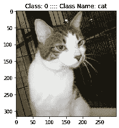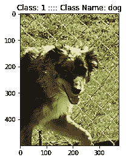

图 1:来自猫狗数据集的样本图像

*   基本模型:我们还定义了一个受 VGG16 启发的基本模型，在这里我们重复应用(卷积->最大池-> ReLU ->批处理范数->丢弃)运算。然后，我们展平输出体积，并将其馈入两个完全连接的层(密集-> ReLU ->批处理-规范)，每个层有 256 个单位，并在第一个 FC 层后丢弃。最后，我们将结果输入到一个具有 sigmoid 激活的单神经元层，产生一个介于 0 和 1 之间的输出，告诉我们该模型预测的是猫(0)还是狗(1)。

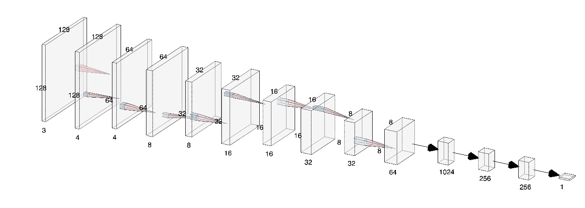

图 2:基本模型架构(使用 [NN SVG](http://alexlenail.me/NN-SVG/LeNet.html) 创建)

*   训练:我们使用 32 的批量大小和默认的权重初始化(Glorot uniform)。默认优化器是 SGD，学习率为 0.01。我们进行训练，直到验证损失在 50 次迭代中没有改善。

# 随机梯度下降

我们首先从普通的随机梯度下降开始。这由以下更新公式定义:

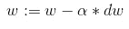

图 3: SGD 更新公式

其中 w 是权重向量，dw 是损失函数相对于权重的梯度。这个更新规则向损失函数的最大下降方向迈出了一步，帮助我们找到一组使损失最小化的权重。请注意，在纯 SGD 中，更新是针对每个示例应用的，但更常见的是对一批示例(称为小批)进行计算。

## 学习率如何影响 SGD？

首先，我们探讨学习率如何影响 SGD。众所周知，选择过低的学习速率会导致模型收敛缓慢，而过高的学习速率会导致模型根本不收敛。


图 4:优化器收敛图解，摘自[杰瑞米·乔登网站](https://www.jeremyjordan.me/nn-learning-rate/)

为了通过实验验证这一点，我们沿着 0.001 和 0.1 之间的对数标度改变学习速率。让我们先画出训练损失。

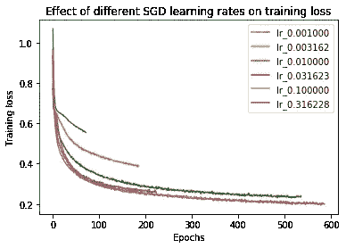

图 5:不同学习率下 SGD 的培训损失曲线

我们确实观察到，当学习率既不太小也不太大(红线)时，性能是最佳的。最初，增加学习率会加快收敛，但在学习率为 0.0316 之后，收敛实际上会变得更慢。这可能是因为步长越大，实际上可能会超过最小损耗，如图 4 所示，从而导致更高的损耗。

现在让我们画出验证损失图。

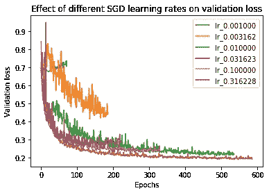

图 6:不同学习率下 SGD 的验证损失曲线

我们观察到，当我们选择太小或太大的学习率时，验证性能会受到影响。太小(例如 0.001)，验证损失根本不会减少，或者减少得非常慢。太大(例如 0.1)并且验证损失不能达到较小学习率所能达到的最低值。

现在让我们画出每个学习率*所达到的最佳培训和验证损失:

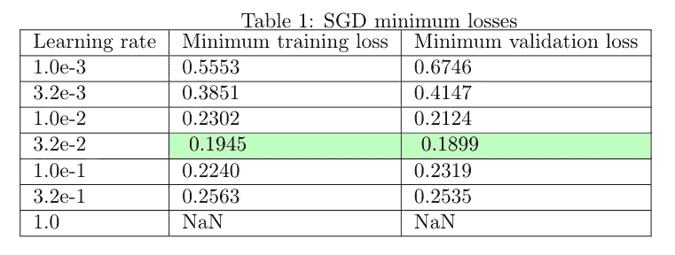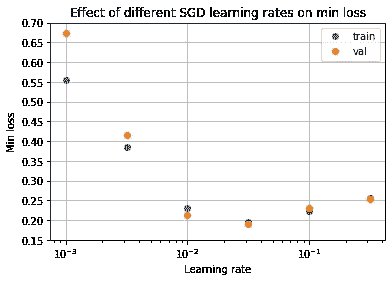

图 7:不同学习率下 SGD 的最小培训和验证损失

上述数据证实了“金发女孩”理论，即选择一个既不太小也不太大的学习率，因为最佳学习率(3.2e-2)在我们尝试的值范围的中间。

*通常，我们预计验证损失会高于训练损失，因为模型之前没有看到验证数据。然而，我们从上面可以看到，验证损失有时比训练损失要低得多。这可能是由于脱落，因为神经元仅在训练时脱落，而不是在评估期间脱落，导致评估期间的性能比训练期间更好。当辍学率较高时，这种影响可能特别明显，就像我们的模型一样(FC 层上的辍学率为 0.6)。

## 最佳新币验证损失

*   最佳验证损失:0.1899
*   相关培训损失:0.1945
*   时代收敛到最小值:535
*   参数:学习率 0.032

## 新币外卖

*   选择一个好的学习率(不要太大，也不要太小)对于确保 SGD 的最佳性能至关重要。

# 带动量的随机梯度下降

## 概观

带动量的 SGD 是 SGD 的变体，通常比普通 SGD 收敛得更快。它通常定义如下:

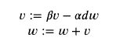

图 8:用动量更新 SGD 方程

*good fellow 等人的深度学习*解释了算法背后的物理直觉[0]:

> 形式上，动量算法引入了一个扮演速度角色的变量*v*——它是参数在参数空间中移动的方向和速度。速度被设置为负梯度的指数衰减平均值。

换句话说，参数以随时间变化的速度穿过参数空间。速度的变化由两项决定:

*   𝛼，学习率，它决定了梯度对速度的影响程度
*   𝛽，速度随时间衰减的速率

因此，速度是梯度的指数平均值，它包含新的梯度，并随着时间的推移自然衰减旧的梯度。

人们可以想象一个球从山上滚下来，速度越来越快。重力对球施加力，使其加速或减速，如梯度项𝛼 ** dw* 所示。球也会遇到粘性阻力，导致其速度衰减，正如𝛽.所描述的那样

动量的一个作用是加速沿着梯度方向一致的维度的更新。例如，考虑梯度为常数 *c* 时动量的影响:

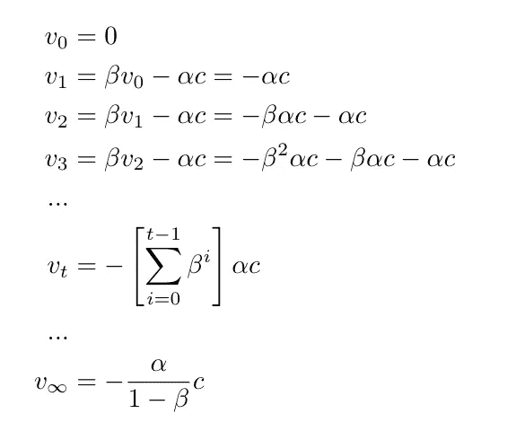

图 9:梯度为常数 c 时速度随时间的变化。

普通的 SGD 每次都会更新 *-* 𝛼 *c* ，而具有动量的 SGD 会随着时间加速，最终达到比普通更新大 1/1-𝛽倍的最终速度(使用无穷级数的公式得出)。例如，如果我们将动量设置为𝛽=0.9，那么更新最终会变成普通更新的 10 倍。

动量的另一个作用是抑制振荡。例如，考虑这样一种情况，即渐变经常沿着某个维度弯曲并改变方向:

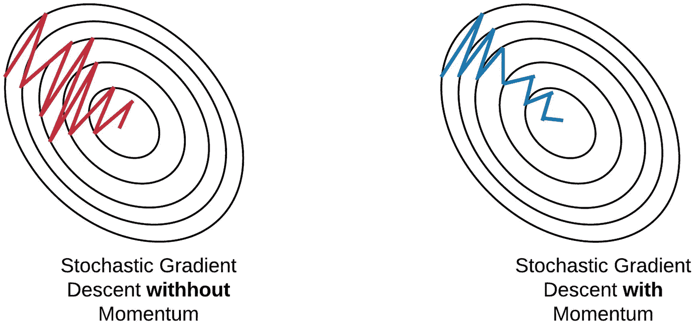

图 10:动量图，来自 Ekaba Bisong 的[更多关于优化技术的内容](https://link.springer.com/chapter/10.1007/978-1-4842-4470-8_33)

动量项抑制了振荡，因为当我们把振荡项加到速度中时，它们就抵消了。这允许更新由梯度始终指向相同方向的维度支配。

## 实验

让我们看看学习率为 0.01 时动量的作用。我们尝试动量值[0，0.5，0.9，0.95，0.99]。

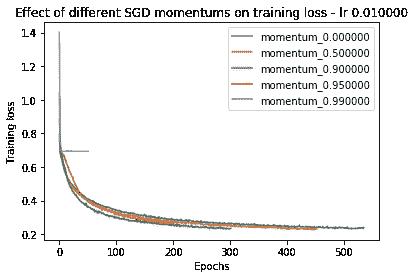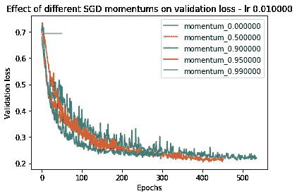

图 11:学习率为 0.01 时动量对训练损失(左)和验证(右)的影响。

上面，我们可以看到，将动量增加到 0.9 有助于模型训练更快地收敛，因为训练和验证损失以更快的速度减少。然而，一旦我们超过 0.9，我们观察到训练损失和验证损失实际上受到影响，模型训练完全不能收敛于动量 0.99。为什么会这样？这可能是因为过大的动量阻止模型适应梯度更新中的新方向。另一个潜在的原因是权重更新变得如此之大，以至于超过了最小值。然而，这仍是未来调查的一个领域。

我们是否观察到振荡的减少，这被吹捧为动量的好处？为了测量这一点，我们可以计算每个更新步骤的振荡比例，即与之前的更新相比，当前更新中有多少比例的参数更新具有相反的符号。事实上，增加动量会降低振荡参数的比例:

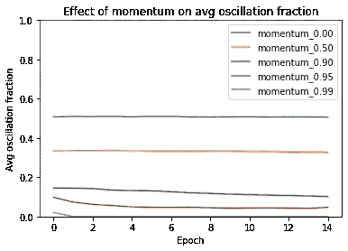

图 12:动量对振荡的影响

更新的大小呢——动量的加速属性增加了更新的平均大小吗？有趣的是，动量越高，初始更新越大，但后期更新越小:

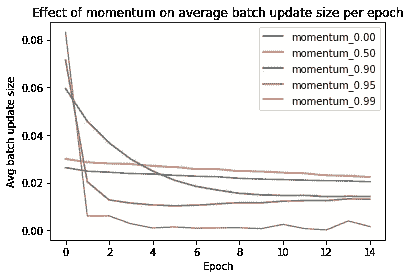

图 13:动量对平均更新大小的影响

因此，增加动量导致采取较大的初始步骤，但较小的后续步骤。为什么会这样呢？这可能是因为动量最初受益于加速度，导致初始步长更大。后来，动量导致振荡抵消，这可能使后面的步骤更小。

支持这种解释的一个数据点是每个时期所经过的距离(定义为时期开始时的权重和时期结束时的权重之间的欧几里德距离)。我们看到，尽管动量值越大，后面的步长越小，但实际上它们移动的距离越大:

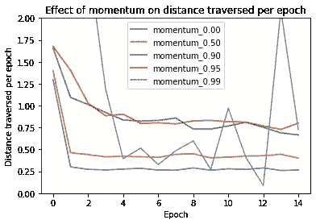

图 14:对于每个动量值，每个时期遍历的距离。

这表明，即使增加动量值会导致后面的更新步骤变得更小，但遍历的距离实际上更大，因为这些步骤更有效——它们不会经常相互抵消。

现在，让我们看看动量对一个小的学习率(0.001)的影响。

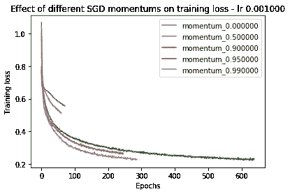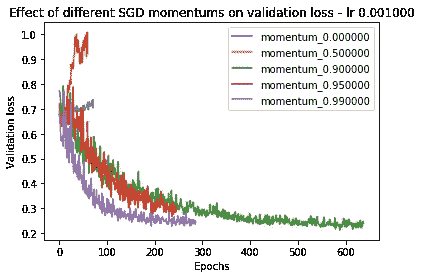

图 15:学习率为 0.001 时动量对训练损失(左)和验证损失(右)的影响。

令人惊讶的是，在小的学习率上增加动力有助于它收敛，而以前没有！现在，让我们来看一个大的学习率。

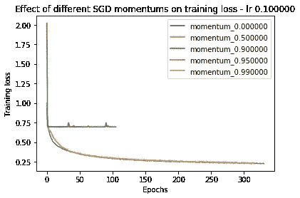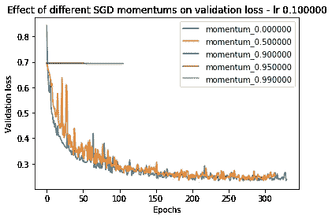

图 16:学习率为 0.1 时动量对训练损失(左)和验证损失(右)的影响。

当学习率较大时，增加动量会降低性能，甚至会导致模型无法收敛(参见上面对应于动量 0.9 和 0.95 的平线)。

现在，为了概括我们的观察结果，让我们看看所有学习速率和动量的最小训练损失和验证损失:

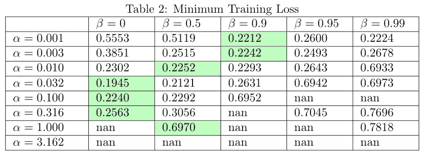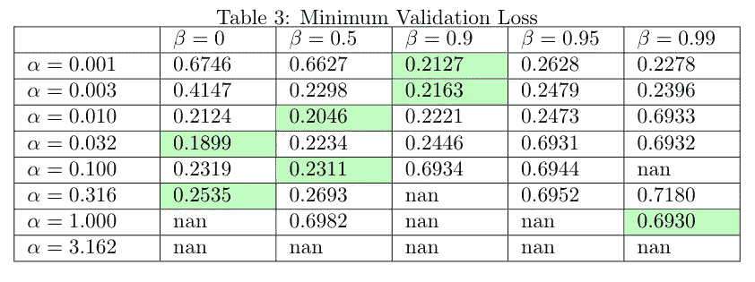

图 17:不同学习速度和动量下的最小训练损失(左)和验证损失(右)。每行中的最小值以绿色突出显示。

我们看到学习率和动量密切相关——学习率越高,“可接受的”动量值(即不会导致模型训练发散的值)的范围越低。相反，动量越高，可接受的学习率范围越低。

总的来说，所有学习率的行为表明，增加动量的效果类似于增加学习率。它有助于较小的学习率收敛(图 14)，但可能导致较大的学习率发散(图 15)。如果我们考虑图 9 中的终端速度解释，这是有意义的——增加动量可以导致更新达到比普通更新本身大得多的终端速度。

然而，请注意，这并不意味着增加动量与增加学习速率是相同的——在增加动量和增加学习速率之间的收敛/发散行为方面有一些简单的相似之处。更具体地说，正如我们在图 12 和图 13 中看到的，动量也会减少振荡，并在训练开始时预先加载大量更新——如果我们只是提高学习速率，我们不会观察到相同的行为。

## 动量的另一种表述

还有另一种定义动量的方法，表述如下:

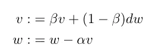

图 18:动量的替代定义

吴恩达在 Coursera 的深度学习专业中使用了动量的定义。在这个公式中，速度项是梯度的指数移动平均值，由参数β控制。更新被应用于权重，更新的大小由学习速率α控制。注意，当展开时，这个公式在数学上与第一个公式相同，除了所有项都乘以 1-β。

这种动量公式在实践中是如何工作的？

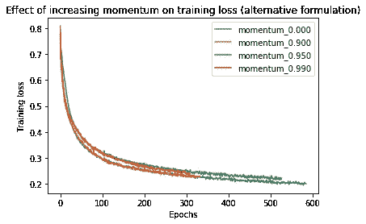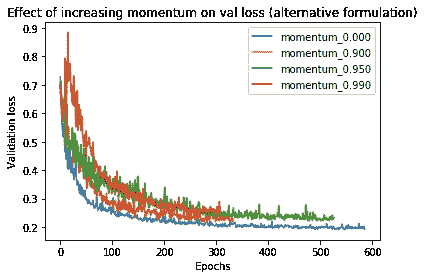

图 19:动量(替代公式)对训练损失(左)和验证损失(右)的影响

令人惊讶的是，使用这种替代公式，看起来增加动量实际上减慢了收敛！

为什么会这样呢？这种动量公式虽然抑制了振荡，但并不像另一种公式那样具有加速的好处。如果我们考虑一个玩具的例子，其中梯度总是一个常数 *c* ，我们看到速度永远不会加速:

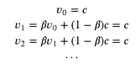

图 20:恒定 c 的重复梯度下速度随时间的变化

事实上，吴恩达认为，这种动量公式的主要好处不是加速度，而是它抑制振荡的事实，允许你使用更大的学习速率，从而更快地收敛。基于我们的实验，增加动量本身(在这个公式中)而不增加学习速率不足以保证更快的收敛。

## SGD 最佳验证损失与动量

*   最佳验证损失:0.2046
*   相关培训损失:0.2252
*   聚合到最小值的时期:402
*   参数:学习率 0.01，动量 0.5

## 带动力外卖的新加坡元

*   **基于我们测试的参数，动量导致模型训练收敛更快，但不能保证改善最终的训练或验证损失。**
*   **学习率越高，可接受动量值的范围越低(模型训练收敛的范围)。**

# 具有内斯特罗夫动量的随机梯度下降

动量的一个问题是，虽然梯度总是指向最大损失减少的方向，但动量可能不是。为了校正这一点，内斯特罗夫动量在一个前瞻点(w +速度)而不是 w 处计算梯度。这给梯度一个校正动量项的机会。

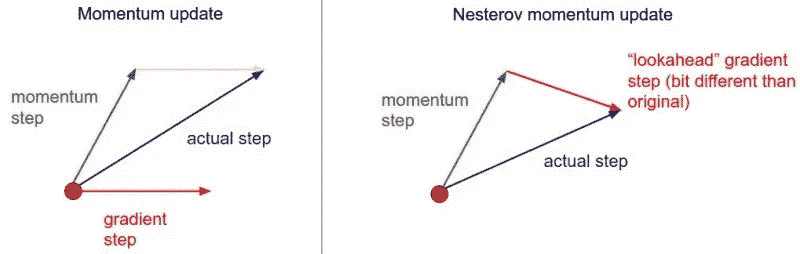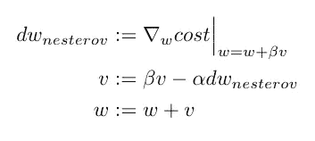

图 21:内斯特罗夫更新。左图:插图。右图:方程式。

为了说明内斯特罗夫如何帮助训练更快地收敛，让我们看一个虚拟的例子，其中优化器试图下降一个碗形的损失表面，最小值在碗的中心。

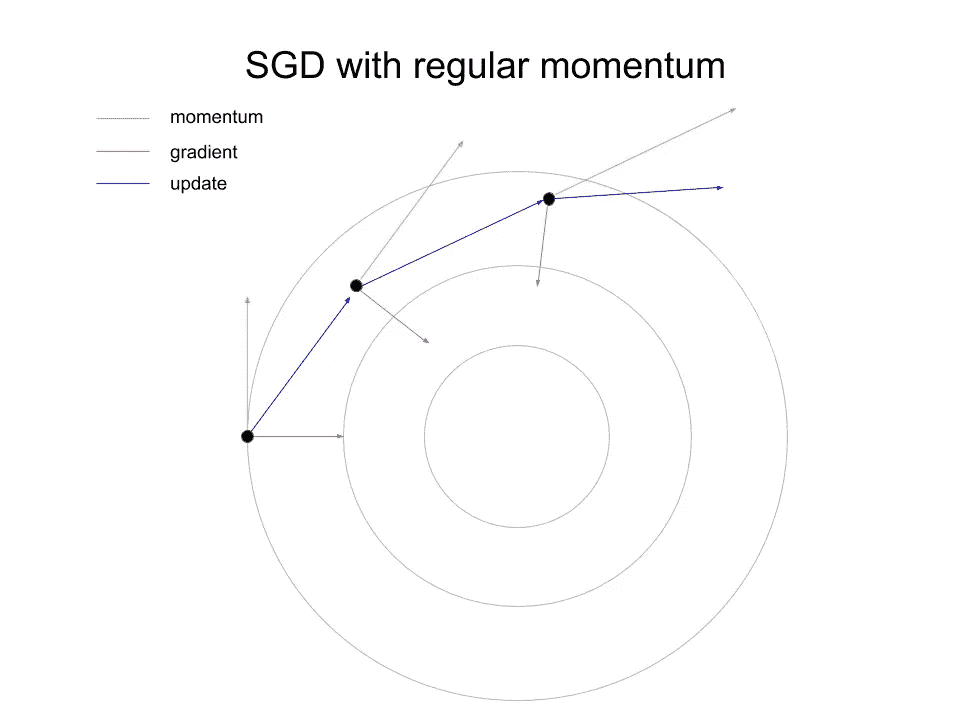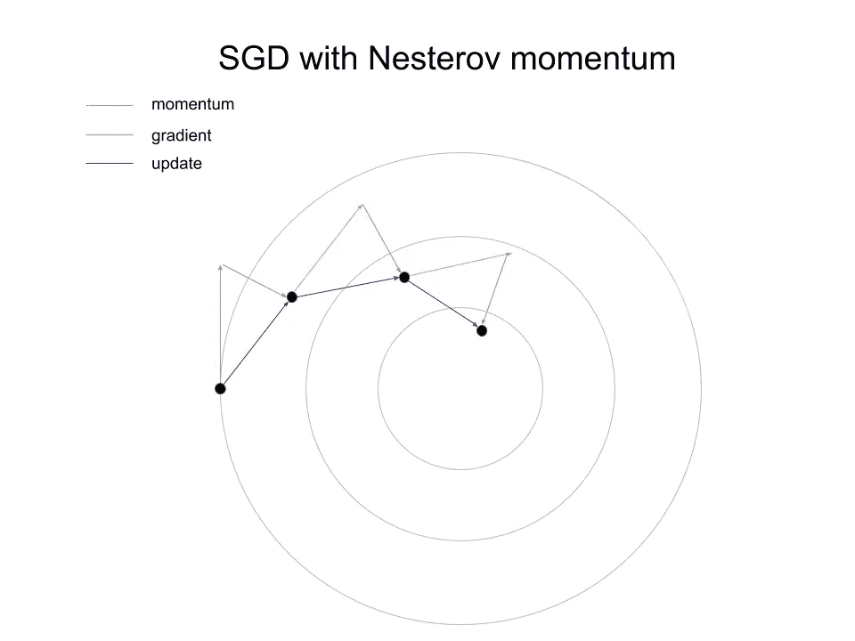

图 22。左:常规动量。右图:内斯特罗夫动量。

如图所示，内斯特罗夫收敛更快，因为它在一个前瞻点计算梯度，从而确保更新更快地接近极小值。

让我们在我们用于常规动量的学习率和动量的子集上尝试内斯特罗夫，看看它是否能加速收敛。我们来看看学习率 0.001 和动量 0.95:

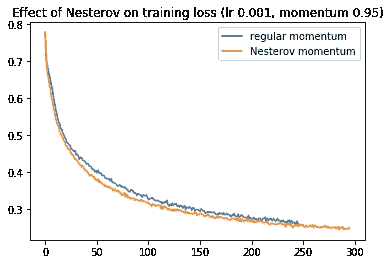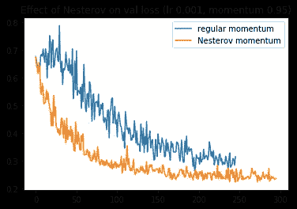

图 23:内斯特罗夫动量对 lr 0.001 和动量 0.95 的影响。

在这方面，内斯特罗夫似乎确实在迅速加快收敛速度！如果我们把动量增加到 0.99 呢？

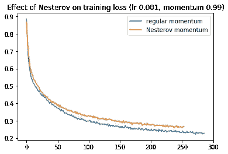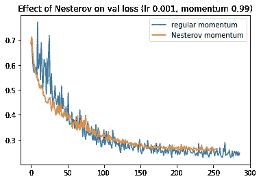

图 24:内斯特罗夫动量对 lor 0.001 和动量 0.99 的影响。

现在，内斯特罗夫实际上在训练损失上收敛得更慢，虽然它最初在验证损失上收敛得更快，但它变慢了，并在大约 50 个时代后被动量超过。

我们应该如何衡量所有训练运行的收敛速度？让我们看看常规动量在 50 个时代后的损失，然后确定内斯特罗夫需要多少个时代才能达到同样的损失。我们将**收敛比**定义为这个历元数除以 50。如果它小于 1，那么内斯特罗夫比常规动量收敛得更快；相反，如果它更大，那么内斯特罗夫收敛得更慢。

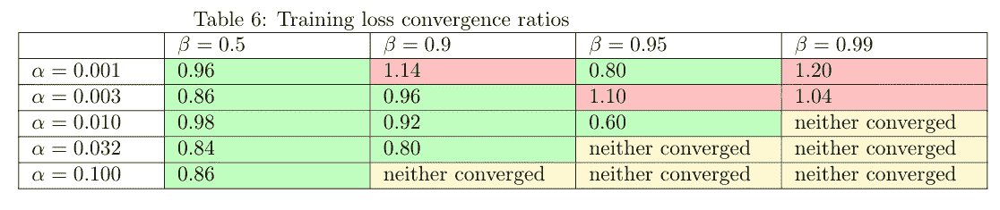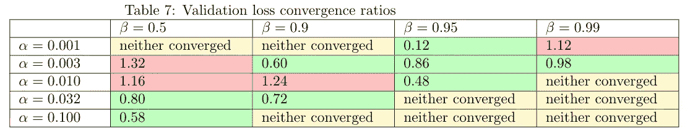

图 25。50 个时期后，内斯特罗夫损失收敛到常规动量损失的时期比率。内斯特罗夫跑得更快的训练用绿色突出显示；红色较慢；内斯特罗夫和常规动量都没有汇聚成黄色。

我们看到，在大多数情况下(10/14)，加入内斯特罗夫会导致训练损失下降得更快，如表 5 所示。这同样适用于表 6 中验证损失的较小程度(8/12)。

添加内斯特罗夫的加速和其他参数(学习速率和动量)之间似乎没有明确的关系，尽管这可能是未来研究的一个领域。

## 内斯特罗夫势头的新币最佳验证损失

*   最佳验证损失:0.2020
*   相关培训损失:0.1945
*   聚合到最小值的时期:414
*   参数:学习率 0.003，动量 0.95

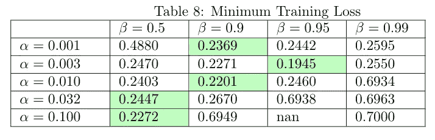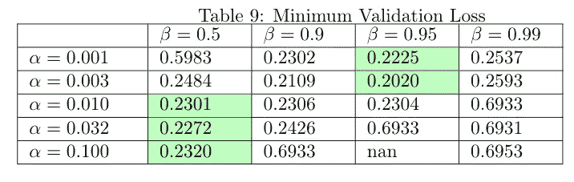

图 26。每次训练运行达到的最小训练和验证损失。每行中的最小值以绿色突出显示。

## 带内斯特罗夫动力外卖的新加坡元

*   **内斯特罗夫动量法计算前瞻点处的梯度，以说明动量效应。**
*   **与常规动量相比，内斯特罗夫通常收敛得更快。**

# RMSprop

在 RMSpropr 中，我们对每个权重参数执行以下操作:

*   保持平方梯度的移动平均值。
*   将梯度除以移动平均值的平方根，然后应用更新。

更新方程式如下:

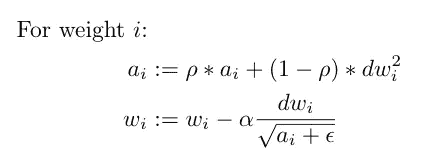

图 27: RMSprop 更新方程—改编自吴恩达的[深度学习专业](https://www.coursera.org/specializations/deep-learning?utm_source=gg&utm_medium=sem&utm_content=17-DeepLearning-US&campaignid=904733485&adgroupid=45435009112&device=c&keyword=online%20deep%20learning%20classes&matchtype=b&network=g&devicemodel=&adpostion=&creativeid=415429156977&hide_mobile_promo&gclid=CjwKCAjwqJ_1BRBZEiwAv73uwPtDMNA6it5ewsgvTbEqUKbAdSq68TIa6akLfBkse0l1mSmBjad3thoCG4UQAvD_BwE)

这里，rho 是一个超参数，它定义了移动平均线适应新术语的速度，rho 越高，移动平均线变化越慢。ε是一个小数字，用来防止被零除。α是学习率，w_i 是权重 I，a_i 是移动平均值，dw_i 是权重 I 的梯度。

RMSprop 在概念层面上试图做什么？RMSprop 正在尝试规范化更新的每个元素，以便没有一个元素过大或过小。作为一个例子，考虑一个权重参数，其中梯度是[5，5，5](并且假设𝛼=1).第二个等式中的分母是 5，因此应用的更新将是-[1，1，1]。现在，考虑一个权重参数，其中梯度为[0.5，0.5，0.5]；分母将是 0.5，给出与前一种情况相同的更新-[1，1，1]！换句话说，RMSprop 更关心每个权重的符号(+或-)，而不是幅度，并尝试对每个权重的更新步长进行标准化。

这不同于普通的 SGD，后者对具有较大梯度的权重参数应用较大的更新。考虑上面的例子，其中梯度是[5，5，5]，我们可以看到结果更新将是-[5，5，5]，而对于[0.5，0.5，0.5]的情况，更新将是-[0.5，0.5，0.5]。

## 学习率和 rho 如何影响 RMSprop？

让我们在改变学习率𝛼(默认为 0.001)和系数𝜌(默认为 0.9)的情况下尝试 RMSprop。让我们首先尝试设置𝜌 = 0，并改变学习率:

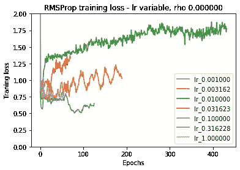

图 28:不同学习速率下的 RMSProp 训练损失，rho = 0。

第一个教训是——看起来𝜌=0 的 RMSProp 表现不佳。这导致更新如下:

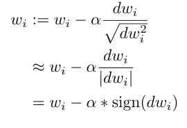

图 29:rho = 0 时的 RMSprop

为什么这不能很好地执行是未来研究的一个领域。

让我们在非零ρ值上再试一次。我们首先绘制了小学习率(1e-3)的训练和验证损失。

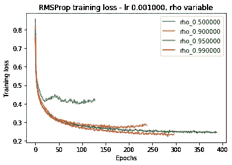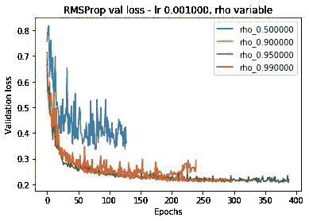

图 30:不同 rho 值下的 RMSProp，学习速率为 1e-3。

增加 rho 似乎减少了训练损失和验证损失，但是随着收益递减，当 rho 从 0.95 增加到 0.99 时，验证损失停止改善。

现在让我们来看看当我们使用更大的学习率时会发生什么。

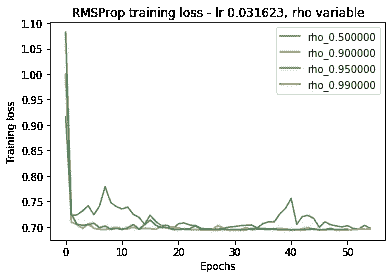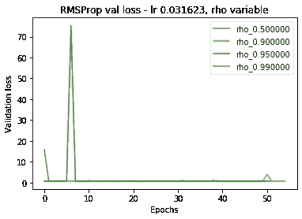

图 31:不同 rho 值下的 RMSProp，学习速率为 3e-2。

在这里，训练和验证的损失完全不一致！

让我们看看所有参数的最小培训和验证损失:

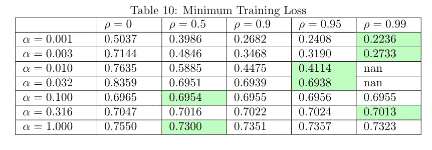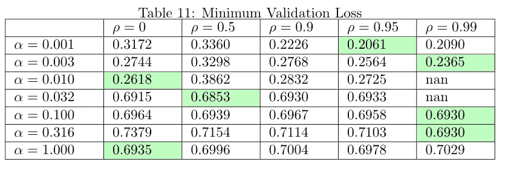

图 32:不同学习速率和 rho 值下 RMSprop 的最小训练损失(左)和最小验证损失(右)。每行中的最小值以绿色突出显示。

从上面的图中，我们发现一旦学习率达到 0.01 或更高，RMSprop 就无法收敛。因此，这里找到的最佳学习率大约是 SGD 上的最佳学习率的十分之一！一种假设是分母项比 1 小得多，因此它有效地扩大了更新。因此，我们需要向下调整学习率来补偿。

关于𝜌，我们可以从上面的图表中看到，RMS 在高𝜌值(0.9 到 1)的数据中表现最佳。尽管 Keras 文档建议使用𝜌=0.9 的默认值，但也值得探索其他值——当我们将 rho 从 0.9 增加到 0.95 时，它大大改善了最佳获得验证损失，从 0.2226 增加到 0.2061。

## RMSprop 上的最佳验证损失

*   最佳验证损失:0.2061
*   相关培训损失:0.2408
*   聚合到最小值的时期:338
*   参数:学习率 0.001，ρ0.95

## RMSprop 外卖

*   RMSprop 似乎在比普通 SGD 小得多的学习速率下工作(大约小 10 倍)。这可能是因为我们将原始更新(dw)除以平均梯度。
*   **此外，探索不同的** 𝜌 **值似乎是值得的，这与 Keras 文档推荐使用默认值相反。**

# 圣经》和《古兰经》传统中）亚当（人类第一人的名字

Adam 有时被认为是首选的优化器，因为它比 SGD 和其他优化方法收敛得更快[1]。本质上是 SGD 与 momentum 和 RMSProp 的结合。它使用以下更新公式:

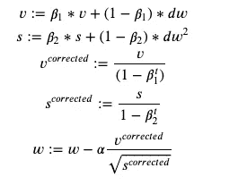

图 33: Adam 更新等式

本质上，我们保留了一个类似于动量项的速度项——它是梯度更新的指数平均值。我们还保留一个平方项，它是梯度平方的指数平均值，类似于 RMSprop。我们也用(1—β)来修正这些项；否则，指数平均值将在开始时以较低的值开始，因为没有要平均的先前项。然后，我们将修正后的速度除以修正后的平方项的平方根，并将其作为我们的更新。

## 学习率如何影响 Adam？

有人建议学习率比β1 和β2 参数更重要，所以让我们首先尝试改变学习率，对数标度从 1e-4 到 1:

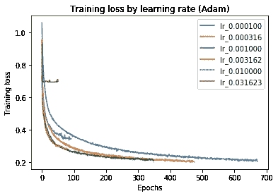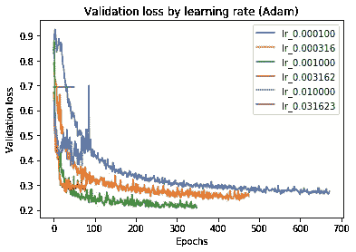

图 34:不同学习率下 Adam 的培训损失(左)和验证损失(右)。

我们没有绘制 0.03 以上的学习率，因为它们没有收敛。我们发现，随着学习速度的提高，训练和验证的损失会更快地减少——但只是到了一定程度。一旦我们将学习率提高到 0.001 以上，训练和验证损失都开始变得更糟。这可能是由于图 4 所示的“过冲”行为。

那么，哪种学习率最好呢？让我们通过绘制每一个的最佳验证损失来找出答案。


图 35:不同学习率下 Adam 的最小培训和验证损失。

我们看到学习率 0.001(碰巧是默认学习率)上的验证损失似乎是最好的，为 0.2059。对应的训练损失为 0.2077。然而，这仍然比最好的 SGD 运行差，后者实现了 0.1899 的验证损失和 0.1945 的训练损失。我们能战胜它吗？让我们试着改变β1 和β2 看看。

## β1 和β2 是如何影响 Adam 的？

我们对β1 和β2 尝试以下值:

```
beta_1_values = [0.5, 0.9, 0.95]
beta_2_values = [0.9, 0.99, 0.999]
```


图 beta _ 1 和 beta_2 不同值的训练损失(左)和验证损失(右)。


图 37:最小培训损失(左)和最小验证损失(右)。每行中的最小值以绿色突出显示。

最佳运行是β1=0.5 和β2=0.999，这实现了 0.2071 的训练损失和 0.2021 的验证损失。我们可以将其与 Adam 的默认 Keras 参数(β1=0.9 和β2=0.999)进行比较，后者分别达到 0.2077 和 0.2059。因此，与 Keras 文档中的建议相反，使用不同的 beta_1 和 beta_2 值进行实验会有所回报，但改善并不大。

令人惊讶的是，我们无法击败最好的 SGD 性能！原来别人也注意到了，用动量或者其他优化算法，Adam 有时候效果比 SGD 差[2]。虽然原因超出了本文的范围，但它表明尝试不同的优化器以找到最适合您的数据是值得的。

## 最佳亚当验证损失

*   最佳验证损失:0.2021
*   相关培训损失:0.2071
*   时代收敛到最小值:255
*   参数:学习率 0.001，β1=0.5，β2=0.999

## 亚当外卖

*   与其他优化器相比，Adam 不能保证获得最佳的训练和验证性能，因为我们发现 SGD 优于 Adam。
*   **尝试β1 和β2 的非默认值可以稍微改善模型的性能。**

# 阿达格拉德

Adagrad 累加梯度的平方，并将更新除以该累加器项的平方根。


图 38: Adagrad 更新方程[3]

这与 RMSprop 类似，但区别在于它只是累加梯度的平方，而不使用指数平均值。这应该会导致更新的大小随着时间的推移而衰减。

让我们以不同的学习率来尝试 Adagrad，从 0.001 到 1。


图 39:不同学习速度下的 Adagrad。左:训练失利。右图:验证损失。

使用 3e-1 的学习率，最佳的训练和验证损失是 0.2057 和 0.2310。有趣的是，如果我们使用相同的学习率与 SGD 进行比较，我们注意到 Adagrad 最初与 SGD 并驾齐驱，但在后来的时代开始落后。


图 40: Adagrad 与 SGD 在相同学习速率下的对比。左:训练失利。右图:验证损失。

这可能是因为 Adagrad 最初被一个小数字除，因为梯度累加器项还没有累加许多梯度。这使得更新可以与 SGD 在初始时期的更新相媲美。然而，随着累加器项累积更多的梯度，Adagrad 更新的大小减小，因此损耗开始变平或者甚至上升，因为它变得更加难以达到最小值。

令人惊讶的是，当我们使用大的学习率(3e-1)时，我们观察到相反的效果:


图 41:大学习率(0.316)下 Adagrad vs SGD。左:训练失利。右图:验证损失。

在大的学习速率下，Adagrad 实际上比 SGD 收敛得更快！一种可能的解释是，当大的学习率导致 SGD 采取过大的更新步骤时，Adagrad 将更新除以累加器项，本质上使更新更小且更“最优”

让我们看看所有参数的最小训练和验证损失:


图 Adagrad 的最小训练和验证损失。

我们可以看到，Adagrad 的最佳学习率为 0.316，明显大于 SGD 的最佳学习率 0.03。如上所述，这很可能是因为 Adagrad 除以累加器项，导致更新的有效大小较小。

## 阿达格拉德最佳验证失败

*   最佳验证损失:0.2310
*   相关培训损失:0.2057
*   聚合到最小值的时期:406
*   参数:学习率 0.312

## 阿达格拉德外卖店

*   **Adagrad 累加梯度的平方，然后将更新除以累加器项的平方根。**
*   **Adagrad 的更新量会随着时间的推移而减少。**
*   【Adagrad 的最优学习速率比 SGD 大(在我们的例子中至少是 10 倍)。

# 循环学习率

循环学习率是一种让学习率在最小值和最大值之间循环变化的方法[4]。它声称消除了调整学习率的需要，并且可以帮助模型训练更快地收敛。


图 43:使用三角周期的周期学习率

我们尝试具有合理学习速率界限(base_lr=0.1，max_lr=0.4)的循环学习速率，并且步长等于 4 个历元，这在作者建议的 4-8 范围内。


图 44:循环学习率。左:列车失联。右图:验证损失。

由于学习率的周期性变化，我们观察到训练损失的周期性振荡。我们在验证损失中也看到了较小程度的这些振荡。

## 最佳 CLR 培训和验证损失

*   最佳验证损失:0.2318
*   相关培训损失:0.2267
*   时代收敛到最小值:280
*   Params:使用上述设置。但是，我们可以通过调整周期策略(例如，允许最大和最小界限衰减)或调整最大和最小界限本身来获得更好的性能。请注意，这种调整可能会抵消 CLR 声称可以节省的时间。

## CLR 外卖

*   **CLR 在最小和最大界限之间循环改变学习率。**
*   **CLR 有可能消除调整学习率的需要，同时获得相似的性能。然而，我们没有取得类似的业绩。**

# 比较

那么，经过上面的所有实验，哪一个优化器最终工作得最好呢？让我们从每个优化器中选择最佳运行，即验证损失最低的优化器:


图 45:每个优化器实现的最佳验证损失。

令人惊讶的是，SGD 获得了最好的验证损失，而且是以显著的优势获得的。然后，我们有 SGD 与内斯特罗夫动量，亚当，SGD 与动量，和 RMSprop，他们都表现相似。最后，Adagrad 和 CLR 排名最后，损失明显高于其他公司。

培训流失怎么办？让我们画出上面选择的跑步的训练损失:


图 46:对于上面选择的最佳运行，每个优化器实现的训练损失。

在这里，我们看到了一些与验证损失的相关性，但 Adagrad 和 CLR 的表现比它们的验证损失所暗示的要好。

融合呢？让我们首先来看看每个优化器收敛到最小验证损失需要多少个时期:


图 47:收敛到极小值的次数。

亚当显然是最快的，而 SGD 是最慢的。

然而，这可能不是一个公平的比较，因为每个优化器的最小验证损失是不同的。测量每个优化器达到固定验证损失需要多少个时期怎么样？让我们取最差的最小验证损失 0.2318(CLR 达到的损失)，并计算每个优化器达到该损失需要多少个时期。


图 48:收敛到最差最小验证损失的周期数(0.2318，由 CLR 实现)。

同样，我们可以看到 Adam 确实比任何其他优化器更快地收敛到给定的损失，这是其声称的优势之一。令人惊讶的是，有动量的新币似乎比香草新币收敛得更慢！这是因为具有动量轮的最佳 SGD 所使用的学习率低于最佳普通 SGD 所使用的学习率。如果我们保持学习速率不变，我们会发现动量事实上的确会加速收敛:


图 49:比较 SGD 和带动量的 SGD。

如上所述，最佳香草 SGD 运行(蓝色)比具有动量运行(橙色)的最佳 SGD 收敛得更快，因为学习率为 0.03，高于后者的 0.01。然而，当通过与学习速率为 0.01(绿色)的普通 SGD 进行比较来保持学习速率不变时，我们看到增加动量确实加快了收敛。

## 为什么亚当打不过香草 SGD？

正如在 Adam 一节中提到的，其他人也注意到 Adam 有时在动量或其他优化算法方面比 SGD 更差[2]。引用 [Vitaly Bushaev](https://medium.com/u/55063a62106c?source=post_page-----d44678d27060--------------------------------) 关于 Adam 的文章，“过了一段时间，人们开始注意到，尽管训练时间很长，Adam 在某些领域并没有收敛到最优解，因此对于一些任务(例如在流行的 [CIFAR 数据集](https://www.cs.toronto.edu/~kriz/cifar.html)上的图像分类)，最先进的结果仍然只能通过应用具有动量的 SGD 来实现。”[2]虽然确切的原因超出了本文的范围，但其他人已经表明 Adam 可能收敛到次优解，即使是在凸函数上。

# 结论

总的来说，我们可以得出结论:

*   **你应该调整你的学习率——它对你的模型的性能有很大的影响，甚至比优化器的选择更大。**
*   **根据我们的数据，vanilla SGD 的表现最好，但 Adam 的表现也差不多，只是收敛速度更快。**
*   **值得尝试 RMSprop 中的 rho 和 Adam 中的 beta 值的不同值，尽管 Keras 建议使用默认参数。**

# 参考

[https://www.deeplearningbook.org/contents/optimization.html](https://www.deeplearningbook.org/contents/optimization.html)

[1]迪德里克·p·金马和吉米·巴雷。 [Adam:一种随机优化的方法](https://arxiv.org/abs/1412.6980)。2014.arXiv:1412.6980v9

[2][https://towards data science . com/Adam-latest-trends-in-deep-learning-optimization-6be 9a 291375 c](/adam-latest-trends-in-deep-learning-optimization-6be9a291375c)

[3][https://ruder . io/optimizing-gradient-descent/index . html # adagrad](https://ruder.io/optimizing-gradient-descent/index.html#adagrad)

[4]莱斯利·史密斯。[https://arxiv.org/pdf/1506.01186.pdf](https://arxiv.org/pdf/1506.01186.pdf)