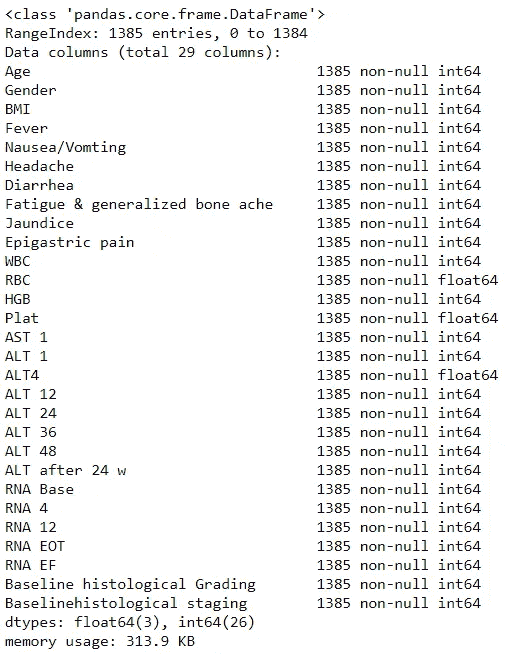
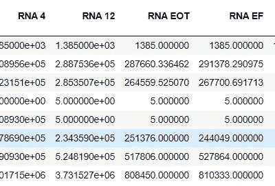

# 异常值的影响

> 原文：<https://towardsdatascience.com/effect-of-outliers-in-classification-ed7e8b6d39f8?source=collection_archive---------43----------------------->


威尔·梅尔斯在 [Unsplash](https://unsplash.com?utm_source=medium&utm_medium=referral) 上拍照

# 介绍

当我们开始处理数据时，我们(通常总是)观察到数据中几乎没有错误，比如缺失值、异常值、没有适当的格式等等。简而言之，我们称之为不一致性。这种一致性或多或少会扭曲数据，并妨碍机器学习算法进行正确预测。

在本文中，我们将尝试了解异常值如何影响机器学习算法的准确性，以及缩放如何帮助或影响我们的学习。为了简化目标，我们使用了两种非参数算法，k-NN 和决策树。

# 关于数据集

我们将使用从 UCI 机器学习库获得的埃及患者的丙型肝炎病毒(HCV)数据集。可从以下渠道获得:

> [http://archive . ics . UCI . edu/ml/datasets/肝炎+丙型+病毒+% 28 HCV % 29+for+埃及+患者](http://archive.ics.uci.edu/ml/datasets/Hepatitis+C+Virus+%28HCV%29+for+Egyptian+patients)

该数据包含了接受了约 18 个月 HCV 治疗剂量的埃及患者。共有 1385 名患者具有 29 种属性。这些属性包括年龄、白细胞计数、红细胞计数、血小板计数等。

# 处理数据

首要的事情是用 python 加载数据和所需的库。

```
import pandas as pd
import numpy as np
import matplotlib.pyplot as plt
import seaborn as sns
%matplotlib inline
pd.set_option('display.max_columns', None) # This will help yoy view all the columns rather than the sample when using *dataframe.head()*df = pd.read_csv('HCV-Egy-Data.csv')
df.head()
```

一旦我们通过数据集，它几乎建议检查是否有任何我们前面提到的不一致。为此，我们将使用 python 的 info 函数。

```
df.info()
```



df.info()结果

在这里，我们观察到我们没有任何丢失的值，并且由于数据是数字数据，我们可以确定所有的属性值都是数字的，即 int64 或 float64 类型。此外，没有空值，因此我们可以使用我们的数据来建模。

我们还想看看是否有异常值，在 pandas 库中的一个快速检查是使用 *describe()* 函数。它为我们提供了所需的统计数据，如*最小-最大值、分位数、标准偏差等。*

```
df.describe() 
```



这里，我们观察到 RNA EOT 的最小值为 5，这与我们的*平均值相差甚远。*现在我们确定至少有一个异常值。因此，我们将看到如何处理异常值影响我们的模型。

## 目标变量:基线组织学分期

> 一点背景，如果活检获得的组织足够大，观察者之间的一致是非常好的，特别是对于纤维化。为了帮助标准化病理学家之间的组织学评估，特别是提高从事不同临床试验的不同研究者之间的组织学测量的客观性，几个小组已经提出了用于分级活动和分期纤维化的组织学方案。在 Metavir 系统中，将坏死性炎症活性分级为 0-3 级。对于与疾病阶段的预处理评估问题更相关的量化纤维化，HAI、改良 HAI 和 Metavir 系统依赖于 0 至 4 或 0 至 6 的标度。

我们将使用 Metavir 系统，因为它给了我们 4 个多级分类，并取消了“基线组织学分级”,因为它们符合相同的逻辑。

```
df = df.drop('Baseline histological Grading',axis=1)
```

# 建模

由于我们的数据在不同的尺度上，我们执行了缩放以将每个属性放在一个共同的尺度上。这将进一步减少异常值的影响。

```
from sklearn.preprocessing import StandardScaler
scaler = StandardScaler()
scaler.fit(df.drop('Baselinehistological staging',axis=1))
scaled_features = scaler.transform(df.drop('Baselinehistological staging',axis=1))
df_feat = pd.DataFrame(scaled_features,columns=df.columns[:-1])
df_feat.head()
```

我们将利用 scikit-learn 库对我们的数据进行拆分和建模。

```
from sklearn.model_selection import train_test_split
X = df.drop('Baselinehistological staging',axis=1)
y = df['Baselinehistological staging']
X_train, X_test, y_train, y_test = train_test_split(scaled_features,df['Baselinehistological staging'],
                                                    test_size=0.20)# here test_size = 20 tells us that the data is split into train 80/20 ratio. 
```

# **K-最近邻(k-NN)**

一旦我们将数据分成训练和测试数据集，我们就可以运行 k = 1 或(n_neighbors = 1)的 k-NN 算法，并检查数据的准确性。

```
from sklearn.neighbors import KNeighborsClassifier
knn = KNeighborsClassifier(n_neighbors=1)
knn.fit(X_train,y_train)
pred = knn.predict(X_test)
from sklearn.metrics import classification_report,confusion_matrix
print(confusion_matrix(y_test,pred))
print(classification_report(y_test,pred))
```

该模型的精确度为 24%,总体来说很差，但这不是我们的目标。我们可以运行肘法来选择最佳的 *k* 值。

```
error_rate = []# Will take some time
for i in range(1,40,2):

    knn = KNeighborsClassifier(n_neighbors=i)
    knn.fit(X_train,y_train)
    pred_i = knn.predict(X_test)
    error_rate.append(np.mean(pred_i != y_test))plt.figure(figsize=(10,6))
plt.plot(range(1,40,2),error_rate,color='blue', linestyle='dashed', marker='o', markerfacecolor='red', markersize=10)
plt.title('Error Rate vs. K Value')
plt.xlabel('K')
plt.ylabel('Error Rate')
```

其中我们看到最小误差率为 k = 35，精度为 31 %。

# 决策树

```
# decision Tree classifier 
from sklearn.tree import DecisionTreeClassifier
dtree = DecisionTreeClassifier()
dtree.fit(X_train,y_train)
pred = dtree.predict(X_test)print(confusion_matrix(y_test,pred))
print(classification_report(y_test,pred))
```

运行上述代码，我们观察到准确率为 25 %,未能超过 k-NN。

# 移除异常值

我们将移除超出数据的 2 %和 98 %的异常值。

```
# Remove Outliers 
df1 = df
col = list(df1.drop('Baselinehistological staging',axis=1).columns)
for i in col:
    y = df[i]
    removed_outliers = y.between(y.quantile(.02), y.quantile(.98))
    index_names = df[~removed_outliers].index 
    df.drop(index_names, inplace=True)
```

我们观察到 k-NN 在 k =1 时的准确度为 28%,提高了约 16%。类似地，在 k = 21 时，给出了 33%,这大约增加了 6%,但是，对于决策树，我们的准确度几乎降低了 4%。

# 结论

我们可以得出结论，去除异常值增加了模型的准确性。尽管它在 k-NN 中显著提高了准确性，但在决策树中却降低了。这就引出了我们分析的下一步，即参数调整。我们将深入研究参数调整，以实现更高的精度。

# 参考

*   [https://aasldpubs . online library . Wiley . com/doi/pdf/10.1002/hep . 1840360720](https://aasldpubs.onlinelibrary.wiley.com/doi/pdf/10.1002/hep.1840360720)
*   Dua d .和 Graff c .(2019 年)。UCI 机器学习知识库[http://archive . ics . UCI . edu/ml]。加州欧文:加州大学信息与计算机科学学院。