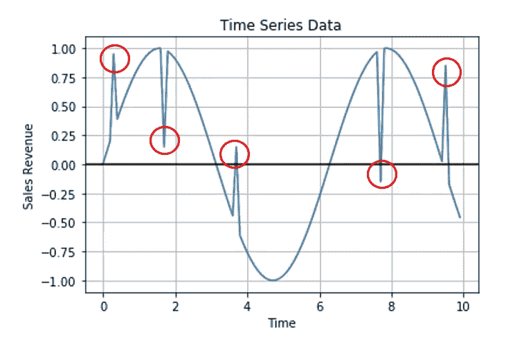
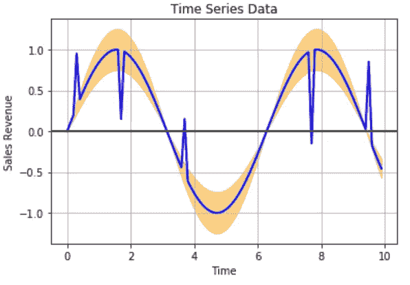
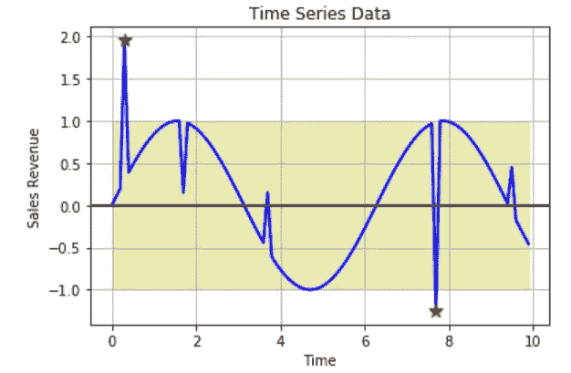
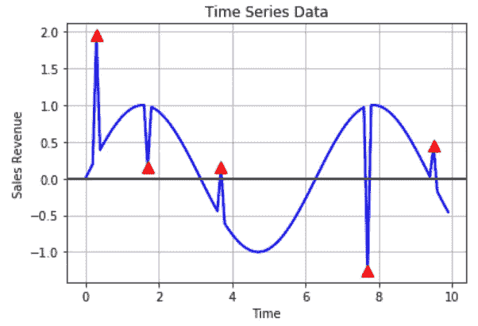

# 时间序列异常检测的有效方法

> 原文：<https://towardsdatascience.com/effective-approaches-for-time-series-anomaly-detection-9485b40077f1?source=collection_archive---------2----------------------->

[取自 Unsplash。](https://unsplash.com/photos/HTyONr8k5TQ)

在当前的形势下，整个世界到处都在经历前所未有的情景，这通常被每个人称为*“新常态”。*但在成为*“*[*新常态*](https://aditya-bhattacharya.net/2020/07/20/sales-and-demand-forecast-analysis/3/) *”，*这些异常或反常的结果会对任何组织产生积极或消极的影响，对制定长期业务战略来说，跟踪这些结果非常重要。因此，每个领域中的异常检测都将是一个重要的讨论主题，关于执行异常检测的有效方法的知识将是任何数据科学家和数据分析师都必须掌握的一项重要技能。

在我们深入研究之前，我们必须澄清，异常现象到底是什么？**异常**的定义可能因域而异。在我们上面看到的封面图片中，母狮是斑马群中的异类。因此，从技术上概括地说，我们可以说异常是异常数据点，它不遵循大多数数据点的*集体共同模式*，因此可以很容易地从其余数据中分离或区分出来。

现在，进入今天的主题范围，**。*我们将在本文中讨论*什么*、*为什么*和*如何*时间序列异常检测部分。**详细的** [**编码走读**](https://aditya-bhattacharya.net/2020/07/20/sales-and-demand-forecast-analysis/3/) **，请访问我的** [**网站**](https://aditya-bhattacharya.net/2020/07/20/sales-and-demand-forecast-analysis/3/) **。***

*我在 YouTube 上的一段视频记录了一个类似的话题:*

*** **更新** **如果你喜欢这篇文章，并希望更多地支持我对社区的贡献，请看看我的书 **"** [**应用机器学习可解释性技术**](https://www.amazon.com/dp/1803246154/ref=as_sl_pc_as_ss_li_til?tag=adib0073-20&linkCode=w00&linkId=74817cc3f53ad04fe861a6ed9f619830&creativeASIN=1803246154) **"** ，这是 GitHub 资源库，其中包含了书中涉及的各个章节的许多实践教程:[https://GitHub . com/packt publishing/Applied-Machine-Learning-explability-Techniques](https://github.com/PacktPublishing/Applied-Machine-Learning-Explainability-Techniques)。如果你喜欢 GitHub 资源库中提供的教程，请在资源库中做 fork 和 star，以示你对这个项目的支持！请订购该书的 [**纸质本**](https://www.amazon.com/dp/1803246154/ref=as_sl_pc_as_ss_li_til?tag=adib0073-20&linkCode=w00&linkId=74817cc3f53ad04fe861a6ed9f619830&creativeASIN=1803246154) 或 [**电子本**](https://www.amazon.com/dp/B0B2PTF5PC/ref=as_sl_pc_as_ss_li_til?tag=adib0073-20&linkCode=w00&linkId=e180f73d5590baee93582fc1a8b17d15&creativeASIN=B0B2PTF5PC) 以示支持。*

* [## 应用机器学习可解释技术:使 ML 模型可解释和可信…

### 应用机器学习可解释技术:使 ML 模型可解释和可信赖的实践…

www.amazon.com](https://www.amazon.com/Applied-Machine-Learning-Explainability-Techniques/dp/1803246154?_encoding=UTF8&pd_rd_w=Wr6SJ&content-id=amzn1.sym.716a1ed9-074f-4780-9325-0019fece3c64&pf_rd_p=716a1ed9-074f-4780-9325-0019fece3c64&pf_rd_r=6P2PM599T97MRG7NZD9J&pd_rd_wg=m4qUW&pd_rd_r=6e349d93-5ba0-4bfe-9055-905c0153fe58&linkCode=li3&tag=adib0073-20&linkId=35506e1847de5c011fc57aa66c2b1d8e&language=en_US&ref_=as_li_ss_il) 

# **什么是时间序列异常？**

在时间序列数据中，异常值或离群值可以被定义为不遵循整个数据的共同集体趋势或季节或周期模式的数据点，并且与其余数据明显不同。大多数数据科学家所说的*显著性*是指*统计显著性*，换句话说，这意味着数据点的统计属性与序列的其余部分不一致。

突出显示异常数据点的时间序列图(图片由作者提供)

从上面的时间序列图中，我们可以看到，与整个序列*显著不同的 5 个数据点用红圈突出显示。因此这 5 个异常数据点不符合时间序列的总体正弦性质，因此可以被称为 [**时间序列异常**](https://aditya-bhattacharya.net/2020/07/20/sales-and-demand-forecast-analysis/3/) 。*

# 为什么时间序列异常检测如此重要？

[取自 unsplash。](https://unsplash.com/photos/unRkg2jH1j0)

如前所述，为了评估*【新常态】*以及重组和重构业务战略和决策流程，跟踪每个部门的异常情况非常重要，并且迫切需要持续详细地研究这些异常情况。数据科学家的角色不仅在这些困难时期变得至关重要，而且对于数据科学家来说，想出一种方法来跟踪、研究和分析异常数据点并获得对业务有意义的信息也成为一种自然的期望。从销售和营销，到供应链和制造，企业的每个阶段都需要足够的信息，特别是关于这些异常的信息，以塑造其流程并最大限度地提高生产率和成果。因此，只要我们在数据中有一个共同的模式，特别是对于时间序列数据，这是非常重要的隔离离群值，并抽出时间和精力来研究这些。

# 时间序列异常检测怎么做？

现在，进入本文最重要的部分，关于**部分如何做**时间序列异常检测**。从一个非常高的层次和一个非常通用的方式，时间序列异常检测可以通过三种主要方式来完成:**

1.  ****通过预测置信水平方法****
2.  ****统计剖析方法****
3.  ****基于聚类的无监督方法****

**在这一节中，我们将只关注技术，在下一篇文章或帖子中，我们将体验算法的确切代码部分以及如何用 Python 编程这些方法的有效方式。**

## **基于预测置信度方法的时间序列异常检测**

****

**通过置信度方法进行异常检测(图片由作者提供)**

**使用时间序列数据进行异常检测的一种方式是通过使用历史数据建立预测模型，以估计和了解时间序列数据的总体共同趋势、季节性或周期性模式。使用预测模型来预测未来值，并基于误差率(可以使用 MAPE-平均绝对百分比误差来计算)，我们可以得出预测值的置信区间或置信带，任何超出该置信带的实际数据点都是异常的。为了建立预测模型，也可以有效地使用流行的时间序列建模算法，如 ARIMA、萨里玛、GARCH、VAR 或任何回归或基于机器学习和深度学习的算法，如 LSTM。这种方法的主要优点是发现局部异常值，但主要缺点是，这种方法高度依赖于预测模型的效率。预测模型中的任何循环漏洞都可能导致假阳性和假阴性。**

## **通过**统计剖析方法**进行时间序列异常检测**

****

**通过统计分析方法进行异常检测(图片由作者提供)**

**这种方法可能是统计学家和数学家最喜欢的方法，在经济和金融领域得到了有效的应用。生成给定数据的统计模型或概况可能是最快和最有用的方法，因为这种方法可以提供更可控和更可解释的结果。这可以通过计算统计值来实现，如历史数据的平均值或中值移动平均值，并使用标准偏差来得出一组统计值，这些统计值可以定义上限和下限，超出这些范围的任何值都可能是异常值。正如我所说的，这种方法非常方便，并且总是可以作为基线方法，而不是使用任何需要大量微调并且可能无法解释的复杂方法。这对于高度不稳定的时间序列也非常有效，因为当数据高度不稳定时，大多数时间序列预测模型算法都会失败。但是这种方法的主要缺点是检测局部异常值。正如我们在上图中看到的，在五个明显的异常点中，只有两个最重要的异常点被检测到。**

## **通过基于**聚类的无监督方法进行时间序列异常检测****

****

**通过基于聚类的无监督方法进行异常检测(图片由作者提供)**

**无监督的方法对于异常检测非常有用，因为它不需要任何标记的数据，提到特定的数据点是异常。因此，聚类算法对于时间序列异常检测非常方便。目前，用于异常检测的聚类算法的一个常见缺陷或瓶颈是定义聚类数，这是大多数聚类算法需要的输入。虽然有许多估计聚类数的技术，但是对于时间序列数据，动态估计每个序列的聚类数是不可行的。这时，**带噪声的应用程序的基于密度的空间聚类(DBSCAN)** 成为自然的选择。 **DBSCAN** 不需要任何预定义的聚类数，只有两个参数(一个聚类中的最小点数和ε，聚类之间的距离)，所以非常容易调优，性能非常快。由于这些优点，DBSCAN 成为进行异常检测的最明显的选择，并且它不像传统的硬聚类技术(如 K-Means)那样将所有数据点分组到一个聚类中。DBSCAN 不将异常或离群数据点分组到任何集群，因此它变得非常容易应用。此外，DBSCAN 有助于绘制大多数其他方法可能会失败的*【新常态】*。但是 DBSCAN 也有一些缺点。一些异常数据点如果在稀疏间隔内重复多次，根据 DBSCAN，这些可能不会被映射为异常。因此，在这种情况下，使用基于**滚动窗口的 DBSCAN** 有助于更有效地绘制这些局部异常。**

******更新**如果你喜欢这篇文章，并希望更多地支持我为社区所做的贡献，请看看我的书“** [**【应用机器学习可解释技术**](https://www.amazon.com/dp/1803246154/ref=as_sl_pc_as_ss_li_til?tag=adib0073-20&linkCode=w00&linkId=74817cc3f53ad04fe861a6ed9f619830&creativeASIN=1803246154) **”，这是 GitHub 资源库，其中包含许多关于书中各个章节的实践教程:**[**https://GitHub . com/packt publishing/Applied-Machine-Learning-explability-Techniques**](https://github.com/PacktPublishing/Applied-Machine-Learning-Explainability-Techniques)**。如果你喜欢 GitHub 资源库中提供的教程，请在资源库中做 fork 和 star，以示你对这个项目的支持！请订购本书的** [**实体本**](https://www.amazon.com/dp/1803246154/ref=as_sl_pc_as_ss_li_til?tag=adib0073-20&linkCode=w00&linkId=74817cc3f53ad04fe861a6ed9f619830&creativeASIN=1803246154) **或** [**电子本**](https://www.amazon.com/dp/B0B2PTF5PC/ref=as_sl_pc_as_ss_li_til?tag=adib0073-20&linkCode=w00&linkId=e180f73d5590baee93582fc1a8b17d15&creativeASIN=B0B2PTF5PC) **以示支持。****

** [## 应用机器学习可解释技术:使 ML 模型可解释和可信…

### 应用机器学习可解释技术:使 ML 模型可解释和可信赖的实践…

www.amazon.com](https://www.amazon.com/Applied-Machine-Learning-Explainability-Techniques/dp/1803246154?_encoding=UTF8&pd_rd_w=Wr6SJ&content-id=amzn1.sym.716a1ed9-074f-4780-9325-0019fece3c64&pf_rd_p=716a1ed9-074f-4780-9325-0019fece3c64&pf_rd_r=6P2PM599T97MRG7NZD9J&pd_rd_wg=m4qUW&pd_rd_r=6e349d93-5ba0-4bfe-9055-905c0153fe58&linkCode=li3&tag=adib0073-20&linkId=35506e1847de5c011fc57aa66c2b1d8e&language=en_US&ref_=as_li_ss_il) 

因此，这就把我们带到了本文的结尾。在 [*我的个人网站*](https://aditya-bhattacharya.net/) *中，我* [*写了一篇详细的文章，讨论并提供了如何应用这些技术的精确 python 代码，并更深入地解释了常见的优点和缺点*](https://aditya-bhattacharya.net/2020/07/20/sales-and-demand-forecast-analysis/3/) *。在那之前，请鼓掌并激励我进行更多的讨论，并与社区分享我的发现。希望我能帮上忙！继续关注:*[*https://medium.com/@adib0073*](https://medium.com/@adib0073)*和我的网站:*[https://www.aditya-bhattacharya.net/](https://aditya-bhattacharya.net/)***