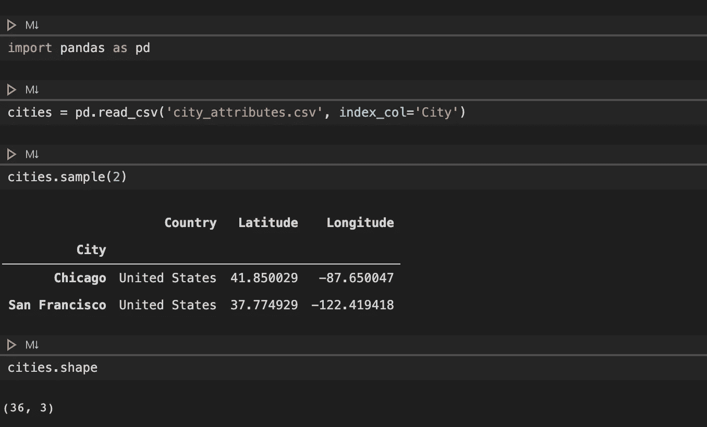
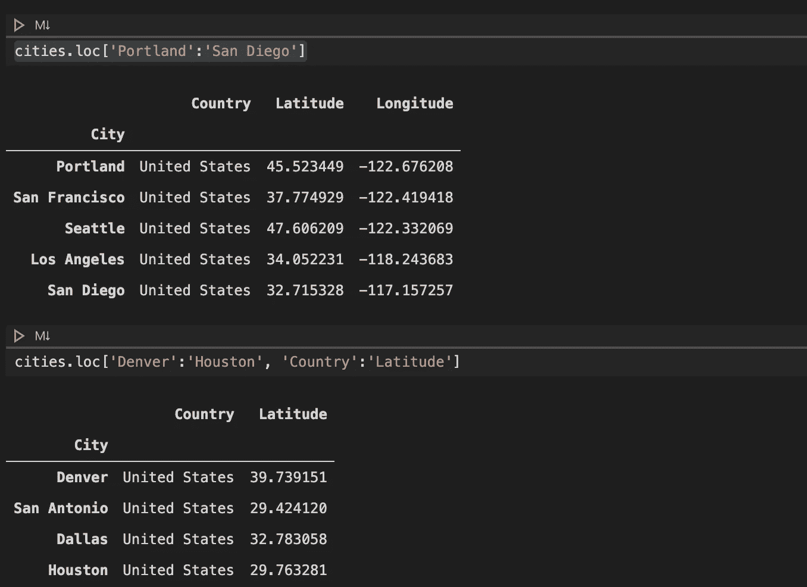
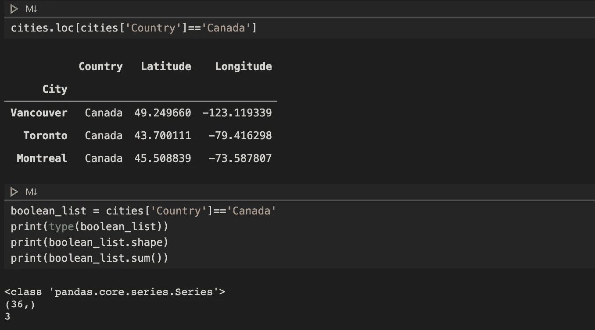
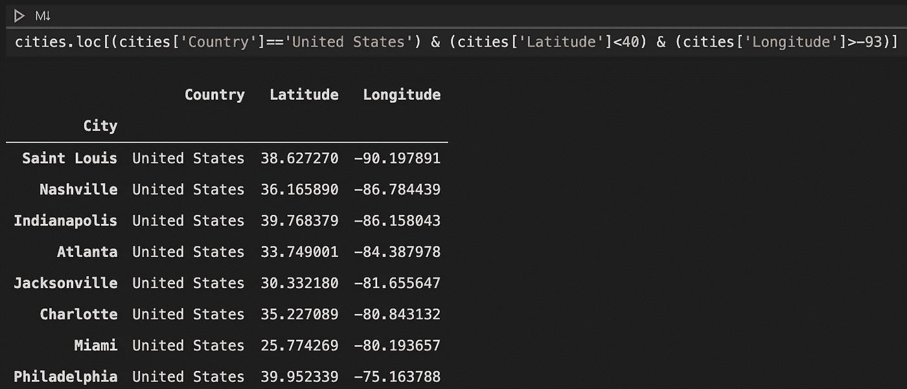
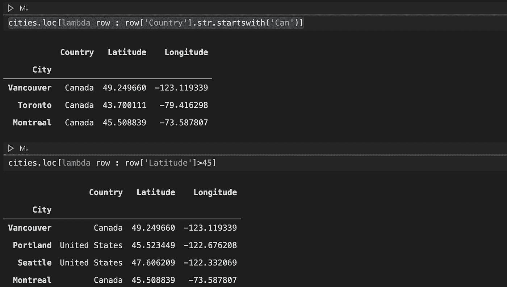
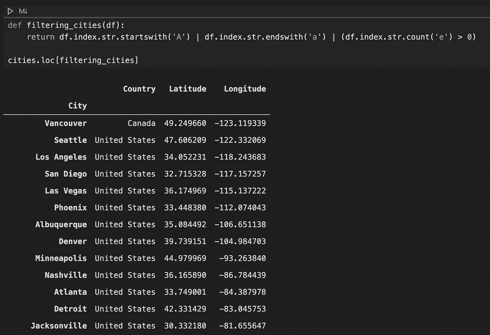

# 有效的数据过滤。位置[]

> 原文：<https://towardsdatascience.com/effective-data-filtering-in-pandas-using-loc-40eb815455b6?source=collection_archive---------4----------------------->

照片由[韦德·奥斯丁·埃利斯](https://unsplash.com/@wadeaustinellis?utm_source=unsplash&utm_medium=referral&utm_content=creditCopyText)在 [Unsplash](https://unsplash.com/s/photos/filter?utm_source=unsplash&utm_medium=referral&utm_content=creditCopyText) 上拍摄

## 学习使用的多种方法。loc[]过滤 Pandas 中的数据帧

Pandas 是用于数据科学研究的最流行的 Python 包之一。它收集了大量用于处理结构化数据的强大方法。处理这些数据表(即 pandas 中的数据帧)的一个常规任务是过滤符合某个预定义标准的数据。在我自己的研究中，在各种过滤方法中，我经常使用 DataFrame 的 loc 属性过滤数据。在本文中，我将向您展示我们如何使用。loc[]用于有效的数据过滤。

# 基本设置

假设您已经构建了自己的 IDE，并在计算机上安装了 Python 和 pandas，基本的设置步骤如下所示。如果你想在 Visual Studio 代码中运行 Jupyter Notebook，请参阅我以前的文章。

首先，我将`pandas`导入到笔记本中。出于当前教程的目的，我从 [Kaggle](https://www.kaggle.com/selfishgene/historical-hourly-weather-data#city_attributes.csv) 下载了 city_attributes.csv 数据集。这个数据集有 4 列:城市、国家、纬度和经度。当我导入文件时，我将城市设置为索引，以便以后进行更有意义的索引。

基本设置

在我们进行任何数据处理之前，看看我们正在处理的数据集总是一个好主意。为此，我只使用了`sample()`和`shape`来获得 2 个随机行，并检查数据帧的大小，这向我们显示数据有 36 条记录。

# 数据过滤

## 使用标签

第一种方法是使用标签过滤数据。这里有几个例子。如您所见，我们只需指定行和列的标签，符合这些标签的特定数据记录就会显示出来。

使用标签过滤数据

从上面的代码片段中，有几件事情需要强调。

*   我们可以指定单个标签或标签列表来过滤 loc[]中的数据。
*   筛选的数据可以是不同的类型:单个值、系列或数据帧，分别如示例所示。
*   当只设置了一个标签或标签列表时，它将返回所有列。

## 使用范围

另一种常用的方法是使用行和列标签的范围。下面是一些例子。类似地，如上所述，我们可以设置一个或两个范围，前者显示所有列，后者显示范围内的列。

使用范围进行数据过滤

## 使用布尔值

过滤数据的一个有效方法是使用与我们正在处理的轴的长度相匹配的布尔值列表。例如，在下面的代码中，我们能够通过只显示加拿大的城市来过滤数据。具体来说，我们通过将国家的值与字符串“Canada”进行比较来创建一系列布尔值，该系列的长度与数据帧的行号相匹配。由于 pandas 将 True 评估为 1，当我们请求这个系列的总和时，我们得到了 3，这正是我们通过运行`cities.loc[cities[‘Country’]==‘Canada’]`得到的行数。

使用布尔进行数据过滤

当然，我们可以有一个更复杂的布尔求值表达式。下面给出一个例子。

使用布尔值进行数据过滤(多条件)

## 使用 Lambdas 或自定义函数

有时，我们需要有一个更高级的数据过滤标准，在这种情况下，我们可以使用 lambdas，如下所示。在 lambda 函数中，我们指定了名为 row 的参数，该参数引用数据帧中的系列，这样我们就可以像上面所做的那样对其求值以生成布尔列表。换句话说，这个方法是建立在使用布尔值的数据过滤方法之上的，尽管它们在概念上是不同的。

使用 Lambdas 进行数据过滤

如果我们想要设置更多的标准，我们甚至可以编写一个数据过滤函数。如下所示，我们有一个名为`filtering_cities()`的函数，它评估多个标准并返回一个布尔值列表，可用于过滤数据。我们将简单地在 loc[]中设置这个函数来过滤数据。

使用函数进行数据过滤

# 结论

本文向您展示了如何使用 loc[]通过多种方式有效地过滤数据。当然，本教程只是通过介绍使用 loc[]进行数据过滤的基本元素来提供一个概念证明，还有其他几种数据过滤方法，我们稍后可以一起探讨。