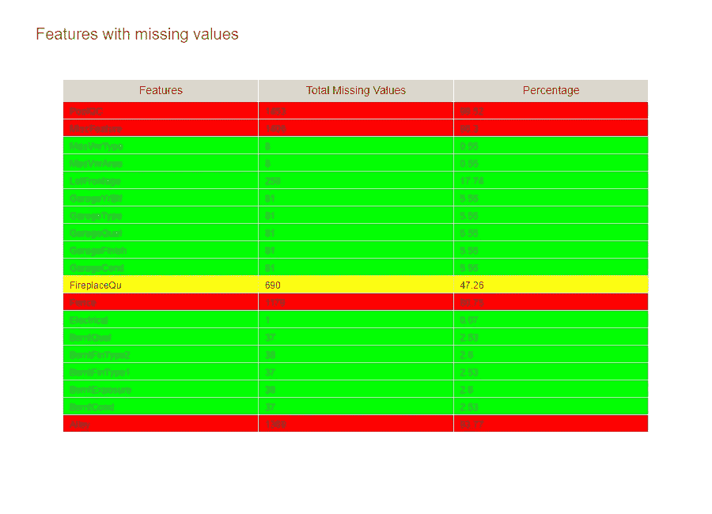
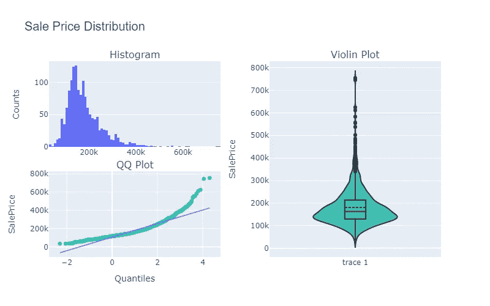
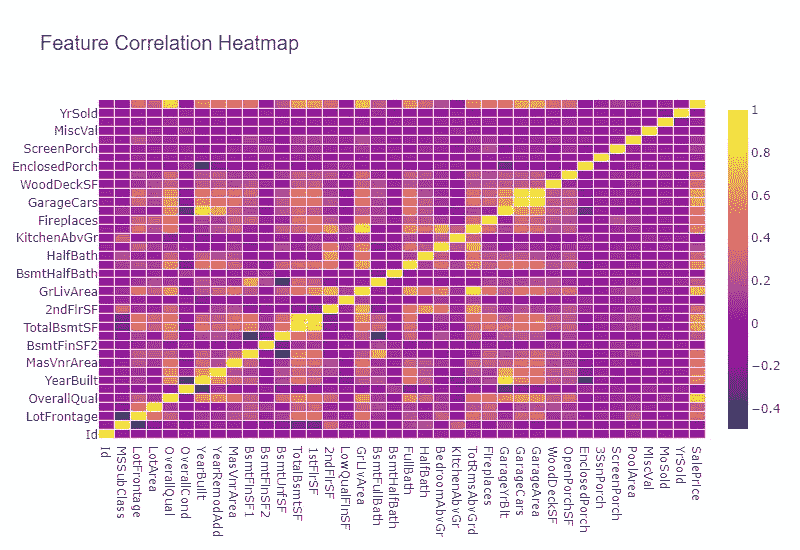

# 有效的数据可视化

> 原文：<https://towardsdatascience.com/effective-data-visualization-ef30ae560961?source=collection_archive---------24----------------------->

## 构建有效的数据可视化的技巧可以简化为 3 个简单的步骤

由于各种原因，如我们的智能手机成瘾，数据一直在以指数速度增长。我不想让任何人感到内疚，因为我也一样内疚——问题是……数字化前所未有地将全球人类联系在一起。我们非常依赖我们的智能手机来保持我们的信息——如果不是因为 Twitter，我不会知道周四晚上 8 点是 NHS 的感谢日，因此我们为什么鼓掌 1 分钟——结果数据是每天大量产生的，因此为什么 21 世纪被大量预测为数据时代。

> “数据是 21 世纪的石油”

随着数据量的增长，无论是在 excel 电子表格中，还是在文本或图像中，从越来越大的数据批次中识别关键见解都变得极其困难。人类大脑试图识别模式以帮助学习和存储信息，但是在大型文本语料库(和其他形式的数据)中，如果没有一些视觉数据，找到关键信息可能会非常困难。机器学习的发展允许系统在没有显式编程的情况下自动学习和改善经验，简化了检测数据模式的任务，我们可以通过预测分析创建有用的模式可视化。此外，在我们开始建立预测模型或做出决策之前，了解我们掌握的数据至关重要，甚至超出了数据科学和数据分析的领域。

关于这一点，在这篇文章中，我将提供 3 个技巧来建立可视化，有效地传达你想要表达的信息。为此，我使用了 Kaggle 的 [**房价**](https://www.kaggle.com/c/house-prices-advanced-regression-techniques/overview) 数据集，您可以从房价竞赛的数据部分下载该数据集( [**单击此处**](https://www.kaggle.com/c/house-prices-advanced-regression-techniques/data) )。要访问我用来生成图形的代码，可以在我的 Github 上访问(下面的链接)。

 [## kurtispykes/演示

### 与中等博客文章相关的演示代码。-路径/到/文件；链接到文章有效的数据可视化…

github.com](https://github.com/kurtispykes/demo/tree/master) 

图 1:NASA 在 [Unsplash](https://unsplash.com?utm_source=medium&utm_medium=referral) 拍摄的照片

**什么是数据可视化？**

在我们继续之前，如果我们想要构建有效的可视化，了解什么是数据可视化及其背后的目的是很重要的，所以不再多说…数据可视化是以可视化格式表示数据。可视化数据的目的是以易于理解的可视化方式总结和呈现数据，向读者突出显示数据中的关键信息。

在上面对数据可视化目的的描述中，我们可以提取两个要点，如果在任何数据可视化任务中记住这两个要点，将会立即使我们的可视化效果更好:

**第 1 点**:可视化应该概括并呈现*容易理解的*信息。“容易”这个词在这里很关键，因为它没有提到视觉化的复杂性。这一点很重要，因为有些图形可能需要更复杂，以达到易于理解的目的。另一方面，如果以简单的方式创建一些可视化效果来满足相同的目的，效果会好得多。到本文结束时，您应该能够区分何时使用简单或复杂的可视化。

**第二点:**数据即将呈现！在某些情况下，可能只有可视化的创建者才能看到，例如，当您自己处理机器学习分类任务时，您希望了解您的预测模型正在犯什么类型的错误。但是几乎总是我们最终会向观众展示我们的发现。因此，可视化必须针对特定的受众，也就是说，读者会对所获得的见解感兴趣，否则他们会感到厌烦。用前面的例子来说，向 CEO 展示你的预测模型所犯错误的可视化效果是无效的，而且可能会让你失去高管们的信任。相反，更好的做法是呈现可视化效果，允许采取可操作的步骤来带来商业价值。

> “有超过 99 种分散注意力的方式，有趣的视觉化效果不是第一种”——没有人

从根本上说，我们进行数据可视化的原因是为了帮助读者看到正在分析的数据中的模式或趋势。从今以后，我将提供一个简单的一步一步的指南来产生有效的可视化。

**提示#1 明确应该通过可视化来回答的问题**

扭曲关键信息的可视化会妨碍做出有意义或准确决策的能力。发生这种情况的一种方式是使用一个繁忙的图，试图在任何时候回答许多问题。通过有一个你希望通过你的视觉化来回答的特定问题，它防止了矫枉过正和试图在一个数字上做太多事情。图 2 旨在确定数据集中缺失变量的数量，并使用类似交通灯的系统来突出显示任何一个要素中缺失变量的数量。可以通过添加说明每种颜色含义的图例来进一步增强该图，例如，红色=缺失数据超过 75%的值。

图 2:显示特性、每个特性中缺失值的数量以及相对于实例数量的百分比的表格。

**提示 2 选择正确的图表**

> “一幅画胜过千言万语”

这听起来很简单，但可能非常困难…图表应该揭示你想告诉读者什么。如果你试图告诉读者，从收集的数据来看，目标特征或因变量的分布，那么直方图、violin 图、qq 图等图可以有效地完成工作。图 3 中的图结合了 3(直方图、Violin 图和 QQ 图),让我们确信数据的分布是正偏的，这对于我们选择用于解决问题的模型非常重要。为了改进这个图，我会将标题移到中间，将 [*核密度估计器*](https://en.wikipedia.org/wiki/Kernel_density_estimation) 添加到直方图中，并决定使用不同的颜色来突出我正在制作的点——注意，这些改进只是为了使图表更漂亮，因为它很好地通知了我们特征是倾斜的。

图 3:目标变量的分布

**提示 3 强调最重要的信息**

使用颜色、大小、比例、形状和标签将读者的注意力引导到你想让他们识别的关键信息上——图 2 在交通灯系统中做得很好。我们希望向我们的读者揭示最重要的信息——在图 2 的情况下，读者可能是将设计功能和构建模型的机器学习工程师。红绿灯立即将我们的注意力吸引到哪些实例可能是一个挑战，以及哪些可能需要从数据中删除。值得注意的是，可视化允许机器学习工程师或数据科学家推迟思考的困难任务，因为可视化立即向我们显示我们的数据有什么问题，同时产生可以实施以改进我们的数据的想法。用于实现这一点的工程不一定是用于最终模型的工程，关键是它有助于我们做出可以采取行动的决策，即产生的想法可以用于设计快速基线模型。

图 4:显示特性相关性的热图。

在图 4 中可以看到另一个强调重要信息的例子。热图显示了功能之间的相关性，并使用更明亮的颜色来强调两个功能之间更强的关系。这使得挑选相关特征并对其做进一步分析变得容易。这样的信息对数据科学项目中的其他团队成员是有益的，因为它将有助于确定哪种方法对于这项任务是可行的。为了改进该表，我们可以在 x=y 线下方(或上方)的图上放置一个遮罩，因为它是冗余数据。

虽然我没有强调本文中可以使用的工具，但在某些方面，我们使用的工具可以帮助我们实现数据可视化的目的。数据科学家会知道 Matplotlib 和 Seaborn 等工具，但在本文中，我用来生成数据的工具是 Ploty.py。该框架允许交互式图表，这使得我们的可视化对读者来说更有吸引力。了解这个框架更多信息的一篇好文章是由 Will Koehrsen 撰写的，标题是“Python 中数据可视化的下一个层次，T2”。在这篇文章中，他提到了他从传统可视化工具切换到现代工具的理由，并给出了很好的入门演示。

**结论**

在可视化数据时应该记住的关键因素是，数据可视化是以一种容易理解的方式总结和呈现数据。因此，我们希望确保我们用可视化来回答特定的问题，在决定使用什么图表来显示数据时做出正确的选择。最后但同样重要的是，我们要确保我们强调的是我们希望读者抓住的关键信息，而不是用多余的信息混淆它们。

有很多方法可以可视化数据，提高这一技能的最好方法是实践。我用来为本文生成图表的 Github 代码远非最佳，没有充分利用 Plotly.js 的功能，并且缺乏深度——在这些数据中还有很多可以探索的地方。因此，有一个很好的机会让你去实践(我已经给了你一个轻微的开端)——简单地分叉我的工作(下面 Github 的链接)，从 Kaggle ( [**点击这里下载**](https://www.kaggle.com/c/house-prices-advanced-regression-techniques/data) )下载数据，安装需求，然后开始工作。

 [## kurtispykes/演示

### 与中等博客文章相关的演示代码。-路径/到/文件；链接到文章有效的数据可视化…

github.com](https://github.com/kurtispykes/demo/tree/master) 

如果你想分享你如何利用这篇文章来改进我的工作(或你已经完成的工作)，这将是真正令我兴奋的，或者你只是想就任何与数据科学有关的事情联系我(即接下来可能要写的东西)，你可以通过 Linkedin [@KurtisPykes](https://www.linkedin.com/in/kurtispykes/) 联系我，或者只是对这篇文章发表评论。此外，我非常有兴趣听到你对这篇文章的反馈，所以请不要犹豫与我联系！

非常感谢您的宝贵时间！

**其他资源关于此主题的有用资源…**

[Suraj Thatte](https://medium.com/u/e5075a23c116?source=post_page-----ef30ae560961--------------------------------) - [有效数据可视化的技巧](/tips-for-effective-data-visualization-d4b2af91db37)

[黄邦贤·刘](https://medium.com/u/f4ddead1a9a5?source=post_page-----ef30ae560961--------------------------------) - [其他人的有效数据可视化](/effective-data-visualization-for-other-humans-695e54a5dc71)

Georgin Lau 和潘磊博士- [数据可视化的 5 步指南](https://www.elsevier.com/connect/a-5-step-guide-to-data-visualization)

鲁米博物馆- [与房价的详细回归](https://www.kaggle.com/masumrumi/a-detailed-regression-guide-with-house-pricing)

佩德罗马塞利诺- [用 Python 进行全面的数据探索](https://www.kaggle.com/pmarcelino/comprehensive-data-exploration-with-python)