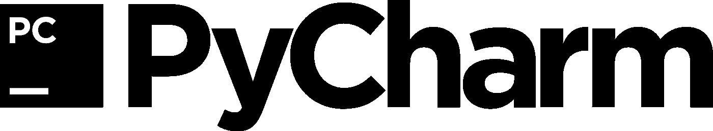
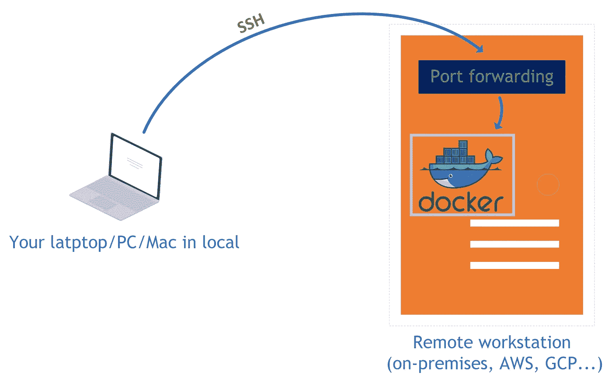

# 使用 PyCharm 和 Docker 的有效深度学习开发环境

> 原文：<https://towardsdatascience.com/effective-deep-learning-development-environment-with-pycharm-and-docker-34018f122d92?source=collection_archive---------33----------------------->

## 借助全面承诺的 IDE 和虚拟化提高您的工作效率。


塞缪尔·伯克在 [Unsplash](https://unsplash.com?utm_source=medium&utm_medium=referral) 上的照片

在本文中，当您在远程环境(内部工作站、AWS、GPUs)中使用 GPU 时，我将指导您为深度学习培训建立一个有效的开发环境。

最后，您将在本地计算机上使用 PyCharm IDE 开发您的 ML/DL 代码，就好像它在您的本地环境中使用 Python 解释器一样。

# ***动机***

## 1.为什么要用 PyCharm 这种成熟的 IDE？



[来源](https://www.jetbrains.com/company/brand/logos/)

> “因此，如果你想走得快，如果你想快速完成，如果你想让你的代码易于编写，就让它易于阅读。”
> ― **罗伯特·c·马丁，** [**干净的代码:敏捷软件工艺手册**](https://www.goodreads.com/work/quotes/3779106)

1.  当你训练你的深度学习代码时，你会做很多实验。你改变你的超参数，添加/删除层来优化模型，调整你的数据集…所以，过一会儿，代码可能会很难管理。因此，您需要编写整洁且可维护的代码。像 PyCharm 这样的 IDE 可以给你提供这样的环境。
2.  在编码时，你必须实时观察你的变量和函数，看看它们是否如你所愿，否则你可能会在长时间的训练后遇到意想不到的结果。打印变量的值或函数的返回值是很常见的，大多数人都是通过在行间打字来完成的。这不是观察变量的正确方法；相反，你应该从外部观察它们*。使用 PyCharm 变量资源管理器和 IPython 控制台可以轻松查看代码的行为和变量值。*
3.  阅读库的文档来为我们的任务找到合适的函数或对象是很费时间的。*自动完成*在编写快速代码时非常方便。然而，在像 Python 这样的动态类型语言中很难做到这一点。尽管其他 ide 和 Jupyter Lab 也有自动完成功能，但它们并不总是能正常工作。皮查姆非常擅长那项工作。

我认为这三点是使用 PyCharm 的关键因素，但还有许多其他的巨大优势:*自动格式化、高级搜索、错误检查、轻松导航、智能重构、剖析、着色...*

## 2.为什么应该使用 Docker？


[来源](https://www.docker.com/company/newsroom/media-resources)

如果你在 Ubuntu 机器上建立了深度学习环境，你就会知道匹配所有这些驱动程序、软件和库的版本有多难。如果你没有遇到任何困难，祝贺你！但是你可能还没有更新你的任何驱动，CUDA，或者深度学习(Tensorflow，PyTorch…)库，这意味着你随时都可能遇到这个困难。

深度学习框架(尤其是 TensorFlow)在版本更新上非常激进，这可能导致与 CUDA 版本或 NVIDIA 驱动程序不兼容。有时候，很难匹配这些软件的发布。此外，如果您不小心同时安装了不同版本的 NVIDIA 或 CUDA 驱动程序，处理起来可能会很复杂，您可能需要格式化您的系统。

Docker 解决了这些问题。你只需要安装 NVIDIA 驱动，其余的由 Docker 容器管理。

比如你正在做 TensorFlow，但是你看到在 PyTorch 的新版本中，有针对你的任务的完美功能，你想尝试一下。在同一台机器上管理不同的框架(*和不同的版本*)是一项挑战。使用 Docker，您可以管理它。它抽象了硬件驱动之上的系统；因此，您可以同时运行不同版本的框架和 CUDA。它类似于虚拟机，但没有虚拟机那么重。使用 Docker 有很多好处，但在这篇文章中，我不打算告诉这些。网上已经有很多很棒的文章，你可以广泛地阅读和获取信息。这篇文章是关于连接这两个产品。我们开始吧。

# 设置系统



流程图

**1。** [在本地电脑上安装 PyCharm](https://www.jetbrains.com/edu-products/download/#section=pycharm-edu) (使用远程解释器需要专业版，PyCharm Professional 对学生免费)。

**2。在你的远程机器上安装 Docker 。**

**2.1。** [熟悉](https://docs.docker.com/get-started/)Docker 环境(可能需要一个工作日才能完全理解什么是映像、容器、如何从 Docker Hub 获取以及 Docker 系统的一般工作方式，但你会得到回报)。

**2.2。**把你喜欢的深度学习框架的 Docker 镜像下载到远程机器上。

[张量流](https://hub.docker.com/r/tensorflow/tensorflow/)

[PyTorch](https://hub.docker.com/r/pytorch/pytorch/)

**现在，是时候将 PyCharm Python 解释器连接到 Docker 容器中的 Python 环境了。**

**1。**启动 Docker 容器。转发端口 8022(可以这样改)到 22 ( **对于 SSH 连接来说是必须的**)。示例:

```
sudo docker run --gpus all -it --rm -p 8022:22 -v /home/workstation/Desktop:/home/gorkem/Desktop --name ssh_container pytorch/pytorch:1.4-cuda10.1-cudnn7-devel bash
```

**2。**使用主操作系统的终端，检查您是否确实将您的端口 8022 转发到了 22 号集装箱。

```
sudo docker port <your container name> 22
-> 0.0.0.0:8022
```

**3。**在 Docker 容器中设置 SSH 服务器。

```
apt update && apt install -y openssh-servermkdir /var/run/sshdecho 'root:<USE_YOUR_OWN_STRONG_PASSWORD>' | chpasswd
# Root password was changed with <USE_YOUR_OWN_STRONG_PASSWORD>sed -i 's/PermitRootLogin prohibit-password/PermitRootLogin yes/' /etc/ssh/sshd_configsed 's@session\s*required\s*pam_loginuid.so@session optional pam_loginuid.so@g' -i /etc/pam.d/sshdecho "export VISIBLE=now" >> /etc/profileservice ssh restart
```

**4。**我无法通过 SSH 进入容器中的 root 用户，所以我创建了另一个 sudo 用户并建立了一个 SSH 连接。

```
adduser gorkem
adduser gorkem sudo
```

**5。**现在，你应该提交你的容器作为一个新的图像。否则，当您终止它时，您将丢失您对 contanier 所做的所有更新。我通常会在提交的图像末尾添加`-ssh`标签。

```
docker commit <container_name> <name>/<name>:<tag>
```

6。关闭容器。

7。从提交的映像启动一个新的 Docker 容器。

```
sudo docker run --gpus all -it --rm -p 8022:22 -v /home/workstation/Desktop:/home/gorkem/Desktop --name ssh_container pytorch/pytorch:1.4-cuda10.1-cudnn7-devel-ssh bash
```

8。检查 SSH 状态，容器启动时会禁用(但可以设置为容器启动时自动启动)，启动 SSH 服务器。

```
service ssh status
->  * sshd is not runningservice ssh start
->  * Starting OpenBSD Secure Shell server sshdservice ssh status
->  * sshd is running
```

9。SSH 服务器正在你的 Docker 容器中运行，现在你可以按照官方的 PyCharm 指南将你的 PyCharm 远程解释器连接到这个容器。在两个问题上你应该小心:

**9.1** 您的用户名是您在 Docker 中创建的用户名(在我的例子中，它是`gorkem`)。

**9.2** 虽然 SSH 默认工作在端口 **22** 上，但是你必须使用转发端口(在我的例子中是 **8022** )。PyCharm 首先连接到远程机器，然后 SSH 连接被转发(由 Docker)到我们的容器。

在从 PyCharm 直接连接到 Docker 容器之前，您可以使用类似于 [Putty](https://www.putty.org/) 的程序来测试 SSH 连接(还是要注意端口号和用户名)，以确保容器端一切正常。

> 现在您可以在 PyCharm IDE 上开发您的算法，就好像您的培训是在您的本地 PC 上运行一样。

如果您有任何问题或改进，请评论。

觉得这篇文章有用？看看我下面的其他文章:

[](https://medium.com/swlh/deep-learning-architectures-that-you-can-use-with-a-very-few-data-8e5b4fa1d5da) [## 你可以用很少的数据使用深度学习架构

### 传统的 CNN(Alex net，VGG，GoogLeNet，ResNet，DenseNet …)在样本较多的情况下有很好的表现…

medium.com](https://medium.com/swlh/deep-learning-architectures-that-you-can-use-with-a-very-few-data-8e5b4fa1d5da) [](https://medium.com/@GorkemPolat/how-to-solve-data-loading-bottlenecks-in-your-deep-learning-training-1ddfcc24449b) [## 如何解决你深度学习训练中的数据加载瓶颈

### 即使你没有固态硬盘！

medium.com](https://medium.com/@GorkemPolat/how-to-solve-data-loading-bottlenecks-in-your-deep-learning-training-1ddfcc24449b)