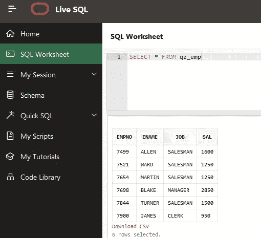

# 有效的 SQL 技能提升

> 原文：<https://towardsdatascience.com/effective-sql-upskilling-92831ad13717?source=collection_archive---------24----------------------->

Domenico Loia 在 [Unsplash](https://unsplash.com/photos/hGV2TfOh0ns) 拍摄的照片

## 如何通过现成的 leader 数据库(免费)使您的 SQL 升级更有效。

任何数据主题中的“提升技能”都意味着两件互补的事情:学习新技能(语言、算法等)。)，并不断更新您已经建立的技能。

在这个故事中，我的目标是与你分享一些提升 SQL / PL-SQL / T-SQL 技能的方法。

# 让我们远离 SQL 懒惰

任何数据科学学科，或任何包含“..数据..”word 在某些时候需要查询数据库并进行一些开发。事实上，我参加过的任何工作面试(无论是作为面试官还是被面试者)都会测试应聘者的 SQL 专业知识以及其他方面。

但问题来了:一旦我们得到了这份工作，我们倾向于只使用我们技能组合中的一小部分来处理公司的数据生态系统，并最终实现老板的期望。我承认:有时我在编写查询或进行数据库开发时变得“懒惰”，只是因为数据库和工具允许我选择肮脏的方式来做事。一个显著的例子是:我曾经做过一个客户流失分析项目，在这个项目中，一个经过良好调整的 Teradata 集群被用来处理相对少量的电信交易。它可以在几毫秒内运行任何脏的分析查询。

另一方面，当数据库配置很差、容量太大或者没有适当调整时，我们必须找到构建查询或在其上开发的聪明方法。查询需要一个完美优化的代码，开发需要使用正确的对象(正确类型的索引、分区、统计信息集合等)..).此外，在这种情况下，我们需要深入了解我们正在处理的平台:在 MS-SQL Server 上最有效的技巧可能与在 Oracle 中不同，等等。

我很确定你也遇到过一些蹩脚的 DB，对吧？因此，在任何情况下，我们能找到的最好的解决方案就是不断提升我们的数据库和 SQL 知识。

如果你想知道为什么数据人员需要掌握 SQL，这里有一个很好的故事:

 [## 每个有抱负的数据科学家必须学习 SQL 的 5 个理由

### 随着海量数据的出现，企业和行业正在收集和产生数十亿的数据…

medium.com](https://medium.com/analytics-vidhya/5-reasons-every-aspiring-data-scientist-must-learn-sql-2bab007a8d76) 

# 我们的目标:提升 SQL 技能

在这里，我将解释一段时间以来我一直在做的事情，提升自己的技能，为他人提供培训，以及更广泛地分享知识。

简而言之，我用的是两个免费平台:**【SQL Live】**和**【Dev Gym】**。要访问它们，您需要创建一个 Oracle 登录名。

## 1.“SQL Live”在线数据库

[**https://livesql.oracle.com**](https://livesql.oracle.com/)

**它提供了对实时 Oracle(企业版！)数据库，已经设置了各种模式和模型类型，其中有一些默认数据，您可以实时查询这些数据。**

****

**作者截图**

**最有用的是 **SQL 工作表**，连接数据库和运行任何脚本(DML、DDL 等)的实际实时会话..).**

****

**作者截图**

## **2.“开发健身房”培训平台**

**[**https://devgym.oracle.com**](https://devgym.oracle.com)**

**它包括锻炼、课程、关于 SQL、PL/SQL 的测验、分析、数据库设计、调优等..从完全的初学者到专家的任何水平。**

**我认为自己是专家，但我可以保证，在 Dev Gym，你总会找到比你更专业的人，从他们身上你可以学到很多东西。**

**我不会对你应该做哪些锻炼提出建议，你可以根据 SQL 水平和感兴趣的话题浏览和选择。我想给你的唯一建议是，先固定好自己的目标，然后按周或按月制定一个自我训练时间表，这样你就可以连贯地规划你想学的内容。**

## **让 Dev Gym 和 SQL Live 一起工作**

**Dev Gym 的优势在于，您选择的任何培训(锻炼、课程、测验)都已经有了配置练习所需的源脚本，因此您不需要花费时间来构建虚假的表格和数据。**

**您只需要获取这些脚本，并在 SQL Live 中运行它们来创建必要的对象，然后您可以使用这些对象进行实际的训练和编码。**

**让我们来看一个例子:我们参加“sensive SQL”测验，并选择“[关于分析函数的测验](https://devgym.oracle.com/pls/apex/f?p=10001:5:5804903206531:::5:P5_COMP_EVENT_ID,P5_QUIZ_ID,P5_CLASS_ID,P5_WORKOUT_ID,P5_RETURN_TO_PAGE,P5_QUESTION_ID,P5_PREVIEW_ONLY,P5_USER_WORKOUT_ID,P5_COMPEV_ANSWER_ID:2292074,3302393,,132322,329,,N,706471,&cs=17cQpp4C7fMFLOdCuIPQ-SHuXn74q4AORw4lwk8MzYD5JuPSNanvr2PN4FTnrNFaWZkoVf5LuVMAdThYly7kqhw)”模块。Code 按钮允许您导入代码，然后在 SQL Live 会话中运行代码，以构建和加载表。**

****

**作者截图**

****

**作者截图**

**现在，您可以构建查询，并通过 SQL 工作表对创建的对象进行锻炼**

****

**作者截图**

## ****SQL-Live 内置数据模型****

**使用“SQL Live”的另一个好方法是利用几个内置的模式，用不同类型的模型来表示现实世界中模型的简化版本。静态数据、OLTP、星型模式化已经可以使用了，或者您甚至可以导出模式和数据，并在其他数据库中重新创建它们，方法是根据您的需要修改 Oracle 语法。**

****

**作者截图**

# **保持你的知识更新**

**几乎每个主要数据库供应商的新版本都引入了新功能。在过去的几年中，所有主要的数据库供应商都增加了许多新的聚类、分析和统计功能。**

**事情是这样的，其中一个玩家首先推出新功能，然后所有其他玩家通常会跟着做同样的事情。从这个角度来看，甲骨文通常是领先者。**

**“SQL Live”的另一个优势是它会定期升级到最新的数据库版本，这样您就可以尝试和学习新发布的功能，而无需花费时间升级数据库。**

# **局限性和解决方法**

**“SQL Live”和“Dev Gym”基于 Oracle 技术，这意味着其中的所有材料都使用 Oracle 的 SQL 和 PL/SQL。那么，我们能做些什么来在另一个数据库上练习同样的练习、锻炼等呢？**

**这里有一个技巧:所有的“SQL Live”和“Dev Gym”脚本都可以导出(您将在编辑器附近看到导出代码按钮)，并且您可以修改它们以在任何数据库上运行，主要是通过改变 DDLs 语句中的数据类型、修改 DMLs 或替换函数(数据转换、分析等)..)与您的目标数据库所接受的进行比较。**

**如果您不熟悉 Oracle 数据库，我相信它是值得学习的:Oracle 总是排在 Garner 魔力象限的最顶端。**

# **提升 SQL 技能的其他方法**

**如果您不想使用上面解释的 Oracle 环境，我可以提出另外几个想法:**

1.  **https://www.db-fiddle.com/允许在各种数据库上运行实时 SQL 代码:MS SQL Server，MySQL，PostgreSQL。但是没有预先建立的物体、锻炼或训练:你需要准备你自己的环境。另一个好处是你不需要创建一个登录。**
2.  **获取并安装 **MySQL** :设置需要 15 分钟，但是值得拥有。我已经描述了如何设置它，并可选地将其连接到 ETL 工具、R(对于 Python 也是可能的，但我在我的另一篇文章中没有解释如何做)，或 Dashboarding 工具:**

** [## 在家创建“真实世界”的数据科学环境

### 我在家里的“真实世界”数据科学环境:数据库，ETL，数据分析，仪表板，9 个步骤。

medium.com](https://medium.com/@maw.ferrari/create-a-real-world-data-science-environment-at-home-7a4255ff6fa5) 

# 简而言之…

*   通过免费访问预先构建的数据库，可以在世界一流的数据库上升级 SQL，从而避免在安装和数据设置过程中花费时间
*   我解释了如何通过使用一个活动的 Oracle 数据库(SQL Live)和一组内置的模型、练习和锻炼(Dev Gym)来实现这一点。
*   然后，我们看到了如何将 Oracle 模型和练习迁移到其他平台(SQL Server 等..).
*   最后，我提到了 Oracle 的另外两种替代方案，它们允许 SQL 升级。

感谢阅读！** 

**[随时订阅我的**《分享数据知识》**简讯**。**](http://eepurl.com/humfIH)**

****

**如果你想订阅《灵媒》,请随意使用我的推荐链接[https://medium.com/@maw-ferrari/membership](https://medium.com/@maw-ferrari/membership):对你来说，费用是一样的，但它间接有助于我的故事。**