# 随着时间的推移有效地可视化数据，以讲述更好的故事

> 原文：<https://towardsdatascience.com/effectively-visualize-data-across-time-to-tell-better-stories-2a2c276e031e?source=collection_archive---------15----------------------->

## 使用 Python 和 Plotly 构建清晰易读的时序数据可视化，以支持您的叙述。

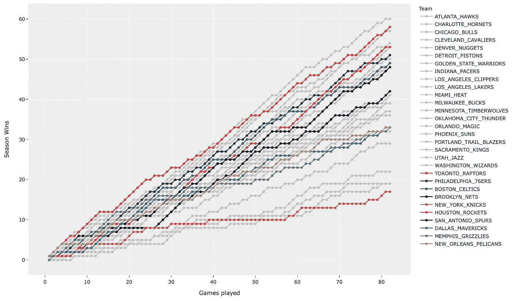

2018-2019 NBA 常规赛

不言而喻，时间是我们所做的几乎每一件事情不可或缺的一部分，包括构建我们对周围世界理解的叙事。当谈到基于数据的 T2 讲故事时，情况也是如此，我们经常需要将数据可视化。无论是公司的股票价格、候选人的选举民调数据，还是一个国家的人口数量，数据随时间的变化都是叙事的关键要素。

但是可视化时间序列数据可能是一个具有挑战性的命题。当有多个数据系列时尤其如此，这些数据系列在小空间内相互交错，就像一群第一次踢足球的不守规矩的 6 岁儿童。

看看下面的图表，它是由 StackOverFlow 用户发布的。

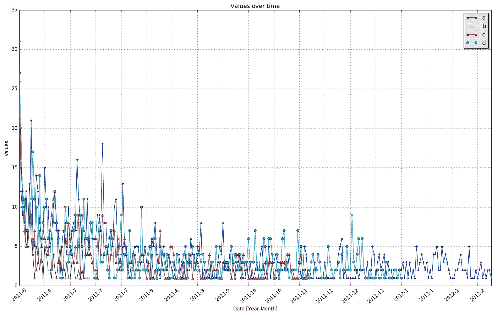

你能看懂这张图表吗？(来自[斯塔克伟福](https://stackoverflow.com/questions/38264623/visualizing-multiple-time-series-observation/38265162#38265162)

正如你可能想象的那样，发帖人正在寻求帮助，如何使图表更清晰易读。甚至很难识别出图中的单个痕迹，更不用说弄清楚任何可能存在的模式了。

我注意到这个图表只包括*四个*轨迹。

另一方面，在 FiveThirtyEight 看一看这位来自 Andrew Flowers 的美女。

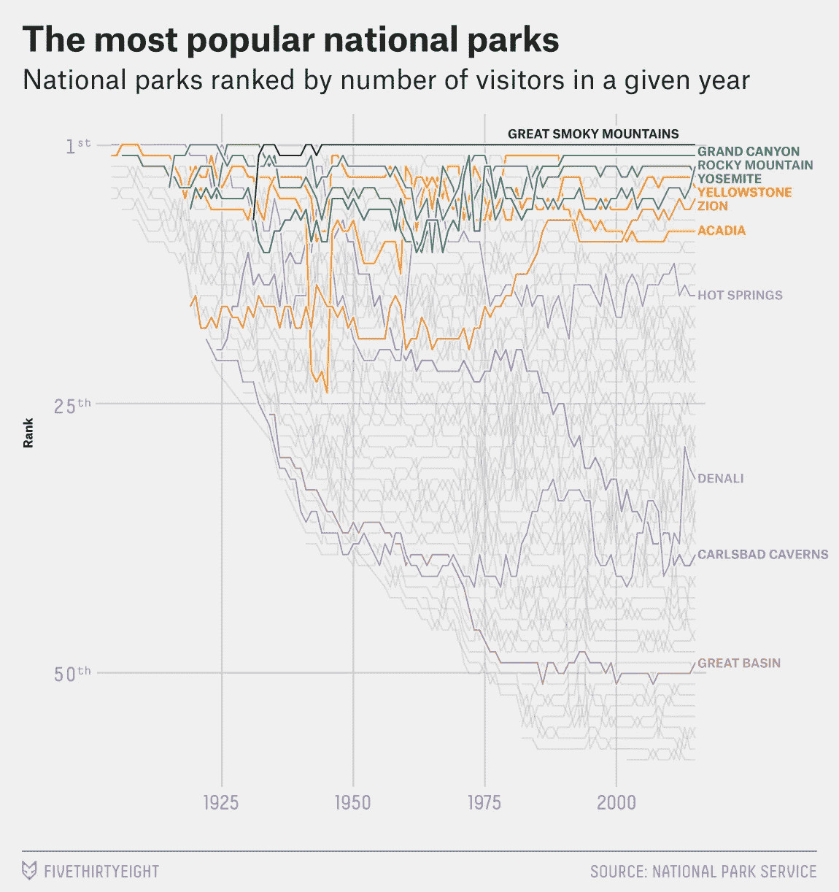

那更好！([五三八](https://fivethirtyeight.com/features/the-national-parks-have-never-been-more-popular/))

该图表包括了不到 60(！)痕迹。但是 FiveThirtyEight 对饱和度、颜色和标签的明智使用彻底改变了游戏。即使在这 60 个数据系列之外，关键的 10 个系列也清楚地显示出来，使读者能够识别每个系列，并随着时间的推移跟踪它，以支持所写的散文。

显然，我们都希望我们的图表看起来更像后者，而不是前者。所以在这篇文章中，我想谈谈如何做到这一点，使用我常用的数据可视化工具(Plotly)来可视化数据。至于数据，让我们用 2018–2019 NBA 赛季数据来尝试重新讲述它的故事；当然，我们可以很容易地使用股票、城镇人口或我的体重数据。我们走吧。

# 在开始之前

## 数据

我把代码和数据放在我的 [GitLab repo 这里](https://gitlab.com/jphwang/online_articles) ( `nba_storytime`目录)。所以请随意使用它/改进它。

## `Packages`

我假设您熟悉 python。即使你相对较新，这个教程也不应该太难。

你需要`pandas`和`plotly`。用一个简单的`pip install [PACKAGE_NAME]`安装每一个(在您的虚拟环境中)。

# 获取您的数据

我选择的数据集是每个 NBA 球队比赛结果的集合。用以下内容加载`csv`文件:

```
all_records_df = pd.read_csv('srcdata/2018_2019_season_records.csv', index_col=0)
```

数据集包括每一场比赛，包括季后赛。数据集包括字符串形式的比赛日期，因此我们可以按日期过滤它们:

```
records_df = all_records_df[pd.to_datetime(all_records_df.date) < pd.to_datetime('2019-04-12')]
```

看起来是这样的:

这些数据包括每支球队在这些比赛日期的累计净得分、比赛次数、胜败情况。

换句话说，随着时间的推移，这些数据讲述了每个球队的赛季故事。我们来看看如何最好地讲述每个团队的故事，如何突出关键时刻，通过数据发现什么有趣的故事。

# 用数据讲故事

## 介绍

让我们把数据绘制成散点图。我们可以生成图表来查看每场比赛的累积胜率:

```
import plotly.express as px
fig = px.scatter(records_df, x='date', y='wins', color='team')
fig.show()
```

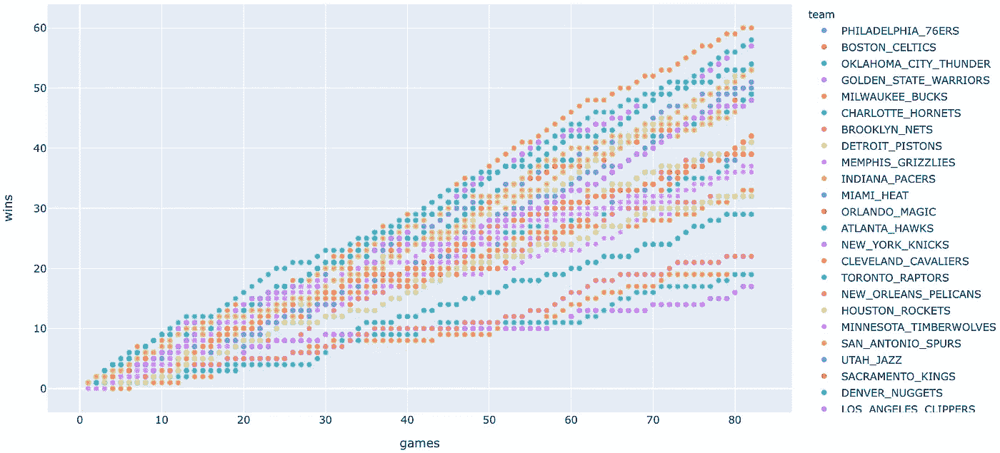

赢与玩的游戏——分散

这是一个很好的开始，但这是一个相当拥挤的图表，尤其是在赛季初。一些颜色在这里和那里很突出，但对我来说，似乎有太多的重叠，挑选出特定的数据集或注意数据中的模式是很清楚的。

让我们来看看其他一些可视化数据的方法。

## 整理数据

如果我们把散点图的点连接起来，把它转换成线图，会怎么样？

(代码方面，这将做到:`fig.update_traces(mode=’markers+lines’)`)

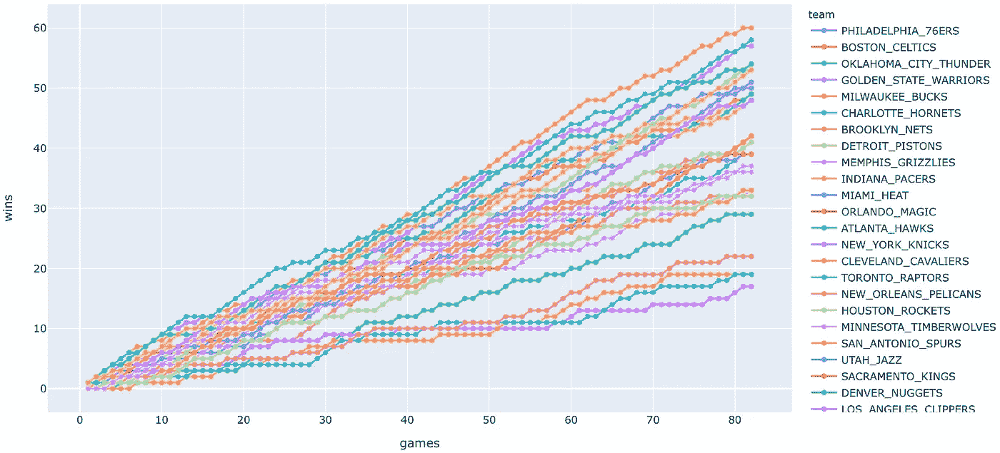

赢与玩的游戏—带标记的折线图

好吧，还不错。因为我们想讲述一个团队发展的故事，所以折线图可能是比散点图更好的选择。(如果您不想看到这些点，请指定:`fig.update_traces(mode=’lines’)`)

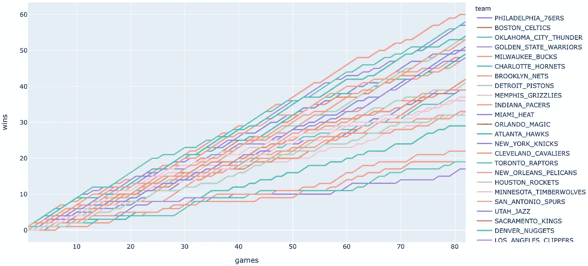

赢与玩的游戏—仅折线图

不过，这里有 30 条跟踪，很难分辨出哪条跟踪在做什么。此外，我们的边上的传说似乎是在一个随机的顺序，使发现困难。让我们解决这个问题。

我们所要做的就是传递一个类别参数值的实参，以你喜欢的任何顺序作为一个列表。我只是将数据按字母顺序排序，然后像这样传递:

```
tm_names = [i for i in records_df.team.unique()]
tm_names.sort()
fig = px.scatter(records_df, x='games', y='wins', color='team', category_orders={'team': tm_names})
```

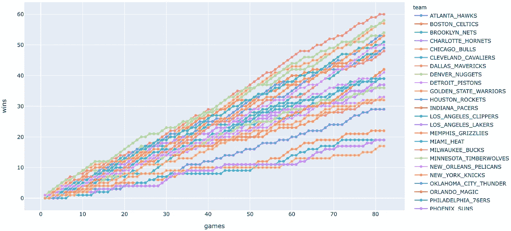

使用有序名称

右边的图例现在按字母顺序排列，使我们能够更容易地找到并隔离正确的轨迹。

说到寻找痕迹——你注意到每条痕迹的颜色都变了吗？那是因为这些颜色是任意分配的。(当然是——我们还没有指定任何颜色映射！)这在某些情况下没问题，但我们可以做得更好。通常，一个数据源会有一种颜色，读者会将这种颜色与它联系起来。在这种情况下，为什么我们不给每条赛道分配颜色呢？

## 丰富多彩的语言

我包含了一个我整理好的字典文件，格式为`{teamname: teamcolour}`。加载它:

```
import pickle
with open('srcdata/teamcolor_dict.pickle', 'rb') as f:
    team_col_dict = pickle.load(f)
```

我们使用列表理解来构建一个颜色列表，其顺序与我们上面使用的团队列表(`tm_names`)的顺序相同:

```
team_cols_list=[team_col_dict[tm] for tm in tm_names]
```

简单地传递这个列表作为`color_discrete_sequence`的一个参数:

```
fig = px.scatter(records_df, x='games', y='wins', color='team', category_orders={'team': tm_names}, color_discrete_sequence=team_cols_list)
fig.update_traces(mode='markers+lines')
fig.show()
```

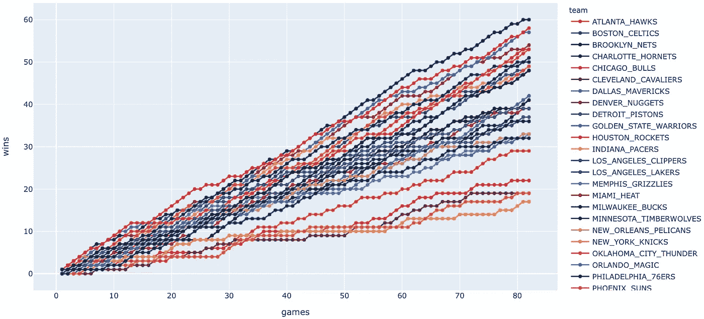

现在用队服！

这并不完美——太多的队服颜色是深绿色和红色的变体。但是，至少现在更容易知道哪个跟踪可能指向哪个团队。

还记得我们在上面看到的 538 图表吗？该图以去饱和灰色显示了大部分轨迹，有助于突出彩色轨迹。让我们试试类似的东西。

最简单的方法是修改我们传递的颜色列表。只需保持我们感兴趣的痕迹的颜色，并将所有其他颜色改为灰色。有很多方法可以做到这一点，但我通过构建一个全新的列表来做到这一点:

```
base_col = '#C0C0C0'
team_cols_list = list()
for i in range(len(tm_names)):
    tm = 'TORONTO_RAPTORS'
    if tm_names[i] == tm:
        team_cols_list.append(team_col_dict[tm])
    else:
        team_cols_list.append(base_col)
```

以完全相同的方式绘制图表，您会看到:

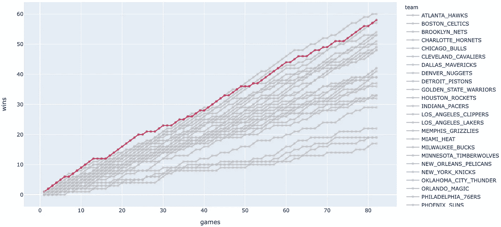

特别强调一条线索(在这种情况下，是最终的 NBA 冠军)

想突出多个痕迹？这很容易做到。再加上猛龙的赛区对手。

```
base_col = '#C0C0C0'
hero_teams = ['TORONTO_RAPTORS', 'PHILADELPHIA_76ERS', 'BOSTON_CELTICS', 'BROOKLYN_NETS', 'NEW_YORK_KNICKS']
team_cols_list = list()
for i in range(len(tm_names)):
    if tm_names[i] in hero_teams:
        tm = tm_names[i]
        team_cols_list.append(team_col_dict[tm])
    else:
        team_cols_list.append(base_col)
fig = px.scatter(records_df, x='games', y='wins', color='team', category_orders={'team': tm_names}, color_discrete_sequence=team_cols_list)
fig.update_traces(mode='markers+lines')
fig.show()
```

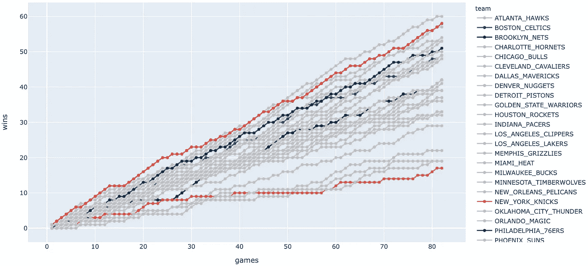

大西洋赛区记录(抱歉，尼克斯球迷)

太好了，但是还有一个小问题。一些痕迹(像黑色的布鲁克林篮网的痕迹)被灰色的痕迹掩盖了。我理解这是由于 Plotly 渲染散点图的方式。轨迹实际上是在图例上从上到下呈现的。因为网队的名字出现在顶部，它被埋在底部。

所以让我们改变一下我们队名的顺序。我们通过以不同的方式构造我们的团队名称列表来做到这一点——之后可以使用相同的剩余代码。

```
hero_teams = ['TORONTO_RAPTORS', 'PHILADELPHIA_76ERS', 'BOSTON_CELTICS', 'BROOKLYN_NETS', 'NEW_YORK_KNICKS']
tm_names = [i for i in records_df.team.unique() if i not in hero_teams]
tm_names.sort()
tm_names = tm_names + hero_teams
```

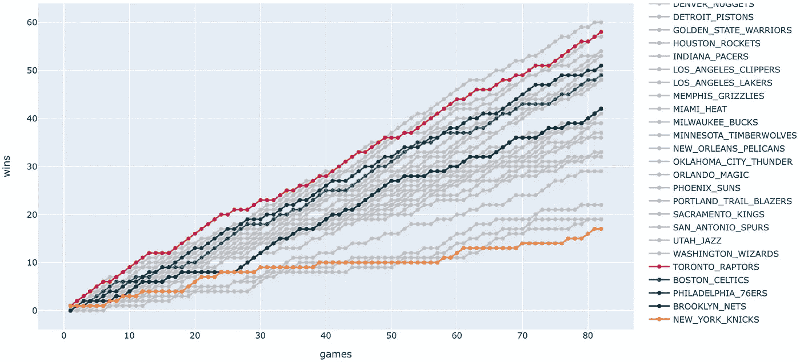

更好，对吗？(还是对不起尼克斯球迷)

# 收尾

## 支线剧情

我们的情节开始看起来相当不错——所以让我们对它们做一些最后的润色。第一，我想比较一下联盟中的两个“联盟”，并强调一下西部的西南赛区。

将分队添加到我们的列表中，并将`‘conference’`传递给我们的`facet_col`参数来创建两个支线剧情:

```
# Separate Conferences, and add highlights for
hero_teams = [
    'TORONTO_RAPTORS', 'PHILADELPHIA_76ERS', 'BOSTON_CELTICS', 'BROOKLYN_NETS', 'NEW_YORK_KNICKS',
    'HOUSTON_ROCKETS', 'SAN_ANTONIO_SPURS', 'DALLAS_MAVERICKS', 'MEMPHIC_GRIZZLIES', 'NEW_ORLEANS_PELICANS'
]
tm_names = [i for i in records_df.team.unique() if i not in hero_teams]
tm_names.sort()
tm_names = tm_names + hero_teams
team_cols_list = list()
for i in range(len(tm_names)):
    if tm_names[i] in hero_teams:
        tm = tm_names[i]
        team_cols_list.append(team_col_dict[tm])
    else:
        team_cols_list.append(base_col)
fig = px.scatter(records_df, x='games', y='wins', color='team',
                 category_orders={'team': tm_names}, color_discrete_sequence=team_cols_list, facet_col='conference')
fig.update_traces(mode='markers+lines')
fig.show()
```

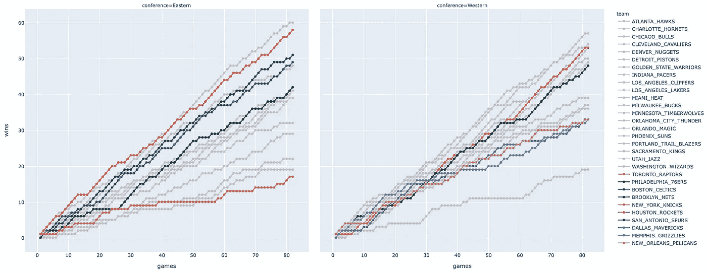

支线剧情

通过将两组数据分成次要情节，我们可以立即看出两次会议之间有趣的对比。很明显，右边的支线剧情(西部联盟)包括更多的轨迹，这些轨迹以更高的比分结束，表明更多的球队赢得了更高的总比分。除了一个异常点，这张图表表明 2018-19 赛季联盟最差的球队主要在东部联盟。

## 绘图主题/模板

这真是太棒了，我刚刚才知道，所以我想在这里简单地分享一下——尽管我正在学习如何使用它们。Plotly 包括一个“主题/模板”功能，允许您快速更改绘图的外观。

我可能会在另一篇文章中深入研究更多的细节，但是现在，请注意，传递模板参数将允许您改变许多绘图格式，例如:

```
fig = px.scatter(records_df, x='games', y='wins', color='team', category_orders={'team': tm_names},
                 color_discrete_sequence=team_cols_list, facet_col='conference', **template="plotly_white"**)
```

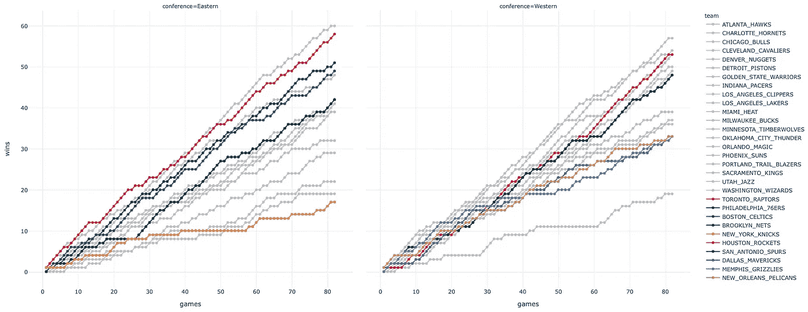

带有“plotly_white”主题

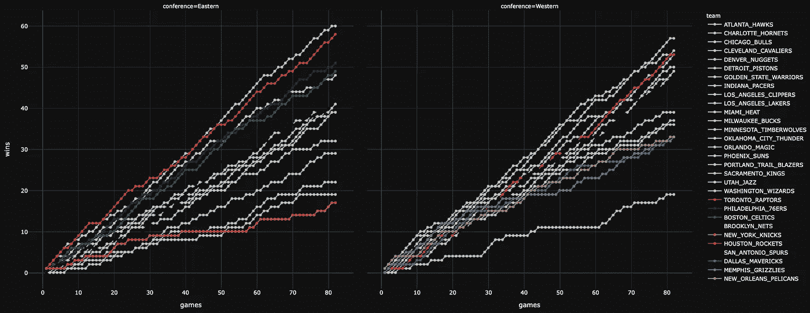

“plotly_black”主题

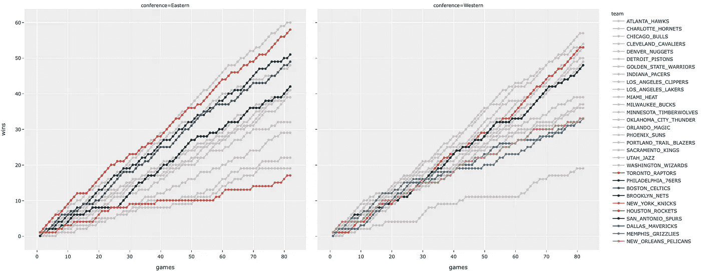

也许你更像是一个 ggplot2 的人

由于我指定了轨迹的团队颜色，轨迹颜色没有改变，但是主题化也会改变默认的颜色图。点击查看[文档。](https://plot.ly/python/templates/)

## 标题和字体大小

为了完整起见，这里有一个版本的图，标题、支线剧情名称和轴标题都经过了格式化处理——以产生一些接近我将在分析文章中使用的内容。

```
fig = px.scatter(records_df, x='games', y='wins', color='team', category_orders={'team': tm_names},
                 color_discrete_sequence=team_cols_list, facet_col='conference', template="ggplot2",
                 title='2018-19 NBA Regular season wins',
                 labels={'games': 'Games played', 'wins': 'Season Wins'}
                 )
fig.for_each_annotation(lambda t: t.update(text=t.text.replace('conference=', 'Conference: ')))
fig.update_traces(mode='markers+lines')
fig.show()
```

除了`.for_each_annotation`方法之外，上述所有方法可能都非常简单。

我在这里做的是用我认为可读性更好的`‘Conference: ‘`替换部分自动生成的支线剧情标题文本(比如`‘conference=Eastern’`)。

这是由 lambda 函数完成的，其中 Plotly 的。for_each_annotation 负责遍历每个注释对象并应用 lambda。

结果如下:

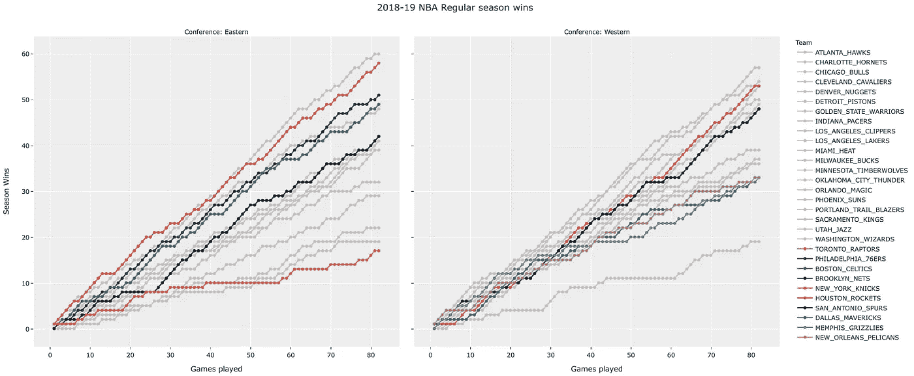

这是我之前做的一个

这看起来是非常简单的数据，但在这种形式下，数据比我们的第一个图更容易消化。如果你不相信我——只需向上滚动，看看我们生成的前两个图。我可以等。

对吗？

通过突出个人的痕迹，我们不仅可以快速展示这些特定的团队是如何在会议的背景下被放置的，还可以展示他们自己的部门的海洋。每个轨迹的梯度显示了它们在季节的不同阶段经历的热(陡)或冷(平)条纹。

此外，在线 Plotly 图表提供了与鼠标悬停数据的交互性，这为用户提供了很好的服务，使他们不必在图表和图例之间来回切换。

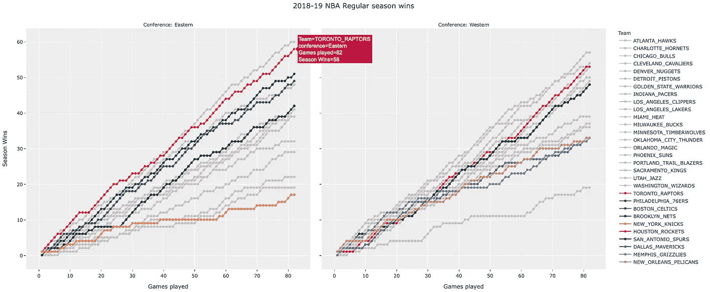

不要忘记交互性

对于时间序列数据，我们几乎可以*做*无限多的事情，因此很难将数据跨时间可视化。如果做得不好，看起来实际上有无限的数据点和数据系列要绘制并传达给我们的读者。

因此，能够从噪音中获取关键细节或信息是很重要的，对我来说，简单的东西会帮助你做到这一点——无论是颜色、比例、支线剧情还是其他什么。事实上，我经常发现一个关键的区别是不要让读者被信息淹没。事实证明，越少往往越多！

这就是我今天的全部内容——感谢您的阅读，如果您有任何建议或要求，请告诉我。

如果你喜欢这个，比如说👋/关注[推特](https://twitter.com/_jphwang)，或点击此处获取更新。ICYMI:我还写了这篇关于用 Plotly Dash 构建 web 数据仪表板的文章。

[](/build-a-web-data-dashboard-in-just-minutes-with-python-d722076aee2b) [## 使用 Python 在几分钟内构建一个 web 数据仪表板

### 通过将您的数据可视化转换为基于 web 的仪表板，以指数方式提高功能和可访问性…

towardsdatascience.com](/build-a-web-data-dashboard-in-just-minutes-with-python-d722076aee2b) 

另外，这是我写的另一篇关于可视化类别变量的文章:

[](/processing-and-visualizing-multiple-categorical-variables-with-python-nbas-schedule-challenges-b48453bff813) [## 用 Python 处理和可视化多个分类变量——NBA 的赛程挑战

### 使用平行分类图和树形图来可视化、识别和比较多个输入变量在…

towardsdatascience.com](/processing-and-visualizing-multiple-categorical-variables-with-python-nbas-schedule-challenges-b48453bff813)