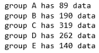

# 使用 Pandas 的 Groupby 功能进行有效的数据汇总和分析

> 原文：<https://towardsdatascience.com/efficient-data-summarizing-and-analysis-using-pandas-groupby-function-7b2cc9eff186?source=collection_archive---------37----------------------->


迈克尔·佩恩在 [Unsplash](https://unsplash.com?utm_source=medium&utm_medium=referral) 上的照片

## 学习使用聚合函数，数据转换，过滤，映射，在数据框架中应用

Groupby 是熊猫很受欢迎的功能。它非常擅长汇总、转换、过滤和其他一些非常重要的数据分析任务。在本文中，我将结合实例详细讲解 groupby 函数的应用。

# 资料组

在本文中，我将使用 Kaggle 的“学生表现”数据集。请从这里随意下载数据集:

[](https://github.com/rashida048/Datasets/blob/master/StudentsPerformance.csv) [## rashida 048/数据集

### 此时您不能执行该操作。您已使用另一个标签页或窗口登录。您已在另一个选项卡中注销，或者…

github.com](https://github.com/rashida048/Datasets/blob/master/StudentsPerformance.csv) 

在这里，我将导入必要的包和数据集:

```
import pandas as pd
import numpy as np
df = pd.read_csv('StudentsPerformance.csv')
df.head()
```


# Groupby 是如何工作的？

Groupby 函数根据您定义的条件拆分数据集。这里我展示了 groupby 函数背后的过程。它会给你一个概念，如果没有 groupby 函数，我们要做多少工作。在本节中，我将创建一个包含两列的更小的新数据集来进行演示。这两栏是“性别”和“阅读分数”。

```
test = df[['gender', 'reading score']]
test.head()
```


**让我们找出不同性别的平均阅读分数**

首先，我们需要根据性别分割数据集。仅生成女性数据。

```
female = test['gender'] == 'female'
test[female].head()
```


以同样的方式，为男性生成数据，

```
male = test['gender'] == 'male'
test[male].head()
```


使用上面的女性和男性数据集分别计算女性和男性的平均阅读分数。

```
fe_avg = test[female]['reading score'].mean()
male_avg = test[male]['reading score'].mean()
print(fe_avg, male_avg)
```

女性的平均阅读分数为 72.608，男性的平均阅读分数为 65.473。现在，做一个女性和男性平均阅读分数的数据图表。

```
df_reading = pd.DataFrame({'Gender': ['female', 'male'], 'reading score': [fe_avg, male_avg]})
```


现在，**让我们用 groupby 函数解决同样的问题。**根据性别分割数据，并对其应用“平均值”,只需一行简单的代码:

```
test.groupby('gender').mean()
```

这一小段代码给出了相同的结果。

# 分组依据中的组

我现在将使用原始数据集“df”。按“种族/民族”分组。

```
race = df.groupby('race/ethnicity')
print(race)
```

输出:<pandas.core.groupby.generic.dataframegroupby object="" at=""></pandas.core.groupby.generic.dataframegroupby>

它返回一个对象。现在检查“race”的数据类型。

```
type(race)
```

输出:pandas . core . group by . generic . data frame group by

因此，我们生成了一个 DataFrameGroupBy 对象。对此 DataFrameGroupBy 对象调用组将返回每个组的索引。

```
race.groups#Here is the Output:
{'group A': Int64Index([  3,  13,  14,  25,  46,  61,  62,  72,  77,  82,  88, 112, 129,              143, 150, 151, 170, 228, 250, 296, 300, 305, 327, 356, 365, 368,              378, 379, 384, 395, 401, 402, 423, 428, 433, 442, 444, 464, 467,              468, 483, 489, 490, 506, 511, 539, 546, 571, 575, 576, 586, 589,              591, 597, 614, 623, 635, 651, 653, 688, 697, 702, 705, 731, 741,              769, 778, 805, 810, 811, 816, 820, 830, 832, 837, 851, 892, 902,              911, 936, 943, 960, 966, 972, 974, 983, 985, 988, 994],             dtype='int64'),  'group B': Int64Index([  0,   2,   5,   6,   7,   9,  12,  17,  21,  26,              ...              919, 923, 944, 946, 948, 969, 976, 980, 982, 991],             dtype='int64', length=190),  'group C': Int64Index([  1,   4,  10,  15,  16,  18,  19,  23,  27,  28,              ...              963, 967, 971, 975, 977, 979, 984, 986, 996, 997],             dtype='int64', length=319),  'group D': Int64Index([  8,  11,  20,  22,  24,  29,  30,  33,  36,  37,              ...              965, 970, 973, 978, 981, 989, 992, 993, 998, 999],             dtype='int64', length=262),  'group E': Int64Index([ 32,  34,  35,  44,  50,  51,  56,  60,  76,  79,              ...              937, 949, 950, 952, 955, 962, 968, 987, 990, 995],             dtype='int64', length=140)}
```

看看上面的输出。Groupby 函数将数据分成子组，现在可以看到每个子组的指数。太好了！但是仅有指数是不够的。我们需要看到每组的真实数据。函数“get_group”对此有所帮助。

```
race.get_group('group B')
```


我在这里展示部分结果。原来产量大很多。

**找出每组的大小**

对“race”对象调用 size 将给出每个组的大小

```
race.size()
```


**循环每组**

您可以在各组之间循环。这里有一个例子:

```
for name, group in race:
    print(name, 'has', group.shape[0], 'data')
```



**多变量分组**

在上面所有的例子中，我们只按一个变量分组。但是通过多个变量分组也是可能的。在这里，我按“种族/民族”和“性别”分组。这将返回按性别分类的每个种族的数据数量。

```
df.groupby(['gender', 'race/ethnicity']).size()
```


此示例使用“size”聚合数据。还有其他聚合函数。以下是所有聚合函数的列表:

总和()

平均值()

大小()

计数()

标准()

风险值()

扫描电镜()

最小值()

中位数()

请试用它们。只需替换这些集合函数中的任何一个，而不是上面示例中的“size”。

**使用多个聚合函数**

我们可以在多个变量上使用 groupby，使用多个聚合函数也是可行的。下一个示例将按“种族/民族”分组，并将使用“最大”和“最小”函数进行聚合。

```
df.groupby('race/ethnicity').agg([np.max, np.min])
```


这里的聚合函数作用于每一列。因为我们没有指定任何列。

制作每场比赛的数学、阅读和写作的最低和最高分数的数据图表。

要做到这一点，使用前面的代码并像这样添加分数:

```
df.groupby('race/ethnicity')['math score', 'reading score', 'writing score'].agg([np.max, np.min])
```


**对多个变量进行分组并使用多个聚合函数**

为了证明这一点，我们将按“种族/民族”和“性别”进行分组。此外，使用两个聚合函数“min”和“max”。让我们制作一个数据框架，包含按性别划分的每个小组在数学、阅读和写作方面的最高和最低分数。

```
df.groupby(['race/ethnicity', 'gender'])['math score', 'reading score', 'writing score'].agg([np.max, np.min])
```


**不同列上的不同聚合函数**

按“种族/民族”分组，对数学成绩使用最大值和平均值，对阅读成绩使用中值和最小值。

```
df.groupby('race/ethnicity').agg({'math score': ['max', 'mean'], 
                                 'reading score': ['median','min']})
```


很酷，对吧？但是列名没有那么好和清晰。它们应该更清晰、更好。我们可以像这样更改列名:

```
math_read = df.groupby('race/ethnicity').agg({'math score': ['max', 'mean'], 'reading score': ['max', 'mean']})
math_read.columns=['Max Math Score', 'Average Math Score', 'Max Reading Score', 'Average Reading Score' ]
```


完全相同的数据框架，但更有条理。

**对名义列使用聚合函数**

在上面的所有例子中，我们在数字列上使用了聚合函数。对一些名义列(如“午餐”和“父母教育水平”)应用聚合函数。

```
df.groupby(['race/ethnicity', 'gender']).agg({'lunch': pd.Series.mode, 'parental level of education': pd.Series.mode, 'math score':np.mean})
```


正如您在上面的代码中看到的，对于名义数据，语法是不同的。就像提醒模式是出现最多的数据。

**在 Groupby 中应用函数**

计算一下有多少孩子的“父母教育水平”是高中水平。

```
df.groupby(df['parental level of education'].apply(lambda x: 'high' in x)).size()
```


如果您不习惯使用 lambda，请查看这篇文章:

[](/efficient-python-programming-with-lambda-map-filter-and-sorted-cfdf536afc36) [## 使用 Lambda、Map、Filter 和 Sorted 进行高效的 Python 编程

### 使用数字、字符串和字典列表的快乐编程

towardsdatascience.com](/efficient-python-programming-with-lambda-map-filter-and-sorted-cfdf536afc36) 

**将“数学分数”栏分成三个偶数桶，并将其定义为低、中、高分**

```
df.groupby(pd.qcut(x=df['math score'], q=3, labels=['low', 'average', 'high'])).size()
```


如果你想设置分界点，并定义你的低，平均，高，这也是一个简单的方法。

```
df.groupby(pd.cut(df['math score'], [0, 40, 70, 100])).size()
```


# 使用 Groupby 转换

在数据帧“df”中生成一个新列，并添加一个包含每个数学分数与平均数学分数之差的列。

```
df['Distance From the Mean'] = df.groupby(['race/ethnicity', 'gender'])['math score'].transform(lambda x: x - x.mean())
```


看上面的数据框。末尾有一个名为“与平均值的距离”的新列。

# 使用 Groupby 筛选

您可以根据特定条件筛选出数据，使数据更有意义。筛选数据少于 100 行的组或种族。

```
df_n = df.groupby('race/ethnicity').filter(lambda x: len(x) > 100)
```

上面的代码说保留长度超过 100 的组。检查原始数据帧“df”和过滤数据帧“df_n”的长度。

```
print(len(df))
print(len(df_n))
```

原始数据帧的长度为 1000，应用过滤器后，数据帧的长度变为 911。

# 地图

绘制每组的平均阅读分数，并生成一个新列。

```
df['New'] = df['race/ethnicity'].map(df.groupby(['race/ethnicity'])['reading score'].mean())
```


看看这个数据框。最后有一个名为“新”的新列，包含相应组的平均阅读分数。

# 使用 Groupby 进行可视化

众所周知，一图胜千言。下面是 groupby 中可视化技术的一些演示。做一个父母教育水平的柱状图。

```
import matplotlib.pyplot as plt
plt.clf()
df.groupby('parental level of education').size().plot(kind='bar')
```


请尝试制作一个饼图。你只需要在上面的代码中使用' pie '而不是' bar'。如果你没有传递任何'种类'，情节将是一个简单的线情节。让我们画出每组的平均数学分数。

```
df.groupby('race/ethnicity')['math score'].mean().plot()
```


# 结论

在本文中，您学习了以多种不同的方式对数据进行分组和汇总。您学习了使用 groupby 使用聚合函数、数据转换、过滤、映射和可视化。

我在这个视频中也解释了同样的内容:

欢迎在推特上关注我，喜欢我的 T2 脸书页面。

## 更多阅读:

[](/your-everyday-cheatsheet-for-pythons-matplotlib-c03345ca390d) [## Python Matplotlib 的日常备忘单

### 完整的可视化课程

towardsdatascience.com](/your-everyday-cheatsheet-for-pythons-matplotlib-c03345ca390d) [](/a-complete-recommendation-system-algorithm-using-pythons-scikit-learn-library-step-by-step-guide-9d563c4db6b2) [## 使用 Python 的 Scikit-Learn 库的完整推荐系统算法:分步指南

### 一个简单、容易、有用的算法，只有几行代码

towardsdatascience.com](/a-complete-recommendation-system-algorithm-using-pythons-scikit-learn-library-step-by-step-guide-9d563c4db6b2) [](/a-complete-guide-to-hypothesis-testing-for-data-scientists-using-python-69f670e6779e) [## 数据科学家使用 Python 进行假设检验的完整指南

### 用样本研究问题、解决步骤和完整代码清楚地解释

towardsdatascience.com](/a-complete-guide-to-hypothesis-testing-for-data-scientists-using-python-69f670e6779e) [](/best-free-courses-for-computer-science-software-engineering-and-data-science-50cd88cafd74) [## 编程、软件工程和数据科学的最佳免费课程

### 麻省理工、哈佛和斯坦福等顶尖大学的免费课程

towardsdatascience.com](/best-free-courses-for-computer-science-software-engineering-and-data-science-50cd88cafd74) [](/a-complete-anomaly-detection-algorithm-from-scratch-in-python-step-by-step-guide-e1daf870336e) [## Python 中从头开始的完整异常检测算法:分步指南

### 基于概率的异常检测算法

towardsdatascience.com](/a-complete-anomaly-detection-algorithm-from-scratch-in-python-step-by-step-guide-e1daf870336e) [](/how-to-present-the-relationships-amongst-multiple-variables-in-python-70f1b5693f5) [## 如何在 Python 中呈现多个变量之间的关系

### 了解如何使用 Python 中的多元图表和绘图来呈现要素之间的关系

towardsdatascience.com](/how-to-present-the-relationships-amongst-multiple-variables-in-python-70f1b5693f5)