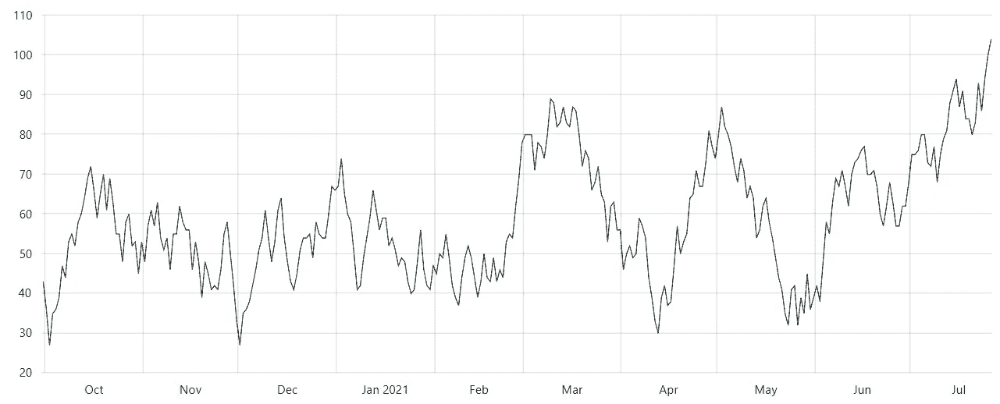

# 使用 React 实现高效的数据可视化

> 原文：<https://towardsdatascience.com/efficient-data-visualization-with-react-f55f67a2d2fa?source=collection_archive---------39----------------------->

## 如何高效处理 amCharts 图表

在 [Unsplash](https://unsplash.com/s/photos/graph?utm_source=unsplash&utm_medium=referral&utm_content=creditCopyText) 上由 [Carlos Muza](https://unsplash.com/@kmuza?utm_source=unsplash&utm_medium=referral&utm_content=creditCopyText) 拍摄的照片

[**amCharts**](https://www.amcharts.com/) **是一个用于数据可视化的 JavaScript 库**，内置了对 TypeScript 和 ES6 模块的支持。也完全兼容[角度](https://angular.io/)、[反应](https://reactjs.org/)、 [Vue.js](https://vuejs.org/) 。amCharts 提供了多种图表类型供选择，如这里的[所示](https://www.amcharts.com/javascript-charts/)。

我已经使用 amCharts 几个月了，现在我知道它的主要优点和缺点。当用于静态图表时，简直令人惊叹。动态图表呢？

**初始化 amCharts 图表需要大量的时间和资源**。想象一下，每当我们需要改变可视化的数据时，例如，作为事件的结果，都要这样做。这很容易成为 web 应用程序的瓶颈，尤其是在同一个页面上有很多图表的情况下。这就是[记忆](https://en.wikipedia.org/wiki/Memoization)发挥作用的地方！

请注意，本文的主要目的不是展示 amCharts 是如何工作的，或者什么是记忆化。这就是为什么**我强烈推荐阅读** [**这个**](https://www.amcharts.com/docs/v4/) **和** [**这个**](https://medium.com/@trekinbami/using-react-memo-and-memoization-1970eb1ed128) **第一个**。

让我们构建一个高效的 [React 组件来包装](https://codeburst.io/a-complete-guide-to-props-children-in-react-c315fab74e7c)任何类型的 amCharts 图表。

 [## 反应中的道具.儿童完全指南

### 掌握 React 组件组成

codeburst.io](https://codeburst.io/a-complete-guide-to-props-children-in-react-c315fab74e7c) 

# **构建图表组件**

我们的通用组件可以定义如下:

`[am4core.create](https://www.amcharts.com/docs/v4/reference/instance_module/#create_method)`函数返回**图表实例**，这允许我们操纵图表本身的行为。图表的创建，即它的初始化，应该只在组件第一次呈现时执行**。否则，这个组件会变得**极其低效**。这就是为什么我们将初始化函数包装在一个 [useMemo](https://reactjs.org/docs/hooks-reference.html#usememo) 回调中。这样，**我们就记住了返回 char 实例的函数，只有在第一次调用组件时才会调用它**。每次组件重新呈现时，都会使用`chart`缓存值，避免初始化开销。**

如果我们希望图表可以被操作，而不是每次都重新创建，我们需要公开它对父组件的引用。为此，我们添加了`onInitialization`道具。有了它，**父级可以直接在它的实例上改变图表的外观、数据和行为**。

这种方法的主要优势有两个:

*   **通过为每个图表类型创建一个组件来避免代码重复**
*   允许父组件**随时随地与图表**直接交互

# 运行中的图表组件

假设我们想要创建一个时态演变[折线图](https://www.amcharts.com/docs/v4/reference/lineseries/)，就像这样:

用 amCharts 制作的时间演变线图

要可视化的数据将从 AJAX 调用中检索，其结果取决于用户选择的时间跨度。首先，我们来定义一下`TemporalEvolutionChart`组件:

父组件负责调用检索要在图表中显示的数据，并将其传递给它。这是通过将 AJAX 调用的结果赋给图表实例的`[data](https://www.amcharts.com/docs/v4/concepts/data/)`属性来实现的。 **amCharts 图表会自动呈现新的数据**。

瞧啊。一旦用户更改了感兴趣的时间跨度，就会发出一个 AJAX 调用(这要感谢这里引入的 API 定义层),图表也会相应地更新。这是一种非常有效的方式，不需要每次都初始化图表。

# 结论

在本文中，我们展示了一种使用 amCharts 和 React 的有效方法。初始化 amCharts 图表是一项耗时的操作，应仅在绝对必要时执行。这种方法是一个很好的例子，说明了如何节省资源，并防止用户因非常慢的网页而感到沮丧。感谢阅读！我希望这篇文章对你有所帮助。如有任何问题、意见或建议，请随时联系我。