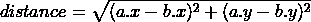
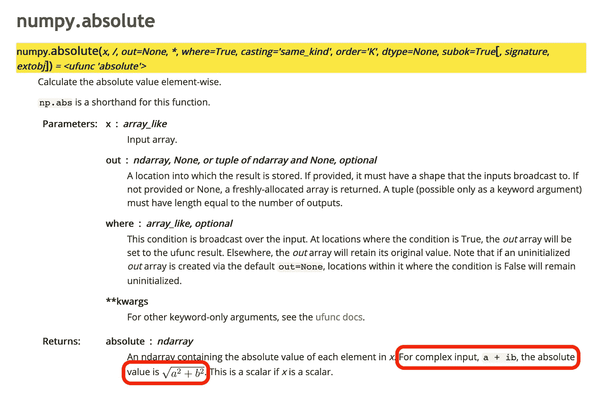

# 熊猫中有效的欧几里德距离计算

> 原文：<https://towardsdatascience.com/efficient-euclidean-distance-computation-in-pandas-66b472f6b0ba?source=collection_archive---------20----------------------->

马库斯·斯皮斯克在 [Unsplash](https://unsplash.com/s/photos/ruler?utm_source=unsplash&utm_medium=referral&utm_content=creditCopyText) 上拍摄的照片

## -一个巧妙的小把戏

在数据科学中，我们经常会遇到地理问题，比如经典的房价预测问题。在大多数情况下，作为特性工程的一部分，使用[k-nearest neighborhood](https://en.wikipedia.org/wiki/K-nearest_neighbors_algorithm)(k-NN)或类似策略来计算基于位置的参考价格不会有什么坏处。

k-NN 中最重要的超参数是距离度量，欧几里德距离是地理空间问题的明显选择。也称为“直线”距离或 L 范数，使用以下公式计算:

使用 k-NN 进行特征训练的问题在于，理论上，它是一个 *O* (n)运算:每个数据点都需要将每隔一个数据点视为潜在的最近邻。在没有像[空间索引](https://en.wikipedia.org/wiki/Spatial_database#Spatial_index)这样的专门技术的情况下，我们可以通过一些矢量化来加快速度。

让我们从一组地理空间数据点开始:

我们通常不直接从`latitude`和`longitude`计算欧氏距离。相反，它们被投影到地理上适当的坐标系中，其中`x`和`y`共享相同的单位。我将在以后的帖子中详细阐述这一点，但请注意

> 在地球上的大多数地方，东北纬度与经度不同。离赤道越远，这种差异就越大。

非矢量化欧几里得距离计算如下所示:

在上面的例子中，我们计算相对于第一个数据点的欧几里得距离。因为我们使用了`pandas.Series.apply`，所以我们循环了`data['xy']`中的每个元素。如果我们对每个数据点重复这个过程，函数`euclidean`将被连续调用 n 次。我们可以通过矢量化来提高效率。

计算现在是矢量化的。但是它的可读性较差，并且有许多中间变量。有没有更干净的方法？

事实证明，高效的欧几里德距离计算的诀窍在于一个不起眼的数字函数:`numpy.absolute`。

Python 的一个经常被忽视的特性是复数是内置的原语。我们可以将它们转换成复数，而不是将`xy`表示为二元元组。

注意数据类型已经从`object`变成了`complex128`。

除非你是受过纯数学训练的人，否则你可能直到现在才意识到(像我一样)复数可以有绝对值，并且绝对值对应于离原点的欧几里得距离。应用这些知识，我们可以将代码简化为:

还有最后一个问题:如果您需要持久化您的表，复数并不容易序列化。幸运的是，把一个复数分解回它的实部和虚部并不太难。

希望你会发现这是有用的。