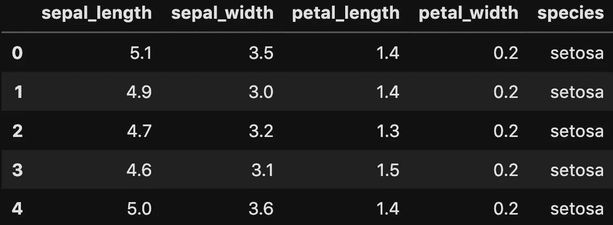
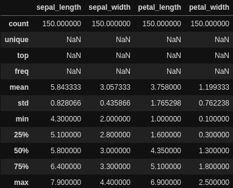
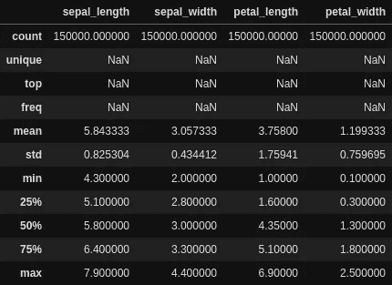

# Pandas 数据帧上条件逻辑的高效实现

> 原文：<https://towardsdatascience.com/efficient-implementation-of-conditional-logic-on-pandas-dataframes-4afa61eb7fce?source=collection_archive---------3----------------------->

## 数据科学，编程，熊猫，效率

## 是时候停止过于依赖。iterrows()和。应用()


照片由[克里斯里德](https://unsplash.com/@cdr6934?utm_source=medium&utm_medium=referral)在 [Unsplash](https://unsplash.com?utm_source=medium&utm_medium=referral) 拍摄

Python 可以说是目前最酷的编程语言(感谢机器学习和数据科学)，但与最好的编程语言之一 c 相比，它的效率并不太为人所知。条件逻辑就是一个例子。当开发机器学习模型时，很常见的是，我们需要根据从统计分析或前一次迭代的结果中得出的硬编码规则，以编程方式更新标签。承认这一点并不丢人:我一直用 Pandas apply 编写代码，直到有一天我厌倦了嵌套块，于是我决定研究(也就是谷歌)替代的、更易维护和更有效的方法(也就是其他方法)

# 演示数据集

我们将要使用的数据集是虹膜数据集，您可以通过 pandas 或 seaborn 免费获得。



虹膜数据集的前 5 行



150 排，听起来有点业余…



150，000 行，现在我们更认真了

假设在我们的初始分析之后，我们想要用以下逻辑来标记数据集:

*   如果萼片长度< 5.1, then label 0;
*   otherwise if sepal width > 3.3，萼片长度< 5.8, then label 1;
*   otherwise if sepal width > 3.3，花瓣长度> 5.1，则标注 2；
*   否则，如果萼片宽度> 3.3，花瓣长度< 1.6 and either sepal length < 6.4 or petal width < 1.3, then label 3;
*   otherwise if sepal width > 3.3 且任一萼片长度< 6.4 or petal width < 1.3, then label 4;
*   otherwise if sepal width > 3.3，则标记为 5；
*   否则标记为 6

在深入研究代码之前，让我们快速地将新的标签列设置为 None:

```
iris['label'] = None
```

# 熊猫。iterrows() +嵌套的 If-Else 块

如果你还在用这个，这篇博文绝对是适合你的地方！

```
1min 29s ± 8.91 s per loop (mean ± std. dev. of 7 runs, 1 loop each)
```

还有跑的时间…好了，我们继续…

# 熊猫。应用()

Pandas `[.apply()](https://pandas.pydata.org/pandas-docs/stable/reference/api/pandas.DataFrame.apply.html)`直接用于沿数据帧或**的轴对序列**的值应用函数**。例如，如果我们有一个函数 f，它对一个可迭代的数求和(即可以是一个`list`、`np.array`、`tuple`等等)。)，并将其传递给如下所示的数据帧，我们将对一行求和:**

```
def f(numbers):
    return sum(numbers)df['Row Subtotal'] = df.apply(f, axis=1)
```

在上面的代码片段中，`axis=1`表示应用函数的方向。`.apply()`会默认有`axis=0`，即逐列应用该功能；而`axis=1`将逐行应用该函数。

现在我们对熊猫`.apply()`有了一个基本的了解，让我们编写分配标签的逻辑代码，看看它会运行多长时间:

```
1.43 s ± 115 ms per loop (mean ± std. dev. of 7 runs, 1 loop each)
```

对于 150，000 行来说，1.43 秒是一个非常大的进步，但仍然非常慢。想象一下，如果您需要处理一个包含数百万交易数据或信用审批的数据集，每次我们想要应用一组规则并将设计好的功能分配给一个列时，将会花费超过 14 秒的时间。运行足够多的专栏，你就可以在下午剩下的时间里放松下来。

# 熊猫。loc[]索引

如果你熟悉 SQL，用`.loc[]`给一个新列赋值实际上只是一个带有大量`WHERE`条件的`UPDATE`语句。因此，这肯定比对每一行或每一列应用一个函数要好得多。

```
13.3 ms ± 837 µs per loop (mean ± std. dev. of 7 runs, 100 loops each)
```

现在我们花的时间只有以前的十分之一，这意味着当你在家工作时，你有更少的借口离开办公桌开始网飞。然而，我们现在只使用内置的熊猫功能。虽然 pandas 为我们提供了一个非常方便的高级接口来与数据表交互，但效率可能会因为抽象层而降低。

# Numpy。哪里()

Numpy 有一个低级接口，允许与 n 维可迭代对象(即向量、矩阵、张量等)进行更有效的交互。它的方法通常是基于 C 语言的，当涉及到更复杂的计算时，它使用优化的算法，这使得它比我们重新发明的轮子要快得多。根据 numpy 的官方文档，`np.where()`接受以下语法:

```
**np.where**(*condition, return value if True, return value if False*)
```

本质上，这是一个二分逻辑，其中条件将被评估为布尔值，并相应地返回值。这里的诀窍是条件实际上可以是可迭代的(即布尔 ndarray 类型)。这意味着我们完全可以将`df['feature'] == 1`作为条件传入，并将 where 逻辑编码为:

```
**np.where**(*df['feature'] == 1**, 
    'It is one', 
    'It is not one'* )
```

所以你可能会问，我们如何用一个像`np.where()`这样的二分法函数来实现我们上面陈述的逻辑呢？答案很简单，却令人不安。嵌套`np.where()`……(剧透:这个片段可能会触发)

```
3.6 ms ± 149 µs per loop (mean ± std. dev. of 7 runs, 100 loops each)
```

恭喜，你挺过来了。我不能告诉你我花了多少时间来计算右括号，但是嘿，这就完成了任务！我们又砍掉了熊猫的 10ms。然而，这个片段是不可维护的，这意味着，它是不可接受的。

# Numpy。选择()

Numpy `.select()`，与`.where()`不同的是，该函数旨在实现多通道逻辑。

```
**np.select****(***condlist***,** *choicelist***,** *default=0***)**
```

它使用与`np.where()`相似的语法，除了第一个参数现在是一个条件列表，它应该与选项具有相同的长度。使用`np.select()`时要记住的一件事是，一旦满足第一个条件，就会选择一个 **选项。这意味着，如果列表中某个超集规则位于某个子集规则之前，则该子集选项将永远不会被选中。具体来说:**

```
condlist = [
    df['A'] <= 1,
    df['A'] < 1
]choicelist = ['<=1', '<1']selection = np.select(condlist, choicelist, default='>1')
```

因为命中`df['A'] < 1`的所有行也将被`df['A'] <= 1`捕获，所以没有行将被标记为`'<1'`。为了避免这种情况发生，请确保在制定更具体的规则之前先制定一个不太具体的规则:

```
condlist = [
    df['A'] < 1, # < ───┬ swapped here
    df['A'] <= 1 # < ───┘
]choicelist = ['<1', '<=1'] # remember to update this as well!!selection = np.select(condlist, choicelist, default='>1')
```

正如你从上面看到的，你将需要更新`condlist`和`choicelsit`来确保代码运行顺畅。但是说真的，当网飞触手可及的时候，谁有时间做这些呢？好吧，我抓住你了，伙计！通过将其更改为字典，我们将获得大致相同的时间和内存复杂度，但代码片段更易于维护:

```
6.29 ms ± 475 µs per loop (mean ± std. dev. of 7 runs, 100 loops each)
```

大约是嵌套的`np.where()`的两倍，但是这不仅将你从翻表括号调试中拯救出来，而且还改变了心不在焉的`choicelist`。我将是第一个咬紧牙关的人，我已经忘记更新`choicelist`太多次了，我已经花了四倍多的时间来调试我的机器学习模型。相信我，`np.select()`跟`dict`。值得！

# 荣誉提名

1.  **Numpy 的矢量化运算**:如果您的代码涉及循环和评估一元函数、二元函数或对数字序列进行运算的函数。您肯定应该通过将数据转换成 numpy ndarray 来重构代码，并充分利用 numpy 的矢量化运算来极大地提高脚本的速度。**结论:这是一个情境赢家！在 Numpy 的官方文档中查看** [**此处**](https://www.pythonlikeyoumeanit.com/Module3_IntroducingNumpy/VectorizedOperations.html#NumPy%E2%80%99s-Mathematical-Functions) **的一元函数、二元函数或运算数字序列的函数示例！**
2.  `**np.vectorize**`:不要被这个函数的名字所迷惑。这只是一个方便的函数，实际上并没有让代码运行得更快。要使用这个函数，您需要首先将您的逻辑编码成一个可调用的函数，然后运行`np.vectorize(your_function)(your_data_series)`。另一个大的缺点是，为了传递给“矢量化”函数，您需要将数据帧转换成一维的可迭代对象。**结论:如果不方便用** `**np.vectorize**` **，想都别想。**
3.  `**numba.njit**`:这才是真正的业务，真正的向量化。当谈到优化循环时，没有超级天才的 hacky 移动，你根本无法轻松击败 numba。它试图将任何 numpy 评估移动到尽可能接近 C 以提高效率。虽然它可以加快数字计算的速度，但它也将自己限制在数字计算上，这意味着没有 pandas 系列，没有字符串索引，只有 numpy 的 ndarray，类型有`int`、`float`、`datetime`、`bool`和`category`。**结论:如果你习惯于只使用 Numpy 的 ndarray，并且把你的逻辑转换成数值计算，那么你就是一个真正的冠军。从** [**这里了解更多**](https://numba.pydata.org/numba-doc/dev/user/5minguide.html) **。**

# 你可能也喜欢这个

如果你对其他 Python 技巧感兴趣，我为你整理了一份简短博客列表:

*   [Python 技巧:扁平化列表](/python-tricks-flattening-lists-75aeb1102337)
*   [Python 技巧:如何检查与熊猫合并的表格](/python-tricks-how-to-check-table-merging-with-pandas-cae6b9b1d540)
*   [Python 技巧:简化 If 语句&布尔求值](/python-tricks-simplifying-if-statements-boolean-evaluation-4e10cc7c1e71)
*   [Python 技巧:对照单个值检查多个变量](/python-tricks-check-multiple-variables-against-single-value-18a4d98d79f4)

如果你想了解更多关于 Python、数据科学或机器学习的知识，你可能想看看这些帖子:

*   [改进数据科学工作流程的 7 种简单方法](/7-easy-ways-for-improving-your-data-science-workflow-b2da81ea3b2)
*   [熊猫数据帧上的高效条件逻辑](/efficient-implementation-of-conditional-logic-on-pandas-dataframes-4afa61eb7fce)
*   [常见 Python 数据结构的内存效率](/memory-efficiency-of-common-python-data-structures-88f0f720421)
*   [与 Python 并行](/parallelism-with-python-part-1-196f0458ca14)
*   [数据科学的基本 Jupyter 扩展设置](/cookiecutter-plugin-for-jupyter-easily-organise-your-data-science-environment-a56f83140f72)
*   [Python 中高效的根搜索算法](/mastering-root-searching-algorithms-in-python-7120c335a2a8)

如果你想了解更多关于如何将机器学习应用于交易和投资的信息，这里有一些你可能感兴趣的帖子:

*   [用 Python 实现交易策略优化的遗传算法](https://pub.towardsai.net/genetic-algorithm-for-trading-strategy-optimization-in-python-614eb660990d)
*   [遗传算法——停止过度拟合交易策略](https://medium.com/towards-artificial-intelligence/genetic-algorithm-stop-overfitting-trading-strategies-5df671d5cde1)
*   [人工神经网络选股推荐系统](https://pub.towardsai.net/ann-recommendation-system-for-stock-selection-c9751a3a0520)

# 在你走之前…

如果可能的话，去找`numba.njit`；否则，`np.select`带着`dict`会帮你远航，我的朋友。记住，每一点点的改进都是有帮助的！如果你从这里学到了新的东西，请告诉我！也请让我知道我是否还遗漏了其他一些巧妙的技巧！

再见！

[](https://www.linkedin.com/in/louis-chan-b55b9287) [## Louis Chan—FTI Consulting | LinkedIn 数据科学总监

### 雄心勃勃的，好奇的和有创造力的个人，对分支知识和知识之间的相互联系有强烈的信念

www.linkedin.com](https://www.linkedin.com/in/louis-chan-b55b9287) [](https://www.buymeacoffee.com/louischan)