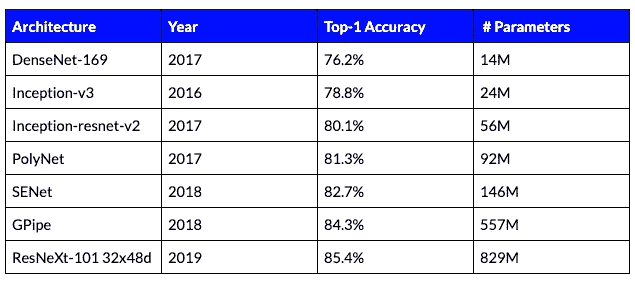
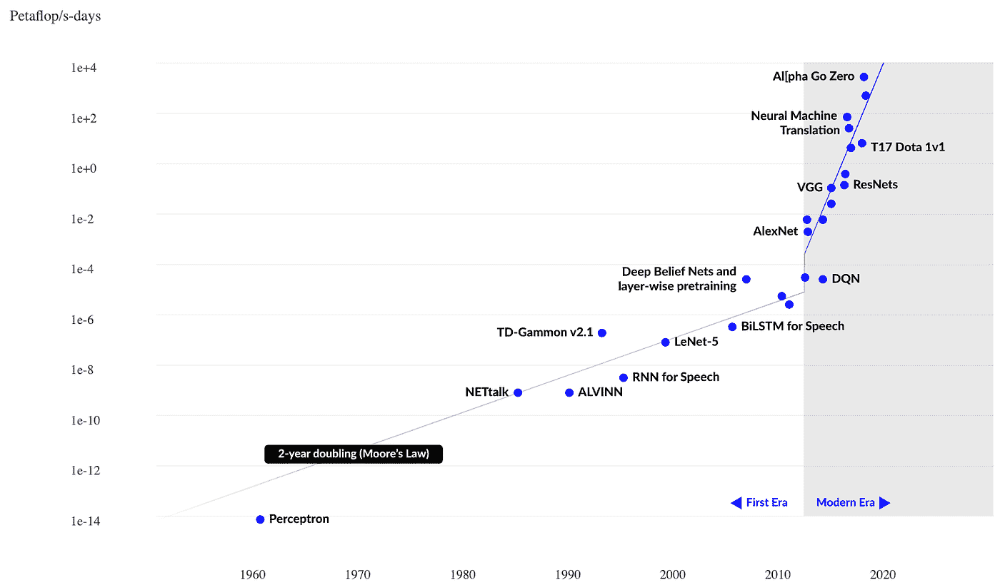
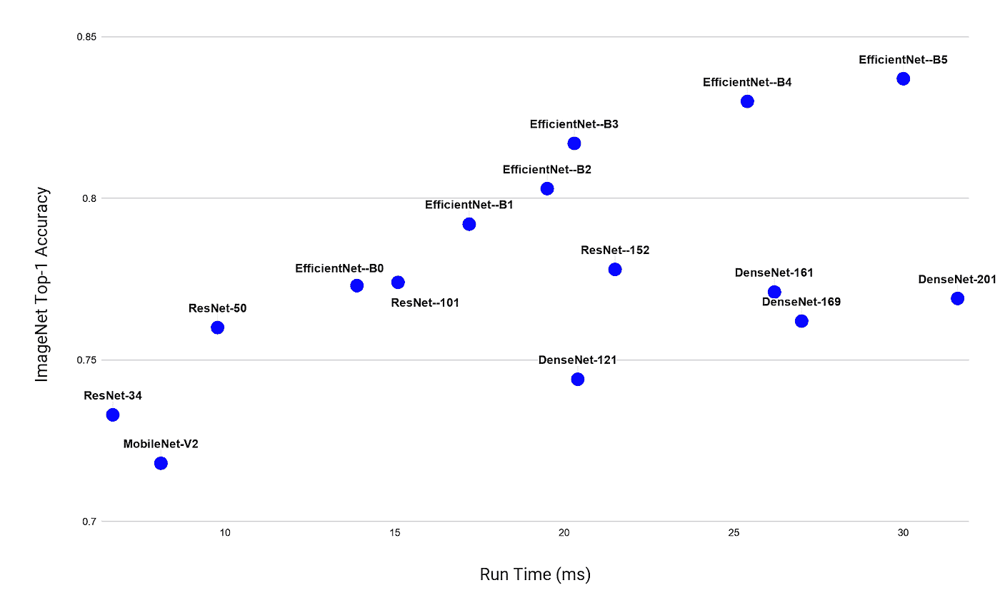

# 深度学习中的高效推理——问题在哪里？

> 原文：<https://towardsdatascience.com/efficient-inference-in-deep-learning-where-is-the-problem-4ad59434fe36?source=collection_archive---------20----------------------->

卷积神经网络可以为许多计算机视觉任务(如图像分类、分割和检测)提供卓越的解决方案。众所周知，神经网络模型的大小与其准确性相关。随着模型大小的增加，精确度也会增加。这可以从表 1 中看出，表 1 显示了几种已知模型在 ImageNet 分类基准测试中的最高精度:

表 ImageNet 上不同分类模型的比较。

众所周知的摩尔定律表明，硬件容量每 1.8 到 2 年翻一番。此外，根据摩尔第二定律，半导体芯片制造厂的成本每 4 年翻一番。另一方面，在 2012 年推出 AlexNet 和 2018 年推出 Alpha-Go 之间的几年里，大型 AI 系统所需的计算量每 3 到 4 个月就会翻一番！(如下图所示)。这个突出的数字意味着深度网络的加速将取决于开发轻量级和算法高效模型的能力。因此，深度学习的软件效率对于推理产生系统将是至关重要的。

图 1:按年份和所需千万亿次浮点运算量(用于训练)划分的神经网络模型。

大多数实际应用的目标是以尽可能短的运行时间获得最高的精度。这在高效深度学习领域提出了几个有趣的问题。在本帖中，我们将解决以下问题:

1.  网络架构如何影响运行时间？
2.  我们如何在不降低模型准确性的情况下减少运行时间？

在本文的其余部分，我们将回答这两个基本问题。

# 架构与推理运行时

如表 1 所示，模型越大，越精确。为了找到运行时间最短、最精确的架构，我们需要了解三个因素之间的权衡:

1.  浮点运算(FLOPs)
2.  运行时间
3.  准确(性)

下面的数字表明，虽然这三者之间有明显的正相关，但它们并不完全相关。这可以通过图的厚度看出，图中显示，对于运行时间(或 FLOPs 数量)相同的两个网络，精度可能会有显著不同。

图 ImageNet 上运算次数(千兆次)与最高精度的对比

图 3:以毫秒为单位的网络运行时间与 ImageNet 上最高精度的对比。

为了理解 FLOPs 和运行时之间的差距，需要考虑几个参数，例如框架、硬件、架构等等。让我们看一个例子，解释为什么 FLOPs 没有一对一的精度函数。在这个例子中，我们考虑深度可分卷积(DSC)，它是由 [Howard et al.](https://arxiv.org/pdf/1704.04861.pdf) 引入的，用于减少深度网络的参数数量。假设我们想要应用大小为 K×K×D 的卷积核，使用 DSC，我们将滤波器分成两个独立的核:对不同通道上的相同条目进行操作的深度核，以及对同一通道中的不同条目进行操作的点状核。例如，如果我们在具有 64 个输入通道的 112 x 112 特征图上进行 3 x 3 深度方向卷积，我们执行 3 x 3 x 64 x 112 x 112 = 7，225，344 次 FLOPs。然后，我们应用可分离分量，它是使用 1 x 1 核的常规卷积。对于该操作，我们取先前的 112×112×64 大小的卷积输出，并将其投影到 128 维的特征图中；这需要 64 x 112 x 112 x 128 = 102，760，448。将两个卷积的运算次数相加得到 109，985，792 次浮点运算。相比之下，相同大小的常规 3 x 3 卷积将需要 924，844，032 次浮点运算，这几乎是 9 倍的运算量！请注意，这两个模型的表达能力是不同的。然而，使用这个想法，[的原始论文](https://arxiv.org/pdf/1704.04861.pdf)，用少得多的网络参数显示了相当的准确性。这个例子清楚地展示了如何用少得多的触发器实现相当的精度。但是，手术次数只是故事的一部分。内存带宽是第二部分——但我们将在另一篇文章中讨论。

现在我们来处理第二个问题。

# 在保持准确性的同时减少运行时间

从模型的角度来看，在深度神经网络中建立了几个启发式算法来减少推理的运行时间。让我们简单解释一下其中的几个:

**量化** —在给定模型的情况下，量化的目标是将权重映射到更小的低精度量化级别集合中。级数反映了精度，并大致反映了存储数据所需的位数(通过对级数应用 log)。在量化过程中，我们希望一方面保持模型的准确性，另一方面将模型量化到尽可能少的级别。量化的影响是双重的。首先，它允许我们用更少的比特，即更少的内存来存储模型。第二，它帮助我们用便宜得多的手术取代昂贵的手术。例如，用半精度(16 位)浮点运算替换双精度(64 位)浮点运算。这反过来使我们能够减少给定网络的推理时间。量化的好处各不相同，取决于数据、量化精度、硬件等。

**修剪—** 现代架构通常过度参数化。然而，这使得大量的权重在推理时是多余的。修剪指的是将这些冗余权重设置为零的过程。与量化类似，修剪的最终目标是将尽可能多的权重设置为零，同时保持准确性。剪枝后，需要对模型进行微调。虽然在某些情况下，修剪可以保持准确性，但它不能用于轻松地减少等待时间，因为权重修剪会导致权重的零星擦除，从而难以利用该结构来实现更快的矩阵乘法。此外，如果通道被修剪(即，使用通道修剪)，模型精度通常会降低。

**知识升华—** 这个术语指的是将复杂模型(老师)学到的知识转移到更简单模型(学生)的过程。最终，学生网络可以达到如果直接在相同的数据上训练则无法达到的准确度。因此，用更简单的模型也能达到同样的精度。这通常表现为较短的运行时间。虽然这个想法听起来很吸引人，但是最近的研究表明在很多情况下这是不切实际的。

**激活统计—** 在现代架构中，ReLU 是使用最广泛的激活函数之一。这种激活具有独特的稀疏特性，可以用来提高效率。例如，AlexNet 的特征地图的稀疏度在 19%到 63%之间。给定这样的稀疏特征映射，可以使用更有效的实现来减少存储器访问和 FLOPs。虽然这种解决方案可以保持准确性，但其运行时间优势可能会因数据集和网络架构而恶化。

**神经架构搜索—** 近年来，已经进行了几次自动搜索有效架构的尝试，以减少运行时间并保持准确性。这通常是通过在所有可能的架构空间或其子集内进行启发式搜索来完成的。NASNet、EfficientNet 和 AmoebaNet 就是这种类型的一些架构。这种解决方案的主要问题是找到这样一种架构需要大量的计算。通常，这种方法需要数千小时的 GPU 来寻找最佳架构。正因如此，对于大多数深度学习从业者来说是不适用的。

# **结论**

近年来，深度学习效率的想法越来越受欢迎。提高深度学习芯片的硬件容量有几种方法；然而，这些要么是昂贵的，要么不能超过对计算资源的需求。这一基本问题引发了对算法解决方案的需求，这些解决方案将提高与深度网络推理相关的运行时间。在这篇文章中，我们看到了一些与设计高效深度学习算法相关的解决方案和挑战。在这个广泛的研究领域，所有的方法都有利弊。因此，在不牺牲准确性的情况下加速推理是一项极具挑战性的任务。

本帖最初发表于-[https://deci . ai/efficient-inference-in-deep-learning-where-the-problem/](https://deci.ai/efficient-inference-in-deep-learning-where-is-the-problem/)