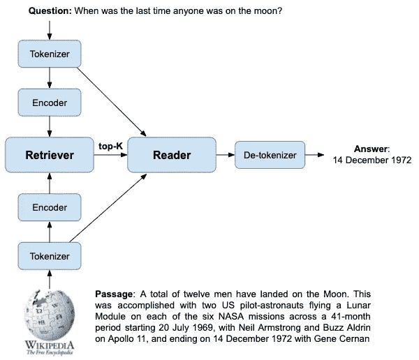
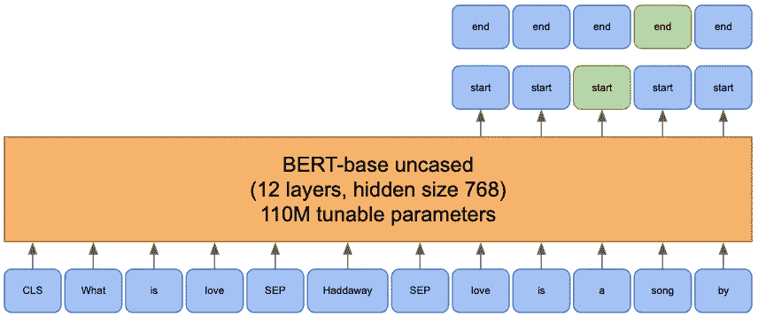
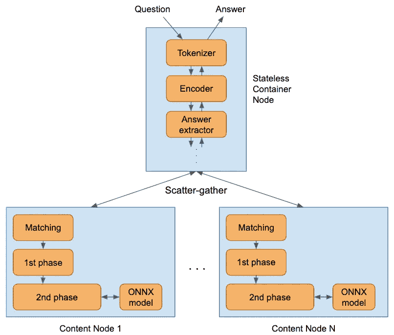
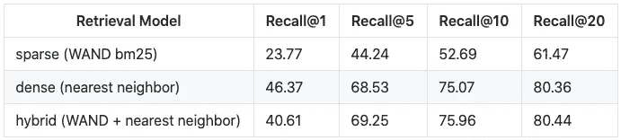
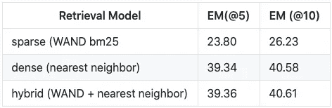

# Vespa.ai 上高效的开放领域问答

> 原文：<https://towardsdatascience.com/efficient-open-domain-question-answering-on-vespa-ai-72562121dcd8?source=collection_archive---------26----------------------->

开放领域问答已经成为衡量系统阅读、表现和检索一般知识能力的基准。基于检索的问答系统需要连接各种系统和服务，如 BM25 文本搜索、向量相似性搜索、NLP 模型服务、标记器和中间件，以将所有这些结合在一起。其中大部分是 Vespa.ai 的核心功能。在本帖中，我们在 Vespa.ai 上的一个可扩展的生产就绪应用程序中重现了基于检索的问答系统的最先进基线。

由[莱斯特·索尔巴肯](https://medium.com/u/344c89cb19cc?source=post_page-----72562121dcd8--------------------------------)和[乔·克里斯蒂安·贝古姆](https://medium.com/u/ec3f3ebbe4ae?source=post_page-----72562121dcd8--------------------------------)拍摄。


乔恩·泰森在 [Unsplash](https://unsplash.com?utm_source=medium&utm_medium=referral) 上的照片

# 介绍

科学进步的一些最有效的驱动力是基准。基准测试提供了一个共同的目标，一个目的，来提高每个人都可以使用的数据集的艺术水平。排行榜额外增加了竞争动机，提供了在同行中脱颖而出的机会。竞赛增加了激励研究人员实际完成工作的截止日期，而不是无休止地修补相关指标。

在机器学习领域，基准测试对于刺激创新和进步尤为重要。一项新的竞赛 NeurIPS 2020 高效开放域问答挑战赛，旨在推动问答系统的发展。这里的目标是开发一个能够回答问题而没有任何话题限制的系统。随着自然语言处理领域的最新进展，这一领域已经成为衡量系统阅读、表示和检索一般知识能力的基准。

当前基于检索的最新技术是[密集段落检索系统](https://github.com/facebookresearch/DPR)，如[开放领域问答论文密集段落检索](https://arxiv.org/abs/2004.04906)中所述。它由一组主要为研究开发的 python 脚本、工具和模型组成。在这样一个系统中有许多部分。其中包括两个基于 BERT 的模型，用于将文本编码为嵌入向量，另一个基于 BERT 的模型，用于提取答案，近似最近邻相似性搜索和基于文本的 BM25 方法，用于检索候选项、分词器等。将这样的系统投入生产并不容易。我们认为将这些不同的部分整合起来，并演示如何用 Vespa.ai 构建一个开放域问答服务系统，以达到最先进的准确性，这将是非常有趣的。

如果你不熟悉， [Vespa.ai](http://vespa.ai) 是一个针对大型数据集的低延迟计算引擎。它存储和索引您的数据，以便在服务时可以高效地执行对数据的查询、选择和处理。Vespa.ai 用于各种任务，如搜索、个性化、推荐、广告、[甚至寻找爱情](https://tech.okcupid.com/vespa-vs-elasticsearch/)，以及许多其他需要在查询时进行计算的应用。在任何给定时间，它每秒钟在全球范围内处理数十万个查询。

问答系统的大多数组件都是 Vespa 的核心功能。不久前，我们改进了 Vespa 对基于术语的检索和排名的文本搜索支持。我们最近添加了高效的近似最近邻，用于语义、密集向量召回。对于混合检索，Vespa 支持许多类型的机器学习模型，例如神经网络和决策森林。我们还改进了对 TensorFlow 和 PyTorch 模型的支持，以运行更大的 NLP 和 Transformer 模型。

这很有趣，因为虽然这在研究环境中有明显的好处，但这种系统的真正价值在于它们在应用中的最终用途。Vespa 被设计为高性能和可扩展的生产就绪系统。因此，它提供了在生产中部署的简化途径，而无需处理维护许多不同子系统的复杂性。这使得 Vespa 成为一个有吸引力的包装。

在这篇博文中，我们将谈到

*   语义密集向量检索的快速近似最近邻。
*   稀疏向量检索的基于术语(BM25)检索。
*   在 Vespa 中导入多个预训练的基于 BERT 的模型，用于编码嵌入向量和提取答案。
*   标记化和其他事情的定制逻辑。

有关更多详细信息，请参考[配套示例应用](https://github.com/vespa-engine/sample-apps/tree/master/dense-passage-retrieval-with-ann)。

这篇文章的目标是为[自然问题基准](https://www.mitpressjournals.org/doi/full/10.1162/tacl_a_00276)重新创建密集段落检索(DPR)论文结果。我们将首先对基于检索的问答系统如何在本文的上下文中工作进行高级概述。然后，我们将展示如何在没有任何外部服务或插件的情况下在 Vespa 上实现这一切，并重现该论文的最先进结果，该结果由给定一组问题的答案的精确匹配来衡量。我们将以对未来的展望和本系列的下一篇文章结束。

# 背景:基于检索的问答系统的剖析

自然问题基准由自然语言问题和答案组成。如何检索和表示回答问题所需的知识取决于每个系统。有两种主要的方法:检索和参数化。基于检索的系统使用搜索词或语义表示向量来回忆一组句子或段落，随后用机器学习模型进行评估以提取精确答案。参数系统将答案或多或少地直接存储在大型神经网络模型的权重中。也有对混合检索和参数化系统的研究，如[检索增强生成系统](https://arxiv.org/abs/2005.11401)，它最近从整体上提高了自然问题基准的艺术水平。我们将在这里关注基于检索的系统，但是将在以后的博客文章中探索参数化和混合的方法。

基于检索的问答系统通常将其“知识”存储在信息检索系统中。这可以是句子、段落或整个文档。这里我们将使用维基百科数据集，其中每一页被分成 100 个单词的段落。该数据集包含 2100 万个这样的段落。回答问题时，我们首先检索最有可能包含答案的段落。然后用机器学习模型对它们进行分析，以提取最有可能导致正确反应的跨度。这些阶段分别被称为“检索者”和“读者”。



从短文中提取答案。(*图片作者*)

## 寻回犬

检索器负责生成一组候选段落。由于后续阅读器组件的评估成本很高，因此拥有有效的检索机制至关重要。有两种主要的段落检索方法:基于术语的(稀疏的)如 BM25，和嵌入的(密集的)向量，每一种都有它们的优点和缺点。

**基于术语的(稀疏)检索**

基于术语的检索是经典的信息检索方法，涵盖了 TF-IDF 和 BM25 等算法。从概念上讲，文本由一个向量表示，其中每个维度代表词汇表中的一个术语。非零值表示它的存在。由于每个文本只包含词汇表中可能术语的子集，这些向量很大而且很稀疏。对于 TF-IDF 或 BM25，可以通过稀疏向量之间的点积来计算两个文本(例如，文档和查询)之间的相似性，其中对稀疏向量稍作修改(例如，术语重要性)。基于术语的方法依赖于倒排索引结构来进行有效的检索。在某些情况下，这可以通过 WAND 等算法进一步加速。

除了词汇化、词干提取和可能的停用词删除等预处理之外，术语与文本中找到的完全匹配。这可能是优点，也可能是缺点。对于非常突出的术语，例如姓名和地点，这大大缩小了搜索空间。然而，不包含确切术语的潜在相关文档将不会被检索到，除非使用查询扩展或相关技术。密集段落检索(DPR)论文使用 ElasticSearch 作为 BM25 的提供系统。

**基于嵌入(密集)的检索**

词汇表中潜在术语的数量可能非常巨大。嵌入向量背后的基本思想是将这个非常高维的稀疏向量压缩成一个非常小的密集向量，其中大多数维度包含非零值。这具有将查询或文档向量投射到低维空间的效果。可以这样做，使得几何上接近的向量在语义上也是接近的。DPR 的论文使用了两种 BERT 模型来编码文本:一种用于编码查询，另一种用于编码文档。在双塔配置中同时训练这两个模型，以最大化可能回答问题的段落的点积。

与稀疏表示相反，没有精确的方法来有效地找到最近的邻居。因此，我们在所谓的近似最近邻(ANN)中用准确性换取效率。已经提出了许多不同的人工神经网络搜索方法。有些与倒排索引结构兼容，因此它们可以很容易地在现有的信息检索系统中实现。例如 k-means 聚类、乘积量化(及其相关)和位置敏感散列，其中质心或桶可以被索引。与倒排索引不兼容的一种方法是 [HNSW](https://arxiv.org/abs/1603.09320) (分层可导航小世界)。HNSW 基于图结构，非常高效，并且有一个吸引人的特性，即图可以在运行时增量构建。这与大多数其他需要离线、面向批量索引构建的方法形成对比。

基于语义嵌入的检索很好地补充了基于术语的检索。语义相似的文档可以被召回，即使它们不包含完全相同的术语。与基于术语的检索的单词包方法不同，词序可以提供额外的上下文。然而，从历史上看，在问答问题上，基于术语的检索优于语义嵌入，但 DPR 的论文表明，如果编码经过专门训练，密集检索可以得到极大改善。DPR 的论文使用带有 HNSW 索引的 [FAISS 进行相似性搜索。](https://github.com/facebookresearch/faiss)

## 朗读者

虽然检索器组件的工作是产生一组候选段落，这些段落有希望包含问题的答案，但是阅读器提取这些段落的实际答案。这需要某种形式的自然语言理解模型，使用的就是 BERT(或其他 Transformer)模型。这些模型通常很大，评估起来很昂贵，所以只有少量的候选段落通过它们。

转换器模型将令牌序列作为输入。文本的标记化可以通过几种不同的方式来平衡词汇大小和序列长度。由于 BERT 模型的完全注意机制，评估时间随着序列长度的增加而二次增加。因此，必须找到一个合理的平衡，基于 BERT 的模型使用一个单词块或类似的算法将不常用的单词分成子单词。

读者模型的输入是表示问题、文档标题和段落本身的标记的串联。该模型查找每个标记的嵌入表示，并通过一系列层，为每个标记产生新的表示。这些表示可以用于不同的任务。对于问答，添加了一个附加层来计算三个必要的输出:文章与问题的相关性，以及答案的开始和结束索引。



回答问题的伯特(*图片作者*

为了提取最终答案，使用产生最大相关性分数的段落。该模型的另外两个输出是每个标记成为开始标记和结束标记的概率。通过找到开始概率和结束概率之和最大的区间来选择最终答案。这会产生一个标记序列，在返回之前，标记器必须将其转换为单词。DPR 论文[使用基于 BERT 的模型](https://huggingface.co/transformers/model_doc/dpr.html#dprreader)来输出跨度预测。

## 把这些放在一起

如上所述的基于检索的问答系统，能够进行基于术语和基于嵌入的检索，至少需要以下组件:

*   BM25 信息检索系统存储了 2100 万条维基百科文本。
*   存储段落嵌入向量的高效向量相似性搜索系统。
*   一个模型服务系统，用于三种不同的基于 BERT 的模型:查询编码器、文档编码器和读者模型。
*   一个基于 BERT 的标记器。
*   中间件将这一切粘合在一起。

记号赋予器为文本生成记号序列。这些令牌被存储以供在读取器模型中使用。它们还被用在基于 BERT 的文档编码器模型中，以创建用于密集检索的嵌入向量。为了快速检索，需要对文本和嵌入向量进行索引。

每个查询都遵循类似的过程。记号赋予器产生一个记号序列，用来在基于查询 BERT 的编码器中产生一个嵌入向量。第一阶段，检索，是使用基于术语的检索或基于嵌入的检索来完成的。前 N 篇文章被传递给读者模型并相应地排序。分析最佳段落以提取包含答案的最佳跨度。

这是实现问答系统需要设置的一系列服务。在下一节中，我们将展示如何在一个 Vespa 应用中实现所有这些功能。

# 在 Vespa 上复制基线

上面提到的大部分组件都成为了 Vespa 中的核心功能。在下文中，我们将介绍如何在 Vespa 中进行设置。详情可参见[配套示例应用](https://github.com/vespa-engine/sample-apps/tree/master/dense-passage-retrieval-with-ann)。

## (计划或理论的)纲要

使用 Vespa 创建应用程序时，通常从文档模式开始。该模式包含每个文档应该存储哪些数据的定义。在我们的例子中，每个文档都是维基百科数据集中的一段。因此，我们建立了一个模式，允许我们已经讨论过的不同检索方法:

*   **稀疏检索**使用传统的 BM25 基于术语的检索。
*   **密集检索**使用经过训练的模型编码的矢量表示。
*   **混合检索**使用上述的组合。

我们在一个文档模式中设置了所有这些:

```
schema wiki {
  document wiki { field title type string {
      indexing: summary | index
    } field text type string {
      indexing: summary | index
    } field title_token_ids type tensor(d0[256]) {
      indexing: summary | attribute
    } field text_token_ids type tensor(d0[256]) {
      indexing: summary | attribute
    } field text_embedding type tensor(x[769]) {
      indexing: attribute | index  
      attribute {
        distance-metric: euclidean
      }
    }
  }
}
```

这里，每个段落的标题和文本内容都由一个字符串和一个令牌序列字段表示。字符串字段被索引以支持 BM25 并支持 WAND 以加速检索。令牌序列被表示为张量，并被用作阅读器模型的输入。

标题和文本的嵌入向量被预先计算并存储为张量。该向量用于密集检索，因此我们[在该字段上启用 HNSW 索引](https://docs.vespa.ai/documentation/approximate-nn-hnsw.html)用于近似最近邻匹配。Vespa 一个很好看的特点就是 HNSW 索引不是离线预建的；它是随着数据被索引而在线构建的。这使得应用程序能够对输入系统的新数据做出更快的响应。

## 检索和排序

其中，Vespa 中的查询定义了 Vespa 应该如何召回文档(称为匹配阶段)以及 Vespa 应该如何对文档进行评分(称为排序阶段)。Vespa 提供了[丰富的查询 API](https://docs.vespa.ai/documentation/query-api.html) ，其中查询是用[Vespa YQL 语言](https://docs.vespa.ai/documentation/reference/query-language-reference.html)指定的。由于不同的检索策略(基于术语的和基于嵌入的)具有不同的查询语法，我们构建了一个定制的搜索器组件，它允许我们构建一个统一的搜索界面，并且只将实际的问题和检索策略作为参数传递。这简化了方法之间的比较。

检索策略在回忆内容和评分方式上都有所不同。在 Vespa 中，使用在文档模式中配置的等级表达式来表示得分。Vespa 支持[多阶段排名](https://docs.vespa.ai/documentation/phased-ranking.html)，我们在这里利用了这一点，因此第一阶段代表检索者，第二阶段代表读者。我们设置了第一阶段的等级配置文件，如下所示:

```
rank-profile sparse inherits openqa {
  first-phase {
    expression: bm25(text) + bm25(title)
  }
}
rank-profile dense inherits openqa {
  first-phase {
    expression: closeness(field, text_embedding)
  }
}
rank-profile hybrid inherits openqa {
  first-phase {
    expression: 1000*closeness(field, text_embedding) + bm25(text) + bm25(title)
  }
}
```

这里，我们设置了三个排序配置文件，一个用于稀疏检索，一个用于密集检索，一个用于混合检索。稀疏排名简档使用针对查询的标题和文本字段的 BM25 分数作为评分函数。密集简档使用*接近度*，例如查询和文档嵌入字段之间的欧几里德距离。混合概要文件是一个将两者结合起来进行混合检索的例子。第一阶段代表取回者。

对于读者模型，我们设置了基本配置文件 *openqa* ，它引入了检索策略之间的第二个共同阶段:

```
onnx-model reader {
  file: files/reader.onnx
  input  input_ids: input_ids
  input  attention_mask: attention_mask
  output output_0: start_logits
  output output_1: end_logits
  output output_2: relevance_logits  
}rank-profile openqa {
  second-phase {
    rerank-count: 10
    expression: onnxModel(reader).relevance_logits
  }
  summary-features {
    onnxModel(reader).start_logits
    onnxModel(reader).end_logits
  }
}
```

这里，前 10 个文档由 reader 模型重新排序，这是 onnxModel rank 特性定义的。我们使用的实际模型是 DPR 团队在 HuggingFace 的模型库上发布的预训练模型。HuggingFace 发布了一款优秀的[变压器模型导出](https://huggingface.co/transformers/serialization.html)，可以轻松将变压器模型(从 PyTorch 或 TensorFlow)导出为 [ONNX 格式](https://onnx.ai/)。在将模型导出到 ONNX 之后，我们可以将模型文件放在应用程序包中，并配置它在文档模式中的使用，如上所示。为了达到这个规模，Vespa 将这个模型分发到集群中的所有内容节点。因此，在排序期间，在内容节点上评估模型，避免将数据传输到外部模型服务。

读者模型有三个输出，其中 *relevance_logits* 输出用于评分。另外两个分别表示每个记号作为问题最终答案的开始或结束记号的概率。这些由定制的搜索器拾取，并且这些字段代表的实际跨度在那里被提取。

该应用程序包含一个额外的模型，即用于在运行时为查询生成嵌入向量的[问题编码器模型](https://huggingface.co/facebook/dpr-question_encoder-single-nq-base)。来自维基百科数据集的预先计算的文档嵌入由脸书研究所发布。我们直接使用这些嵌入。

## Vespa 容器中间件——将所有这些放在一起

该应用程序具有以下在 Vespa 容器中作为 Java 实现的自定义插件:

*   一个 BERT 记号赋予器组件，负责从文本中生成 BERT 记号序列。
*   一种在索引过程中使用 BERT 符号化的定制文件处理程序。
*   一个定制的搜索器，为调用 BERT 问题编码器模型的查询检索嵌入表示。
*   控制检索逻辑的自定义搜索器(例如，稀疏、密集或混合)。
*   一个自定义搜索器，它读取阅读器模型的输出，提取最匹配的答案范围，并将该令牌序列转换为返回给用户的实际文本。

结果是一个服务，它接受一个文本问题并返回预测的答案，所有这些都在一个 Vespa 应用程序中。



数据和对数据的计算(例如 ML 模型评估)被分布到所有内容节点。自定义处理发生在无状态容器上。(*图片作者*)

# 结果

我们在这个应用程序中使用的基准是自然问题数据集。本节中的所有实验都是通过查询 Vespa 实例并检查黄金参考答案的预测答案来运行的。

**寻回犬准确度总结**

我们使用 Recall@position 作为检索者的主要评估指标。寻回犬的明显目标是在尽可能低的位置获得尽可能高的回忆。由于使用基于 BERT 的阅读器对最终的顶级段落进行重新排序，因此我们需要评估的段落越少，运行时间复杂度和性能就越好。

下表总结了使用开放领域问答任务的自然问题中的原始 3610 个 dev 问题的检索器准确性( [NQ-open.dev.jsonl](https://github.com/google-research-datasets/natural-questions/blob/master/nq_open/NQ-open.dev.jsonl) )。



检索准确性

DPR 论文报告召回 79.4 的@20，因此我们的结果与他们报告的密集检索方法的结果一致。我们将这种细微的差异归因于 HNSW 指数的不同设置。

**阅读器准确度总结**

我们使用精确匹配(EM)指标来评估阅读器的准确性。精确匹配指标衡量与任何一个基本事实答案精确匹配的预测的百分比。要使查询的 EM 分数为 1，答案预测必须与数据集中给出的最佳答案完全匹配。这很有挑战性。例如，“最后一次登月是什么时候？”有黄金答案“1972 年 12 月 14 日 UTC”或“1972 年 12 月”，预测答案“1972 年 12 月 14 日”将被评分为 0。

结果与上面的数据集相同，检索器对前 10 个结果进行了重新排序:



阅读器准确度

以上结果重现了 DPR 论文的结果，该论文是基于检索的系统的当前技术状态。

# 进一步的工作

在这篇博文中，我们一直专注于在 Vespa 的一个实例中重现 DPR 论文的结果。在本系列的下一部分中，我们将介绍一个更复杂的混合模型，并展示如何使用其他模型类型来提高准确性。我们将发表另一篇文章，讨论如何将总系统延迟降低到更合理的水平，同时衡量这对准确性的影响。

敬请期待！