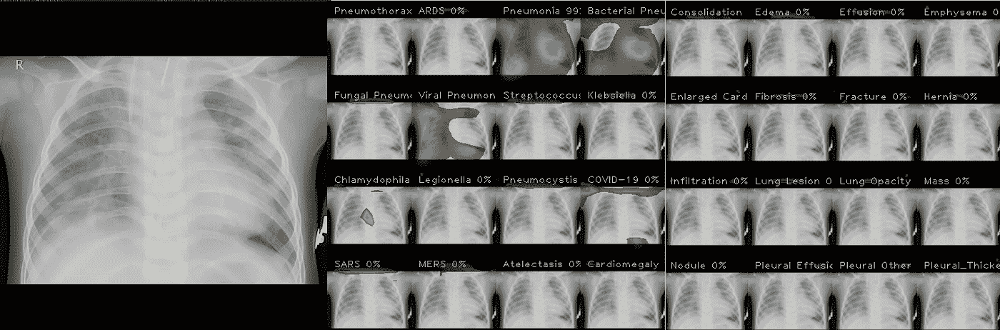
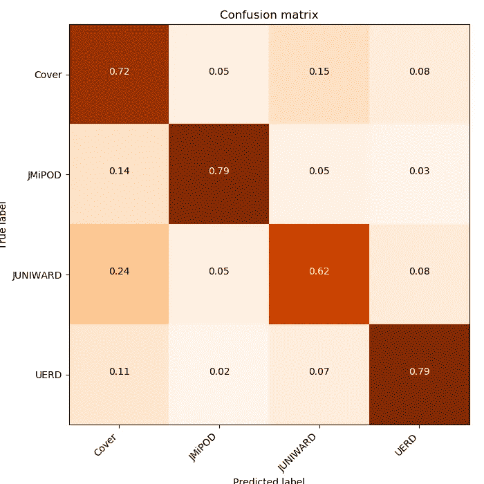
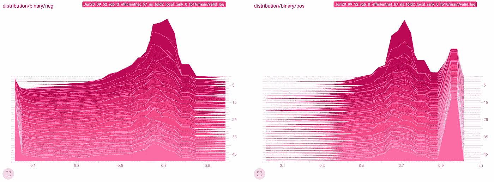
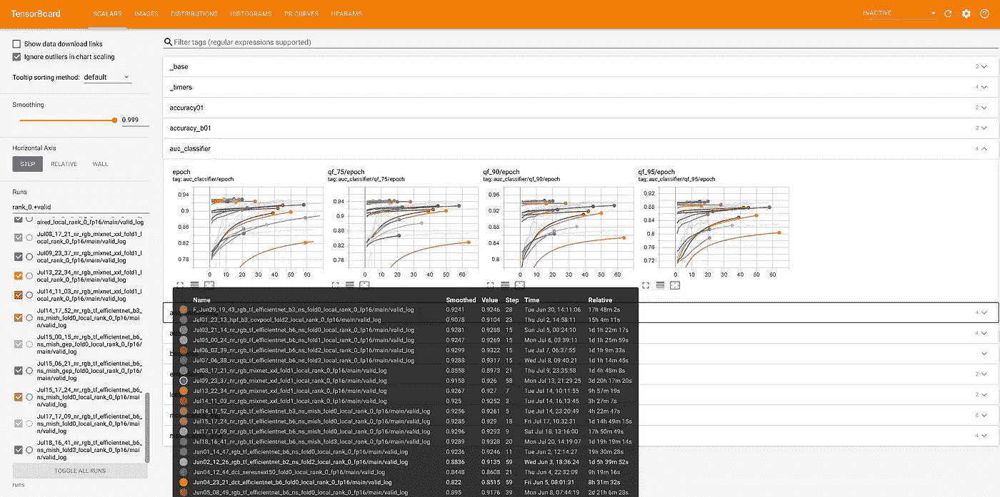
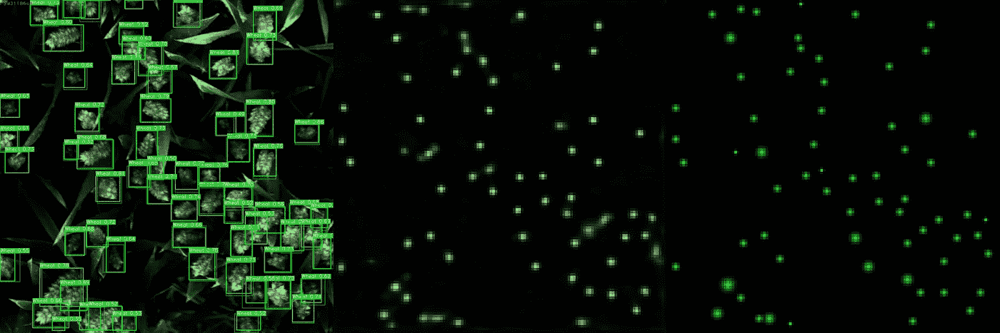
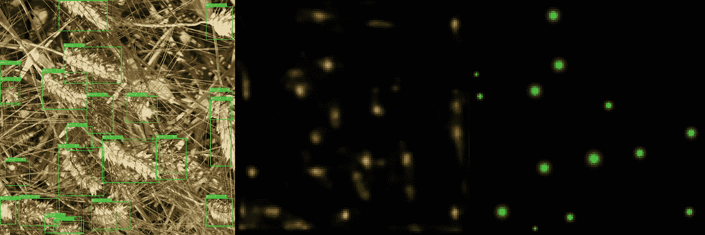
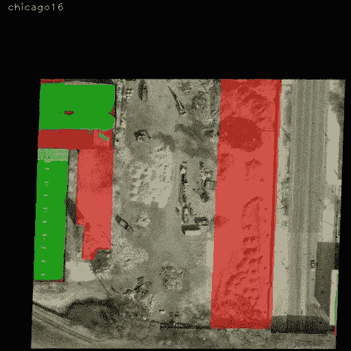

# 高效 py torch——增压培训管道

> 原文：<https://towardsdatascience.com/efficient-pytorch-supercharging-training-pipeline-19a26265adae?source=collection_archive---------23----------------------->

## 为什么只报告你的模型的最高精度通常是不够的。

将你的 train.py 脚本转化为具有一些额外特性的强大管道(照片由 [Nur Faizin](https://unsplash.com/@stripdua?utm_source=medium&utm_medium=referral) 在 [Unsplash](https://unsplash.com?utm_source=medium&utm_medium=referral) 上拍摄)

每一个深度学习项目的最终目标都是为产品带来价值。当然，我们希望有最好的模型。什么是“最好的”——取决于特定的用例，我将在这篇文章中不讨论这个问题。我想谈谈如何从您的 ***train.py*** 脚本中获得最大收益。

## 在本帖中，我们将介绍以下技巧:

1.  相反，高级框架自己制造了训练循环
2.  使用其他指标监控培训进度
3.  使用张量板
4.  可视化模型的预测
5.  使用 Dict 作为数据集和模型的返回值
6.  检测异常并解决数值不稳定性

> **免责声明**:在下一节中，我将包括一些源代码清单。它们中的大多数是为 [Catalyst](https://github.com/catalyst-team/catalyst) 框架(版本 20.08)定制的，并且在 [pytorch-toolbelt](https://github.com/BloodAxe/pytorch-toolbelt) 中可用。

# 不要重新发明轮子

照片由[科尔特·奥姆斯特德](https://unsplash.com/@colterolmstead?utm_source=medium&utm_medium=referral)在 [Unsplash](https://unsplash.com?utm_source=medium&utm_medium=referral) 上拍摄

> **建议 1 —利用 PyTorch 生态系统的高级培训框架**

PyTorch 在从头开始编写训练循环时提供了极好的灵活性和自由度。理论上，这为编写任何训练逻辑提供了无限的可能性。在实践中，你很少会为训练 CycleGAN、提取 BERT 或从头实现 3D 对象检测编写奇异的训练循环。

从头开始编写一个完整的训练循环是学习 PyTorch 基础知识的极好方法。然而，我强烈建议，一旦你有所领悟，就转向高级框架。选项很多:[触媒](https://github.com/catalyst-team/catalyst)、 [PyTorch-Lightning](https://github.com/PyTorchLightning/pytorch-lightning) 、 [Fast。AI](https://github.com/fastai/fastai) 、[点燃](https://pytorch.org/ignite/)、[其他](https://pytorch.org/ecosystem/)。高级库通过以下方式节省您的时间:

*   提供久经考验的训练循环
*   支持配置文件
*   支持多 GPU 和分布式训练
*   检查点/实验的管理
*   自动记录培训进度

从这些高级库中获取最大价值需要一些时间。然而，这种一次性投资从长远来看是值得的。

**优点**

*   训练管道变得更小——代码越少——出现错误的机会就越少。
*   更简单的实验管理。
*   简化的分布式和混合精度训练

**缺点**

*   另一个抽象层次——通常，当使用高级框架时，我们必须在特定框架的设计原则和范例内编写代码。
*   时间投资—学习额外的框架需要时间。

# 给我看看指标

由 [Mikail McVerry](https://unsplash.com/@mcverry?utm_source=medium&utm_medium=referral) 在 [Unsplash](https://unsplash.com?utm_source=medium&utm_medium=referral) 上拍摄的照片

> **建议 2——在培训期间查看其他指标**

在 MNIST、CIFAR 甚至 ImageNet 中，几乎每一个用于图像分类的快速入门示例项目都有一个共同点——它们在培训期间和培训之后报告一组最少的指标。最常见的是前 1 名和前 5 名的准确性、错误率、训练/验证损失，仅此而已。虽然这些指标是必不可少的，但这只是冰山一角！

**现代图像分类模型有数千万个参数。你想只用一个标量值来计算它吗？**

具有最佳 Top-1 准确度的 CNN 分类模型在泛化方面可能不是最佳的。根据您的领域和要求，您可能希望保存假阳性/假阴性率最低的模型或平均精度最高的模型。

让我给你一些建议，在培训期间你可以记录哪些数据:

*   Grad-CAM 热图——查看图像的哪些部分对特定类别的贡献最大。

可视化 Grad-CAM 热图有助于识别模型制作预测是基于真实的病理还是图像伪影(尤金·赫韦德钦亚)

*   **混淆矩阵**——向你展示哪一对职业对你的模型最具挑战性。

混淆矩阵揭示了模型对特定类型做出错误分类的频率(Eugene Khvedchenya，ALASKA2 Image Steganalysis，Kaggle)。

*   **预测分布**——让您洞察最佳决策边界。

该模型的负面和正面预测的分布显示，有很大一部分数据该模型无法以置信界限进行分类(Eugene Khvedchenya，ALASKA2 Image Steganalysis，Kaggle)。

*   **所有层的最小/平均/最大**梯度值——允许识别模型中是否有消失/爆炸梯度或初始化不良的层。

# 使用仪表板工具监控培训

> **建议 3——使用 TensorBoard 或任何其他解决方案来监控训练进度**

在训练模型时，您最不想做的事情可能就是查看控制台输出。一个功能强大的仪表盘可以让你一次看到所有的指标，这是一种更有效的检查培训结果的方式。

Tensorboard 允许在本地快速检查和比较您的跑步记录(Eugene Khvedchenya)

对于少量实验和非分布式环境，TensorBoard 是金标准。从版本 1.3 开始，PyTorch 完全支持它，并提供了一组丰富的功能来管理试验。还有更先进的基于云的解决方案，如[Weights&bias](https://www.wandb.com/)、 [Alchemy](https://github.com/catalyst-team/alchemy) 和 [TensorBoard.dev](http://TensorBoard.dev) ，这使得在多台机器上监控和比较训练课程变得更加容易。

使用 Tensorboard 时，我通常会记录一组指标:

*   学习率和其他可能改变的优化参数(动量、重量衰减等)。)
*   花费在数据预处理和模型内部的时间
*   跨训练和验证的损失(每批和每个时期的平均值)
*   跨培训和验证的指标
*   最终度量值的训练会话的超参数
*   混淆矩阵、精密度-召回曲线、AUC(如果适用)
*   模型预测的可视化(如果适用)

# 一幅画胜过千言万语

直观地看模型的预测是超级重要的。有时候训练数据是有噪音的；有时，模型会过度拟合图像的伪影。通过可视化最佳和最差批次(基于损失或您感兴趣的度量)，您可以获得对模型表现良好和较差的情况的宝贵见解。

> **建议 5 —可视化每个时期的最佳和最差批次。它可能会给你宝贵的洞察力**

**Catalyst 用户提示**:此处使用可视化回调 I 示例:[https://github . com/blood axe/Catalyst-Inria-Segmentation-Example/blob/master/fit _ predict . py # L258](https://github.com/BloodAxe/Catalyst-Inria-Segmentation-Example/blob/master/fit_predict.py#L258)

例如，在[全球小麦检测](https://www.kaggle.com/c/global-wheat-detection)挑战中，我们需要检测图像上的麦穗。通过可视化最佳批次的图片(基于地图度量)，我们看到该模型在查找小对象方面做得近乎完美。

最佳模型预测的可视化揭示了模型在小对象上表现良好(Eugene Khvedchenya，Global Wheat Detection，Kaggle)

相比之下，当我们看最差批次的第一个样本时，我们看到该模型很难对大型物体做出准确的预测。可视化分析为任何数据科学家提供了宝贵的见解。

最差模型预测的可视化揭示了模型在大型对象上表现不佳(Eugene Khvedchenya，Global Wheat Detection，Kaggle)

查看最差批次也有助于发现数据标签中的错误。通常，标签错误的样品损失更大，因此会出现在最差的批次中。通过在每个时期对最差批次进行目视检查，您可以消除这些错误:

标签错误的例子。绿色像素表示真阳性，红色像素表示假阴性。在此示例中，地面实况掩膜在实际上不存在的位置有一个建筑物覆盖区。(Eugene Khvedchenya，Inria 航空影像标注数据集)

# 使用`Dict`作为数据集和模型的返回值

> **建议 4 —如果您的模型返回多个值，请使用** `***Dict***` **返回结果。不要用** `***tuple***` **。**

在复杂模型中，返回多个输出并不少见。例如，对象检测模型通常会返回包围盒及其标签，在图像分割 CNN-s 中，我们经常会返回中间遮罩以进行深度监督，多任务学习目前也很流行。

在许多开源实现中，我经常看到这样的情况:

**出于对作者的尊重，我认为这是一种从模型**返回结果的非常糟糕的方法。**以下是我推荐使用的替代方式**:

这个建议与“Python 之禅”中的一个假设有点共鸣——“显式比隐式好”**。遵循这条规则将会使你的代码更加整洁和易于维护。**

那么，为什么我认为第二种选择更好呢？出于几个原因:

*   返回值有一个与之相关联的显式名称。您不需要记住元组中元素的确切顺序
*   如果需要访问返回的字典中的特定元素，可以通过它的名称来实现
*   从模型中添加新的输出不会破坏代码

使用`Dict`,你甚至可以改变模型的行为，根据需要返回额外的输出。例如，这里有一小段代码演示了如何为度量学习返回多个“主要”输出和两个“辅助”输出:

同样的建议也适用于数据集类。对于 Cifar-10 toy 示例，可以将图像及其对应的标签作为元组返回。但是在处理多任务或多输入模型时，您希望以 Dict 类型从数据集中返回样本:

当您的代码中有字典时，您可以在任何地方引用带有名称常量的输入/输出。遵循这条规则将使你的培训渠道非常清晰，易于遵循:

# 检测训练中的异常

就像人类可以阅读其中有许多错误的文本一样，深度学习模型也可以在训练管道中出现错误时学习“一些合理的东西”。作为开发人员，您负责搜索异常，并对它们的出现进行推理。(照片由[布雷特·乔丹](https://unsplash.com/@brett_jordan?utm_source=medium&utm_medium=referral)在 [Unsplash](https://unsplash.com?utm_source=medium&utm_medium=referral) 上拍摄)

> **建议 5 —使用** `***torch.autograd.detect_anomaly()***` **在训练过程中查找算术异常**

如果你在培训过程中看到损失/指标中有任何 nan 或 Inf，你的脑海中应该响起警报。这表明您的管道出现了问题。通常，它可能由以下原因引起:

*   模型或特定层的初始化错误(你总是可以通过查看梯度大小来检查是哪些)
*   数学上不正确的运算(`torch.sqrt()`从负数，`torch.log()`从非正数，等等)。)
*   `torch.mean()`和`torch.sum()`归约使用不当(零大小张量上的均值会给出 nan，大张量上的求和容易导致溢出)
*   在损失中使用`x.sigmoid()`(如果你需要损失函数中的概率，更好的方法是使用`x.sigmoid().clamp(eps,1-eps`或`torch.logsigmoid(x).exp()`来防止梯度消失)
*   Adam 类优化器中的低ε值
*   使用 fp16 训练时不使用动态损耗缩放

为了在代码中找到 Nan/Inf 第一次出现的确切位置，PyTorch 提供了一个易于使用的方法**torch . autograded . detect _ anomaly()**:

将其用于调试目的，否则禁用，因为**异常检测会带来计算开销，并使训练循环变慢约 10–15%**。

# 结束了

感谢阅读！我希望你喜欢它，并从这篇文章中找到一些外卖。你想分享什么技巧和诀窍？请在评论中写下你的诀窍，或者如果你对 PyTorch 相关的特定主题感兴趣，也请告诉我！

Eugene 是一名计算机视觉和机器学习工程师，拥有十多年的软件开发经验。《[掌握 OpenCV 用于实用计算机视觉项目](https://www.amazon.com/Mastering-OpenCV-Practical-Computer-Projects/dp/1849517827/ref=sr_1_2?dchild=1&keywords=Mastering+OpenCV+for+practical&qid=1591877326&sr=8-2)》一书的作者。卡格尔[主人](https://www.kaggle.com/bloodaxe)。[白蛋白](https://github.com/albumentations-team/albumentations)核心团队成员。pytorch [-toolbelt](https://github.com/BloodAxe/pytorch-toolbelt) 的作者。OpenCV、PyTorch 和 Catalyst contributor。[https://www.linkedin.com/in/cvtalks/](https://www.linkedin.com/in/cvtalks/)