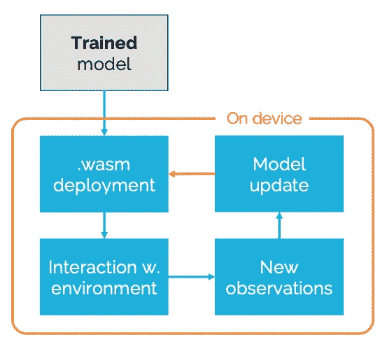

# 边缘高效强化学习

> 原文：<https://towardsdatascience.com/efficient-reinforcement-learning-on-the-edge-331afa979a30?source=collection_archive---------50----------------------->

图片作者。

## 借助正交持久性，我们可以在边缘设备上实现顺序学习

[在之前的帖子](/exploiting-the-differences-between-model-training-and-prediction-40f087e52923)中，我们已经展示了如何利用模型训练(*即*需要所有数据，通常需要多次通过数据集)和预测(*即*基于具有预训练参数的单个函数)之间的差异，来有效地部署机器学习(ML)和人工智能(AI)模型。[通过将训练好的模型传输到 WebAssembly](/why-would-you-use-webassembly-to-put-scikit-learn-in-the-browser-77671e8718d6) ，可以将受监督和不受监督的模型高效地部署到云和边缘设备。[我们已经能够在可用内存小于 64Kb 的设备上部署模型。相当酷。然而，我们经常被问到如何有效地更新模型(T10)(最好是本地更新模型(T11)):在边缘设备上更新模型(T14)状态的简单方法(T15)将允许有效的顺序学习和强化学习应用。](https://www.scailable.net/edge/)

> 在边缘设备本身上更新模型*状态的简单方法将允许高效的顺序学习和强化学习应用。*

在这篇文章中，我们将解释如何使用正交持久性来更新 WebAssembly 二进制文件的状态，以实现这样的功能。我们将首先解释模型更新的概念(ML/AI)视图，然后关注 WebAssembly 中的实现。最后，我们将讨论正交持久性提供的可能性。

# 更新模型的状态

正如我们之前所描述的，经过训练后，[大多数机器学习模型由一个简单的(尽管通常是高维的)数学函数和一组参数组成](/exploiting-the-differences-between-model-training-and-prediction-40f087e52923)。例如，在神经网络中，所涉及的权重矩阵的条目构成了通过训练模型获得的*参数*。有点抽象地说，在训练之后，我们可以将模型定义为一个函数 *f()* ，它将输入 *x* 映射到(预期的)输出 *y* 。我们可以明确说明，函数的行为取决于参数的状态*:*

**y = f(x；****S1****)**

*其中*将包含(例如)所有必需的权重。**

**在许多情况下，能够随时间更新状态 ***S1*** 是有用的。当(*例如*)存在[概念漂移](/concept-drift-can-ruin-your-model-performance-and-how-to-address-it-dff08f97e29b)并且模型的性能随时间下降时，或者当部署到边缘设备的模型需要更新以反映本地情况时，这可能是有用的。在这种情况下(以及更多情况，参见我们下面的讨论)，将*更新为*—*即*所涉及参数的新状态会很有用，而不会有太多麻烦。此外，当部署模型时，应该维护其更新的状态:*即*当在边缘设备上运行时，更新的模型应该*保持*。****

**虽然概念上很简单——我们只是将新状态 ***S2*** 存储在某个地方——但是当使用 WebAssembly 部署模型时，在边缘设备上高效地实现持久状态更改有些棘手。然而这是很有可能的。**

> **虽然在概念上很容易，但在边缘设备上有效实现持久状态改变在实践中往往很棘手。然而这是很有可能的。**

# **更新 WebAssembly 二进制文件的状态**

**我们通常使用 WebAssembly 将模型部署到[边缘设备。当考虑这种模型的持续更新时，对所涉及的一般过程有一个合理的理解是有用的:](https://www.scailable.net/edge)**

1.  **我们部署 WebAssembly 二进制文件——它有效地包含了 *f(。；***)*—去边设备。这些二进制文件存储在设备的“磁盘”上，包括它们的状态*。****
2.  ***边缘设备包含一个 WebAssembly *运行时*，这是一个应用程序，它加载二进制文件并将其所谓的`data section` ( [参见本文以获得关于 WebAssembly 二进制文件](https://rsms.me/wasm-intro)的更多信息)写入其(线性)内存:这个`data section`通常用于存储模型的状态*。运行时确保在边缘设备上执行预测(在我们的例子中，当。WASM 二进制被称为，见本教程)。****

***一般来说，在 WebAssembly 二进制文件之间来回传输数据是相对容易的:我们通常在传递一个指向内存中存储(*例如*)特征向量的位置的指针时这样做(详见[本教程](https://github.com/scailable/sclbl-tutorials/tree/master/sclbl-create-your-own-wasm)—特征向量是*y = f(x；****S****)*以上符号介绍)。然而，传递一个持续的新状态 ***S*** 要棘手得多:不允许*直接向现有的`data section`写入，这样做也不能确保它在磁盘上的持久性。****

**我们通过向所有需要持久更新的 WebAssembly 二进制文件中自动添加一个新的`custom data section`有效地解决了这个问题。这个`custom data section` 在功能上与标准的 WebAssembly 数据部分相同，只是这次它可以被更新:我们将一个导出的`update()`函数添加到已部署的。WASM 二进制文件，包含对模型状态进行任何更新所需的逻辑。因此，我们现在可以将状态从 **S1** 更新到 **S2** 以确保模型的更新。**

**然而，简单地更新线性存储器中的状态对于持久性来说是不够的；我们需要确保状态的任何变化也反映在磁盘上(*即*当打开和关闭设备时，我们希望 ***S2*** 被保留)。这是通过扩展标准 WebAssembly 运行时来解决的:我们的 edge 运行时主动监控线性内存中的状态 ***S*** 。当它改变时，运行时会在磁盘上覆盖所涉及的 WebAssembly 二进制文件的`custom data section`。因此，我们现在有了一个新的、持久的状态。**

**因此，通过扩展 WebAssembly 的数据结构*和默认运行时*，有可能在边缘上允许 ML/AI 模型的高效持久更新。**

> **因此，通过扩展 WebAssembly 的数据结构*和默认运行时*，有可能允许边缘上的 ML/AI 模型的高效持久更新。**

# **持久状态更新的可能性**

**我们已经描绘了一些场景，在这些场景中，对已部署的 WebAssembly 二进制文件进行(本地)更新可能是有意义的:在概念漂移或本地变化的情况下，使用新的状态*不时地更新已部署的模型可能是有用的。然而，快速和持久的更新允许更丰富的应用程序:***

*   ***模型状态的快速和持久更新允许边缘设备上的模型的[顺序学习。例如，当模型可以用](https://link.springer.com/article/10.1007/s11336-018-09656-z)[求和形式](https://papers.nips.cc/paper/3150-map-reduce-for-machine-learning-on-multicore.pdf)来表达时，部署的模型可以很容易地用每个新的(标记的)可用数据点来更新。***
*   ***模型状态的快速和持久更新允许在边缘设备上进行强化学习(从而将独立的 WebAssembly 部署扩展到受监督和不受监督的模型之外)。例如，可以使用`predict()`和`update()`函数迭代地实现[多武装强盗策略](https://journals.sagepub.com/doi/pdf/10.1177/2158244019851675)(并添加一些主动探索)。***

***我们将很快向我们的 [WebAssembly Javascript 运行时](https://github.com/scailable/sclbl-webnode)添加持久更新，从而让您看到在此设置中“运行时覆盖到磁盘”的实际实现。然而，我们希望在上面的帖子中已经提供了一个有价值的方法草图。***

# ***放弃***

****值得注意的是我自己的参与:我是 Jheronimus 数据科学院* [*的数据科学教授，也是*](https://www.jads.nl/)[*Scailable*](https://www.scailable.net/)*的联合创始人之一。因此，毫无疑问，我对 Scailable 有既得利益；我有兴趣让它成长，这样我们就可以最终将人工智能投入生产并兑现它的承诺。这里表达的观点是我自己的。****