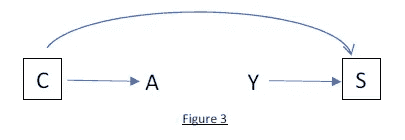

# 数据科学中的因果推理:有效的抽样框架和设计

> 原文：<https://towardsdatascience.com/efficient-sampling-frameworks-in-causal-inference-data-science-52ad44e15f48?source=collection_archive---------22----------------------->

## [实践教程](https://towardsdatascience.com/tagged/hands-on-tutorials)

## 病例对照设计:数学推导、解释、计算模拟和消除误解

照片由[奥斯卡诺德](https://unsplash.com/@furbee?utm_source=medium&utm_medium=referral)在 [Unsplash](https://unsplash.com?utm_source=medium&utm_medium=referral) 上拍摄

# 1:背景和动机

当应用因果推断方法时，特别是在非随机环境中，病例对照设计家族是一个强有力的工具。它们是一个有效的抽样框架，用于恢复因果效应的无偏估计，这些估计可以从一个完整的队列研究中恢复，而无需实际进行所述队列研究。

像几乎所有的因果推断方法一样，病例对照设计最初是在医学和公共卫生相关领域发展起来的；这些设计范例中的许多语言和术语反映了这一事实。然而，这些都是强大的方法，可以(并且更普遍地)在任何对恢复非随机化设置中因果效应的无偏估计感兴趣的领域中利用，感兴趣的从业者包括统计学家、数据科学家和机器学习从业者。

让我们指定下面的玩具例子。我们希望在非随机化设置中恢复二元干预*对二元结果*的因果效应的无偏估计。下图显示了我们框架的一个因果 DAG 在 ***A*** 对*Y*C*无因果效应的空值下。如果这是一项队列研究，我们可以使用标准方法对 ***C*** 进行调整，并恢复*A*Y 的因果效应的无偏估计。*****

******

***作者图片***

***然而，假设为这个队列中的每个观察收集数据非常昂贵或耗时？相反，我们只想获取一小部分观察数据用于我们的分析。而如果二元结局 ***Y*** 高度不平衡，其中 ***Y=1*** 只代表队列人群的一小部分比例呢？因此，简单地对整个队列进行边际随机抽样是不可行的。与传统的机器学习不同，在传统的机器学习中，我们只关心预测，我们不能以优化我们预测目标的能力的方式方便地“平衡”我们的数据集；这可能极大地扭曲了*和 ***Y*** 之间的经验关系，使得恢复 ***A*** 对 ***Y*** 的因果效应的无偏估计变得不可能。****

**那么，有没有一种有效的方法(或一系列方法)可以用来有效地对我们的队列进行抽样，进行分析，并且仍然能够恢复我们感兴趣的因果效应的无偏估计？答案是肯定的。使用病例对照设计家族，我们在分析中包括病例和对照的有效取样部分；但是我们这样做的方式仍然允许我们无偏地估计利息的因果效应。**

**作为一个在使用这些范例方面受过良好训练的人，我发现与其他方法相比，关于这些方法的教育材料和资源很缺乏。围绕这些方法还有一些常见的误解和困惑。我的目标是这篇文章有助于缓解这些挑战。**

**这篇文章的内容如下:**

****

**作者图片**

**所以让我们开始吧。**

# **2:5 个病例对照范例的详细示例**

**为了便于说明，让我们指定一个简化的玩具示例。假设我们有一个利益的二元干预*和利益的二元结果*。在我们的玩具示例中，我们的群组中总共有 13 个人。所有个体在随访开始时都以结果 ***Y=0*** 开始。每个人都被随访一段可变的时间，总共有 3 个人在随访结束时经历了结果 ***Y=1*** 。这 3 个人是观察值 7、9 和 13，在下图中用圆圈标记。我对这 3 个观察结果进行了不同的颜色编码，稍后会变得清晰。****

****

**作者图片**

**需要记住几个关键点:**

*   **在下面的 13 个观测值中，一些有二元干涉 ***A=0*** ，其余的有 ***A=1*** 。考虑到我们将对独立于干预状态的控制进行采样，我特意没有在下图中标出每个观察的干预状态。这个以后就清楚了。**
*   **在实际的病例对照分析中，为了恢复干预*对结果 ***Y*** 的无偏因果估计，我们可能会因 ***C*** 而产生混淆，我们希望稍后进行调整。因此，在混杂因素 ***C*** 水平内匹配病例和对照可能是有益的。在下面的例子中，为了简单起见，我特意省略了混杂因素 ***C*** 。在实际分析中，如果在 ***C*** 上匹配是有益的，我们将在混杂 ***C*** 的层次内实现下面示例中的匹配标准。***

## **2.1:事件密度采样**

**在发病率密度抽样中，我们从研究基地中产生病例的人-时间总量中抽取对照样本。取样控件的示例如下所示，取样控件由相应的彩色 x 表示。对于每种情况，我们匹配两个对照。下表显示了三个病例及其相应的六个匹配对照的图。**

****

**作者图片**

**对于事件密度抽样方案，有三个关键点需要记住:**

*   **随后可能成为病例的观察结果可以作为对照进行采样*(注意观察结果 9 如何成为病例，也作为对照进行采样，与观察结果 7 相匹配*)。**
*   **观察值通过替换进行采样，这意味着它们可以作为对照进行多次采样*(注意观察值 8 如何作为对照进行两次采样)*。注意,“替换取样”适用于本文讨论的所有取样方案的**。****
*   **假设我们从总的人-时间池中取样，观察值随机取样作为人-时间长度的控制(即加权随机取样)。因此，例如，在上面的图中，观察值 8 比观察值 12 具有更高的被采样作为对照的概率，假设观察值 8 的随访总长度更长。因此，我们使用加权随机抽样法对对照组进行随机抽样，每次观察的权重与观察在队列中所占的总人-时间成比例**

**我们现在有病例，也有控制手段。我们知道我们可以计算病例对照优势比估计量:**

****

**作者图片**

**我们可以从数学上证明，在利用发病率密度抽样的情况下，病例对照比值比估计值是我们在进行完整队列研究时估计的发病率比(IRR)的无偏估计值。这是有条件的，假设在干预 ***A=1*** 和 ***A=0*** 总体中，抽样控制的抽样分数是相同的。这就是为什么必须独立于干预状态对质控品进行取样的原因。**

**上述陈述的数学证明如下所示:**

****

**作者图片**

****2.1.1:病例对照分析中“比值比”的注释****

**关于病例对照研究的一个常见误解如下:**

***“病例对照研究估计比值比，需要罕见结果假设来估计风险比”***

**正如我们从入射密度采样的详细演练中看到的，**上述陈述(一般而言)是不正确的**。许多困惑源于围绕病例对照研究设计的拙劣语言。**

**从病例对照分析中估计的优势比与从队列分析中估计的优势比不是同一个经验指标。从算法上来说，它看起来是相同的度量。然而，参照病例对照研究，抽样“对照”并不是真正的对照。更确切地说，抽样“控制”是从一些独立于干预状态的随机抽样的基础研究中抽取的。该“研究基础”可以是处于危险中的人-时间、处于危险中的观察的总人口、在审查之前从未得出结果的处于危险中的观察的总人口等。“研究基础”的详细说明改变了对比值比的解释，该比值比是从病例对照研究中根据经验得出的。**

**正如我们在上面所看到的，采用发病率密度抽样的病例对照分析恢复了一个经验优势比，这是一个我们在进行全队列研究时估计的发病率比的无偏估计。注意，这和“罕见病”的假设完全没有关系。**

**请注意，有一个抽样方案(累积密度抽样)，其中病例对照比值比估计值是我们进行全队列研究时估计的比值比的无偏估计值*(见 2.3 节)*。**

**让我们进入下一个抽样方案，风险集抽样**

## **2.2:风险设定抽样**

**风险集抽样几乎与发病率密度抽样相同，除了对照抽样与人-时间匹配的相应病例。正如发病率密度抽样一样，作为风险集抽样结果的病例对照比值比估计值也是发病率比(IRR)的一个无偏估计值，如果我们进行了一项完整的队列研究，我们就会对其进行估计。**

**如果人-时间长度是干预 A 和结果 Y 因果关系的混杂因素，并且人-时间需要在分析的后期进行调整，出于统计效率和阳性相关的原因，使用风险集抽样而不是发病率密度抽样可能是有益的。**

**从同一个玩具示例开始，下面再次显示了该采样方案的示例实现。**

****

**作者图片**

## **2.3: **累计发病率抽样****

**累积发病率抽样是经典的“病例对照”旗帜下的最后一种抽样技术。这也是(我相信)最容易理解的。**

**对于在随访监测结束时没有成为病例的每个观察结果，我们从观察总体中随机抽取对照样本。请注意，我们不再按时间匹配(如风险集抽样)或随机抽样控制与基于人-时间长度的加权随机抽样(如发病率密度抽样)。相反，到随访结束时，群组中仍为 ***Y=0*** 的每个观察值被采样作为对照的可能性相等。**

**同样，下面显示的是这种采样方案的一个示例实现。**

****

**作者图片**

**在累积发病率抽样的情况下，病例对照比值比估计值是我们进行完全队列研究时估计的实际比值比(or)的无偏估计值。这也是基于这样的假设:在干预 ***A=1*** 和 ***A=0*** 人群中，抽样控制的抽样分数是相同的。**

**上述陈述的数学证明如下所示:**

****

**作者图片**

## **2.4:基于案例的采样**

**基于病例的设计与累积密度抽样的病例对照设计有某些相似之处。不同之处在于:**

*   **使用累积密度抽样，我们等到随访结束时才知道哪些观察结果发展成病例，哪些没有。然后，我们从从未成为病例的观察群体中抽取对照样本。**
*   **在基于病例的设计中，我们在随访开始时对对照进行取样，不管这些观察结果是否可能(在某一点上)发展成病例。**

**因此，在基于病例的设计中，我们从引起病例的潜在观察队列中取样。**

**下面显示的是这种采样方案的一个实现示例。**

****

**作者图片**

**在基于病例的设计中，病例对照比值比估计值是对风险比(RR)的无偏估计，如果我们进行了完整的队列研究，我们就会对 RR 进行估计。这也是基于这样的假设:在干预 ***A=1*** 和 ***A=0*** 人群中，抽样控制的抽样分数是相同的。**

**上述陈述的数学证明如下所示:**

****

**作者图片**

## **2.5:病例群组抽样**

**病例队列设计与风险集抽样的病例对照设计有某些相似之处。在某些方面，病例-群组设计抽样方案更简单；尽管它需要比本文讨论的任何其他抽样方案更复杂的统计分析。**

**病例组设计的步骤如下:**

1.  **我们从随访开始时从总人口中随机抽样一个亚队列开始。这个小组是一个简单的边际随机样本。**
2.  **我们识别整个队列中的所有病例。注意，有些病例可能属于亚组，有些可能不属于。**
3.  **然后，我们随着时间的推移跟踪亚队列中的病例和所有观察结果。当每个病例发展成一个病例时，我们对在该时间点仍在亚队列中的所有其他观察结果进行采样，作为该病例的匹配对照。**

**下面显示的是这种抽样方案的一个实现示例，其中观察值 2 到 10 作为“子群组”被随机抽样。**

****

**请记住以下几点:**

*   **类似于带有风险集抽样的病例对照设计，我们对每个病例对照进行人-时间匹配的抽样。**
*   **与风险设定抽样或本文中讨论的任何其他抽样方案不同，我们不一定要对每个案例进行相同数量的控制抽样。在每个病例匹配时，我们对亚队列中的所有观察结果进行采样，而不是对每个病例的恒定数量的对照进行采样。随着时间的推移，随着随访时间的结束，观察结果退出亚队列，与每个病例相匹配的对照组的数量变得越来越少。我们可以在上面的玩具例子中看到这种效果；观察 9 与 8 个对照匹配，观察 7 与 7 个对照匹配，观察 13 仅与 5 个对照匹配。**

****

**作者图片**

# **3.病例对照分析中的混杂调整**

**不管采用何种抽样方案，在病例对照分析中，通常采用我们的抽样程序，在混杂因素水平内匹配病例和对照。**就这样做的动机而言，一个常见的误解如下**:**

****

**作者图片**

**注意，上述说法是**不正确的**。**

**这种匹配的目的是**而不是**来调整混杂(至少在分析的这一步不是这样)。我相信这种混乱很大程度上源于队列研究中的匹配比较。**

**在队列研究中，在混杂因素 ***C*** 的水平内，匹配干预 ***A=1*** 和非干预 ***A=0*** 观察值(具有一些指定的匹配率)确实会产生一个匹配人群，其中*C***A***。这也是在一项队列研究中，通过 ***C*** 充分调整了混杂因素。假设满足因果推断的条件(一致性、正定性和可交换性)，在匹配人群中，*对 ***Y*** 的经验平均边际效应恢复了*对 ***Y*** 的平均因果效应的无偏估计。*****

**同样，以上是队列研究中匹配的结果。**病例对照研究**中的情况并非如此。**

**在病例对照研究中，当抽样控制时，我们通常在混杂*水平内匹配病例和控制。这不会通过 ***C*** 对混杂进行调整(至少不会在分析的这一步)。相反，在匹配之后，我们仍然需要通过 ***C*** 来调整混杂，无论是通过使用标准方法(条件作用)、倾向得分调整、边际结构建模、G 估计等。我们在 ***C*** 水平内匹配病例和对照的原因是出于两个重要的研究设计考虑:***

1.  **抽样估计量的统计效率**
2.  **当恢复因果效应的无偏估计时，减少积极性问题的可能性**

**通过在混杂因素 ***C*** 的水平内匹配病例和对照，我们保证在*C 的每个水平内至少有一些病例和对照的观察实例，使我们更有可能获得我们所需要的足够数据，甚至有可能在以后对 ***C*** 进行调整。这与因果推理的肯定性要求有关。***

**这也可以通过检查下面的因果有向无环图(Dag)来理解。注意，这些示例 Dag 是在干预*对结果*没有因果影响的无效假设下绘制的(因此缺少从 ***A*** 到 ***Y*** 的有向箭头)。****

**在*图 1* 中，我们从讨论中的整个群组开始。我们想要估计干预*对结果 ***Y*** 的因果效应。我们可以看到，变量 ***C*** 是两个*和*的共同原因。由 d-分离规则可知，路径从 ***A*** 到 ***C*** 到 ***Y*** 是开放的，用 ***C*** 混淆了 ***A*** 对 ***Y*** 。*****

****

**作者图片**

**在*图 2* 中，我们通过从一些潜在的研究基础中提取所有病例( ***Y=1*** )和一个对照样本，在混杂因素 ***C*** 水平内匹配病例，来创建我们的病例对照人群。假定病例与对照的相同比例在 ***C*** 水平内匹配，在这个匹配的人群中 ***C*** 不再是结果 ***Y*** 的直接原因(因此缺少从 ***C*** 到 ***Y*** 的箭头)。**

**然而， ***C*** 直接告知我们用于选择控件的标准 ***S*** ，正如结果状态 ***Y*** 一样，因此定向箭头*到 ***S*** 和 ***Y*** 到 ***S*** 。注意 ***S*** 是 ***C*** 和 ***Y*** 之间的碰撞体。此外，假设我们的病例对照分析仅限于我们匹配的人群，我们的条件是选择标准 ***S*** (因此围绕 ***S*** )。通过 d-分离，通过在碰撞器 ***S*** 上的调节，我们打开了从 ***C*** 到 ***Y*** 通过 ***S*** 的联想路径。因此，以我们的抽样标准 ***S*** 为条件，从 ***A*** 到 ***C*** 到 ***S*** 到*的联想路径仍然是开放的，留下变量 ***C*******

**这就是为什么在混杂因素 ***C*** 的水平内匹配我们的病例和对照本身并不针对***C***of***A***on***Y***的混杂因素进行调整。我们后面还需要针对 ***C*** 进行调整。**

****

**作者图片**

**最后，*图 3* 显示了我们在病例对照人群中使用标准方法(条件反射)对 ***C*** 进行调整。以 ***C*** 为条件从 ***A*** 到 ***C*** 到 ***S*** 的关联路径现已关闭。因此，如果我们估计在*上匹配的总体中 ***A*** 对*Y***C***的平均条件效应，我们将恢复出*对*Y 的平均因果效应的无偏估计。******

******

***作者图片***

# ***4.5 种范式的计算机模拟***

***为了巩固上述证明和概念，进行了计算模拟研究。根据以下 DAG 指定了一百万次观察的模拟队列:***

******

***在模拟队列中，随访时间的长度被随机分配到 30 到 100 个单位的观察值。目标是恢复*对*的相对因果影响的无偏估计。按照上面的 DAG，这可以通过在*C 上的结果模型中的标准调节方法来实现。因此，***A**Y***以 ***C*** 为条件的条件估计，恢复了对*A*Y 因果效应的无偏估计。********

***在我们的模拟研究中，如果我们可以访问整个队列，我们将受益于恢复真实的“基于队列的”发病率比(IRR)、比率比(RR)和优势比(OR)。在我们的模拟中，我们将实现本文中讨论的五种病例对照抽样方法中的每一种，并展示它们如何产生与其对应的“群组”估计非常接近的估计。***

***从上面的模拟输出中，我们得到了以下结果。我们可以看到病例对照比值比估计值与他们估计的相应队列相对测量值非常匹配。***

******

***作者图片***

# ***5.总结和结论***

***如果你想了解更多的病例对照分析，特别是一级与二级对照，以及对照选择的考虑，我强烈建议你阅读 Wacholder 等人的 3 部分系列。***

***[病例对照研究中对照的选择 I:原则](https://pubmed.ncbi.nlm.nih.gov/1595688/)***

***[病例对照研究中的对照选择 II:对照类型](https://pubmed.ncbi.nlm.nih.gov/1595689/)***

***[病例对照研究中的对照选择 III:设计选项](https://pubmed.ncbi.nlm.nih.gov/1595690/)***

***此外，如果你想了解更多关于因果推理的方法和注意事项，我会推荐哈佛大学的 Miguel Hernan 和 Jamie Robins(我以前的两位教授)的教科书“*causalem Inference:What If*”,加州大学洛杉矶分校的 Judea Pearl 的教科书“*causalem*”,以及斯坦福大学的达芙妮·黑仔和耶路撒冷希伯来大学的 Nir Friedman 的教科书“*probabilical graphic Models:Principles and technologies*”。这些都是很棒的文章。我计划在未来写更多关于因果推理的深度文章。***

**[因果推断:如果](https://www.hsph.harvard.edu/miguel-hernan/causal-inference-book/)会怎样**

**[因果关系](http://bayes.cs.ucla.edu/BOOK-2K/)**

**[概率图形模型:原理和技术](https://mitpress.mit.edu/books/probabilistic-graphical-models)**

**希望以上有见地。正如我在以前的一些文章中提到的，我认为没有足够的人花时间去做这些类型的练习。对我来说，这种基于理论的洞察力让我在实践中更容易使用方法。我个人的目标是鼓励该领域的其他人采取类似的方法。我打算在未来写一些基础作品，所以请随时在 [**LinkedIn**](http://www.linkedin.com/in/andrew-rothman-49739630) 上与我联系，并在 [**上关注我这里的**](https://anr248.medium.com/) 更新！**