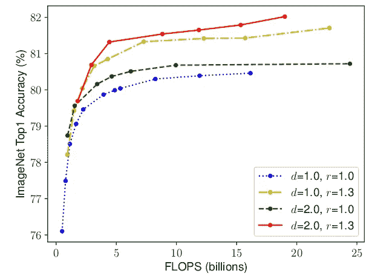

# EfficientNet:卷积神经网络的扩展做得很好

> 原文：<https://towardsdatascience.com/efficientnet-scaling-of-convolutional-neural-networks-done-right-3fde32aef8ff?source=collection_archive---------6----------------------->

## 如何智能缩放 CNN 以实现精度增益


在 [Unsplash](https://unsplash.com?utm_source=medium&utm_medium=referral) 上由 [Lidya Nada](https://unsplash.com/@lidyanada?utm_source=medium&utm_medium=referral) 拍摄的照片

自从 Alex net 赢得 2012 年 ImageNet 挑战赛以来，卷积神经网络在计算机视觉领域变得无处不在。他们甚至发现了它们在自然语言处理中的应用，其中最先进的模型使用卷积运算来保留上下文并提供更好的预测。然而，与所有其他神经网络一样，设计 CNN 的关键问题之一是模型缩放，即决定如何增加模型大小以提供更好的准确性。

这是一个繁琐的过程，需要手动反复试验，直到产生满足资源约束的足够精确的模型。该过程耗费资源和时间，并且经常产生具有次优精度和效率的模型。

考虑到这个问题，谷歌在 2019 年发布了一篇论文，涉及一个新的 CNN 家族，即 EfficientNet。与 GPipe 等先进模型相比，这些 CNN 不仅提供了更好的精度，还通过减少参数和 FLOPS(每秒浮点运算)流形提高了模型的效率。本文的主要贡献是:

*   设计一个简单的手机大小的基线架构: **EfficientNet-B0**
*   提供一种有效的**复合缩放**方法来增加模型大小，以实现最大的精度增益。

# **EfficientNet-B0 架构**


表 1。基线网络的架构细节

复合缩放方法可以推广到现有的 CNN 架构，例如移动网络和 ResNet。然而，选择一个良好的基线网络对于实现最佳结果至关重要，因为复合比例方法仅**通过复制基础网络的底层卷积运算和网络结构来增强**网络的预测能力。

为此，作者利用神经架构搜索构建了一个高效的网络架构， **EfficientNet-B0** 。仅用 **5.3M** 参数和 **0.39B** FLOPS 就在 ImageNet 上实现了 **77.3%的准确率**。(Resnet-50 提供 76%的精度，参数为 26M，触发器为 4.1B)。

该网络的主要构建模块由 MBConv 组成，并添加了压缩和激励优化功能。MBConv 类似于 MobileNet v2 中使用的反向残差块。这些在卷积块的开始和结束之间形成快捷连接。首先使用 1x1 卷积来扩展输入激活图，以增加特征图的深度。随后是 3×3 深度方向卷积和点方向卷积，减少了输出特征图中的通道数量。捷径连接连接较窄的层，而较宽的层存在于跳跃连接之间。这种结构有助于减少所需操作的总数以及模型大小。


图一。反向剩余块

该块的代码可以推测为:

```
from keras.layers import Conv2D, DepthwiseConv2D, Add
def inverted_residual_block(x, expand=64, squeeze=16):
    block = Conv2D(expand, (1,1), activation=’relu’)(x)
    block = DepthwiseConv2D((3,3), activation=’relu’)(block)
    block = Conv2D(squeeze, (1,1), activation=’relu’)(block)
    return Add()([block, x])
```

# 复合缩放


图二。模型缩放。(a)是一个基线网络示例；(b)-(d)是仅增加网络宽度、深度或分辨率的一个维度的传统缩放。(e)是我们提出的复合缩放方法，它以固定的比例统一缩放所有三个维度。

卷积神经网络可以在三个维度上扩展:*深度、宽度、分辨率*。网络的**深度**对应于网络的层数。**宽度**与层中神经元的数量相关，或者更确切地说，与卷积层中滤波器的数量相关。**分辨率**就是输入图像的高度和宽度。上面的图 2 更清晰地展示了这三个方面的扩展。

通过堆叠更多的卷积层来增加深度，允许网络学习更复杂的特征。然而，更深层次的网络往往会受到梯度消失的影响，变得难以训练。虽然诸如批量标准化和跳过连接的新技术在解决这个问题上是有效的，但是经验研究表明，仅通过增加网络的深度而获得的实际精度会很快饱和。例如，Resnet-1000 提供了与 Resnet-100 相同的精度，尽管有额外的层。

缩放网络的宽度允许层学习更精细的特征。这一概念已在众多作品中广泛使用，如广域网络和移动网络。然而，与增加深度的情况一样，增加宽度会阻止网络学习复杂的特征，从而导致精度增益下降。

更高的输入分辨率提供了关于图像的更多细节，因此增强了模型推理更小对象和提取更精细模式的能力。但是像其他缩放维度一样，这本身也提供了有限的精度增益。


图 3。用不同的网络宽度(w)、深度(d)和分辨率(r)系数放大基线模型。

这导致了一个重要的观察结果:

**观察 1 *:*** *按比例增加网络宽度、深度或分辨率的任何维度都会提高精度，但是对于更大的模型，精度增益会减小。*



图 4。为不同的基线网络调整网络宽度。

这意味着，为提高精确度而进行的网络缩放应该部分地由这三个维度的组合来贡献。图 4*中的经验证据证实了这一点，在图 4*中，对于不同的深度和分辨率设置，网络的精度以增加的宽度进行建模。

结果表明，仅缩放一维(宽度)会使精度增益迅速停滞。然而，将此与层数(深度)或输入分辨率的增加相结合，可以增强模型的预测能力。

这些观察多少有些意料之中，可以用直觉来解释。例如，如果输入图像的空间分辨率增加，卷积层的数量也应该增加，使得感受野足够大以跨越现在包含更多像素的整个图像。这导致了第二个观察结果:

**观察 2:** *为了追求更高的精度和效率，在 ConvNet 扩展期间平衡网络宽度、深度和分辨率的所有维度至关重要。*

## **建议的缩放方法**

卷积神经网络可以被认为是各种卷积层的堆叠或组合。此外，这些层可以被划分成不同的级，例如 ResNet 具有五个级，并且每个级中的所有层具有相同的卷积类型。因此，CNN 在数学上可以表示为:


等式 1

其中 n 表示网络，I 表示级数，F ᵢ表示第 I 级的卷积运算，L ᵢ表示 F ᵢ在级 I 中重复的次数。H ᵢ、W ᵢ和 C ᵢ简单地表示级 I 的输入张量形状

从等式 1 可以推导出，L ᵢ控制网络的深度，C ᵢ负责网络的宽度，而 H ᵢ和 W ᵢ影响输入分辨率。找到一组好的系数来缩放每一层的这些维度是不可能的，因为搜索空间是巨大的。因此，为了限制搜索空间，作者制定了一套基本规则。

*   比例模型中的所有层/级将使用与基线网络相同的卷积运算
*   所有层必须以恒定的比例均匀缩放

建立这些规则后，等式 1 可以参数化为:


等式 2

其中 w、d、r 是用于缩放网络宽度、深度和分辨率的系数；F̂ ᵢ、L̂ ᵢ、ĥᵢ、ŵᵢ、ĉᵢ是基线网络中预定义的参数。

作者提出了一种简单但有效的缩放技术，该技术使用**复合系数ɸ** 以原则方式统一缩放网络宽度、深度和分辨率:


等式 3

ɸ是一个用户定义的全局比例因子(整数)，它控制有多少资源可用，而 **α** 、 **β** 和 **γ** 决定如何将这些资源分别分配给网络深度、宽度和分辨率。卷积运算的 FLOPS 与 ***d，w，r，*** 成比例，因为深度加倍会使 FLOPS 加倍，而宽度或分辨率加倍会使 FLOPS 增加几乎四倍。因此，使用等式 3 缩放网络将使总 FLOPS 增加(α * β * γ ) ^ɸ。因此，为了确保总 flops 不超过 2^ϕ，应用约束(α * β * γ ) ≈ 2。这意味着，如果我们有两倍的可用资源，我们可以简单地使用复合系数 1 将 FLOPS 缩放 2 倍。

参数- **α** 、 **β** 和 **γ-** 可通过设置 **ɸ=1** 并找到产生最佳精度的参数，使用网格搜索来确定。一旦找到，这些参数可以固定，复合系数 **ɸ** 可以增加，以获得更大但更精确的模型。这就是 EfficientNet-B1 到 EfficientNet-B7 的构造方式，名称末尾的整数表示复合系数的值。

## 结果

这种技术使作者能够生产出比现有的 ConvNets 精度更高的模型，同时也极大地减少了总体 FLOPS 和模型尺寸。


表二。针对 ImageNet 挑战，比较 EfficientNet 与现有网络

这种缩放方法是通用的，可以与其他架构一起使用，以有效地缩放卷积神经网络，并提供更好的精度。


表 3。向上扩展 MobileNets 和 ResNet。

# 参考资料:

*   [**高效网**](http://Rethinking Model Scaling for Convolutional Neural Networks) **，** ICML 2019
*   [**MobileNet v2**](https://arxiv.org/abs/arXiv:1801.04381)**，** CVPR 2018
*   [**GPipe**](http://papers.nips.cc/paper/8305-gpipe-efficient-training-of-giant-neural-networks-using-pipeline-parallelism)**NIPS 2019**
*   **官方发布的代码:[https://github . com/tensor flow/TPU/tree/master/models/official/efficient net](https://github.com/tensorflow/tpu/tree/master/models/official/efficientnet)**