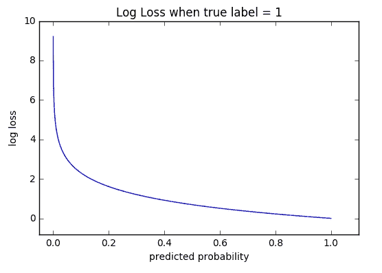

# EfficientNet 应该是 goto 预训练模型或…

> 原文：<https://towardsdatascience.com/efficientnet-should-be-the-goto-pre-trained-model-or-38f719cbfe60?source=collection_archive---------36----------------------->

## 比较不同预训练模型的时间和准确性，并最终创建一个集成来提高结果。


乔恩·泰森在 [Unsplash](https://unsplash.com?utm_source=medium&utm_medium=referral) 上的照片

一周前我还没有听说过这个术语，现在我认为 EfficientNet 是最好的预训练模型。在他们的[论文](https://arxiv.org/abs/1905.11946)中，他们已经展示了它的艺术状态，所以让我们来测试一下，当你为一个模型选择一个主干时，它是否应该是你的选择。我将把它的性能与广泛使用的 MobileNet、Inception 和 Xception 进行比较，比较的基础是每个时期训练和执行推理所用的时间，当然还有准确性。我决定用一场[狗对猫](https://www.kaggle.com/c/dogs-vs-cats-redux-kernels-edition)的 Kaggle 比赛来做我的裁判，让一切都脱离我的掌控。在我们开始模型和比较之前，如果你想了解更多关于什么是 EfficientNet 和它的所有八个模型的架构，你可以先阅读我以前的文章。

[](/complete-architectural-details-of-all-efficientnet-models-5fd5b736142) [## 所有高效网络模型的完整架构细节

### 让我们深入了解所有不同高效网络模型的体系结构细节，并找出它们的不同之处…

towardsdatascience.com](/complete-architectural-details-of-all-efficientnet-models-5fd5b736142) 

# 目录

1.  要求
2.  加载数据集
3.  模型
4.  结果

*   训练时间
*   推理时间
*   测试集上的性能

5.全体

# 要求

您将需要 TensorFlow-Nightly，因为 EfficientNet 的稳定版本和 Kaggle 目前不支持下载数据集和提交结果。我将使用 Google Colab，所以如果你想编码，打开笔记本，不要忘记连接到 GPU。

```
!pip install tf-nightly-gpu
!pip install -q kaggle
```

您将需要生成一个 Kaggle 的 API 密钥。程序如[所示，此处为](https://adityashrm21.github.io/Setting-Up-Kaggle/)。执行下面给出的代码来完成设置。

```
! mkdir ~/.kaggle
! cp kaggle.json ~/.kaggle/
! chmod 600 ~/.kaggle/kaggle.json
```

# 加载数据集

```
! kaggle competitions download -c 'dogs-vs-cats-redux-kernels-edition'
! mkdir train
! unzip train.zip -d train
! mkdir test
! unzip test.zip -d testimport ostrain_dir = os.path.join('/content/train', 'train')
test_dir = os.path.join('/content/test', 'test')
```

我使用了一个定制的数据生成器来批量加载图像，并定义了几个图像增强函数。

```
def data_gen(img_names, bat ch_size):
    c = 0
    n = os.listdir(img_names) #List of training images
    random.shuffle(n)while (True):
        img = np.zeros((batch_size, 224, 224, 3)).astype('float')
        labels = []for i in range(c, c+batch_size):
            train_img = cv2.imread(os.path.join(train_dir, n[i]))
            train_img =  cv2.resize(train_img, (224, 224))
            train_img = train_img/255.if random.random() < 0.25:
                train_img = cv2.flip(train_img, 1)
            rno = random.random()
            if rno < 0.1:
                train_img = train_img[:196, :196, :]
            elif rno < 0.2:
                train_img = train_img[28:, 28:, :]
            elif rno < 0.3:
                train_img = train_img[28:, :196, :]
            elif rno < 0.4:
                train_img = train_img[:196, 28:, :]
            elif rno < 0.5:
                train_img = train_img[28:196, 28:196, :]
            if rno < 0.5:
                train_img = cv2.resize(train_img, (224, 224), cv2.INTER_CUBIC)img[i-c] = train_img
            if len(re.findall('dog', n[i])) == 1:
                labels.append(1)
            else:
                labels.append(0)labels = np.array(labels)
        c+=batch_size
        if(c+batch_size>=len(n)):
            c=0
            random.shuffle(n)
        yield img, labelstrain_gen = data_gen(train_dir, batch_size)
```

如果您想了解如何创建更多的图像增强功能，请参考本文。

[](/complete-image-augmentation-in-opencv-31a6b02694f5) [## OpenCV 中的完整图像增强

### 这是一篇详尽的文章，通过使用 OpenCV 的自定义数据生成器，涵盖了所有的图像增强功能。

towardsdatascience.com](/complete-image-augmentation-in-opencv-31a6b02694f5) 

# 模型

我们将创建一个非常基本的模型，即加载预训练的网络，将其层设置为可训练，添加一个全局平均池层和一个密集层。所有的层都被设置为可训练的，这样即使有些层在这里被冻结了，也要花最长的时间来训练。他们将接受 10 个纪元的训练。

```
def create_model(base_model):
    base_model.trainable = True
    global_average_layer = tf.keras.layers.GlobalAveragePooling2D()(base_model.output)
    prediction_layer = tf.keras.layers.Dense(1, activation='sigmoid')(global_average_layer)
    model = tf.keras.models.Model(inputs=base_model.input, outputs=prediction_layer)
    model.compile(optimizer=tf.keras.optimizers.Adam(lr=0.0001), loss=tf.keras.losses.BinaryCrossentropy(from_logits=True), metrics=["accuracy", "mse"])
    return modeldef fit_model(model):
    model.fit(train_gen, batch_size=batch_size, steps_per_epoch=25000 // batch_size, epochs=epochs)IMG_SHAPE = (224, 224, 3)
model_mob = tf.keras.applications.MobileNetV2(input_shape=IMG_SHAPE, include_top=False, weights="imagenet")
model_inc = tf.keras.applications.InceptionV3(input_shape=IMG_SHAPE, include_top=False, weights="imagenet")
model_xcep = tf.keras.applications.Xception(input_shape=IMG_SHAPE, include_top=False, weights="imagenet")
model_B0 = tf.keras.applications.EfficientNetB0(input_shape=IMG_SHAPE, include_top=False, weights="imagenet")
model_B1 = tf.keras.applications.EfficientNetB1(input_shape=IMG_SHAPE, include_top=False, weights="imagenet")
model_B2 = tf.keras.applications.EfficientNetB2(input_shape=IMG_SHAPE, include_top=False, weights="imagenet")
model_B3 = tf.keras.applications.EfficientNetB3(input_shape=IMG_SHAPE, include_top=False, weights="imagenet")
model_B4 = tf.keras.applications.EfficientNetB4(input_shape=IMG_SHAPE, include_top=False, weights="imagenet")
model_B5 = tf.keras.applications.EfficientNetB5(input_shape=IMG_SHAPE, include_top=False, weights="imagenet")fit_model(model_mob)
fit_model(model_inc)
fit_model(model_xcep)
fit_model(model_B0)
fit_model(model_B1)
fit_model(model_B2)
fit_model(model_B3)
fit_model(model_B4)
fit_model(model_B5)
```

# 结果

啊终于到了真相大白的时刻了。你一直在等待的部分。

# 训练时间

记录下训练时每个时期所用的时间，如下所示。

```
+-----------------+-------------------------+
|      Model      | Time per epoch (in sec) |
+-----------------+-------------------------+
| MobileNetV2     |                     250 |
| InceptionV3     |                     400 |
| Xception        |                     900 |
| EfficientNet-B0 |                     179 |
| EfficientNet-B1 |                     250 |
| EfficientNet-B2 |                     257 |
| EfficientNet-B3 |                     315 |
| EfficientNet-B4 |                     388 |
| EfficientNet-B5 |                     500 |
+-----------------+-------------------------+
```

(最后两个 EfficientNets 在 Colab 上抛出内存错误，我无法训练它们。如果你想创建这样的表格，你可以使用[这个](https://ozh.github.io/ascii-tables/)。)EfficientNet-B0 轻松击败所有人，Xception 是最慢的。

# 推理时间

为了避免差异，我加载了一个测试图像，并测量了预测它的总时间 100 次，取其平均值。结果如下。

```
+-----------------+-------------------------+
|      Model      | Time per epoch (in sec) |
+-----------------+-------------------------+
| MobileNetV2     |                   0.034 |
| InceptionV3     |                   0.049 |
| Xception        |                   0.038 |
| EfficientNet-B0 |                   0.041 |
| EfficientNet-B1 |                   0.048 |
| EfficientNet-B2 |                   0.049 |
| EfficientNet-B3 |                   0.054 |
| EfficientNet-B4 |                   0.061 |
| EfficientNet-B5 |                   0.070 |
+-----------------+-------------------------+
```

现在，这是个惊喜！我曾觉得训练时间会指示推理时间，但一点也不。MobileNet 这次拿了蛋糕，紧随其后的是花了最多时间训练的 Xception。效率网模型中的时间随着代的增加而增加，这是随着参数数量的增加而预期的。

# 准确(性)

我选择不包含验证集，这样在 Kaggle 上提交 CSV 文件后会有惊喜。使用的度量标准是[测井损失](https://www.kaggle.com/c/dogs-vs-cats-redux-kernels-edition/overview/evaluation)。它的价值越低越好。



[来源](http://wiki.fast.ai/index.php/Log_Loss)

```
+-----------------+----------+
|      Model      | Log loss |
+-----------------+----------+
| MobileNetV2     |    0.238 |
| InceptionV3     |    0.168 |
| Xception        |    0.111 |
| EfficientNet-B0 |    0.205 |
| EfficientNet-B1 |    0.160 |
| EfficientNet-B2 |    0.122 |
| EfficientNet-B3 |    0.137 |
| EfficientNet-B4 |    0.126 |
| EfficientNet-B5 |    0.125 |
+-----------------+----------+
```

例外表现最好！！紧随其后的是其他 EfficientNet 模型，除了 EfficientNet-B0，它真正的比较对象是 MobileNetV2，它名列前茅。EfficientNet-B0 可能是移动模型的有趣选择🤔。这些结果表明，深度学习仍然像彩票一样，任何人都可以表现得更好(在可比模型中表现良好)。

# 全体

当我知道 EfficientNet 有 8 个模型时，我想为它创建一个整体模型，看看效果如何。我们将制作两个集合模型，一个包含 MobileNet、Inception 和 Xception，另一个包含 6 个 EfficientNet 模型。我们将创建的集合将使用 ANN 来组合这些模型。我已经写了一篇关于如何做到这一点的文章，所以如果你想了解它是如何做到的，请参考。

[](/destroy-image-classification-by-ensemble-of-pre-trained-models-f287513b7687) [## 基于预训练模型集成的破坏性图像分类

### 通过制作预训练网络的集成堆叠集成模型，如…

towardsdatascience.com](/destroy-image-classification-by-ensemble-of-pre-trained-models-f287513b7687) 

在为集合模型创建数据生成器而不是产生四维(批量大小、图像高度、图像宽度、通道)的 NumPy 数组时，我们在列表中传递它的次数作为模型的数量。

```
img = np.zeros((batch_size, 224, 224, 3)).astype('float')
# looping and adding images to img
img = [img]*no_of_models_in_ensemble
```

现在加载所有的模型放入集合中，冻结它们的权重，改变层的名称，这样没有两层有相同的名称，添加一些密集的层来创建一个人工神经网络，这就完成了。

```
def ensemble_model(models):
    for i, model in enumerate(models):
        for layer in model.layers:
            layer.trainable = False
            layer._name = 'ensemble_' + str(i+1) + '_' + layer.name
    ensemble_visible = [model.input for model in models]
    ensemble_outputs = [model.output for model in models]
    merge = tf.keras.layers.concatenate(ensemble_outputs)
    merge = tf.keras.layers.Dense(32, activation='relu')(merge)
    merge = tf.keras.layers.Dense(8, activation='relu')(merge)
    output = tf.keras.layers.Dense(1, activation='sigmoid')(merge)
    model = tf.keras.models.Model(inputs=ensemble_visible, outputs=output)
    model.compile(optimizer=tf.keras.optimizers.Adam(lr=0.001), loss=tf.keras.losses.BinaryCrossentropy(from_logits=True), metrics=["accuracy"])
    return model
```

两个集合模型都被训练 10 个时期，并且它们的对数损失值是:

*   MobileNet、Inception 和异常集合:0.104
*   有效净系综:0.078

第一个集合模型确实有所改进，但没有那么多。然而，有效网络集合有了很大的提高。

比较所有这些结果，我们可以看到，我们不能抹杀其他模型相比，有效的网络和提高分数的竞争集成是一条路要走。