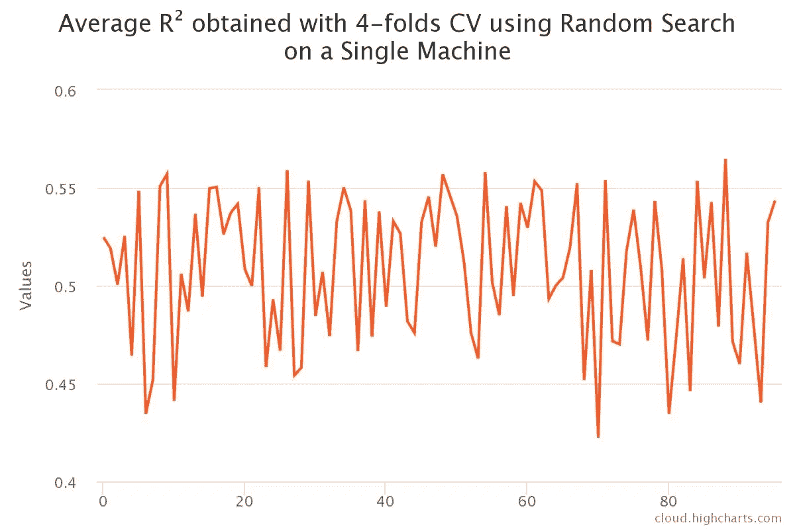

# 使用 Apache Spark 轻松调整超参数

> 原文：<https://towardsdatascience.com/effortless-hyperparameters-tuning-with-apache-spark-20ff93019ef2?source=collection_archive---------6----------------------->

## 如何在 Spark 上运行随机搜索而不用编写 Spark 代码？


图片由 [Gerd Altmann](https://pixabay.com/users/geralt-9301/?utm_source=link-attribution&utm_medium=referral&utm_campaign=image&utm_content=1044105) 从 [Pixabay](https://pixabay.com/?utm_source=link-attribution&utm_medium=referral&utm_campaign=image&utm_content=1044105) 拍摄

我仍然无法决定**超参数调优**是我在处理机器学习管道时最喜欢还是最不喜欢的步骤之一；一方面，**这是通常在项目**接近尾声时发生的事情:那些定义问题的会议，花在挖掘数据上的所有时间，ETL 脚本开发的数周… **遥远的记忆，是时候看看事情是否联系在一起了！**另一方面，有时候**我觉得自己就像** [**坦塔罗斯，拿不到就挂在我面前的多汁水果！**](https://en.wikipedia.org/wiki/Tantalus)

如果您曾经有过这种感觉，那么这篇文章可能是一个很好的起点，可以加速这个过程并简化您的生活，**尤其是有了 Apache Spark 基础设施之后！**

# 超参数调谐 101

我会将学习算法的超参数定义为**一条在训练过程之前嵌入模型中的信息，而不是在拟合过程中导出的信息**。如果模型是一个随机森林，超参数的例子有:树的最大深度或在构建森林的每个元素时要考虑多少个特征。

如果你曾经评估过一个 ML 模型的质量，**你会知道没有一个放之四海而皆准的配置，因为当我们将同一个模型应用于两个不同的数据集时，它会表现出显著不同的性能**；超参数调整是一个简单的过程，旨在优化配置，使我们为我们的问题选择的模型具有最佳性能。

在非常高的水平上，我们希望使用机器学习算法实现的是最小化成本函数(或最大化质量度量)`f(y_hat(x),y)`，其中`y_hat`是模型预测的值(给定一组已知特征`x`)`y`是预期结果。

考虑具有单个超参数的 ML 算法。**如果我们在数据集上拟合算法并评估性能，我们将获得成本函数** `**f**`的特定值。如果我们画出成本如何根据不同的超参数选择而变化，我们最终会得到如下结果:


在上图中，就成本函数而言，一个参数选择给了我们比其他参数更好的结果:**我们可能应该选择那个来构建最终的模型**。上面的例子中，我们有一个单一的超参数，因此，我们的搜索空间只是一条曲线。**如果我们的算法支持** `**2**` **超参数，那么搜索空间变成一个曲面**:


同样，我们将选择给出最佳成本函数的一对超参数`(hp_1,hp_2)`。

**当我们有** `**k**` **超参数时，搜索一定发生在一个** [**超曲面**](https://en.wikipedia.org/wiki/Hypersurface)**`**k**`**维度**上；参数越多，探索就越困难。**

**此时我们需要的是一个在超参数空间中导航的策略。我们可以使用两种非常简单的方法:**

*   ****网格搜索-** 这种方法非常简单:**对于每组参数，我们将模型拟合到我们的数据集，并评估性能**。最后，我们选择产生最佳结果的组合。请注意，搜索空间通常包含数百万个点，因此通常不可能进行广泛的测试；因此，网格搜索通常会超时运行。**
*   ****随机搜索-** 该方法非常类似于网格搜索，唯一的区别是搜索空间不是以“网格”方式导航，而是随机选择要测试的超参数元组。**该策略通常优于网格搜索，因为后者对探测起点非常敏感**(例如，考虑网格的第一个元素远离任何可接受的参数选择的情况)。**

****

# **冰山**

**正如我之前所写的，超参数优化只是 ML 过程的冰山一角。对于这个演示，**我们实际上需要定义问题并收集数据。**幸运的是，一些可爱的人已经这样做了。我们将使用 2017 年举行的 Kaggle [梅赛德斯-奔驰绿色制造竞赛](https://www.kaggle.com/c/mercedes-benz-greener-manufacturing)。
用梅赛德斯-奔驰自己的话说:*在这场比赛中，戴姆勒向卡格勒挑战，以解决维数灾难，减少汽车在测试台上花费的时间。竞争对手将使用代表梅赛德斯-奔驰汽车功能不同排列的数据集来预测通过测试所需的时间。获胜的算法将有助于加快测试速度，从而在不降低戴姆勒标准的情况下降低二氧化碳排放。***

**我选择这个数据集/问题的原因是:**

1.  **任务很简单:我们有特性和一个要预测的。句号。本指南的目的不是为了在模型质量方面实现出色的性能，而是为了展示如何使用 Spark 来调整参数。**我想从表格中删除所有与数据预处理相关的复杂内容**(例如，我避免了图像、音频、时间序列等。).**
2.  ****数据集很小**:一个(相当)大的数据集对于超参数优化本身来说不是问题(我们可以在数据集的样本上运行模型)，但是处理大量的样本是一个挑战，我不想在本文中介绍(可以在另一篇文章中介绍！).**
3.  ****我想要一个真正的问题**:我不想使用 Iris、IMDB 或 Titanic 数据集。我相信，如果例子与现实生活中的情况相似，会更有效。**
4.  ****预处理越少，代码越简单**:重点要放在火花部分；在 Python 中，没有人需要数百行预处理！**

**介绍够了，让我们跳到有趣的东西。**

# **准备好；设置；XGBoost！**

****数据集由几个分类变量、相当多的二元变量组成，并且相关变量是连续的**。奔驰混淆了表格，所以功能只知道`X_i`。如果你想要一个广泛的数据分析，我建议你去比赛页面，看看由社区制作的笔记本！**为评估建议的度量是** [**决定系数**](https://en.wikipedia.org/wiki/Coefficient_of_determination) **，R，我们将坚持使用它来比较模型。我们将使用**[**XGBoost**](https://xgboost.readthedocs.io/en/latest/)**来做预测，** *一个优化的分布式梯度增强库，在* [*梯度增强*](https://en.wikipedia.org/wiki/Gradient_boosting) *框架下实现机器学习算法*[*【1】*](https://xgboost.readthedocs.io/en/latest/)**

**梅赛德斯-奔驰数据集示例**

**我们试图实现的是使用 Spark 基础设施运行并行网格/随机搜索。 **Apache Spark 自带一些机器学习工具(**[**ml lib**](https://spark.apache.org/mllib/)**)。** **别提了！****

**我可以听到你的反对意见:是的，XGBoost 网格搜索**可以使用 MLLib 管道**来实现([有一个 Nan Zhu 提供的很好的平台，解释了如何做到这一点](https://www.slideshare.net/databricks/building-a-unified-data-pipeline-with-apache-spark-and-xgboost-with-nan-zhu))，但是**我认为 MLLib 没有为参数调整提供足够的灵活性**:归根结底，你可能想要使用一个更智能的算法，纯 Python 将使实现更容易；有了下面的想法，你应该能够运行多种类型的搜索(贝叶斯，遗传)而不用忙于处理 Spark APIs:所有的东西大部分都是用普通的 Python 编写的！**

## **方法学**

**让我们再做一步，定义什么是高级方法论。对于本文的范围来说，我们需要做一个最小的预处理:唯一的目的是让数据集对 XGBoost 可读。**

**我们要做的事情很简单:**

1.  ****删除 ID 列**:由于显而易见的原因，我们不想将 ID 提供给 XGBoost。**
2.  ****对分类变量**进行编码:我们将使用简单的均值编码(即[*对于每个类别，我们将其标签设置为一个训练数据*](https://www.kaggle.com/vprokopev/mean-likelihood-encodings-a-comprehensive-study) 上目标变量的均值)。**

**预处理功能**

**正如我在上面指出的，比赛是基于 **R 的，所以我们将继续使用这个指标来探究模型的性能；更准确地说，评估算法如下:****

```
1\. Pick a set of hyperparameters2\. Perform 4-folds [Cross-Validation](https://en.wikipedia.org/wiki/Cross-validation_(statistics))3\. Get the average **R² score for the 4 runs and store it** 4\. Goto 1\. until timeout5\. Select the parameters with the **highest** average score (**R²=1 is the perfect model**)
```

**厉害！现在我们终于准备好实现算法了！**

## **定义搜索空间**

**运行网格或随机搜索的第一步是定义搜索空间。XGBoost 有[很多很多参数](https://xgboost.readthedocs.io/en/latest/parameter.html)可以在装配前设置。对于我们的问题，我们将使用 tree booster(库也提供了其他选项)，我们将只关注以下参数:**

****learning_rate** : *更新中使用的步长收缩，防止过拟合。在每个增强步骤之后，我们可以直接获得新特征的权重，并且* `*eta*` *缩小特征权重以使增强过程更加保守。【* [*xgboost 参数*](https://xgboost.readthedocs.io/en/latest/parameter.html)*】***

****colsample_bytree** : *是构造每棵树时列的子样率。对于每个构建的树，进行一次子采样。【* [*xgboost 参数*](https://xgboost.readthedocs.io/en/latest/parameter.html)*】***

****子样本** : *训练实例的子样本比率。将其设置为 0.5 意味着 XGBoost 会在生成树之前随机采样一半的训练数据。这将防止过度拟合。子采样将在每个增强迭代中出现一次*。*[*xgboost 参数*](https://xgboost.readthedocs.io/en/latest/parameter.html)***

******n_estimators** :算法使用的树的数量。****

******reg_alpha** : *权重上的 L1 正则项。增加该值将使模型更加保守。【* [*xgboost 参数*](https://xgboost.readthedocs.io/en/latest/parameter.html)*】*****

******最大深度** : *一棵树的最大深度。增加该值将使模型更加复杂，并且更有可能过度拟合。【* [*xgboost 参数*](https://xgboost.readthedocs.io/en/latest/parameter.html)*】*****

******gamma** : *在树的叶子节点上做进一步划分所需的最小损失减少。* `*gamma*` *越大，算法就越保守。【* [*xgboost 参数*](https://xgboost.readthedocs.io/en/latest/parameter.html)*】*****

****可以想象，以上是一个相当大的搜索空间！**然而，当我们进行超参数调整时，我们并不是完全在黑暗中摸索。许多 ML 方法(以及 XGBoost)都有指导原则，可以帮助为网格的所有参数定义有意义的范围。**比如，即使知道`learning_rate`可以在`[0,1]`，接近`1`的值也不太可能有好结果。以下 Python 字典代表了我为 Mercedes-Benz 问题选择的搜索空间:****

****上面的字典将导致 6，890，400 个点进行探测。注意，**即使每个测试需要 1 秒钟完成，我们也需要大约 79 天 18 小时的连续计算时间来探索整个网格！**网格搜索永远不会尝试所有那些组合。****

****以下函数将网格作为 Python 生成器返回(以避免在内存中有大数据结构):****

# ****局部网格和随机搜索****

****现在我们有了搜索空间，让我们试着在本地实现网格搜索。****

****首先，我们需要一个方法来评估 **R :******

****然后我们用下面的签名定义一个函数`grid_search`:****

```
**grid_search(timeout_seconds, cv_splits, boosting_rounds)**
```

******搜索算法将在**T5 之后终止。交叉验证将使用`cv_splits`数量的分割，XGBoost 将使用`boosting_rounds`迭代:****

****此外，我们将收集熊猫数据框架中的结果进行分析:****

****太棒了。让我们运行上面的代码一个小时，喝杯咖啡，把结果留到以后。****

## ****随机搜索****

****我们可以回收上面的大部分代码来实现随机搜索，**唯一的区别是我们不需要预定义网格**:我们可以只声明一个函数，返回探索面的一个随机点:****

****然后我们可以稍微修改一下网格搜索循环:****

****再次:跑步，咖啡，等待结果。****

# ****让我们随机搜索火花吧！****

******本文的要点是解释如何使用 Spark 基础设施来并行化上述算法。**我们将只关注随机搜索。****

****我们可以使用各种策略来解决这个问题:****

*   ****用户定义函数(UDF):我们可以实现一个 Spark UDF。例如，我们可以创建一个 dataframe，在一列中包含网格的所有元素，然后对该列应用 UDF，使用这些值作为 XGBoost 的输入参数。**这个解决方案有几个缺点**:首先**我承诺过你会在没有火花知识的情况下运行这个算法**，UDF 并不是一个很好的维持这个承诺的起点。第二点是，在各种 UDF 之间共享训练数据集可能是不安全的(可能有共享变量？欢迎评论中的建议！).****
*   ******MLLib** :同样，这是 Spark 的一个相当高级的用例，我认为它不够灵活。****
*   ******带有 Spark 后端的 Joblib**:我们要用这个！你们中的许多人，可能已经知道 Joblib， [*一套工具提供了****Python 中的轻量级流水线操作*** *(函数的透明磁盘缓存和惰性重求值(memoize 模式)，轻松简单的并行计算)。Joblib 特别针对大数据优化为* ***快速*******健壮*** *，并针对 numpy 数组**](https://joblib.readthedocs.io/en/latest/) **进行了具体优化。对你来说可能听起来很新鲜的是，Joblib 有一个方便的 [Spark 后端。**通过几行代码，我们将直接在 Spark 上运行并行循环，而无需编写 Spark 代码！**](https://github.com/joblib/joblib-spark)******

****在查看实现之前，**我们需要指定我们将使用的架构**。**特别是，一旦算法有了交叉验证的结果，它将需要在“某个地方”把它们吐出来**(供我们收集和分析)。我们将使用一个 MongoDB 实例:****

********

****上图显示我们将在 Jupyter 笔记本中有一个入口点。通过其中一个单元，我们将使用 Joblib-Spark 将执行发送到不同的节点；此外，**在每个节点上，我们将使用普通 Joblib 来启用多线程**。最后，每个执行器将把结果写在位于另一个服务器上的 MongoDB 实例中。****

****预处理代码将保持不变，我们可以重用该函数来生成随机组合，所以让我们编写一个神奇的循环:****

******Joblib 魔术发生在下面一行**:****

```
**Parallel(backend="spark", n_jobs=NODES)(delayed(evaluate)(X, y, kf, boosting_rounds) for p in range(0, NODES))**
```

****让我们来分解一下:****

*   ****`Parallel`初始化 Joblib 环境。在这种情况下，我们需要指定后端(即“spark”)。****
*   ****涉及到一些“全局”变量；一个重要的参数是`NODES`，即集群中的节点数量。我们正在做的是将网格分成 `**NODES=3**` **块，并将每个块发送给一个 Spark 执行器。******
*   ****`delayed`只是一个*装饰器，用来捕获函数*的参数(在这里是`evaluate`，我们将在后面定义它)。需要`for p in range(0, NODES)`来告诉`Parallel`执行`delayed`函数多少次(在这种情况下**只执行** `**NODES**` **次，因为执行程序将运行测试，直到超时发生******
*   ****`X`、`y`、`kf`和`boosting_rounds`是`evaluate`功能的参数。****

****引擎盖下发生了什么？ **Joblib-Spark 将通过网络发送函数(使用**[**cloud-pickle**](https://github.com/cloudpipe/cloudpickle)**进行序列化)**。然后通过`parallelize` Spark 方法，每个执行将被发送到单个节点。****

****我们需要构建将在每个 Spark 机器上执行的`evaluate`函数:****

****如你所见，我们在`evaluate`中定义了一个内部函数。**这是必要的，因为除了在 Spark 上并行化网格搜索，我们还想在单个执行器上使用多线程。下面一行显示了默认后端的(普通)Joblib 的用法:******

```
**Parallel()(delayed(evaluate_inner)(keys, g, X, y, kf, boosting_rounds) for g in df_grid)**
```

****让我们运行上面的`random_search_spark`函数一个小时，并将结果保存在我们的 MongoDB 实例中。**我们希望在 Spark UI 上看到的是三个阶段，每个阶段将运行一个小时**:****

********

****35 分钟后触发用户界面****

********

****60 分钟后的 Spark UI 任务失败，因为 Spark 上下文在超时后终止****

# ****比较和结论****

****旅程即将结束。我们已经收集了所有的结果，我们只需要分析它们！****

******Spark 测试一直在由 3 台机器(1 个驱动程序+ 2 个执行器)组成的集群上运行，每台机器有 4 个内核**，而“本地”搜索算法一直在单台机器上执行。我们对所有的方法都使用了下面的常数。****

```
**CV_SPLITS = 4 # Number of CV splits
TIMEOUT_SECONDS = 3600 # Timeout is 1 hour
BOOSTING_ROUNDS = 500 # XGBoost boosting rounds**
```

****第一个有趣的发现是简单地比较每种方法执行了多少测试:****

********

******在这种情况下，我们获得了 3 倍的提升**，这是给定节点数量的线性增长(注意:“本地”版本仍然有 4 个内核可用)。****

****为了了解方法“如何”探索超曲面，让我们画出算法获得的**R:******

********

****在单台机器上使用网格搜索通过 4 倍 CV 获得的平均 R****

********

****在单台机器上使用随机搜索通过 4 倍 CV 获得的平均 R****

********

****在火花(3 个节点)上使用网格搜索通过 4 倍 CV 获得的平均 R****

****从上面的图表中，至少可以看出两点:****

1.  ******网格搜索探索似乎没那么有效**。请注意曲线中的水平部分:每个部分中变化的**参数对分数**的影响非常小，因此可能不值得深入探究(当然，为了简单起见，我没有考虑参数之间的相互依赖性)。****
2.  ****Spark 并行化是可取的，因为它可以荒谬地增加尝试的次数。****

****通过这些方法找到的最佳参数:****

```
****Grid Search (Local)**
Best **R²**: 0.5656Params:
   learning_rate: 0.01,
   colsample_bytree: 0.8,
   subsample: 0.5,
   n_estimators: 100,
   reg_alpha: 0.01,
   max_depth: 3,
   gamma:0**Random Search (Local)**
Best **R²**: 0.5648Params:
   learning_rate: 0.0354,
   colsample_bytree: 0.88,
   subsample: 0.8,
   n_estimators: 1410,
   reg_alpha: 0.10,
   max_depth: 3,
   gamma:0**Random Search (Spark)**
Best **R²**: 0.5643Params:
   learning_rate:0.0524,
   colsample_bytree:0.93,
   subsample:0.88,
   n_estimators:1413,
   reg_alpha:0.409,
   max_depth:3,
   gamma:7**
```

******注意网格搜索赢了，即使它只能做 32 次尝试！**以上结果的结果是**我们可能应该重新考虑调整哪些超参数以及如何定义网格/范围**。例如，我们可以看到，所有的方法都同意这样的事实，即`learning_rate`应该在`[0.01,0.05]`中，而在我们的网格中，我们将最大值设置为`0.25` : **我们可能浪费了大量的计算时间来寻找超曲面的错误区域！** *(旁注:* `*max_depth=3*` *让我想到，也许，很多变量可以从数据集中剔除，但那是另一回事)。*****

****我认为上面的结果可以引出下面的问题:**我们是否可以在探索算法中加入一些智能，做一些比这更聪明的事情？**答案是“**是的，我们可以**”，但那是另一篇文章的主题！离开之前，如果你读到这里，**你值得拥有** [**链接到最后的笔记本**](https://gist.github.com/aialenti/acad08b609642c47a5abd14e78207173) **！******

# ****外卖食品****

*   ****Joblib-Spark 可以成为在 Spark 基础设施上扩展算法的强大工具。其中一个主要优势是**它不需要使用 Spark APIs 进行开发:**要使用它，您不需要对 Apache 的分布式计算系统有很深的理解。****
*   ****Joblib 可能允许你用相对较小的努力提升和移动你现有的管道。****
*   ******网格搜索和随机搜索**是两种非常简单的方法，可用于进行超参数调整，并且**易于实现**。****
*   ****随机搜索通常优于网格搜索。****
*   ******网格和随机搜索在超参数调优方面并不是最好的**，**因为它们没有利用已经执行的测试来理解探索过程中的方向。******

****我希望你喜欢！**让我知道你的想法**，如果你愿意，**看看这些其他的文章！******

****[](/the-art-of-joining-in-spark-dcbd33d693c) [## 火花中加入的艺术

### Spark 中加速连接的实用技巧

towardsdatascience.com](/the-art-of-joining-in-spark-dcbd33d693c) [](/clustering-pollock-1ec24c9cf447) [## 聚类波洛克

### 杰森·布拉克绘画的聚类分析——如何利用 k-means 进行色彩分组

towardsdatascience.com](/clustering-pollock-1ec24c9cf447)****