# 轻松推荐相似图片

> 原文：<https://towardsdatascience.com/effortlessly-recommending-similar-images-b65aff6aabfb?source=collection_archive---------29----------------------->

## **使用来自预训练卷积神经网络的特征来产生可比性**

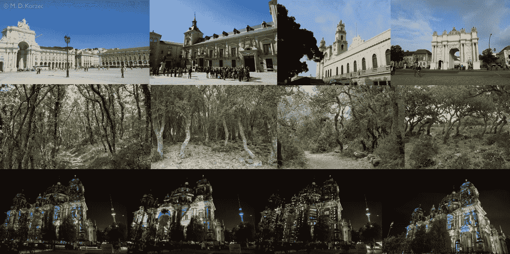

自动选择相似图像(来源:M. D. Korzec)

让我们来解决这样一个问题:拥有一个无序的、庞大的图像集，我们希望从中找到一个相似图像的子集。该解决方案产生了基于图像的项目-项目推荐系统，该系统可以用于例如在线商店。为此，我们将使用迁移学习，利用预先训练的卷积神经网络。

私人图片(来源:M. D. Korzec)

这些来自我私人收藏的图片包含了不同的动机，当面对成千上万的图片时，找到最相似的就变得非常困难了。利用所呈现的解决方案，我们将基于图像内容(即，不基于其元数据)获得相似性值，如下面的示例中来自相同图像集的相似性值。第一个图像描述了查询的参考图像，一辆我们在欧洲休产假时使用的货车，停在法国某处的山羊农场上。

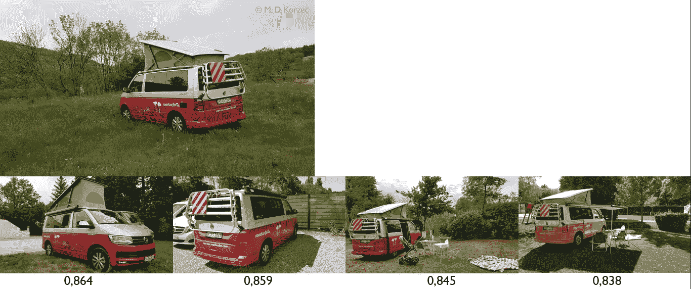

具有相似值的与查询图像相似的图像(来源:M. D. Korzec)

在下面一行中，我们可以看到算法选择的最相似的图像。照片下面的数字是从 0 到 1 的相似度值，1 是可能的最高相似度。不仅显示了红色货车的图像，而且由于所有其他相似之处，我们第一次租赁的黄色货车由于水泵故障而需要更换。

许多在线产品可以与这样的推荐器一起工作，以提高转化率，无论是摄影师的收藏、电影推荐，还是可以从图像相似性中受益的其他商店(例如，CD 封面或视觉相似性可能增加转化率的其他产品)。这种基于项目的推荐系统被称为基于内容的推荐系统。欲了解更多信息，您可以参考[1]或快速进入关于*走向数据科学* [2，3]的博客条目。

如果您已经具备 Python 和图像处理的基础知识，那么有一种非常简单的方法可以获得这样的建议。在接下来的段落中，我将为一组固定的图像提供其背后的高级逻辑:

1.获取和预处理数据

2.使用经过训练的卷积神经网络作为特征向量生成器

3.使用特征向量差异来计算相似性

4.使用最佳推荐列表

您可以使用现成的神经网络，不需要模型工程或培训。没有必要清理元数据，没有隐藏的工作，你只需要建立一个有效的数据处理一次，没有额外的工作。

# **1。获取并预处理数据**

即使要实现一个原型，也需要一个大的图像测试集。我使用了 Coco 系列的一部分，结果令人印象深刻。在 15000 张图片中，推荐者发现了非常相似的内容。然而，由于这些图片根据用户在 Flickr 中的选择有不同的许可，所以我没有在这里发布这些结果。相反，我为这个博客创建了一个不同的测试集。所有上传的图片都来自我的本地图片库，大约有 5000 张图片，都是 jpg 格式，随着相机的改变，分辨率也有所不同。

预训练的深度神经网络需要特定格式的输入图像。对于本文，我在 PyTorch 库中使用 resnet18 [5]，它需要 224x224 RGB 图像作为输入，图像值在范围[0，1]内。图像被标准化为具有平均值[0.485，0.456，0.406]和标准偏差[0.229，0.224，0.225]，因此它们都被重新缩放以适应这种格式(注意不要在变换过程中丢失关于图像方向的元数据)。关于特定实现的细节将在我的下一篇博客中介绍。如果要使用其他卷积神经网络，先检查输入要求，并相应调整预处理。此外，请注意，这里 resnet18 的权重是从 ImageNet 上的训练中获得的。请记住，训练集和测试集应该是不同的。

# **2。使用经过训练的卷积神经网络作为特征向量生成器**

当你第一次意识到与图像相关的神经网络的一个特征时，你可能会大吃一惊:

> **经过训练的卷积神经网络可以创建特征向量，通过比较这些特征向量来计算图像的相似性。**

使用高级特征向量，而不是努力寻找用经典的图像处理方法来表征图像的方法，这些方法可用于比较它们(例如，从不同方向和局部边缘密度的边缘检测开始，然后扩展到不包括这些的所有情况)。可用的、经过训练的模型已经提供了你需要的一切，当它们在具有高动机可变性的巨大图像集上被训练时。你不需要理解向量的任何条目，你只需要知道相似的图像会有相似的条目。

以下示意图解释了将核心网络视为黑盒时特征和分类向量的计算

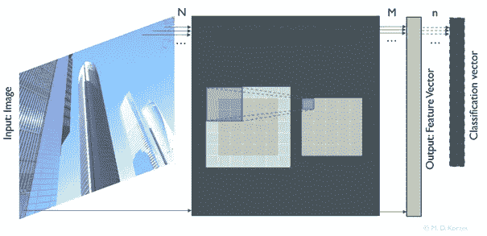

作为黑盒的卷积神经网络(来源:M. D. Korzec)

M>n，特征向量包含了大量加密图像的高层描述。因此，当抽象中间的所有层并忽略不用于推荐器的分类向量时，我们只处理一个函数

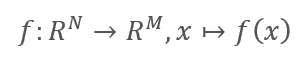

这是高中就熟悉的。这里，x 是中的矢量化 RGB 图像

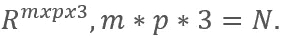

当使用预先训练的模型时，所有的参数都是固定的，所以没有更多的自由变量，这里也没有列出。如第一部分所述，必须对给定的图像进行预处理，以适应所用网络的输入格式。

**你不需要做的事情**

当你想从头开始训练你的网络时，你需要

*   手动准备大量数据(图像-分类向量-对)
*   花时间在一些优化上

分类向量(例如，“图像包含汽车”可以由一个单位向量表示，该单位向量的位置表示汽车)是固定的，输入是固定的，并且网络的权重被优化以获得尽可能接近真实分类向量的猜测分类向量。f(x)的被充分研究的形式允许在优化迭代期间使用的自动微分的帮助下优化权重，并且首先使得深度神经网络的使用成为可能。如果你有兴趣了解更多相关话题，你可以参考[一位前研究同事关于这个话题的博客文章[6]。](/high-school-math-for-machines-differentiable-code-5f588140b148?source=---------2------------------)

在具有更多条目的分类层之前的完全连接的一维层是图像内容的高级加密描述。早期图层仅描述低级特征(如边)，分类向量可能相当小，因此最后一个完全连接的图层是一个不错的选择。它将包含有用的值，即使图像的内容在学习期间没有被分类。

因此，我们知道，我们可以省去训练神经网络的努力，我们仍然可以通过一个函数调用 f(x)从图像输入 x 中获得特征向量。然后，我们可以很容易地确定一个图像何时与另一个图像或多或少相似。

# **3。使用特征向量差异计算相似度**

为了比较从不同图像的卷积神经网络的评估中导出的特征向量，采用余弦相似性是一种很好且简单的方法。在这里，你基本上只是计算所有图像对的余弦公式，对整个图像集这样做产生一个相似性矩阵。

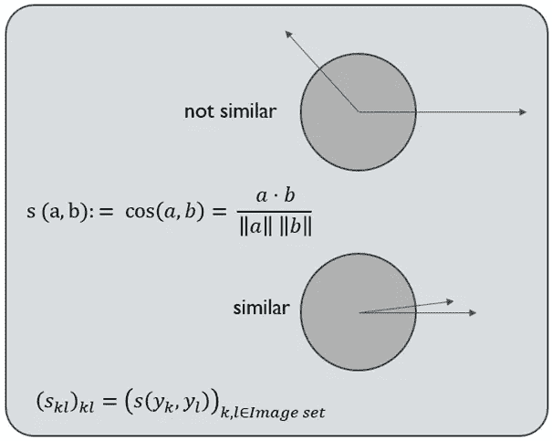

余弦相似性(来源:M. D. Korzec)

在二维空间中，如上所示，该公式易于解释和可视化。它在更高维度中以同样的方式工作，例如考虑三个向量

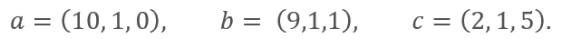

凭直觉，a 和 b 的相似性应该高于 a 和 c 或 b 和 c 的相似性。事实上，当把这些数字代入上述公式时，人们会发现

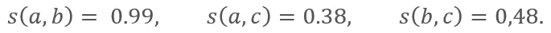

因此，不出所料，

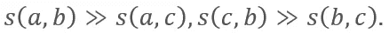

相似性计算是推荐系统中的主要课题之一[1]。在我们的例子中，也应该使用一些其他的度量来描述向量之间的差异。

# **4。使用最佳建议列表**

因此，总的来说，当比较两个图像时，我们已经推导出要执行的以下逻辑步骤

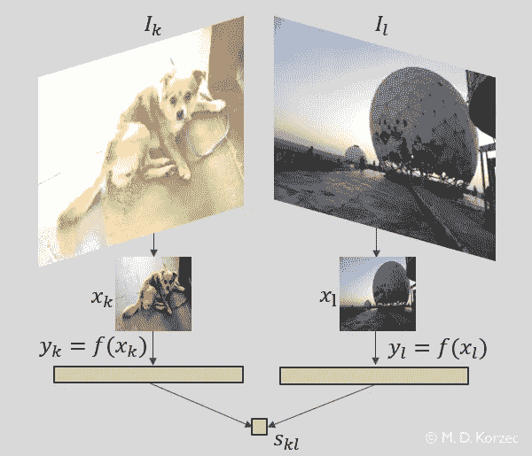

比较两幅图像(来源:M. D. Korzec)

您只需要迭代感兴趣的集合中的所有图像。所有导出条目(s_kl)一起定义了完整的相似性矩阵。然而，当使用在线推荐的结果时，使用完整的相似性矩阵是没有效率的。当对最相似的图像感兴趣时，为了效率，可以通过相似性值对元素进行排序，并使用前 k 个列表，即最相似的 k 个图像。因此，来自矩阵(s_kl)的行 k 从大到小排序，并且高度相似的图像被保留并用于推荐。下图解释了用于从相似性矩阵生成前 4 个列表的较小向量/矩阵的集合。

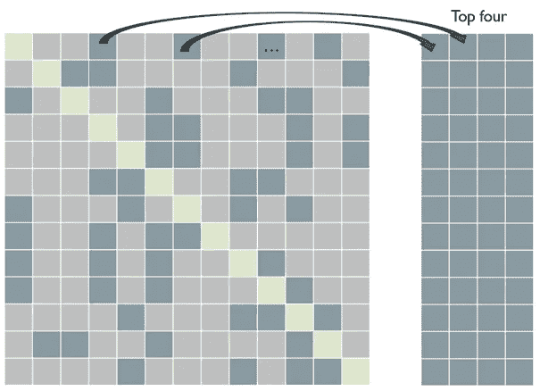

相似性矩阵和前 4 个列表(来源:M. D. Korzec)

较暗的区块表示与该行中表示的图像最相似的四个图像，并且为了有效的请求而分开存储。当然，在典型的应用程序中，您会使用四个以上。

当您在 top-k 列表中有了所有排序的信息并接收到一个查询作为输入时，您只需转到该特定图像的相应行，并显示存储有相应行中存储的 id 的图像。

# **外卖信息**

*   当我们想要获得基于图像的推荐时，经过训练的卷积神经网络可以完成这项工作。
*   我们使用预先训练的模型，所以没有必要建立一个训练管道。
*   我们本质上只评估一个函数来获得特征向量。
*   我们通过计算余弦来比较特征向量。
*   当新的图像被添加到集合中时，需要更新新的相似性值和 top-k 列表。
*   当您从足够大的图像集和训练有素的模型开始时，不存在冷启动问题。

如果你有 Python 代码涵盖了上述推荐者的想法，并且它将被用在一个网站上，有多种方法可以做到这一点。在我的下一篇文章中，[我将解释上述步骤](https://medium.com/@maciek.korzec/recommending-similar-images-using-pytorch-da019282770c)的 Python 实现的要点，并且我将解释如何建立一个简单的基于 Flask 的网站来使用这些结果。

测试集中相似的蒲公英图片(来源:M. D. Korzec)

[1] C. C. Aggarwal，[推荐系统——教科书](https://www.springer.com/de/book/9783319296579) (2016)，施普林格

[2] P. Pandey，[推荐系统的非凡世界](/the-remarkable-world-of-recommender-systems-bff4b9cbe6a7) (2019)，走向数据科学

[3] B. Rocca 和 J. Rocca，[推荐系统介绍](/introduction-to-recommender-systems-6c66cf15ada) (2019)，走向数据科学

[4] T.-Y. Lin 等著，[微软 COCO:情境中的通用对象](https://arxiv.org/abs/1405.0312)(2014)；使用:[测试数据 2017](images.cocodataset.org/zips/test2017.zip)

[5]何国光，张，任，孙，【深度残差学习用于图像识别】，2015

[6]m . KPF，[面向机器的高中数学:可微分编程](/high-school-math-for-machines-differentiable-code-5f588140b148) (2020)，面向数据科学

# 感谢阅读！喜欢这个话题吗？

如果你觉得这篇文章很有趣，你可能想看看我在这个主题上的其他文章:

 [## 成功互联网企业推荐系统的核心价值

### 推荐系统的重要性评估

medium.com](https://medium.com/swlh/the-core-value-of-recommender-systems-for-successful-internet-enterprises-7164a7bacdc6)  [## 使用 PyTorch 推荐相似图片

### 使用 Resnet18 实现完全迁移学习

towardsdatascience.com](/recommending-similar-images-using-pytorch-da019282770c)  [## 一个推荐图片的 Flask 应用程序

### PyTorch 中基于卷积神经网络的相似图像推荐网站原型

medium.com](https://medium.com/@maciek.korzec/a-flask-app-for-image-recommendations-a865e1496a0d)  [## py torch+Flask+PostgreSQL+Heroku 部署的映像建议

### 用 Flask 封装一个基于 PostgreSQL/ PyTorch 的图像推荐系统，导入数据并在 Heroku 上运行

towardsdatascience.com](/image-recommendations-with-pytorch-flask-postgresql-heroku-deployment-206682d06c6b)