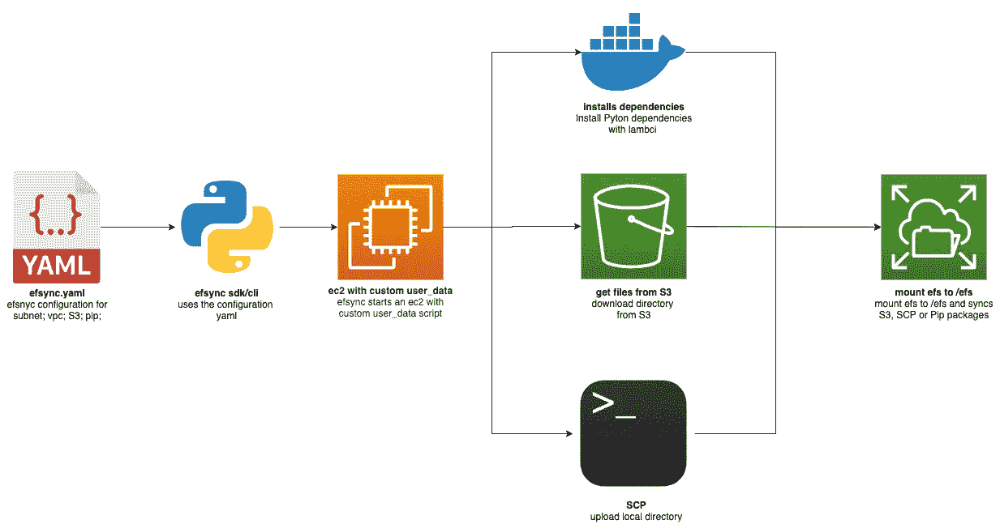

# efsync 我的第一个开源 MLOps 工具包

> 原文：<https://towardsdatascience.com/efsync-my-first-open-source-mlops-toolkit-4af6181d16d6?source=collection_archive---------39----------------------->

## 自动将 Python 依赖项和 ML 模型同步到 AWS Lambda 函数的 AWS EFS

谢栋豪在 [Unsplash](https://unsplash.com/?utm_source=unsplash&utm_medium=referral&utm_content=creditCopyText) 上的照片

*原载于*[*https://www . philschmid . de*](https://www.philschmid.de/efsync-my-first-open-source-mlops-toolkit)*。*

# 介绍

在生产中成功使用机器学习的一部分是 MLOps 的使用。MLOps 通过持续培训(CT)增强 DevOps。因此，MLOps 的主要组成部分包括持续集成(CI)、持续交付(CD)和持续培训(CT)。 [Nvidia 写了一篇文章详细介绍了什么是 MLOps。](https://blogs.nvidia.com/blog/2020/09/03/what-is-mlops/)

我叫菲利普，住在德国的纽伦堡。目前，我在一家科技孵化创业公司担任机器学习工程师。在工作中，我为金融科技和保险公司设计并实现了云原生机器学习架构。我是无服务器和以无服务器方式提供机器学习模型的忠实粉丝。我已经写了两篇关于如何在 AWS Lambda 这样的无服务器环境中使用 BERT 这样的深度学习模型的文章。

在使用像 [AWS Lambda](https://aws.amazon.com/de/lambda/) 、 [Google Cloud Functions](https://cloud.google.com/functions) 、 [Azure Functions](https://azure.microsoft.com/de-de/services/functions/) 这样的工具进行无服务器机器学习时，要克服的一个大障碍是存储。Tensorflow 和 [Pytorch](https://pytorch.org/) 的尺寸很大，像 BERT 这样的新型“艺术级”模型的尺寸超过 300MB。

今年 7 月，AWS 增加了对[亚马逊弹性文件系统(EFS)](https://aws.amazon.com/efs/?nc1=h_ls) 的支持，这是一个适用于 AWS Lambda 的可扩展的弹性 NFS 文件系统。这允许我们将 AWS EFS 文件系统挂载到 AWS Lambda 函数。

直到今天，将依赖项或模型文件同步到 AWS EFS 文件系统还是非常困难的。你可以用 [AWS Datasync](https://docs.aws.amazon.com/efs/latest/ug/gs-step-four-sync-files.html) 来做这件事，或者你可以在同一个子网和 VPC 中启动一个 EC2 实例，并从那里上传你的文件。

为此，我构建了一个名为 [**efsync**](https://github.com/philschmid/efsync) 的 MLOps 工具包。Efsync 是一个 CLI/SDK 工具，它自动将文件从 S3 或本地文件系统同步到 AWS EFS，并使您能够将 AWS Lambda 运行时的依赖项直接安装到您的 EFS 文件系统中。CLI 易于使用，您只需要访问一个 AWS 帐户和一个启动并运行的 AWS EFS 文件系统。

# 体系结构

作者创建的 efsync 架构

# 快速启动

*   **通过 pip3** 安装

*   **将您的 pip 依赖项或文件同步到 AWS EFS**

# 用例

Efsync 涵盖 5 种使用情形。一方面，它允许您安装所需的依赖项，另一方面，efsync 帮助您准备好您的模型，无论是通过从 S3 到 EFS 的同步还是使用 SCP 的本地上传。我为每个用例创建了一个示例 [Jupyter 笔记本](https://github.com/philschmid/efsync#--examples)。

这 5 个使用案例包括:

*   将 Python 与 AWS Lambda 运行时的依赖项直接安装到 EFS 文件系统中，并在 AWS Lambda 函数中使用它们。 [*例题*](https://github.com/philschmid/efsync/blob/main/examples/efsync_pip_packages.ipynb)
*   将 S3 的文件同步到 EFS 的文件系统。 [*例题*](https://github.com/philschmid/efsync/blob/main/examples/efsync_s3_files.ipynb)
*   使用 SCP 将文件上传到 EFS 文件系统。 [*例题*](https://github.com/philschmid/efsync/blob/main/examples/efsync_scp_files.ipynb)
*   安装 Python 依赖项，并从 S3 同步到 EFS 文件系统。 [*例题*](https://github.com/philschmid/efsync/blob/main/examples/efsync_pip_packages_and_s3_files.ipynb)
*   用 SCP 和 EFS 文件系统安装 Python 依赖项和上传文件。 [*例题*](https://github.com/philschmid/efsync/blob/main/examples/efsync_pip_packages_and_scp_files.ipynb)

***注:*** *每个例子都可以在 Google Colab 中运行。*

# 实施配置可能性

在项目中使用 efsync 有 4 种不同的方式:

*   您可以创建一个`yaml`配置并使用 SDK。
*   你可以创建一个 python `dict`并使用 SDK。
*   您可以创建一个`yaml`配置并使用 CLI。
*   您可以使用带参数的 CLI。

您可以在 [Github 资源库](https://github.com/philschmid/efsync#%EF%B8%8F--configurations)中找到每个配置的示例。我还包括了不同用例的配置示例。

***注意*** *:如果你用 scp 从本地目录(如* `*model/bert*` *)同步一个文件到 efs (* `*my_efs_model*` *) efsync 会把模型同步到* `*my_efs_model/bert*` *，这是因为 SCP 递归上传文件。*

# 例子

下面的例子展示了如何将 Python 依赖项安装到 EFS 文件系统，然后将文件从 S3 同步到 EFS 文件系统。出于配置目的，我们必须创建一个`efsync.yaml`和一个`requirements.txt`文件来保存我们的依赖项和配置。

## **1。安装 efsync**

## **2。创建一个** `**requirements.txt**` **和依赖关系**

## **3。用所有需要的配置**创建一个 `**efsync.yaml**`

**`efsync.yaml`包含所有配置，例如:**

****标准配置****

*   **`efs_filesystem_id`:AWS EFS 文件系统 id(挂载点)。**
*   **`subnet_Id`:EFS 文件系统的子网 Id，它运行在。**
*   **`ec2_key_name`:启动 EC2 实例所需的键名。**
*   **`aws_profile`:在`.aws/credentials`中配置的具有所需权限的 IAM 配置文件。**
*   **`aws_region`:EFS 文件系统正在运行的 AWS 区域。**

****Pip 依赖关系配置****

*   **`efs_pip_dir`:EC2 上的 pip 目录，将在此安装依赖项。**
*   **`python_version` **:** 用于安装 pip 包的 Python 版本- >应该作为 lambda 运行时使用。**
*   **`requirements`:requirements . txt 的路径+文件，该文件包含可安装的 pip 依赖项。**

****S3 配置****

*   **`s3_bucket` : S3 斗名从文件中应下载。**
*   **`s3_keyprefix` : S3 keyprefix 为目录/文件**
*   **`file_dir_on_ec2`:保存 S3 文件的目录名**

## ****4。运行 efsync wit** `**efsync.yaml**`**

# **摘要**

**使用[**ef sync**](https://github.com/philschmid/efsync)**您可以轻松地将文件从 S3 或本地文件系统自动同步到 AWS EFS，并允许您将 AWS Lambda 运行时的依赖项直接安装到您的 EFS 文件系统中。从 S3 安装和同步文件大约需要 6 分钟，安装依赖项大约需要 4-5 分钟，同步文件大约需要 2 分钟。****

****你可以在 Github 上找到库[。如果您有任何问题或改进，请随时创建拉动式请求或问题。](https://github.com/philschmid/efsync)****

****感谢阅读。如果你有任何问题，随时联系我或评论这篇文章。你也可以在 [Twitter](https://twitter.com/_philschmid) 或者 [LinkedIn](https://www.linkedin.com/in/philipp-schmid-a6a2bb196/) 上和我联系。****