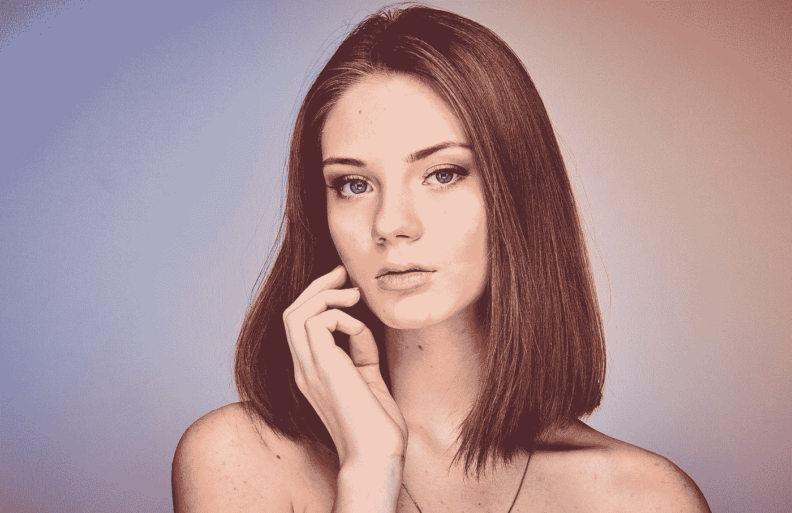
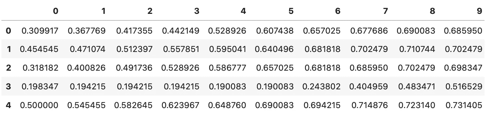
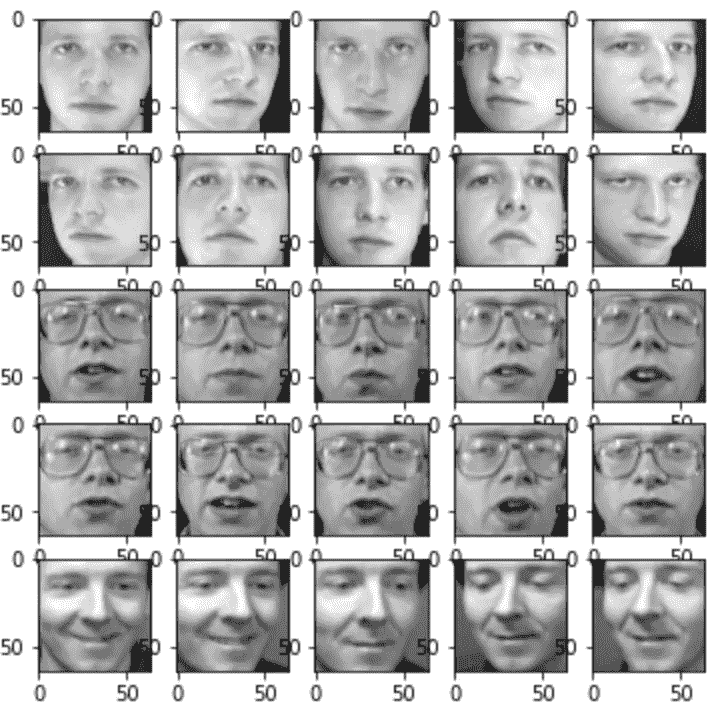
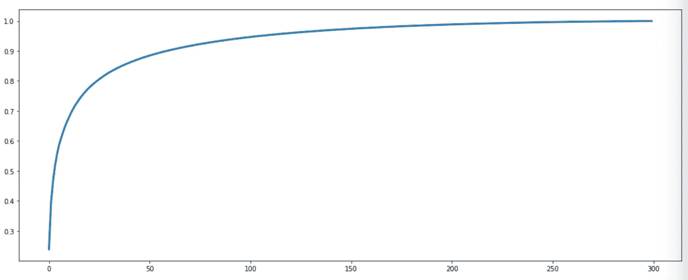
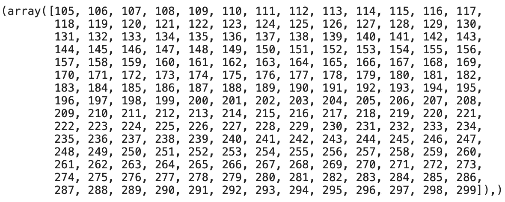
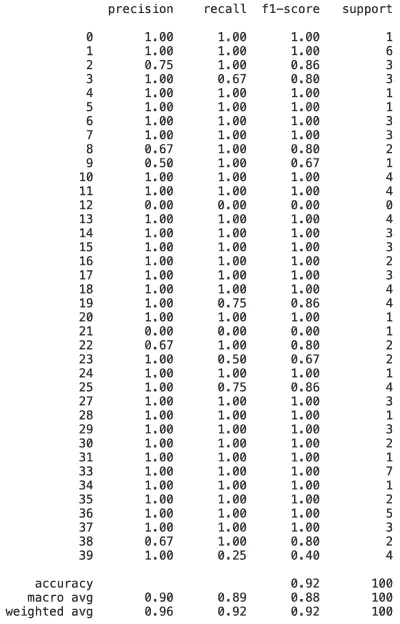

# 特征脸 Python 中的人脸分类

> 原文：<https://towardsdatascience.com/eigenfaces-face-classification-in-python-7b8d2af3d3ea?source=collection_archive---------13----------------------->

## 深度学习的数据不够？试试特征脸。

如今，我们可以使用神经网络来执行最先进的图像分类，或在这种情况下的人脸分类。但是采取一种更简单的方法怎么样呢？这就是本文的目的。



照片由 [x )](https://unsplash.com/@speckfechta?utm_source=medium&utm_medium=referral) 在 [Unsplash](https://unsplash.com?utm_source=medium&utm_medium=referral) 上拍摄

***官方回购:*** [*访问这里*](https://github.com/daradecic/Python-Eigenfaces) *获取数据和代码。*

最初，将原始像素值作为输入特征的想法可能看起来很愚蠢——这很可能是真的，主要是因为我们会丢失所有的 2D 信息，而且还有卷积神经网络来提取重要的特征(因为不是所有的像素都相关)。

今天我们将介绍特征脸算法的思想——它只是一种应用于人脸识别问题的**主成分分析**。通过这样做，我们希望降低数据集的维度，只保留解释最大差异的成分，然后应用简单的分类算法(如 SVM)来完成分类任务。

听起来像是一个计划，但是在阅读这篇文章之前，你应该知道什么？ 这是个好问题。你要精通 Python 和它的数据分析库，也要知道什么是主成分分析，至少在高层是这样的。

*还在读书？那我想你已经具备了先决条件。在开始编写代码之前，我们要讨论的最后一件事是文章结构，可以列举如下:*

*   导入和数据集浏览
*   图像可视化
*   主成分分析
*   模型培训和评估
*   结论

好了，事不宜迟，我们开始吧！

# 导入和数据集浏览

正如您可能已经预料到的那样，我们将需要常见的怀疑对象— *Numpy* 、 *Pandas* 和 *Matplotlib* ，但也将使用来自 *ScikitLearn* 的一堆东西—像 SVM、PCA、train test split 和一些用于评估模型性能的指标。

下面是所有的进口:

```
import numpy as np 
import pandas as pd 
import matplotlib.pyplot as pltfrom sklearn.svm import SVC
from sklearn.model_selection import train_test_split
from sklearn.decomposition import PCA
from sklearn.metrics import confusion_matrix, classification_reportimport warnings
warnings.filterwarnings(‘ignore’)
```

至于数据集，我们已经在 GitHub 上找到了，但现在似乎找不到了。可以从我的 [GitHub 页面](https://github.com/daradecic/Python-Eigenfaces)下载。

下面是你如何把它装载到熊猫身上:

```
df = pd.read_csv(‘face_data.csv’)
df.head()
```



现在，我们可以快速检查数据集的形状:

```
df.shape**>>> (400, 4097)**
```

所以，400 行和 4097 列，一个奇怪的组合。对于这些列，我们这里有**归一化像素值**(表示范围(0，1)内的值)，最后我们有一个**目标**列，指示照片上的人是谁。

如果我们仔细看看目标列的唯一元素的数量，我们会得到数据集中的总人数:

```
df[‘target’].nunique()**>>> 40**
```

由于我们有 4096 个功能，这是一个单一颜色通道中 64x64 图像的清晰指示器:

```
64 * 64**>>> 4096**
```

太好了，我们现在有了关于数据集的一些基本信息，在下一节中，我们将进行一些可视化。

# 图像可视化

为了可视化几张脸，我们将声明一个将 1D 向量转换为 2D 矩阵的函数，并使用 *Matplotlib 的* **imshow** 功能将其显示为灰度图像:

```
def plot_faces(pixels):
    fig, axes = plt.subplots(5, 5, figsize=(6, 6))
    for i, ax in enumerate(axes.flat):
        ax.imshow(np.array(pixels)[i].reshape(64, 64), cmap=’gray’)
    plt.show()
```

但是在绘制之前，我们需要将特征从目标中分离出来，否则，我们的数据集将溢出 64x64 矩阵边界:

```
X = df.drop(‘target’, axis=1)
y = df[‘target’]
```

就这样，现在我们可以使用声明的函数了:



这部分就讲到这里。下一次，我们将执行训练测试分割和 PCA。

# 主成分分析

本节的目标是通过只保留那些解释最大差异的成分来减少问题的维度。简而言之，这是常设仲裁院的一个目标。但在此之前，我们必须将数据集分成训练和测试部分:

```
X_train, X_test, y_train, y_test = train_test_split(X, y)
```

现在，我们可以将主成分分析应用于训练特征。然后很容易画出解释方差的**累积和**，这样我们就可以近似得出多少个主成分就足够了:

```
pca = PCA().fit(X_train)plt.figure(figsize=(18, 7))
plt.plot(pca.explained_variance_ratio_.cumsum(), lw=3)
```



仅通过查看图表，看起来大约 100 个主成分将保持大约 95%的方差，但让我们验证一下这一说法:

```
np.where(pca.explained_variance_ratio_.cumsum() > 0.95)
```



是的，看起来 105 个组件就够了。记住，95%不是一成不变的，你可以自由选择更低或更高的百分比。

让我们再次执行 PCA，但这次使用了额外的 **n_components** 参数:

```
pca = PCA(n_components=105).fit(X_train)
```

最后，我们必须转变培训功能:

```
X_train_pca = pca.transform(X_train)
```

太好了！这一节就到这里，下一节我们将训练和评估 SVM 模型。

# 模型培训和评估

到目前为止，培训功能已经发生了变化。训练模型的过程非常简单，只需制作一个实例并拟合训练数据即可:

```
classifier = SVC().fit(X_train_pca, y_train)
```

厉害！模型现在已经训练好了，为了在测试集上对它进行评估，我们首先需要将测试特征带到同一个**特征空间**。一旦完成，SVM 就被用来做预测:

```
X_test_pca = pca.transform(X_test)
predictions = classifier.predict(X_test_pca)
```

现在我们终于可以看到它的表现了。为此，我们将使用来自 *ScikitLearn* 的**分类 _ 报告**，因为它比 40x40 混淆矩阵更容易查看:

```
print(classification_report(y_test, predictions))
```



所以大约 90%的准确率，对于 40 个不同的类和默认模型来说当然不可怕。

对于本文来说就是这样，让我们在下一节快速浏览一下可能的改进领域。

# 结论

这是一个相当快速的指南——故意的。您可以自由地执行**网格搜索**来为分类器找到最佳超参数，或者甚至使用完全不同的算法。

此外，尝试选择 90%和 99%的解释方差比率，以查看模型性能如何变化。

感谢您的阅读，欢迎在评论区留下您的想法。

*喜欢这篇文章吗？成为* [*中等会员*](https://medium.com/@radecicdario/membership) *继续无限制学习。如果你使用下面的链接，我会收到你的一部分会员费，不需要你额外付费。*

[](https://medium.com/@radecicdario/membership) [## 通过我的推荐链接加入 Medium-Dario rade ci

### 作为一个媒体会员，你的会员费的一部分会给你阅读的作家，你可以完全接触到每一个故事…

medium.com](https://medium.com/@radecicdario/membership)