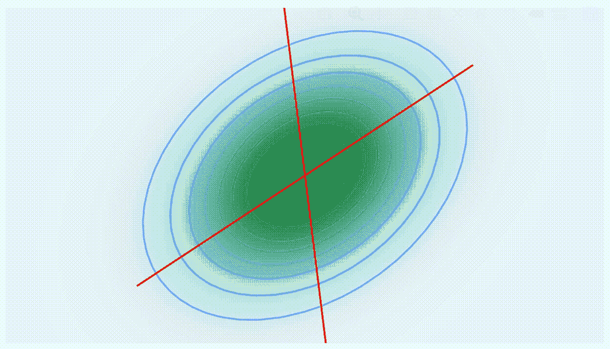
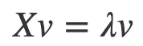
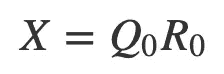
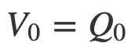
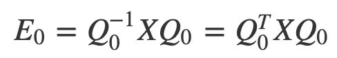
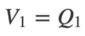
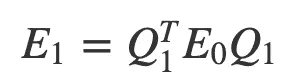
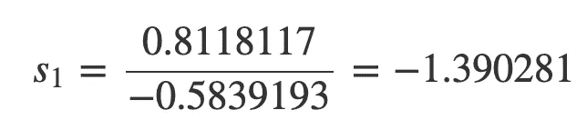
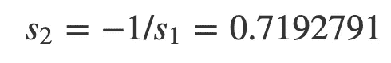

# 特征值和特征向量

> 原文：<https://towardsdatascience.com/eigenvalues-and-eigenvectors-89483fb56d56?source=collection_archive---------15----------------------->

## 计算和可视化



这里有动画:[https://BDS haff . github . io/BDS haff . github . io/blog/2020-03-23-计算-特征值-特征向量/](https://bdshaff.github.io/bdshaff.github.io/blog/2020-03-23-computing-eigenvalues-and-eigenvectors/)

# 这是怎么回事

*   首先，我将谈谈是什么让我对*特征值*实际上是如何计算的感到好奇。
*   然后我分享一下我实现最简单的算法( ***QR 方法*** )做一些基准测试。
*   最后，我将分享你如何将算法寻找*特征向量*的步骤动画化！

# 他们无处不在

特征值和特征向量在数学中随处可见，尤其是应用数学。统计学、机器学习、数据科学都属于这个范畴。

前段时间决定通过实现主成分分析( *PCA* )来学习 Rcpp 和 C++。我知道 *PCA* 问题的解决方案是样本方差-协方差矩阵的特征值分解。我意识到我需要用 C++编写我自己版本的内置`eigen`函数，那时我意识到除了一个 *2x2* 案例，我不知道`eigen`实际上是如何工作的。我发现的是我在这里读到的[的 ***QR 法*** 。](https://people.inf.ethz.ch/arbenz/ewp/Lnotes/chapter4.pdf)

# 为什么 n > 2 不一样

有了一个 *2x2* 矩阵，我们可以手动求解特征值。这是可行的，因为一个 2x2 矩阵的行列式是一个二次多项式，所以我们可以用正规代数来分解和求解它。但是如何计算大型矩阵的特征值呢？事实证明，当你不能分解和求解多项式时，你真正应该做的是分解矩阵。纯属巧合的是，*数字爱好者* YouTube 频道最近发布了一个关于这个想法的视频[在这里](https://www.youtube.com/watch?v=wTUSz-HSaBg)。如果你对这种类型的内容感兴趣，值得一试！

# 快速复习:它们是什么？

首先，快速复习一下什么是*特征值*和*特征向量*。取一个方阵 ***X*** 。如果有一个矢量 ***v*** 和一个标量 ***λ*** 这样



那么 **v** 就是**XT5*T7*λ****就是***X*** 对应的特征值。

换句话说，如果你把 ***v*** 乘以 ***X*** 看作是对***v*** 应用一个函数，那么对于这个特定的向量 ***v*** 来说，这个函数不过是一个拉伸/挤压标量乘法。通常，将一个向量乘以一个矩阵等于取向量分量的线性组合。但是如果你取一个*特征向量*，你不需要做所有的计算。只要乘以*特征值*就都好了。

# 计算:QR 方法

计算*特征值*和*特征向量*的 ***QR 法*** 从我心爱的 *QR 矩阵分解*开始。我在[之前的帖子](/qr-matrix-factorization-15bae43a6b2)中写过。这种分解允许将矩阵 ***X=QR*** 表示为正交矩阵 ***Q*** 和上三角矩阵 ***R*** 的乘积。同样， ***Q*** 正交的事实很重要。

用于寻找特征值的 ***QR 方法*** 的中心思想是将 *QR 矩阵分解*迭代应用于原始矩阵 ***X*** 。

# 相似矩阵

这里我需要提一下 ***X*** 的*特征值*的一个数学性质。如果我们取任何一个可逆矩阵 ***M*** 那么这个矩阵


将具有与 ***X*** 相同的*特征值*。这样的矩阵 ***E*** 和 ***X*** 在形式上定义为 ***相似矩阵*** ，简单来说就是它们具有相同的*特征值*。然而*特征向量*将会不同。同样，回想一下 ***QR*** 中的 ***Q*** 是正交的，因此是必然的。

# QR 算法

所以， ***QR 方法*** 的思想是迭代以下步骤

1.  将 *QR 分解*应用于 ***X*** 以便



2.让



和计算



注: ***E*** 是 ***类似于*** 到 ***X*** 。它们的*特征值*是相同的。

3.然后分解


4.因此



和



5.用 ***E*** 迭代单元本质上是对角的。

当 ***E*** 是对角线时，你得到的是对角线上的*特征值*，而 ***V*** 是**特征向量！**

这是 ***QR 法的最简单版本。有几个改进的版本，我就不赘述了，但是你可以在这里读到它们[。](https://people.inf.ethz.ch/arbenz/ewp/Lnotes/chapter4.pdf)***

接下来，我想用 R 和 C++编写一个函数来实现这个方法，并验证它是否有效。

# 简单实现

我们将这样做:

1.  展示一个用`R`编写的函数，该函数明确实现了用于寻找*特征值*的 ***QR 方法*** 。
2.  通过将结果与内置的`eigen`函数进行比较来验证它是否工作。
3.  在`C++`中实现相同的功能，并通过`myc`包可用。验证它是否也能正常工作。
4.  最后，比较它们的性能。

以下是我将使用的软件包:

```
library(tidyverse)
library(microbenchmark)
library(plotly)
library(myc)
```

# R 函数

`my_eigen`是一个非常简单的函数。前几行执行 ***QR 方法*** 的初始迭代。然后 while 循环迭代，直到 ***E*** 矩阵的对角线稳定下来，并且不再变化超过小的余量。带有`values`和`vectors`的返回列表应该与`eigen`函数返回的相同。对于 ***QR 分解*** 步骤，我使用的是`myc`包中的`myc_qr`。

```
my_eigen <- function(A, margin = 1e-20) {
  Q <- myc_qr(A)$Q
  E <- t(Q) %*% A %*% Q
  U <- Q
  res <- diag(E)
  init <- diag(A)
  while (sum((init - res)^2) > margin) {
    init <- res
    Q <- myc_qr(E)$Q
    E <- t(Q) %*% E %*% Q
    U <- U %*% Q
    res <- diag(E)
  }
  return(list(values = round(diag(E), 6), vecotrs = U))
}
```

# 验证它是否有效

让我们检查一下它是否工作。我将使用对称矩阵，因为我想确保特征值不是复数。

```
X <- matrix(c(
  3, 2, 3, 2,
  5, 1, 5, 4,
  9, 3, 2, 1,
  4, 5, 6, 7
), ncol = 4)

A <- t(X) %*% X
```

这是一个矩阵，我将使用它来验证我的函数是否按预期工作。

```
A##      [,1] [,2] [,3] [,4]
## [1,]   26   40   41   54
## [2,]   40   67   62   83
## [3,]   41   62   95   70
## [4,]   54   83   70  126
```

下面是内置的`eigen`函数返回的内容。

```
eigen(A)## eigen() decomposition
## $values
## [1] 268.6301739  39.1116701   5.8239493   0.4342066
## 
## $vectors
##            [,1]        [,2]         [,3]       [,4]
## [1,] -0.3085888  0.02606027 -0.001691293  0.9508370
## [2,] -0.4823478  0.07140554 -0.858273366 -0.1600270
## [3,] -0.5053596 -0.81601931  0.242450805 -0.1412152
## [4,] -0.6455425  0.57300488  0.452306949 -0.2244074
```

正如您在下面看到的，当调用`my_eigen`函数时，结果是相同的。

```
my_eigen(A)## $values
## [1] 268.630174  39.111670   5.823949   0.434207
## 
## $vecotrs
##           [,1]        [,2]         [,3]       [,4]
## [1,] 0.3085888  0.02606027  0.001691289 -0.9508370
## [2,] 0.4823478  0.07140567  0.858273355  0.1600270
## [3,] 0.5053596 -0.81601935 -0.242450683  0.1412152
## [4,] 0.6455425  0.57300481 -0.452307035  0.2244074
```

当调用`Rcpp`版本的`myc_eigen`函数时，结果也是一样的。

```
myc_eigen(A)## $values
## [1] 268.6301739  39.1116701   5.8239493   0.4342066
## 
## $vectors
##           [,1]        [,2]         [,3]       [,4]
## [1,] 0.3085888  0.02606027  0.001691289 -0.9508370
## [2,] 0.4823478  0.07140567  0.858273355  0.1600270
## [3,] 0.5053596 -0.81601935 -0.242450683  0.1412152
## [4,] 0.6455425  0.57300481 -0.452307035  0.2244074
```

此外，我们可以通过比较将*和 ***λ*** 应用于*特征向量*的结果，并检查它们是否相等，来验证计算的分解是否正确。*

```
*eigen_decomp <- myc_eigen(A)

v <- eigen_decomp$vectors[, 2]
l <- eigen_decomp$values[2]*
```

*这里我们应用矩阵。*

```
*as.numeric(A %*% v)## [1]   1.019261   2.792791 -31.915878  22.411177*
```

*和预期的缩放比例 ***v*** 由 ***λ*** 给出相同的矢量。数值似乎朝着第 7 个有效数字有一点分歧，但解决方案是可以接受的接近。*

```
*(l * v)## [1]   1.019261   2.792795 -31.915880  22.411175*
```

# *标杆管理*

*出于兴趣，我想比较一下这些函数计算特征值的速度。看起来在一个小矩阵上，比如我们在内置的`eigen`函数上面使用的 *4x4* 矩阵，会慢一点。*

```
*microbenchmark(eigen(A), my_eigen(A), myc_eigen(A))## Unit: microseconds
##          expr     min       lq      mean   median      uq     max
##      eigen(A) 179.003 191.6580 211.15584 201.8395 230.539 326.666   
##   my_eigen(A) 140.156 151.9090 161.32797 160.7745 169.035 221.650   
##  myc_eigen(A)  61.102  65.6775  71.19684  69.7855  75.054  92.629* 
```

*如果我们采用更大的矩阵，那么`eigen`当然会更快。这个`Rcpp`版本的 is my 函数只比纯`R`函数快一点，可能是因为它使用了一个矩阵乘法函数`myc_matmult`，这个函数明显比`%*%`操作符慢。*

```
*X <- matrix(rnorm(100), ncol = 10)
A <- t(X) %*% X

microbenchmark(eigen(A), my_eigen(A), myc_eigen(A))## Unit: microseconds
##      expr      min       lq      mean   median        uq      max
    eigen(A)  187.839  203.035  361.0305  230.057  341.2605  1444.53
 my_eigen(A) 1698.668 1775.423 3067.5417 1911.548 2908.7345 18626.75
myc_eigen(A) 1225.512 1299.820 2178.2306 1547.336 2394.2235 12239.43* 
```

# *可视化和动画*

*显然自己实施 ***QR 方法*** 并不是为了更好的表现。然而，我们能做的是构建一个函数，跟踪值是如何计算的，也许能更好地了解它是如何工作的。*

*下面是一个函数`my_eigen2`，它执行与`my_eigen`函数相同的计算，除了它不使用 while 循环，而是迭代给定的最大次数，并记录更新后的*特征值*。如果计算收敛，则迭代在达到给定的最大值之前停止。*

```
*my_eigen2 <- function(A, margin = 1e-10, itrs = 40) {
  Q <- myc_qr(A)$Q
  Qt <- t(Q)

  Elist <- vector("list", length = 21)
  Ulist <- vector("list", length = 21)

  E <- t(Q) %*% A %*% Q
  U <- Q

  Elist[[1]] <- E
  Ulist[[1]] <- U

  res <- diag(E)
  for (i in 1:itrs) {
    init <- res
    Q <- myc_qr(E)$Q
    E <- t(Q) %*% E %*% Q
    U <- U %*% Q
    Elist[[i + 1]] <- E
    Ulist[[i + 1]] <- U
    res <- diag(E)
    print(sum((init - res)^2))
    if (sum((init - res)^2) < margin) {
      break()
    }
  }

  return(list(
    values = round(diag(E), 6),
    vectors = U,
    Elist = Elist[1:i],
    Ulist = Ulist[1:i]
  ))
}*
```

# *想象一个 2 乘 2 的案例*

*为了可视化 ***QR 方法*** 如何工作，我决定使用一个 *2x2* 协方差矩阵。这是为了使其与 *PCA* 相关，并使其易于实际可视化。*

```
*A <- matrix(c(
  1.0, 0.3,
  0.3, 0.8
), nrow = 2)

A##      [,1] [,2]
## [1,]  1.0  0.3
## [2,]  0.3  0.8*
```

*首先，我们让`my_eigen2`进行计算，并建立矩阵列表，记录 ***QR 方法*** 如何收敛到答案。在 9 个步骤之后，计算收敛。*

```
*eigen_decomps <- my_eigen2(A, itrs = 30)## [1] 0.005127351
## [1] 0.0003368977
## [1] 1.882642e-05
## [1] 1.011322e-06
## [1] 5.382776e-08
## [1] 2.858891e-09
## [1] 1.517664e-10
## [1] 8.055721e-12*
```

*这些是实际的*特征值*和*特征向量*:*

```
*eigen_decomps$values## [1] 1.216227 0.583773eigen_decomps$vectors##           [,1]       [,2]
## [1,] 0.8118117 -0.5839193
## [2,] 0.5839193  0.8118117*
```

*以下代码在计算的每一步提取两个*特征向量*的方向，并将它们堆叠到 data.frame 中。我们可以使用这些来计算斜率，然后将它们可视化在密度图上。*

*正确的斜率是*

**

*和*

**

```
*animation_data <-
  map2(eigen_decomps$Elist, eigen_decomps$Ulist, 
            ~ as.data.frame(1 / .x %*% .y)) %>%
  bind_rows(.id = "frame") %>%
  rename(x1 = "V1", y1 = "V2") %>%
  bind_cols(d = rep(c("d1", "d2"), length(eigen_decomps$Elist))) %>%
  pivot_wider(names_from = d, values_from = c(x1, y1)) %>%
  bind_cols(
    x0 = rep(0, length(eigen_decomps$Elist)),
    y0 = rep(0, length(eigen_decomps$Elist))
  ) %>%
  mutate(frame = as.numeric(frame)) %>%
  mutate(
    slope1 = y1_d1 / x1_d1,
    slope2 = y1_d2 / x1_d2
  )

animation_data## # A tibble: 8 x 9
##   frame x1_d1 x1_d2 y1_d1 y1_d2    x0    y0 slope1 slope2
##   <dbl> <dbl> <dbl> <dbl> <dbl> <dbl> <dbl>  <dbl>  <dbl>
## 1     1 0.865  2.67 -7.00  1.76     0     0  -8.09  0.659
## 2     2 0.893  2.79 -2.27  2.03     0     0  -2.54  0.727
## 3     3 0.941  2.88 -1.71  2.10     0     0  -1.81  0.729
## 4     4 0.975  2.91 -1.53  2.11     0     0  -1.57  0.725
## 5     5 0.994  2.92 -1.46  2.11     0     0  -1.47  0.723
## 6     6 1.00   2.93 -1.43  2.11     0     0  -1.43  0.722
## 7     7 1.01   2.93 -1.42  2.11     0     0  -1.41  0.721
## 8     8 1.01   2.93 -1.41  2.11     0     0  -1.40  0.721*
```

*使用`ggplot`和`plotly`,我们可以生成以下动画可视化*

```
*data.grid <-expand.grid(x = seq(-5, 5, length.out = 200), 
                        y = seq(-5, 5, length.out = 200))dens <- cbind(data.grid, 
             z = mvtnorm::dmvnorm(data.grid, 
                                     mean = c(0, 0), 
                                     sigma = A))

ggplotly(
  ggplot(dens, aes(x = x, y = y, z = z)) +
    geom_contour(color = "blue", alpha = 0.3) +
    coord_fixed(xlim = c(-2, 2), ylim = c(-2, 2), ratio = 1) +
    geom_abline(aes(slope = slope1, intercept = 0, frame = frame),
      color = "red", data = animation_data
    ) +
    geom_abline(aes(slope = slope2, intercept = 0, frame = frame),
      color = "red", data = animation_data
    ) +
    theme_void() +
    theme(
      legend.position = "none",
      axis.line = element_blank(),
      panel.grid.major = element_blank()
    ) +
    geom_raster(aes(fill = z)) +
    scale_fill_gradientn(colours = RColorBrewer::brewer.pal(n = 5, name = "BuGn"))
) %>%
  animation_opts(frame = 500, redraw = TRUE) %>%
  style(hoverinfo = "skip")*
```

**

*可以在这里查看我博客上的实际动画:[https://BDS haff . github . io/BDS haff . github . io/blog/2020-03-23-计算-特征值-和-特征向量/](https://bdshaff.github.io/bdshaff.github.io/blog/2020-03-23-computing-eigenvalues-and-eigenvectors/)*

# *我的外卖*

1.  *我真的很感谢 LAPACK 或 Armadillo 这样的数值线性代数库，因为经历了最简单的特征值计算方法，我可以更好地欣赏创建它们的所有工作。*
2.  *通过这个练习，我对计算特征值背后的细节变得非常熟悉。虽然有时令人沮丧，但我真的觉得我学到了很多东西，在我看来，真正彻底地学习了一些东西的感觉是最好的感觉之一。*