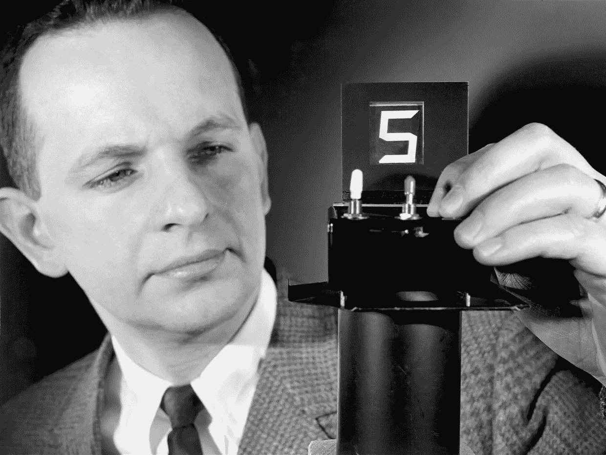

# 开始数据科学项目前要问的八个问题

> 原文：<https://towardsdatascience.com/eight-questions-to-ask-before-starting-a-data-science-project-cc5be3005f2a?source=collection_archive---------64----------------------->

## 或者，如何像 DARPA 一样进行项目管理

图片来源: [Pixabay](https://pixabay.com/illustrations/blueprint-technical-drawing-4056027/)

如果你熟悉国防高级研究计划局(DARPA)，这个名字可能会让人联想到未来的军事技术、人形机器人和机械四足动物，所有这些都包裹在政府机密研究的神秘之中。你也不会太离谱。快速搜索就会出现为士兵设计的软[外骨骼](https://www.digitaltrends.com/cool-tech/darpa-invests-super-light-exoskeleton-soldiers/)、千兆像素相机技术、[机器人群体战术](https://www.darpa.mil/program/offensive-swarm-enabled-tactics)以及数百个其他 DARPA 赞助的研发项目。然而，该机构对数据科学的一个被忽视的贡献是其决策方法。

DARPA 概述

该机构的研究是科幻小说和汤姆·克兰西小说的素材。然而，人们很容易忘记 DARPA 也是一个(深呼吸)官僚机构，有完整的等级制度、标准操作程序和文书工作。也许这没有想象中的[自我修复材料](https://futurism.com/darpa-is-working-to-make-homes-that-grow-and-can-repair-themselves)和[精神控制机器](https://www.popularmechanics.com/military/research/a27560088/darpa-soldier-machine/)有趣，但它确实回避了一个问题:所有的脑力都由他们支配，该机构如何选择追求哪些项目？

这是我们在数据科学和职业生活中每天都要面对的问题。我们的资源是有限的，项目失败是昂贵的，机会成本是真实的，那么哪些风险是值得冒的呢？

> Heilmeier 的教义问答有助于将有趣的项目与重要的项目分开。

乔治·海尔迈耶:1975-1977 年间，工程师、发明家和 DARPA 主任。据该机构称，他精心设计了一套八个问题，“任何提出研究项目或产品开发努力的人都应该能够回答。”今天，它们被称为 Heilmeier Catechism，DARPA 仍然在项目提案和项目经理申请过程中使用它们。数据科学项目受益于问同样的问题。

*乔治·h·赫利迈尔，图片来源:* [*DARPA*](https://www.darpa.mil/work-with-us/heilmeier-catechism) *(公共领域)*

# 开始项目前要问的八个问题:

1.  你想做什么？绝对不要使用行话来阐明你的目标。
2.  今天是如何做到的，当前实践的局限性是什么？
3.  你的方法有什么创新，为什么你认为它会成功？
4.  谁在乎呢。如果你成功了，会有什么不同呢？
5.  有什么风险？
6.  要花多少钱？
7.  需要多长时间？
8.  检查成功的期中和期末“考试”有哪些？

回答 Heilmeier 的问题将节省您和他人的时间。一些承担较大技术项目的办公室甚至会将这些问题作为建议书的强制性内容。即使不是必需的，通读 Heilmeier 的教义问答也可以帮助区分有趣的项目和重要的项目。以下是关于每个组件如何与数据科学流程相关的一些想法。

你想做什么？绝对不要使用行话来阐明你的目标。第二句话值得特别注意。数据科学家在他们的职业生涯中花了大量时间在各方之间翻译技术语言，当不与其他数据书呆子交谈时，行话充其量是低效的。在最坏的情况下，利益相关者可能会发现你居高临下，与问题脱节——他们可能会把你叫出来。行话也为误解提供了大量的机会。

**如今是如何做到的，目前的做法有哪些局限？**这个问题的范围值得思考——与其他地方相比，这里的*是如何做到的*？这个问题很快回答了解决方案是否已经存在——这是利益相关者想要知道的。了解数据科学领域当前的最佳实践，以及您的组织是否在使用它们。目前的方法还能更好吗？要诚实。

**你的方法有什么创新，为什么你认为它会成功？一旦我们确定了其他人是如何处理这个问题的，考虑一下为什么。我们是在向我们的组织提议真正新颖的东西吗？新奇的想法出奇的少，但是即使我们提出的解决方案存在于其他地方，将其应用于我们的组织仍然是有价值的。如果一个解决方案可以解决手头的问题，经理或客户可能根本不在乎这个解决方案是否在其他地方使用过。**

谁在乎呢？如果你成功了，会有什么不同呢？这个项目重要还是只是学术上的兴趣？如果我们提出一种新的方法，只是为了看看某物能弯曲和拉伸到什么程度，这个项目可能不属于“重要”的类别。在数据科学中，一个定义明确的问题在这里会有所帮助。项目在解决什么问题，为什么它很重要？

> 我们的资源是有限的，项目失败是昂贵的，机会成本是真实的，那么哪些风险是值得冒的呢？

**有什么风险？要花多少钱？需要多长时间？简言之，谨慎的成功比意外的失败更可取。考虑追求项目的机会成本和减轻风险的可用机制，并了解您的意外情况。对于数据科学家来说，洞察这些可能需要与利益相关者进行额外的对话。这是我们可能都需要更多练习的地方。**

**检查成功的期中和期末“考试”是什么？我们必须对自己负责。想想真正的进步是什么样的，如何衡量。在数据科学中，管理对自己和投资方的期望可能是成功和失败的区别。利用你对潜在风险的了解来设定明确的预期，并与相关方进行沟通。**

从 DARPA 那里可以学到很多其他的创新经验。在 2016 年的[报告](https://www.darpa.mil/attachments/DARPA_Innovation_2016.pdf)中，该机构将其在创新方面的成功归功于员工有限的任期和它提供的紧迫性(DARPA 项目经理的年流失率约为 25%)，以及冒险和对失败的容忍度。查看他们的[网站](https://www.darpa.mil/about-us/about-darpa)了解更多信息。