# 爱因斯坦，以及所有理论中最美丽的

> 原文：<https://towardsdatascience.com/einstein-and-the-most-beautiful-of-all-theories-f4ad4ce7a0a2?source=collection_archive---------7----------------------->

图片由[com break](https://pixabay.com/fr/users/Comfreak-51581/?utm_source=link-attribution&utm_medium=referral&utm_campaign=image&utm_content=1388582)来自 [Pixabay](https://pixabay.com/fr/?utm_source=link-attribution&utm_medium=referral&utm_campaign=image&utm_content=1388582)

## 广义相对论如何解释水星近日点的“异常”进动

英国理论物理学家保罗·狄拉克(1902–1984)是量子力学的创始人之一，他曾写道:

“很难将牛顿引力理论及其力的瞬时传播与狭义相对论的要求相协调，爱因斯坦在这一困难上的工作导致了他的相对论的推广——这可能是有史以来最伟大的科学发现。”

[广义相对论](https://en.wikipedia.org/wiki/General_relativity)被普遍认为是一个异常美妙的理论。几年来的几次测试证实了这一理论的一致性。我来描述一下[其中一个测试](https://en.wikipedia.org/wiki/Tests_of_general_relativity)，它正确解释了水星近日点的“异常”进动(见[链接](https://en.wikipedia.org/wiki/Tests_of_general_relativity))[牛顿的引力理论](https://en.wikipedia.org/wiki/Newton%27s_law_of_universal_gravitation)未能预测到。

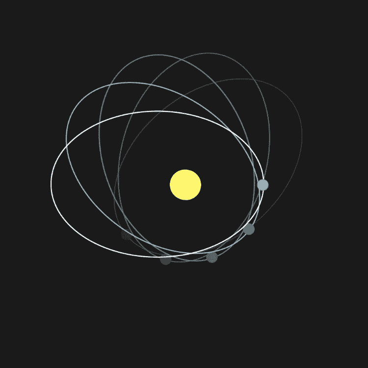

图 1:图为水星近日点进动([来源](https://en.wikipedia.org/wiki/Tests_of_general_relativity#Perihelion_precession_of_Mercury))。

## 牛顿理论的问题是

近日点(行星轨道上离太阳最近的点)的进动(或旋转)有多种原因。其中两个是:

*   其他行星的存在导致了彼此轨道的扰动，这是主要原因
*   太阳的[扁率](https://en.wikipedia.org/wiki/Flattening)(见图)明显不太相关

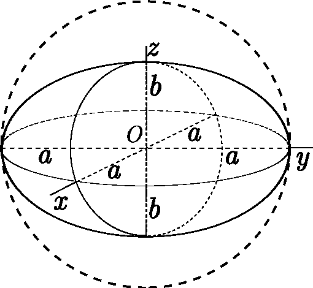

图 2:该图显示了一个半径被压缩成扁椭球体的球体([来源](https://en.wikipedia.org/wiki/Flattening))。

水星岁差的近日点速率与牛顿引力理论的预测不符。法国天文学家和数学家于尔班·勒·威耶注意到了这一异常现象。由 T2·西蒙·纽康·T3 在 1882 年进行的最后一次测量估计，实际的岁差率与牛顿的预测相差 43 度。提出了许多特别的解决方案，但没有一个奏效。

正如下一节将要讨论的，在广义相对论中，这个额外的岁差完全可以用爱因斯坦的广义相对论来解释。对于后者的修订版，请查看下面的文章。

 [## 爱因斯坦引力方程的启发式推导

### 从简单论证中获得爱因斯坦方程

towardsdatascience.com](/a-heuristic-derivation-of-einsteins-gravity-equations-8d3659c8a46c) 

## 用广义相对论计算水星的近日点进动

史瓦西解是描述太阳周围真空时空几何的爱因斯坦场方程的解。换句话说，史瓦西度规是太阳产生的时空曲率导致的太阳系度规。在以下情况下有效:

*   将太阳视为不旋转的物体
*   忽略源自太阳系其他行星的引力场。

史瓦西解具有以下线元素:

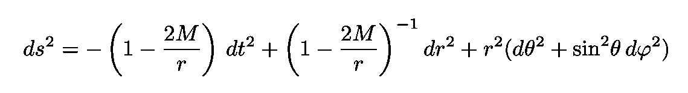

方程式 1:描述太阳周围真空时空几何的史瓦西解的线元素。

参数 *R* = 2 *M* 称为[史瓦西半径](https://en.wikipedia.org/wiki/Schwarzschild_radius)。坐标 *r* 、 *θ、*和 *φ* 为球面坐标，如图 3 所示。

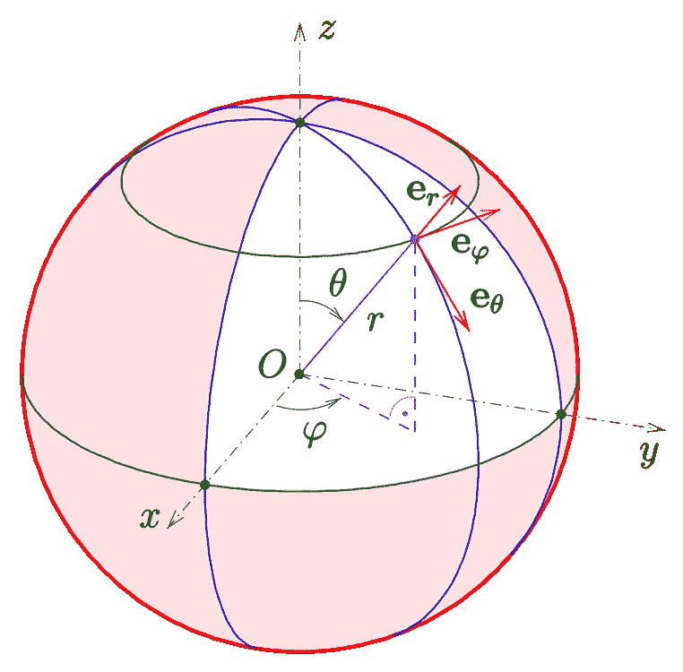

图 3:球坐标([来源](https://en.wikipedia.org/wiki/Spherical_coordinate_system))。

注意，从度规的各向同性来看，我们总是有θ = π/2(轨道被限制在赤道处)。事实上，根据[两体问题](https://en.wikipedia.org/wiki/Two-body_problem)(在我们的例子中，天体是太阳和行星)，受中心力势作用的天体的运动将始终位于一个平面内。图 4 和图 5 示出了两种类型的轨道双体系统。限于平面的运动在牛顿和爱因斯坦引力理论中都是有效的。因此，在我们的分析中，只考虑位于该平面内的测地线就足够了。

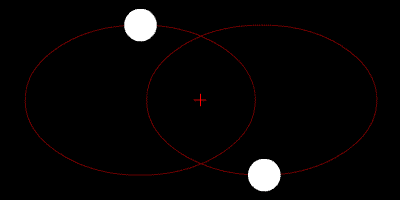

图 4:两个质量相同的天体围绕一个共同的[重心](https://en.wikipedia.org/wiki/Barycenter)运行，在两个天体之外(这种情况出现在例如双星中)([来源](https://en.wikipedia.org/wiki/Two-body_problem))。

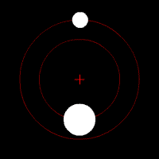

图 5:两个质量不同的物体围绕一个共同的重心运行([来源](https://en.wikipedia.org/wiki/Two-body_problem))。

该分析有效的第三个条件是径向坐标 *r* 必须远大于太阳的半径。这不是问题，因为太阳的史瓦西半径比太阳半径小得多。更具体地说，太阳的史瓦西半径大约为 2.95×10 米，而太阳的半径接近 6.96×10⁸米

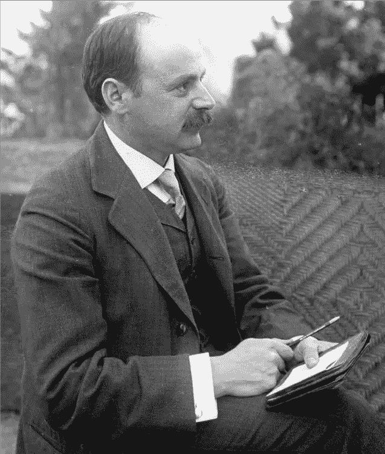

图 6:****德国物理学家和天文学家**卡尔·史瓦西** ( [来源](https://en.wikipedia.org/wiki/Karl_Schwarzschild))****

****给定时空的对称性与在其中运动的粒子和光子的守恒量有关。由于史瓦西解的度规 ***g*** 既与时间无关(或[时间平移不变量](https://en.wikipedia.org/wiki/Time_translation_symmetry))又[球对称](https://en.wikipedia.org/wiki/Spherically_symmetric_spacetime)，所以大质量粒子的能量和光子的能量都是守恒的。我们可以从数学上看到如下。****

****在一个度规为 ***g*** 的时空中，一个自由下落的物质粒子或光子遵守与那个时空相关的[测地线方程](https://en.wikipedia.org/wiki/Geodesics_in_general_relativity)(一条“直线”对弯曲时空的推广)，它由(见[史高斯](https://books.google.com.br/books?id=GgRRt7AbdwQC&printsec=frontcover&dq=schutz+relativity&hl=en&sa=X&ved=0ahUKEwjfmauknPboAhX9HrkGHaEyDAwQ6AEIMjAB#v=onepage&q=schutz%20relativity&f=false))给出:****

****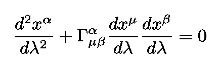****

****方程 2:测地线方程，由自由下落的物质粒子或光子遵守。****

****注意，由于光子也会被考虑，参数*λ*不可能是合适的时间 τ。*测地线方程也可以写成:*****

**********

*****方程 3:测地线方程，用另一种形式写成。*****

*****现在请注意:*****

**********

*****等式 4:时间和坐标ϕ.中度量的常数分量*****

*****Eqs。3 和 4 意味着:*****

**********

*****等式 5:测地线的运动常数。*****

*****然后我们做如下定义:*****

*****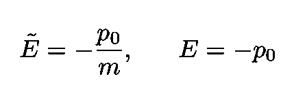*****

*****等式 6:大质量粒子每单位质量的能量和光子的能量。*****

*****大质量粒子能量上面的~(见[史高斯](https://books.google.com.br/books?id=GgRRt7AbdwQC&printsec=frontcover&dq=schutz+relativity&hl=en&sa=X&ved=0ahUKEwjfmauknPboAhX9HrkGHaEyDAwQ6AEIMjAB#v=onepage&q=schutz%20relativity&f=false))用来表示这个能量是*每单位质量*。同理，由于 ***g*** 对 *φ* 的独立性，角动量是守恒的。我们定义:*****

*****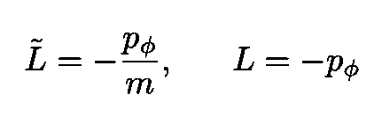*****

*****方程式 7:大质量粒子单位质量的角动量和光子的角动量。*****

*****其中左边的项是大质量粒子每单位质量的角动量，右边的项是光子的角动量。我们现在需要轨道方程。大质量粒子动量的三个分量是:*****

*****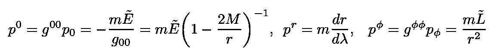*****

*****等式 8:大质量粒子的三个动量分量。*****

*****光子的动量是:*****

**********

*****方程式 9:光子动量的三个分量。*****

*****我们现在使用我们刚刚导出的动量分量，将它们代入粒子和光子的方程| **p** |=- *m* ，并求解 *dr* / *dλ* 。用于 *dr* / *dλ* 然后的等式为:*****

*****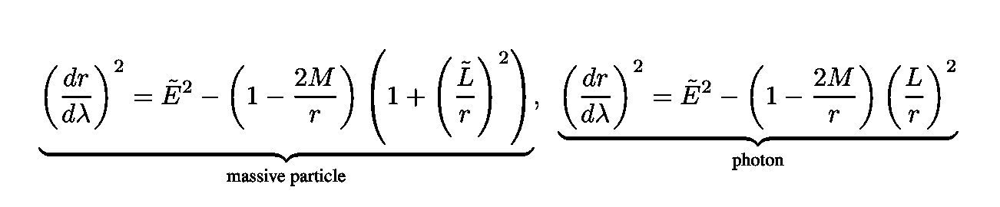*****

*****等式 10:关于 *dr* / *dλ平方的等式。******

*****现在直觉告诉我们用有效势改写这些方程，即:*****

*****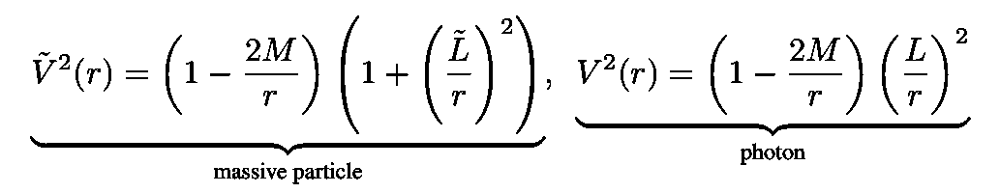*****

*****方程 11:大质量粒子和光子的有效势的定义。*****

*****电势绘制在图 7 中。注意，由于两个方程的左边都是正的，有效势必然小于能量。图 7 显示了有质量和无质量粒子的有效势(注意图 7 中的 *E* 和 *V* 表示相同的量，上面有波浪符号~)。图中还标出了 *dr/dλ* =0 的转折点，禁域(其中 *E* < *V* )和圆形轨道(稳定和不稳定)，其中 *dV /dr* =0。*****

*****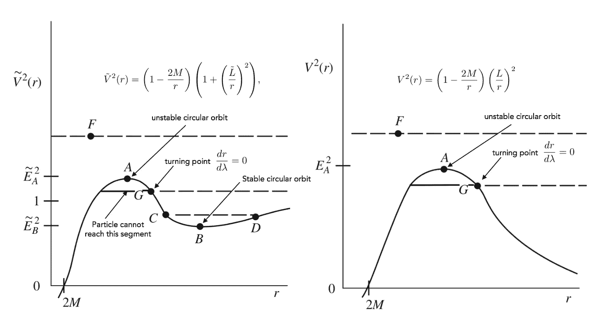*****

*****图 7:有质量和无质量粒子(光子)的有效势。该图显示了稳定(最小值)和不稳定(最大值)的转折点、禁区和圆形轨道。*****

## *****水星近日点的进动*****

*****从现在起，让我们只考虑大质量物体的运动，因为我们的目标是计算水星近日点的进动。*****

*****稳定的圆形轨道出现在有效势的最小值处。设 *M* 为太阳质量。对有效势求微分，将结果设为零，求解 *r* 我们得到稳定圆轨道的半径:*****

*****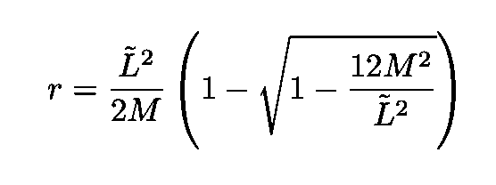*****

*****方程 12:围绕太阳振荡的大质量粒子的稳定圆形轨道的半径。*****

*****在牛顿力学中，行星在圆形轨道上的完整轨道返回到其初始 *φ。*现在利用圆轨道有 *E* = *V* 的事实，并利用到目前为止推导出的表达式，我们得到一颗行星拥有δ*φ=*2*π，*的时间，即周期 *P* :*****

*****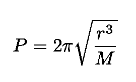*****

*****等式 13:行星绕太阳旋转周期的牛顿结果。*****

*****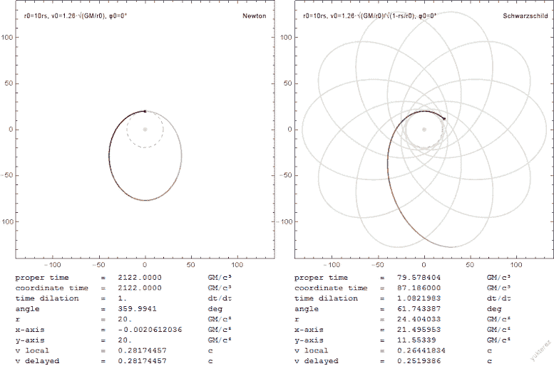*****

*****图 8:图中显示了一个测试粒子遵循牛顿万有引力定律或爱因斯坦方程的轨道之间的差异([来源](https://en.wikipedia.org/wiki/Two-body_problem_in_general_relativity))。*****

*****现在，在广义相对论中，旋转的行星不会回到它的原点。如果相对论效应很小，我们应该有一个绕着中心缓慢旋转的椭圆。我们能做的(见[史高斯](https://books.google.com.br/books?id=GgRRt7AbdwQC&printsec=frontcover&dq=schutz+relativity&hl=en&sa=X&ved=0ahUKEwjfmauknPboAhX9HrkGHaEyDAwQ6AEIMjAB#v=onepage&q=schutz%20relativity&f=false))是检查轨道近日点的运动。为此，我们进行三个快速计算(见[史高斯](https://books.google.com.br/books?id=GgRRt7AbdwQC&printsec=frontcover&dq=schutz+relativity&hl=en&sa=X&ved=0ahUKEwjfmauknPboAhX9HrkGHaEyDAwQ6AEIMjAB#v=onepage&q=schutz%20relativity&f=false)):*****

*   *****根据角动量推导出 *dφ* /dλ的表达式*****
*   *****根据单位质量的能量推导出 *dt* / *dλ* 的表达式*****
*   *****定义新变量 *u* ≡ 1/ *r******

*****将它们代入等式。10 我们得到:*****

*****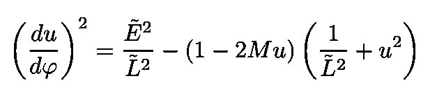*****

*****等式 14:du/dφ的相对论表达式。*****

*****我们现在定义 *y，**圆度偏差如下:******

******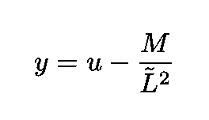******

******等式 15:变量 y 的定义，圆度的偏差。******

******对于牛顿轨道， *y* =0。为了得到相对论性的表达式，我们代入方程。15 成情商。14、降条款的顺序 *y* 。对于几乎圆形的轨道，我们得到下面的方程:******

******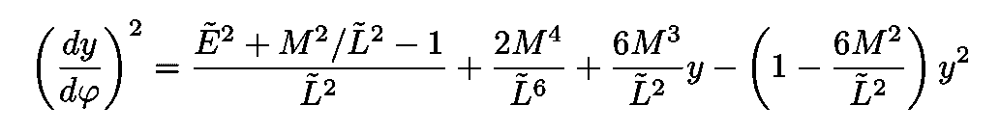******

******等式 16:dy/dφ的相对论表达式。******

******该解决方案如下:******

******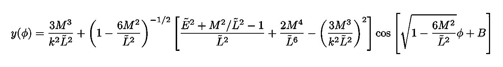******

******等式 17:等式的解 y(φ)。16.******

******whee B 取决于初始条件。从余弦的论证，我们得出结论:当δ(*kφ*)= 2π时，轨道回到相同的半径。不同于 1 的 k 的存在就是它与牛顿结果的区别！如果相对论效应很小，我们可以做几个简单的近似来获得:******

******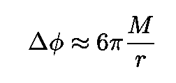******

******等式 18:近日点从连续轨道前进。******

******特别是对于汞来说，我们得到了每年 0.43 英寸的位移，正如本文开头所提到的，这是通过实验确定的值。******

******似乎连爱因斯坦[都被结果](https://books.google.com.br/books?id=pe25DgAAQBAJ&printsec=frontcover&source=gbs_atb#v=snippet&q=mercury&f=false)惊呆了。发现计算结果后，他几天都不能工作。用他自己的话说，他变得“欣喜若狂”******

******我的 [Github](https://github.com/marcotav) 和个人网站 [www.marcotavora.me](https://marcotavora.me/) 有一些其他有趣的材料，既有关于物理的，也有关于数学、数据科学和金融等其他主题的。看看他们！******