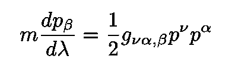
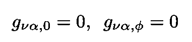
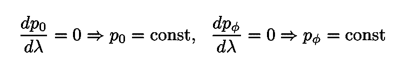
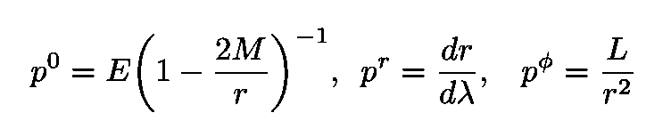

# 爱因斯坦的引力、光的弯曲以及他如何成为世界上最著名的科学家

> 原文：<https://towardsdatascience.com/einsteins-gravity-theory-and-the-bending-of-light-by-the-sun-1e796626dc19?source=collection_archive---------16----------------------->

## 太阳对光的引力弯曲的解释

图片由[com break](https://pixabay.com/fr/users/Comfreak-51581/?utm_source=link-attribution&utm_medium=referral&utm_campaign=image&utm_content=1390007)来自 [Pixabay](https://pixabay.com/fr/?utm_source=link-attribution&utm_medium=referral&utm_campaign=image&utm_content=1390007)

[广义相对论](https://en.wikipedia.org/wiki/General_relativity)(发表于 1915 年)[阿尔伯特·爱因斯坦](https://en.wikipedia.org/wiki/Albert_Einstein)的几何引力理论，被许多科学家认为可能是所有现存物理理论中最美丽的

在这篇文章中，我将描述广义相对论的经典测试之一，可以说是最著名的一个，这是太阳(或任何球对称，与时间无关的引力场)对光的弯曲[，如图 1 所示。](https://en.wikipedia.org/wiki/Tests_of_general_relativity#Deflection_of_light_by_the_Sun)

图 1:太阳光的弯曲([来源](https://weinsteing.wordpress.com/2017/12/20/the-geodesics-of-the-schwarzschild-metric-5/))。

可以看出，净偏转角有一个非常简单的表达式:

等式 1:掠日光子的净偏转。

其中 *M* 为太阳质量， *b* 称为[撞击参数](https://en.wikipedia.org/wiki/Impact_parameter)(见图 2)。

图 2:影响参数 b。

光弯曲的一种表现形式被称为[引力透镜](https://en.wikipedia.org/wiki/Gravitational_lens)，目前被天文学家用作一种必不可少的测量工具(见图 3)。

图 3:[爱因斯坦十字](https://en.wikipedia.org/wiki/Einstein%27s_Cross)，在这里我们看到了同一个遥远类星体的四幅图像，这是强引力透镜的结果([来源](https://en.wikipedia.org/wiki/Gravitational_lens)

在我以前的一篇文章中([见下文](/einstein-and-the-most-beautiful-of-all-theories-f4ad4ce7a0a2)，描述了另一个理论的成功测试，即水星近日点的“异常”进动。

 [## 爱因斯坦，以及所有理论中最美丽的

### 广义相对论如何解释水星近日点的“异常”进动

towardsdatascience.com](/einstein-and-the-most-beautiful-of-all-theories-f4ad4ce7a0a2) 

# 史瓦西解及其测地线

[史瓦西度规](https://en.wikipedia.org/wiki/Schwarzschild_metric) ***g*** 是太阳产生的时空扭曲导致的太阳系度规。它具有以下行元素:

方程 2:史瓦西解的线元素，太阳产生的时空曲率扭曲导致的太阳系的度规。

公制中使用的坐标是如图 4 所示的[球坐标](https://en.wikipedia.org/wiki/Spherical_coordinate_system) ( *r* ， *θ，* *φ* )。

图 4:球坐标 r(径向距离)、θ(极角)、ϕ(方位角)([来源](https://dipy.org/documentation/1.0.0./theory/spherical/))。

因为我们的目标是导出 Eq。1，我们将需要首先获得光子轨迹的表达式 *φ* ( *r* )，其中 *φ* 是方位角，而 *r* 是半径坐标。让我们从计算穿过太阳引力场的光子的动量分量开始。

## 计算光子的动量和守恒量

给定时空中沿测地线运动的粒子的守恒量与对应的度规张量 ***g*** 的对称性之间存在对应关系。由于[史瓦西解](https://en.wikipedia.org/wiki/Schwarzschild_metric)同时具有[球对称性](https://en.wikipedia.org/wiki/Spherically_symmetric_spacetime)和[时间平移不变性](https://en.wikipedia.org/wiki/Time_translation_symmetry)，因此测试粒子的能量和角动量都是守恒的。这在数学上可以通过将[测地线方程](https://en.wikipedia.org/wiki/Geodesics_in_general_relativity)后接质点重写为(见[史高斯](https://books.google.com.br/books?id=GgRRt7AbdwQC&printsec=frontcover&dq=schutz+relativity&hl=en&sa=X&ved=0ahUKEwjfmauknPboAhX9HrkGHaEyDAwQ6AEIMjAB#v=onepage&q=schutz%20relativity&f=false))来看出:

方程 3:测地线方程，用动量 p 和 g 的导数来写，用这个符号，很容易看出动量守恒和相关时空的对称性之间的对应关系(更多细节见正文)。

现在，光子在零测地线上行进，这意味着参数 *λ* 一定是不同于适当时间 *τ的某个仿射参数。*由于[史瓦西度规](https://en.wikipedia.org/wiki/Schwarzschild_metric)遵守以下条件

等式 4:史瓦西度规的两个常数分量。

情商。3 为我们提供了下列守恒量

等式 5:由度规张量分量的相应导数的消失产生的两个运动常数。

注意，球对称意味着运动发生在一个平面上，我们可以选择θ = π/2(也就是说 *dθ* / *dλ* = 0)。

# 光子

由于我们的目标是专门研究光线的弯曲，所以从现在开始，只考虑光子的运动(大质量粒子在[这篇文章](/einstein-and-the-most-beautiful-of-all-theories-f4ad4ce7a0a2)中讨论)。

方程式中的两个运动常数。5 分别是能量和角动量，

等式 6:运动的两个常数 E 和 L 分别是能量和角动量。

牛顿的能量概念需要负号才能在低速下恢复。

光子动量的三个相关分量的显式表达式很容易使用度规的史瓦西分量和等式来计算。6:

方程 7:光子动量分量的显式表达式。

我们现在把这三个分量代入|***p***| =*m*= 0，求解为( *dr* / *dλ* )。我们得到:

方程 8:根据仿射参数λ的光子轨道方程。

我们可以改写这个等式，定义一个“有效势”,由下式给出:

方程式 9:光子的“有效势”。

该有效电势绘制在图 5 中。图中标明了转折点(其中 *dr/dλ* =0)、禁域(其中*E*<*V】*、和圆轨道(其中 *dV /dr* =0)等重要元素。

图 5:光子的有效势。

# 光的引力弯曲

回想一下，我们这里的目标是获得穿过太阳引力场的光子的 *φ* ( *r* )。事实证明，这很容易简单地通过将动量的*φ*-分量(角动量)除以等式的平方根来实现。8.我们得到:

方程 10:光子 *φ* ( *r* )的轨道微分方程。

正如我们在简介中定义的，参数 *b* 是冲击参数。在牛顿力学中，直接表明 *b* 是径向距离 *r* 的最小值(无偏转时)。因此 *b* 是光子轨迹相对于径向移动的平行轨迹的“偏移”(参见[史高斯](https://books.google.com.br/books?id=GgRRt7AbdwQC&printsec=frontcover&dq=schutz+relativity&hl=en&sa=X&ved=0ahUKEwjfmauknPboAhX9HrkGHaEyDAwQ6AEIMjAB#v=onepage&q=schutz%20relativity&f=false))。

如同在牛顿的情况下，使用新变量*u≦*1/*r .*然后Eq 在数学上是方便的。10 变成了:

等式 11:根据新变量 u 的光子轨道。

现在让我们考虑极限，其中*M*/*r*<<1 或者等效地*u*<<1/*M .*我们事后定义下面的辅助变量 *y* :

等式 12:新变量 y 的定义。

最后一步是求解方程。11 *。*我们最终获得:

方程 13:作为 dφ/dy 方程的解的光子轨迹(根据变量 y)。

光子的偏转如下图所示(以及一些相关注释):

图 6:光子穿越太阳引力场时轨迹的弯曲。

快速计算表明，净挠度确实由方程给出。1:

等式 14:光子经过太阳附近后的净偏转，与等式中的表达式相同。1.

图 7:著名的英国天文学家、物理学家和数学家[亚瑟·爱丁顿](https://en.wikipedia.org/wiki/Arthur_Eddington)，第一个证实爱因斯坦对δφ的预测的团队的领导人([来源](https://en.wikipedia.org/wiki/Arthur_Eddington))。一张[爱丁顿](https://en.wikipedia.org/wiki/Sir_Arthur_Eddington)拍摄的著名的 1919 年日食实验照片([来源](https://en.wikipedia.org/wiki/Tests_of_general_relativity#Deflection_of_light_by_the_Sun))。

代入太阳的质量，用太阳的半径作为撞击参数 *b* (见[史高斯](https://books.google.com.br/books?id=GgRRt7AbdwQC&printsec=frontcover&dq=schutz+relativity&hl=en&sa=X&ved=0ahUKEwjfmauknPboAhX9HrkGHaEyDAwQ6AEIMjAB#v=onepage&q=schutz%20relativity&f=false))我们得到最大偏转，大约等于 1 *。*75*。这个结果在 1919 年由著名的英国天文学家、物理学家和数学家亚瑟·爱丁顿领导的英国团队进行的一个著名实验中首次得到证实。*

*感谢您的阅读，再见！一如既往，我们随时欢迎建设性的批评和反馈！*

*我的 [Github](https://github.com/marcotav) 和个人网站 [www.marcotavora.me](https://marcotavora.me/) 有一些其他有趣的材料，既有关于物理的，也有关于数学、数据科学和金融等其他主题的。看看他们！*