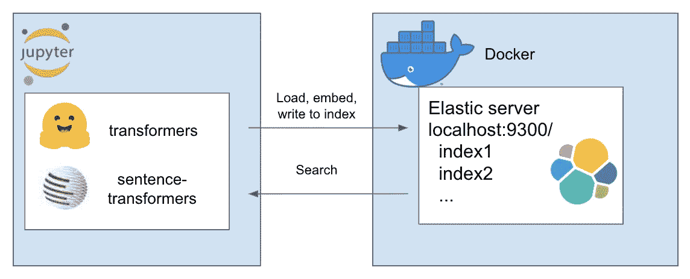
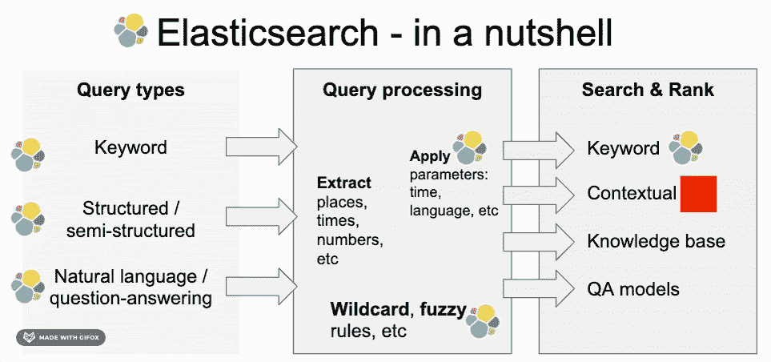
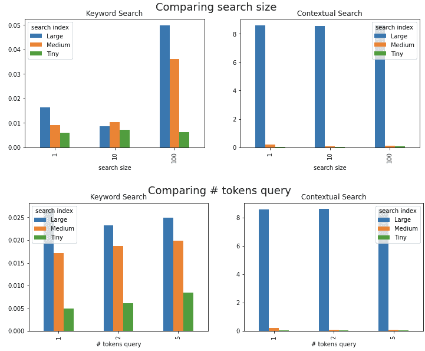

# 搜索(第三部分)——弹性变压器

> 原文：<https://towardsdatascience.com/elastic-transformers-ae011e8f5b88?source=collection_archive---------26----------------------->

## 让 BERT 变得有弹性——Jupyter 笔记本上的可扩展语义搜索



这是一个关于如何通过 transformers 建立和添加语义搜索作为弹性搜索索引的技术教程。我们将经历所有需要的步骤，并将介绍实用程序类 ElasticTransformers。最后，我们将考虑一些速度比较。

这是关于搜索的三部分系列的最后一部分。对于这如何适应更广泛的搜索主题的非技术讨论，请考虑前两部分。

*   Pt 1 是对搜索引擎典型构件的一个温和的介绍
*   在 [Pt 2](https://medium.com/@mihail.dungarov/search-pt-2-semantic-horse-race-5128cae7ce8d) 中，我们对搜索的关键词和上下文嵌入进行了并排比较

在第 1 部分中，我们已经看到了 Elasticsearch 如何提供一系列现成的搜索功能。在本文中，我们将展示如何再添加一个——上下文语义搜索



图片由作者制作，用 [gifox](https://gifox.io/)

# “如何做”

我将在这里简要概述这种方法。也可以关注 [github](https://github.com/md-experiments/elastic_transformers) 。

# 体系结构

我们将在本地部署 Elasticsearch 作为 docker 容器。数据将存储在本地。使用 Jupyter notebook，我们将使用[句子转换器](https://github.com/UKPLab/sentence-transformers)库将数据分块并迭代地嵌入记录批，并提交给索引。最后，我们还将执行笔记本外的搜索。为了实现这一切，我准备了一个实用程序类 ElasticTransformers


# 积木

所有这些步骤也记录在 [github repo](https://github.com/md-experiments/elastic_transformers) 中，并作为随附笔记本的一部分执行。

*   **数据**我用的是 Rohk 的[百万新闻头条](https://www.kaggle.com/therohk/million-headlines)。这些数据代表了美国广播公司新闻大约 18 年的头条新闻。长时间跨度以及数据集的大小为实验提供了良好的基础。
*   **Elasticsearch Docker 容器。**在本地开始使用 Elasticsearch 的一个非常快速简单的方法是将其部署为 Docker 容器。按照步骤[这里](https://www.elastic.co/guide/en/elasticsearch/reference/current/docker.html)对于本教程，您只需要运行两个步骤:
*   [拉动图像](https://www.elastic.co/guide/en/elasticsearch/reference/current/docker.html#_pulling_the_image)
*   [使用 Docker](https://www.elastic.co/guide/en/elasticsearch/reference/current/docker.html#docker-cli-run-dev-mode) 启动单节点集群
*   对于弹性上的**向量搜索**，我们使用密集向量搜索功能，这要感谢[这些优秀的资源](https://www.elastic.co/blog/text-similarity-search-with-vectors-in-elasticsearch)
*   如前所述，我们使用(SBERT) [句子转换器](https://github.com/UKPLab/sentence-transformers)进行嵌入，作为一种高性能且非常容易访问语义相似性的方法

使用这些实用程序，我们依次:创建一个索引，编写几个不同大小的数据集以嵌入索引，并执行一些实验

# 对于懒惰的人…嗯，忙碌的人…

最后，所有这些步骤过去执行起来都很复杂。值得庆幸的是，现在是 2020 年，很多事情都变得简单了:我们可以在 Docker 上部署一个只有两行代码的 Elasticsearch(实际上是从 2016 年开始的), transformers 预先训练有一些先进的库，我们可以在我们舒适的 Jupyter 笔记本上完成以上所有工作…

所有这些步骤也记录在 [github repo](https://github.com/md-experiments/elastic_transformers) 中，并作为随附笔记本的一部分执行。

# 使用弹性变形器

ElasticTrasnformers 构建在 [elasticsearch](https://elasticsearch-py.readthedocs.io/en/master/#) 库的基础上，它简单地包装了一些实例化步骤，添加了简单的索引创建实用程序&映射(我个人一直在努力解决这个问题),重要的是，它是一个易于使用的大文档分块工具，可以将嵌入内容写入搜索索引

**初始化**类以及(可选)要使用的索引的名称

```
et = ElasticTransformers(url = ’http://localhost:9300', index_name = 'et-tiny')
```

**为索引创建规格**。可以基于关键字搜索或语义(密集向量)搜索是否需要相关字段来提供相关字段的列表。它也有密集向量大小的参数，因为这些参数可以变化

```
et.create_index_spec(
  text_fields=[‘publish_date’,’headline_text’],
  dense_fields=[‘headline_text_embedding’],
  dense_fields_dim=768
)
```

**创建索引** —使用之前创建的规范创建一个索引以备搜索

```
et.create_index()
```

**写入大文件** —将一个大的 csv 文件分解成块，并反复使用预定义的嵌入实用程序为每个块创建嵌入列表，然后将结果提供给索引。在笔记本中，我们展示了一个如何创建 embed_wrapper 的例子，注意实际的嵌入器可以是任何函数。我们使用[带 distilbert](https://www.sbert.net/docs/pretrained_models.html#semantic-textual-similarity) 的句子转换器，因为它在速度和性能之间提供了一个很好的平衡。然而，这可能因您感兴趣的用例而异。

```
et.write_large_csv(‘data/tiny_sample.csv’,chunksize=1000,embedder=embed_wrapper,field_to_embed=’headline_text’)
```

**搜索** —可以选择关键字(弹性中的“匹配”)或上下文(弹性中的“密集”)搜索。注意，它需要 write_large_csv 中使用的相同嵌入函数。这只检查 type = 'dense '是否作为嵌入搜索处理，否则可以采用常见的:' match '，'通配符'，' fuzzy '等。

```
et.search(query = ’search these terms’, field = ’headline_text’, type = ’match’, embedder = embed_wrapper, size = 1000)
```

我们将以几种不同的索引大小(小型:1k，中型:100k 和大型:110 万(所有)标题)索引来自一百万个新闻标题的数据。最后，我们将使用这些来执行一些速度比较。

# 速度…

我们刚刚索引了大约 110 万个句子，但是所有这些真的有规模吗？自然，扫描海量指数时总会有减速，但减速多少呢？

我进行了几次测试(每次重复 10 次):

*   不同长度的查询:1、2 和 5 个令牌
*   结果大小不同的查询 1、10 和 100 个结果

结果如下图所示:

*   关键词搜索—索引大小增加 1000 倍，速度降低约 8 倍；结果大小增加 100 倍，速度降低约 4 倍。所有这些都不到 10 毫秒
*   然而，在上下文搜索方面，性能会显著降低，从一个大(1mn)索引进行单独搜索需要 8 秒。与 100k 的中等规模指数相比，这显然是一个明显的放缓，仍然远远小于 1 秒

值得注意的是，交互式搜索应用程序的常见要求是在 1 秒内检索到结果，在某些情况下不到 300 毫秒，因此这是一个显著的减速。下面探讨了一些解决方案



作者图片

# 提高速度

搜索速度是一个至关重要的方面，因为搜索通常需要交互，文档大小通常也很重要。在这种情况下，我们可以看到，随着数据集大小的增加，速度呈指数级下降。这是因为我们将所有文档与查询进行比较，而不是在关键字搜索方法中使用倒排索引。有多种方法可以解决这个问题，但不幸的是，它们都需要在精度方面进行权衡。

例如，**近似最近邻** (ANN)方法将使用更少的空间和更快的执行速度，代价是有时返回的结果并不完全相关——对于实现，请查看 [Faiss](https://github.com/cran/fastcluster) 或[airy](https://github.com/spotify/annoy)以及这个关于混合嵌入、关键字搜索和使用 Faiss 的很好的例子。大谈规模人工神经网络的不同权衡以及如何选择一个— [十亿级近似最近邻搜索。](https://www.youtube.com/watch?v=SKrHs03i08Q)另一种方法可能是执行聚集聚类并仅在检索时收集相关数量的结果。查看 [fastcluster](https://github.com/cran/fastcluster) 的实现。

[Haystack](https://github.com/deepset-ai/haystack) 为结合变形金刚和搜索提供了一个广泛的框架。然而，查询被认为是自然语言问题，并且采用了**问答框架**。不同之处在于，在 QA 框架中，查询和每个单独的候选文档之间的匹配质量是成对评估的。这本身就是一个计算量大得多的问题，与我们在这里所做的相反，在这里每个文档都由一个嵌入来表示，该嵌入在运行时与查询进行比较。较大的计算负荷最初是通过将搜索空间减少到较少数量的相关候选项来处理的。

# **冗长的文件**

我们看到的上下文解决方案也受到文档大小的限制——受到 transformers 模型的令牌限制的约束。在这种情况下，我们可以容纳多达 **512 个标记**(类词块，例如单词 *look* 是一个标记，*look*是两个标记— look & ing，等等。).这种约束适用于标题或甚至段落，但不适用于全尺寸文档，例如新闻文章正文、研究论文等。

这些模型可以扩展到更长的序列，但是随着长度的增加，它们的内存使用量呈二次方增长。常见的解决方案倾向于保持标准长度，但使用变通方法，例如在相关的地方对嵌入进行一些平均。这仍然是一个活跃的研究领域，最近一个值得注意的新发现是[big bird](https://arxiv.org/abs/2007.14062)——一个基于 Google Research transformer 的模型，它可以处理更长的序列，同时保持内存使用量与文档大小成线性增长

# 结论

我们已经看到了如何轻松地部署一个 Elasticsearch 容器，并用一些我们可用的最强大的上下文嵌入来索引它。评估表明，对于大型索引，语义搜索可能会变慢，但是，我们也考虑了一些替代解决方案。

这个领域的未来仍然充满希望，并且越来越容易实现。

希望这是有用的。感谢您的阅读。如果你想和我打招呼或者只是想告诉我我错了，请随时通过 [LinkedIn](https://www.linkedin.com/in/mihail-dungarov-cfa-a0291a88) 联系我