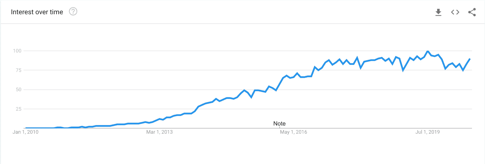
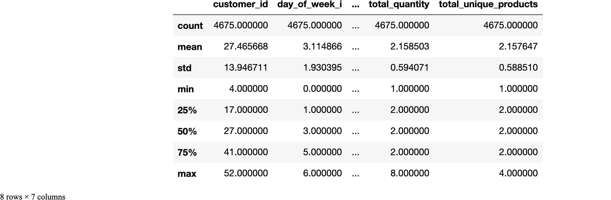
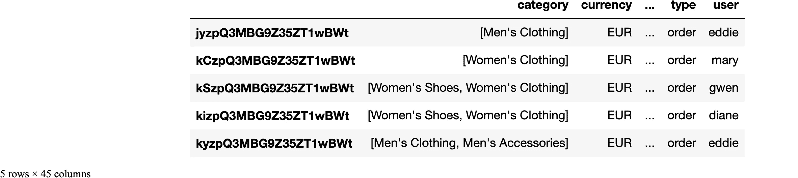
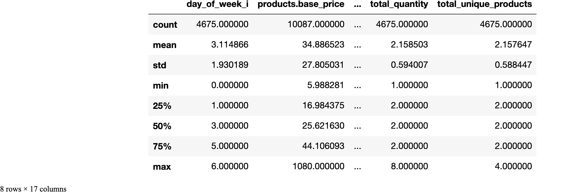
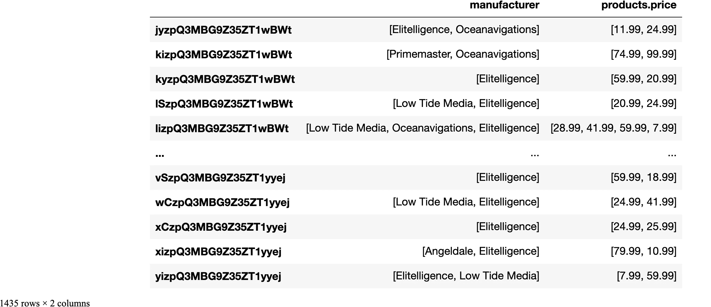

# 数据科学的弹性研究变得更加容易

> 原文：<https://towardsdatascience.com/elasticsearch-for-data-science-just-got-way-easier-95912d724636?source=collection_archive---------18----------------------->

## 弹性搜索功能与熊猫的便利

## *Eland* 是一个全新的 python 包，它在 Elasticsearch 和数据科学生态系统之间架起了一座桥梁。


由[扎克里·佩里](https://unsplash.com/@ztpphotography?utm_source=unsplash&utm_medium=referral&utm_content=creditCopyText)在 [Unsplash](https://unsplash.com/s/photos/moose?utm_source=unsplash&utm_medium=referral&utm_content=creditCopyText) 上拍摄的照片

[Elasticsearch](https://www.elastic.co/elastic-stack) 是一个功能丰富的开源**搜索引擎**构建在 **Apache Lucene 之上，**Apache Lucene 是市场上最重要的全文搜索引擎之一。

Elasticsearch 最为人所知的是它提供的丰富多样的 REST API 体验，包括用于全文搜索、排序和聚合任务的高效包装器，这使得在现有后端中实现这些功能变得更加容易，而无需复杂的重新设计。

自从 2010 年推出以来，Elasticsearch 在软件工程领域获得了很大的吸引力，到 2016 年，根据 DBMS 知识库 DB-engines ，它成为最受欢迎的企业搜索引擎软件栈[，超过了行业标准 **Apache Solr** (也是基于 Lucene 构建的)。](https://db-engines.com/en/blog_post/55)



自 2010 年发布以来，弹性搜索的谷歌趋势数据

Elasticsearch 如此受欢迎的原因之一是它所积累的生态系统。世界各地的工程师开发了开源的 Elasticsearch 集成和扩展，其中许多项目被 Elastic(Elastic search 项目背后的公司)吸收为其堆栈的一部分。

其中一些项目是 **Logstash** (数据处理管道，通常用于解析基于文本的文件)和 **Kibana** (构建在 Elasticsearch 之上的可视化层)，导致了现在广泛采用的 ELK (Elasticsearch，Logstash，Kibana)堆栈。

ELK stack 很快获得了恶名，因为它在新兴和巩固的技术领域中有一系列令人印象深刻的可能应用，如 *DevOps、站点可靠性工程、*以及最近的*数据分析。*

## 但是数据科学呢？

如果你是一名数据科学家，正在阅读这篇文章，并且拥有 Elasticsearch 作为你雇主的技术堆栈的一部分，你可能会在尝试使用 Elasticsearch 为数据分析甚至简单的机器学习任务提供的所有功能时遇到一些问题。

数据科学家通常不习惯将 NoSQL 数据库引擎用于日常任务，甚至不习惯依赖复杂的 REST APIs 进行分析。例如，使用 Elasticsearch 的低级 python 客户端处理大量数据也不是那么直观，对于来自与 SWE 不同领域的人来说，学习曲线有些陡峭。

尽管 Elastic 在增强 ELK 堆栈以用于分析和数据科学用例方面做出了巨大努力，但它仍然缺乏与现有数据科学生态系统(pandas、NumPy、scikit-learn、PyTorch 和其他流行库)的简单接口。

2017 年，Elastic 向数据科学领域迈出了第一步，作为对软件行业日益流行的*机器学习*和预测技术的回答，它为 ELK stack 发布了第一个 [ML 功能的 X-pack](https://www.elastic.co/blog/introducing-machine-learning-for-the-elastic-stack) (扩展包)，在其功能中添加了*异常检测*和其他无人监管的 ML 任务。之后没多久，[回归和分类模型](https://www.elastic.co/guide/en/machine-learning/current/ml-dfanalytics.html)**(**[**1**](#fn1)**)**也被加入到麋鹿栈可用的 ML 任务集合中。

上周，Elasticsearch 在数据科学行业获得广泛采用的另一个步骤是发布了 [Eland](https://eland.readthedocs.io/en/latest/) ，这是一个全新的 Python Elasticsearch 客户端和工具包，具有强大的(和熟悉的)类似熊猫的 API，用于分析、ETL 和机器学习。

## Eland:弹性和数据

Eland 使数据科学家能够有效地使用已经很强大的 Elasticsearch 分析和 ML 功能，而不需要深入了解 Elasticsearch 及其许多复杂性。

Elasticsearch 的功能和概念被转化成一个更容易识别的环境。例如，一个包含文档、映射和字段的 Elasticsearch 索引变成了一个包含行和列的数据框架，就像我们在使用 pandas 时看到的那样。

```
# Importing Eland and low-level Elasticsearch clients for comparison
import eland as ed
from eland.conftest import *
from elasticsearch import Elasticsearch
from elasticsearch_dsl import Search, Q

# Import pandas and numpy for data wrangling
import pandas as pd
import numpy as np

# For pretty-printing
import json
```

典型的数据科学用例，例如将整个弹性搜索索引读入 pandas 数据框架进行探索性数据分析或训练 ML 模型，通常需要一些效率不高的快捷方式。

```
# name of the index we want to query
index_name = 'kibana_sample_data_ecommerce' 

# instantiating client connect to localhost by default
es = Elasticsearch()

# defining the search statement to get all records in an index
search = Search(using=es, index=index_name).query("match_all") 

# retrieving the documents from the search
documents = [hit.to_dict() for hit in search.scan()] 

# converting the list of hit dictionaries into a pandas dataframe:
df_ecommerce = pd.DataFrame.from_records(documents)# visualizing the dataframe with the results:
df_ecommerce.head()['geoip']0    {'country_iso_code': 'EG', 'location': {'lon':...
1    {'country_iso_code': 'AE', 'location': {'lon':...
2    {'country_iso_code': 'US', 'location': {'lon':...
3    {'country_iso_code': 'GB', 'location': {'lon':...
4    {'country_iso_code': 'EG', 'location': {'lon':...
Name: geoip, dtype: object# retrieving a summary of the columns in the dataset:
df_ecommerce.info()<class 'pandas.core.frame.DataFrame'>
RangeIndex: 4675 entries, 0 to 4674
Data columns (total 23 columns):
 #   Column                 Non-Null Count  Dtype  
---  ------                 --------------  -----  
 0   category               4675 non-null   object 
 1   currency               4675 non-null   object 
 2   customer_first_name    4675 non-null   object 
 3   customer_full_name     4675 non-null   object 
 4   customer_gender        4675 non-null   object 
 5   customer_id            4675 non-null   int64  
 6   customer_last_name     4675 non-null   object 
 7   customer_phone         4675 non-null   object 
 8   day_of_week            4675 non-null   object 
 9   day_of_week_i          4675 non-null   int64  
 10  email                  4675 non-null   object 
 11  manufacturer           4675 non-null   object 
 12  order_date             4675 non-null   object 
 13  order_id               4675 non-null   int64  
 14  products               4675 non-null   object 
 15  sku                    4675 non-null   object 
 16  taxful_total_price     4675 non-null   float64
 17  taxless_total_price    4675 non-null   float64
 18  total_quantity         4675 non-null   int64  
 19  total_unique_products  4675 non-null   int64  
 20  type                   4675 non-null   object 
 21  user                   4675 non-null   object 
 22  geoip                  4675 non-null   object 
dtypes: float64(2), int64(5), object(16)
memory usage: 840.2+ KB# getting descriptive statistics from the dataframe
df_ecommerce.describe()
```



上面描述的过程将引导我们以字典列表的形式获取索引中的所有文档，然后将它们加载到 pandas 数据框架中。这意味着在进程中的某个时刻，在内存中同时拥有文档本身和结果数据帧**(**[**2**](#fn2)**)**。对于大数据应用程序来说，这一过程并不总是可行的，在 Jupyter 笔记本环境中探索数据集可能会变得非常复杂和快速。

> Eland 使我们能够执行与上面描述的操作非常相似的操作，而没有任何涉及使它们适应 Elasticsearch 上下文的摩擦，同时仍然使用 elastic search 聚合速度和搜索功能。

```
# loading the data from the Sample Ecommerce data from Kibana into Eland dataframe:
ed_ecommerce = ed.read_es('localhost', index_name)# visualizing the results:
ed_ecommerce.head()
```



作为一个额外的特性，pandas 方面需要更多的争论，字段`geoip`(它是索引中的一个嵌套 JSON 对象)被无缝地解析成我们的数据帧中的列。我们可以通过调用 Eland dataframe 上的`.info()`方法看到这一点。

```
# retrieving a summary of the columns in the dataframe:
ed_ecommerce.info()<class 'eland.dataframe.DataFrame'>
Index: 4675 entries, jyzpQ3MBG9Z35ZT1wBWt to 0SzpQ3MBG9Z35ZT1yyej
Data columns (total 45 columns):
 #   Column                         Non-Null Count  Dtype         
---  ------                         --------------  -----         
 0   category                       4675 non-null   object        
 1   currency                       4675 non-null   object        
 2   customer_birth_date            0 non-null      datetime64[ns]
 3   customer_first_name            4675 non-null   object        
 4   customer_full_name             4675 non-null   object        
 5   customer_gender                4675 non-null   object        
 6   customer_id                    4675 non-null   object        
 7   customer_last_name             4675 non-null   object        
 8   customer_phone                 4675 non-null   object        
 9   day_of_week                    4675 non-null   object        
 10  day_of_week_i                  4675 non-null   int64         
 11  email                          4675 non-null   object        
 12  geoip.city_name                4094 non-null   object        
 13  geoip.continent_name           4675 non-null   object        
 14  geoip.country_iso_code         4675 non-null   object        
 15  geoip.location                 4675 non-null   object        
 16  geoip.region_name              3924 non-null   object        
 17  manufacturer                   4675 non-null   object        
 18  order_date                     4675 non-null   datetime64[ns]
 19  order_id                       4675 non-null   object        
 20  products._id                   4675 non-null   object        
 21  products.base_price            4675 non-null   float64       
 22  products.base_unit_price       4675 non-null   float64       
 23  products.category              4675 non-null   object        
 24  products.created_on            4675 non-null   datetime64[ns]
 25  products.discount_amount       4675 non-null   float64       
 26  products.discount_percentage   4675 non-null   float64       
 27  products.manufacturer          4675 non-null   object        
 28  products.min_price             4675 non-null   float64       
 29  products.price                 4675 non-null   float64       
 30  products.product_id            4675 non-null   int64         
 31  products.product_name          4675 non-null   object        
 32  products.quantity              4675 non-null   int64         
 33  products.sku                   4675 non-null   object        
 34  products.tax_amount            4675 non-null   float64       
 35  products.taxful_price          4675 non-null   float64       
 36  products.taxless_price         4675 non-null   float64       
 37  products.unit_discount_amount  4675 non-null   float64       
 38  sku                            4675 non-null   object        
 39  taxful_total_price             4675 non-null   float64       
 40  taxless_total_price            4675 non-null   float64       
 41  total_quantity                 4675 non-null   int64         
 42  total_unique_products          4675 non-null   int64         
 43  type                           4675 non-null   object        
 44  user                           4675 non-null   object        
dtypes: datetime64[ns](3), float64(12), int64(5), object(25)
memory usage: 96.0 bytes# calculating descriptive statistics from the Eland dataframe:
ed_ecommerce.describe()
```



我们还可以注意到，内存使用从 pandas 数据帧中的大约 840 Kbs 变成了 Eland 数据帧中的仅 96 字节。我们不需要将整个数据集保存在内存中来从索引中检索我们需要的信息。大部分工作负载[留在弹性搜索集群](https://www.youtube.com/watch?v=U8fnkzp_sfo)**(**[**3**](#fn3)**)**中作为聚合或特定查询。

对于如此小的数据集，这并不重要。尽管如此，当我们扩展到千兆字节的数据时，不把所有东西都保存在内存中进行简单计算和分析的好处更加明显。

## 数据框架的弹性搜索功能

Eland 抽象了 Elasticsearch 中许多已经存在的 API，数据科学家不需要学习 Elasticsearch 的特定语法。例如，可以获得索引的映射(相当于检索熊猫数据帧的`dtypes`属性)。尽管如此，目前还不清楚该如何做。使用 Eland DataFrame 对象，我们可以像在常规 pandas DataFrame 上一样检索`dtypes`属性。

```
# getting the dtypes from pandas dataframe:
df_ecommerce.dtypescategory                 object
currency                 object
customer_first_name      object
customer_full_name       object
customer_gender          object
                          ...  
total_quantity            int64
total_unique_products     int64
type                     object
user                     object
geoip                    object
Length: 23, dtype: object# retrieving the Data types for the index normally would require us to perform the following Elasticsearch query:
mapping = es.indices.get_mapping(index_name) 

# which by itself is an abstraction of the GET request for mapping retrieval
print(json.dumps(mapping, indent=2, sort_keys=True)){
  "kibana_sample_data_ecommerce": {
    "mappings": {
      "properties": {
        "category": {
          "fields": {
            "keyword": {
              "type": "keyword"
            }
          },
          "type": "text"
        },
        "currency": {
          "type": "keyword"
        },
        "customer_birth_date": {
          "type": "date"
        },
        "customer_first_name": {
          "fields": {
            "keyword": {
              "ignore_above": 256,
              "type": "keyword"
            }
          },
          "type": "text"
        },
        "customer_full_name": {
          "fields": {
            "keyword": {
              "ignore_above": 256,
              "type": "keyword"
            }
          },
          "type": "text"
        }
...# Eland abstracts this procedure into the same pandas api:
ed_ecommerce.dtypescategory                         object
currency                         object
customer_birth_date      datetime64[ns]
customer_first_name              object
customer_full_name               object
                              ...      
taxless_total_price             float64
total_quantity                    int64
total_unique_products             int64
type                             object
user                             object
Length: 45, dtype: object
```

有了这些抽象，Eland 允许我们使用核心的 Elasticsearch 特性，这些特性不是 pandas 的一部分(或者至少不是那么高效)，比如全文搜索，Elasticsearch 最突出的用例。

```
# defining the full-text query we need: Retrieving records for either Elitelligence or Primemaster manufacturer
query = {
        "query_string" : {
            "fields" : ["manufacturer"],
            "query" : "Elitelligence OR Primemaster"
        }
    }# using full-text search capabilities with Eland:
text_search_df = ed_ecommerce.es_query(query)

# visualizing price of products for each manufacturer using pandas column syntax:
text_search_df[['manufacturer','products.price']]
```



## 更多集成的可能性

本文只是触及了 Eland 为数据科学家和其他数据专业人员在日常操作中使用 Elasticsearch 所带来的可能性的表面。

特别是在 DevOps 和 AIOps 环境中，基于 ML 的工具还不是很成熟，数据专业人员可以从 Python 现有的机器学习生态系统中受益，以分析大量的可观测性和度量数据，这将是另一篇文章的主题。

Eland 无疑是向 Elasticsearch 迈出的一大步，我期待 ELK stack 的未来版本会带来什么。

## 如果你喜欢这篇文章

查看[本次网络研讨会](https://www.youtube.com/watch?time_continue=2470&v=U8fnkzp_sfo&feature=emb_title)，其中[塞斯·迈克尔·拉森](https://github.com/sethmlarson)(Eland 的主要贡献者之一)介绍了 Eland 的主要功能。

如果你想看到更多关于弹性搜索、数据科学、信息检索、可观察性背景下的 NLP 的内容，请随时在 LinkedIn 上 [***与我联系***](https://www.linkedin.com/in/mateuspicanco/) 和 [***阅读我关于这些主题的其他文章***](https://medium.com/@mateuspicanco) ***。***

## 脚注:

1.  截至 ELK stack 7.8 版本，回归和分类机器学习作业仍处于试验阶段。
2.  对于这些任务，可以使用更熟悉的类似 SQL 的查询界面，比如 Elasticsearch 的 JDBC 驱动程序。然而，这仍然需要对弹性搜索概念(例如，索引模式和分页)有一定的了解。
3.  这类似于其他分布式计算模块，如 Dask。Eland 的 case 本质上在内部维护了一个查询构建器和任务图，只有在请求数据时才运行这些延迟的任务。

## 参考资料:

*   页（page 的缩写）Andlinger， [Elasticsearch 取代 Solr 成为最受欢迎的搜索引擎](https://db-engines.com/en/blog_post/55) (2016)，DB-engines 上博文的[URL](https://db-engines.com/en/blog_post/55)。
*   Elastic.co，【Eland 官方文档 (2020)，[网址为](https://eland.readthedocs.io/en/latest/)。
*   *Seth Michael Larson，*[Eland 简介 Elasticsearch 支持的数据框架和机器学习](https://www.youtube.com/watch?v=U8fnkzp_sfo) (2020)，网上研讨会的 URL。