# 基于 Avro 模式的类固醇弹性研究

> 原文：<https://towardsdatascience.com/elasticsearch-on-steroids-with-avro-schemas-3bfc483e3b30?source=collection_archive---------30----------------------->

## 如何应对大型企业设置中的接口版本爆炸

Brandon Mowinkel 在 [Unsplash](https://unsplash.com/s/photos/chain-break?utm_source=unsplash&utm_medium=referral&utm_content=creditCopyText) 上拍摄的照片

# 它是关于什么的

下面的文章解释了一种使用现代数据存储和序列化技术来分离组件和停止企业的大规模数据消费者应用程序中固有的服务接口版本爆炸的方法。

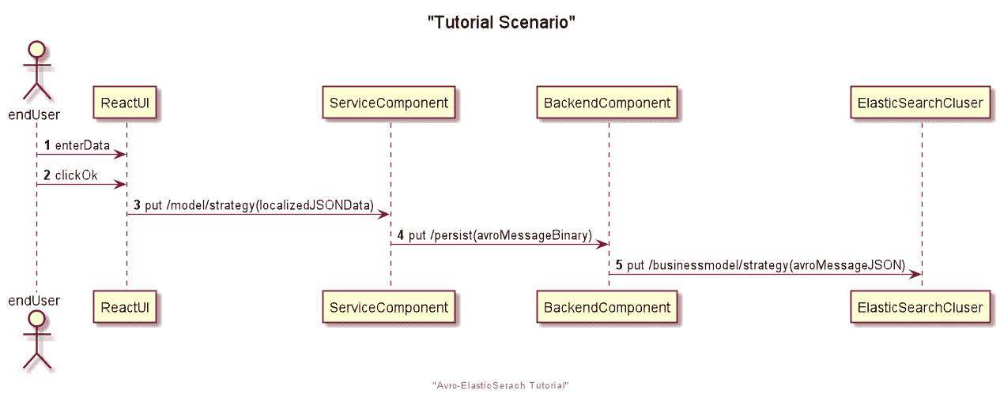

高层互动之旅

在一家大型金融机构负责一个大量使用的数据提供商系统时，我总是面临新服务版本的无休止的部署迭代，以及多个消费者无法在适当的时间框架内迁移到新版本的情况。随着时间的推移，这导致了为一个服务运行多个并行版本的情况。

提醒一句:这种方法是基于 NoSQL 数据存储基础设施的，我充分意识到这种数据存储可能不适合所有类型的业务应用。然而，有足够多的用例非常适合这种类型的架构。

# 互动之旅

我们的教程涵盖了以下场景:
我们有一个服务组件，它处理通过基于 React 的浏览器应用程序提供的用户输入，并将其数据持久存储在基于 ElasticSearch 集群的持久性存储中。

*   (3):`ReactUI`向`ServiceComponent`发送本地化的 JSON 数据负载(用户输入)
*   (4)`ServiceComponent`通过引用代码值替换本地化的文本来解本地化 JSON 数据有效负载，并准备一个 Avro 二进制消息(序列化),然后将其发送到`BackendComponent`
*   (5)`BackendComponent`将 Avro 二进制消息解串，转换成 Avro JSON 消息，存储在`ElasticSearch Cluster`

## Avro 模式

Avro 消息的一个关键特征是，它通过相关的 Avro 模式进行自我描述。Avro 模式是基于 JSON 的消息结构定义。

参考下面简单的 Avro 模式。

这个例子已经概述了 Avro 模式定义语言的一些细节。

*   `personid`和`lastname`是`long`和`string`类型的强制属性
*   `surname`是一个联合属性，也就是说，它可以是`null`或者具有类型为`string`的值。默认情况下，其值为`null`。

可选值总是被表示为联合，并且为了准备无缝的模式演化(稍后将详细介绍)，您应该总是定义可选属性的缺省值。

## Avro 模式解析器和客户端绑定生成器

Avro 序列化程序和反序列化程序使用该模式将 Avro 二进制消息(或 Avro JSON 消息，取决于您选择的配置)解析为 Java 数据访问对象(DAO)。这些 DAO 可能是通用的或预编译的强类型模式 Java 类。

也就是说，Maven 目标`generate-sources`生成一个类`Person`，它有三个属性`personId`、`lastName`和`firstname`，然后可以使用 Avro 解析器从这种类型的二进制消息中实例化出 person 对象。

为了自我描述，Avro 消息可以用模式本身或模式指纹来补充。

完整模式 JSON 的供应通常是以基于文件的方式完成的，这捆绑了大量的 Avro 消息。在我们的交互之旅中——具有单个 Avro 消息的请求-响应风格——这样的方法开销太大。对于这个场景，模式指纹是正确的方法。

## Avro 指纹和模式目录

Avro 模式指纹是一个全局唯一标识符，用于引用中央模式注册中心中的正确模式。

下面的抽象`SchemaRegistry`类描述了这种注册中心所需的方法。

*   方法`registerSchema`允许发送者(发布者)注册他发送给读者(消费者)的消息的 Avro 模式。作为返回值，Avro 指纹将被返回，它唯一地标识这个模式。对模式本身的任何更改都会产生新的指纹。
*   使用`getSchemaFingerprint`方法计算指纹
*   方法`getSchema`将返回与`fingerprint`中传递的相关联的 Avro JSON

就这样，建立了一个全局模式注册中心，Avro 消息的读者或作者可以使用它来交换相关 JSON 模式的模式指纹，这样就可以充分利用 Avro 的全部功能了。

本教程提供了模式注册表的两种实现:

*   轻量级测试的基于文件的实现，以及
*   基于弹性搜索(ES)的实现。如果您的公司实例化了一个高效的 ES 集群，您可以通过引入一个专用的 ES 索引，轻松地将它作为公司范围的模式注册表。
*   有现成的模式注册中心可用，特别是在 Kafka 领域，例如，[融合 Kafka](https://docs.confluent.io/current/schema-registry/schema_registry_tutorial.html) 产品的模式注册中心。但我们尽可能保持简单，并利用 ElasticSearch，它被用作我们的目标数据存储。

下面的例子显示了索引`avroschema`中指纹`8354639983941950121`下的 ElasticSearch 注册模式。任何消息的作者或读者都将使用 Avro 指纹来引用其处理中使用的底层模式。

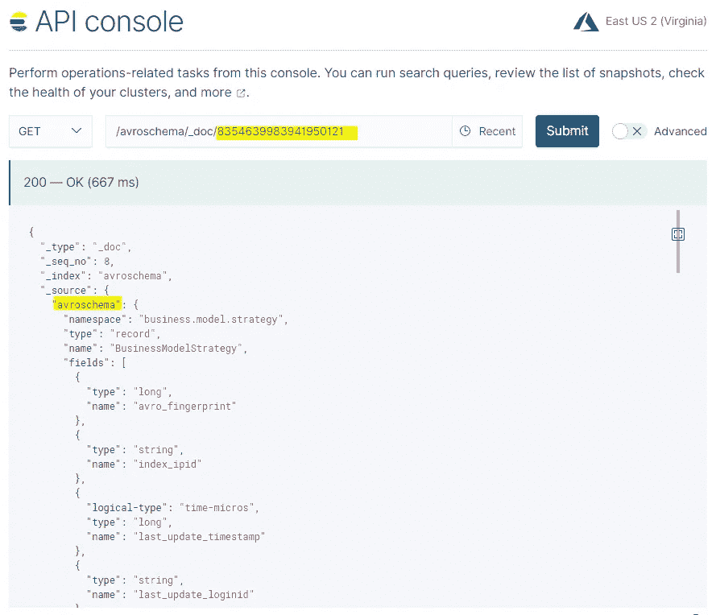

使用 ElasticSearch，您将获得一个现成的模式定义中央存储库，业务分析师、设计人员或开发人员在系统开发期间可以使用查找和查询功能轻松增强它。

如果您认为实现模式注册中心需要大量的编码，那么您就错了。

下面你可以看到功能完整的`ElasticSearchSchemaRegistry` java 类。

## 持久性管理器

非常简单紧凑。你现在可能会争辩说`ESPersistencyManager`类隐藏了复杂性(作为教程的一部分被使用和实现)。

不完全是，这个类是围绕 [Jest](https://github.com/searchbox-io/Jest) 的一个超轻层，Jest 是一个用于 Elasticsearch 的 HTTP Java 客户端。虽然 Elasticsearch 提供了自己的原生 Java 客户端，但 Jest 提供了更流畅的 API 和更自然的工作界面。对 JEST 感兴趣，可以看看 [Blaedung 的教程文章](https://www.baeldung.com/elasticsearch-jest)。

我们的`ESPersisencyManager`只是保护我们的补习班免受直接的笑话曝光。一种封装技术曾经能够在未来版本中替代持久性管理器。

同样非常紧凑，可以持久化 Avro 模式。值得一提的是，您可以提供 ElasticSearch 自己的主键(在 ES 中称为`_id`)。在我们的教程中，我们使用全局唯一指纹作为 ES 中的主要标识符，这使得查找变得简单明了(见上面的截图)。提供主键是一个关键特性，尤其是在数据复制场景中使用 ElasticSearch 时，ES 只是另一个主系统的从系统，而这个主系统已经生成了主键。

可以想象，检索一个 JSON 对象甚至更简单 Jest 为我们完成了这项工作。

## 后端组件启动序列

我们现在应该对后端组件使用我们的方法必须准备和配置的内容有了很好的理解。

下图概述了最重要的步骤:

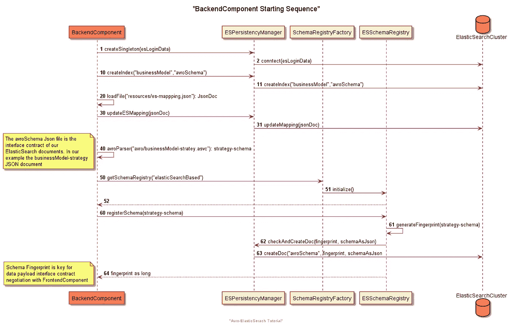

后端组件的启动顺序

*   我们创建了一个与我们的弹性搜索集群的连接
*   `10,11:`我们创建(如果不存在的话)两个 ES 指数，`businessmodel`和`avroschema`。第一个用于我们的域数据记录，后一个用于 Avro 模式
*   `20,30,31:`我们为我们的`avroschema`加载并编写一个定制的 ES 映射。这需要一些解释。ES 需要一些关于其持久化 JSON 文档的模式信息(这是一个 *ES* 文档模式，不应该与 *Avro* 模式混淆)。默认情况下，ES 将通过分析提供的 JSON 文档自动分配一个 ES 映射模式。在我们的例子中，我们必须根据需要调整 ES 映射，并告诉 ES 不要解释属性`avroschema`中提供的 JSON 部分(通过将类型切换到`object`)。

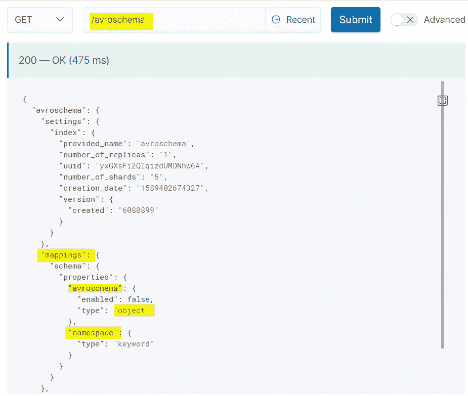

我们的索引“avroschema”的弹性搜索索引元信息

*   `40–46:`我们现在从文件系统加载 Avro 消息模式，并将其注册到 ES 模式注册表中。作为回报，我们得到了 Avro 模式指纹，这是我们的**通用接口契约标识符**，用于提供/消费我们的消息。该模式定义了我们的一个业务域数据对象(DO)，即“业务模型策略 DO”，它收集关于公司的策略数据。除了简单类型之外，该模式还引入了一个用于说明的枚举。`doc`属性允许提供文本解释，这在人们浏览注册表中的模式时很有帮助。

用于收集公司战略数据的 Avro 模式

## 服务组件启动序列

让我们看看服务组件需要准备什么。

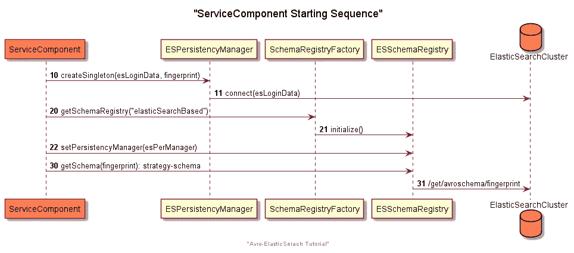

启动序列服务组件

*   `10–11:`我们创建一个到 ES 集群的连接对象(ESPersistencyManager)
*   `20,21,22:`我们初始化一个基于 ES 的模式注册中心，传递我们的连接对象
*   `30,31:`我们基于指纹版本来检索模式，服务组件就是基于指纹版本构建的。

## 消息版本随时间演变

必须详细理解最后一步——基于“预先配置的静态”指纹解析模式。

模式指纹表示 ServiceComponent 或 BackendComponent 能够处理的消息版本号。

在我们简单的 Hello world 示例中，后端和服务组件的模式指纹是相同的。但实际上，后端组件以及一个或多个服务组件可能会随着时间的推移以不同的变化速度发展。

下图说明了这种情况。

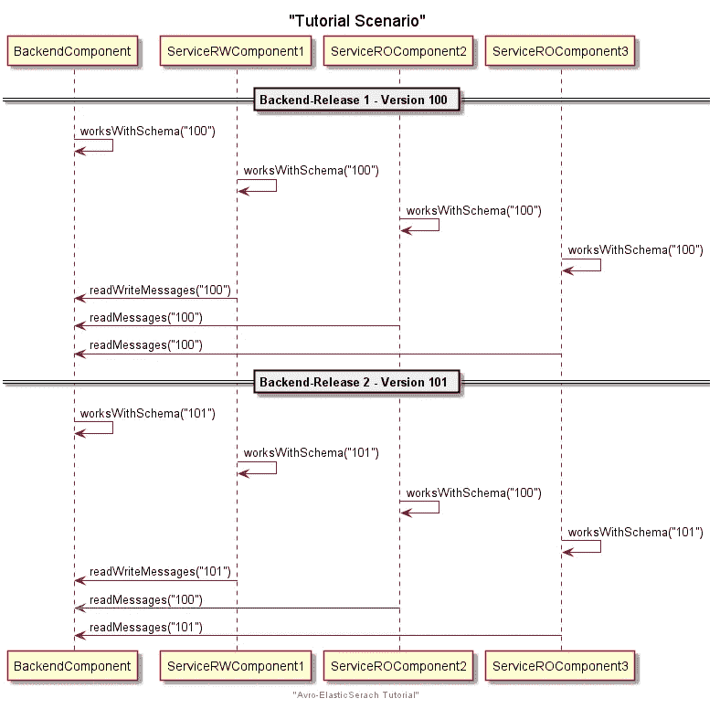

模式(接口)版本随时间的演变

*   想想一个`BackendComponent`，它在带有模式版本(指纹)`100`的 Release 1 中与它的`ServiceRWComponent1`一起发布。然后还有两个只读组件`ServiceROComponent2`和`ServiceROComponent3`，正在使用版本`100`的数据。
*   三个月后，`BackendComponent`发布了新的版本 2，它用模式版本`101`支持增强的数据模型(一些额外的可选属性)。它的`ServiceRWComponent1`也支持这个新版本。
*   对于两个独立的数据消费者`ServiceROComponent2`和`ServiceROComponent3`——它们可能以不同的变化速度发展——情况如下:`ServiceROComponent2`没有自己的版本并停留在版本`100`上，`ServiceROComponent3`需要版本`101`的附加数据元素并发布其`ServiceROComponent3`的新的整体版本。

# 接口版本爆炸

这就是现实生活中的我们。如果你是一个`BackendComponent`的所有者，它提供对许多独立数据消费者(`ServiceROComponent2`和`ServiceROComponent3`)来说很重要的数据集，你将面临支持多个接口版本的需求。这个版本支持需求可能会随着时间的推移而急剧增长，并影响您的交付时间、灵活性和组件成本的增加。

> 作为第三方组件(不在您的控制之下)的数据提供商，您可能只有有限的权力来强制它们升级到更新的发布接口版本号。

由[亚历克斯·霍利奥克](https://unsplash.com/@stairhopper?utm_source=unsplash&utm_medium=referral&utm_content=creditCopyText)在 [Unsplash](https://unsplash.com/s/photos/explosion?utm_source=unsplash&utm_medium=referral&utm_content=creditCopyText) 拍摄的照片

对于许多数据提供者来说，服务版本及其在组件整个生命周期中的管理起着至关重要的(有时甚至是麻烦的)作用。

运行由 WSDL 接口定义语言支持的 SOAP-Webservices 或由开放 API 规范 3(即 Swagger)支持的 JSON-Services(两种非常流行的请求-响应交互技术)将使您面临不断的版本更改，以防您增强您发布的接口。

版本变更是显式的，必须由您的使用者采用，这对于允许从您的生产组件中删除旧版本的单一协调版本升级来说可能是力所不及的。

在这里，Avro 凭借其开箱即用的模式演进支持大放异彩。

## Avro 模式演变

Avro 支持模式进化，这意味着您可以同时拥有不同模式版本的 Avro 消息的生产者和消费者。这一切都继续工作(只要模式兼容)。模式演化是大型生产系统中的一个关键特性，它可以分离组件，并允许组件在不同时间通过接口变化来运行系统更新。

Avro 算法实现要求 Avro 消息的读者与消息的作者拥有相同版本的模式。那么 Avro 是如何支持模式进化的呢？如果读取器在另一个模式版本上，读取器可以向 Avro 解析器传递两个不同的模式。然后，解析器使用它的[解析规则](https://https//avro.apache.org/docs/1.7.2/api/java/org/apache/avro/io/parsing/doc-files/parsing.html)将数据从写模式翻译到读模式。

让我们用我们的`BackendComponent.convertAvroBinarToJSON`方法来检查一下。这是本教程的主要方法之一，它将 Avro 二进制消息转换成 Avro JSON 消息格式，之后保存在 ES 中。

backendcomponent convertAvroBinaryToJSON 方法

*   该方法在 Avro 单对象编码的二进制消息中传递，定义如下:

> **单个 Avro 对象**被**编码**如下:一个双字节标记，C3 01，表示**消息**是 **Avro** 并使用这个**单个**记录格式(版本 1)。**对象的模式**的 8 字节小端 CRC-64- **AVRO** 指纹。使用 **Avro 的**二进制**编码**的 **Avro 对象编码**。([链接](https://avro.apache.org/docs/current/spec.html#single_object_encoding_spec))

*   我们从消息中提取模式指针
*   `Line 3:`我们从模式注册中心获取相关的模式
*   `Line 4:`我们获得消息有效载荷
*   `Line 7:`我们检查收到的信息的指纹是否与`BackendCompontent`中使用的指纹相同
*   `Line 8:`如果指纹相同，我们用`BackendComponent`模式创建一个 Avro `GenericDatumReader`(用于解码消息)
*   `Line 10:`如果没有，我们用`BackendComponent`模式和检索消息模式创建一个 Avro `GenericDatumReader`。读者现在将在解码二进制消息期间应用模式演化逻辑。
*   `Line 12:`我们还创建了一个 Avro `GenericDatumWriter`来产生消息的 JSON 表示。如前所述，Avro 支持紧凑的二进制编码，以及基于 JSON 的编码。你可以用一些简单的 Avro 助手类从一种编码转换到另一种编码。
*   `Line 14:`我们为二进制文件`payload`创建一个`binaryDecoder`，以及
*   `Line 18:` a `jsonEncoder`基于我们的`schema`
*   `Line 19-23:`最后，我们对二进制消息进行解码，并将其编码成 JSON 消息格式，这样就可以持久化了。

方法`BackendComponent.persist`负责这项任务，这很简单。

*   我们传入我们对象的弹性搜索`index`(“业务模型”)、弹性搜索`type`(“策略”)，以及唯一的`id`

后端组件持久方法

在现实场景中，persist 方法将由`BackendComponent`作为 JSON-、Webservice 或任何其他远程接口公开。

我们持久化的 Avro JSON 文档被存储为`_source`属性的一部分。

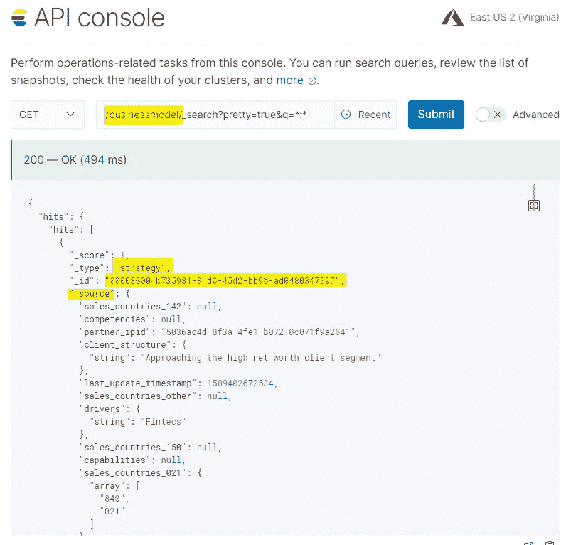

想想我们现在取得的成就。

*   我们的`BackendComponent`现在可以服务于 JSON 文档结构，它完全符合 Avro 消息规范。根据`ServiceComponent`接收到的二进制消息，到 JSON 持久性格式的转换完全自动进行。
*   JSON `_source`文档结构(有效载荷)是完全自描述的。我们注入了主键`index_ipid`，以及模式指纹`avro_fingerpint`作为有效负载的一部分
*   这意味着 JSON 消息文档的消费者可以通过 ES 解析模式来处理消息，并且知道文档在 ES 中的惟一存储标识符。

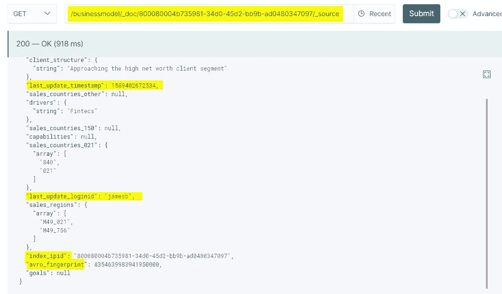

*   我们还注入了可能相关的附加公共属性，即`last_update_timestamp`和`last_update_loginid`，以保存更新文档的时间和人员的信息。这将允许我们通过引入例如基于 Kafka 的事件接收器(将是另一篇文章的主题)来建立时间序列和审计追踪

# 图式进化再探

数据管理的一个重要方面是模式演变。定义了初始模式后，应用程序可能需要发展，如上图所示。当这种情况发生时，下游消费者必须能够无缝地处理用新旧模式编码的数据。

我们区分两种兼容性类型:

*   向后兼容意味着使用较新模式的用户可以读取基于较旧模式的数据
*   向前兼容意味着使用旧模式的用户可以根据新模式读取数据

如果模式演化是向后兼容的，以及向前兼容的，则取决于改变是否符合 [Avro 模式解析](https://avro.apache.org/docs/1.7.7/spec.html#Schema+Resolution)约束

以下是分辨率规格中的三个基本规则:

*   可以对字段进行重新排序，而不会对读取器或写入器产生任何影响
*   向记录中添加一个字段是可以的，前提是您还要**给**一个默认值。默认值的提供允许具有新模式的读取器从基于旧模式的写入器读取消息。
*   只要您最初给了**一个默认定义，从记录中删除一个字段是可以的。即旧模式上的读取器接收默认值。**

这意味着在数据消息中添加或删除可选字段会保持消息完全兼容，只要已经或将要为删除或添加的属性定义默认值。所以当您开始定义您的模式时，您应该从一开始就考虑到这一点。

在数据消息中添加或删除可选的数据属性是一种场景，这在生产系统中经常发生，生产系统不断发展以满足新的业务需求。

# 解释了增强的版本控制策略

让我们通过一个简单的例子来看看 Avro 将如何帮助我们减少版本复杂性和组件耦合，通过比较一个经典的应用程序设置，以及我们使用 ElasticSearch 和 Avro 的增强设置。

## 经典应用

假设在生产环境中有以下组件设置。

*   我们有一个应用程序，它覆盖了一个特定的有界上下文(例如，一个 CRM client profiling 应用程序)，由一个 React 维护 UI `ReactMaintainUI`组成，该 UI 由一个呈现服务组件`ServiceComponent`支持，该组件为 UI 提供一个 JSON 本地化的有效负载接口。我们假设它是一个招摇风格的 OpenAIP 接口。它将连接到一个后端组件`BackendComponent`，该组件提供了一个 web 服务接口，并将其数据保存在关系数据库中`RelaionalDB`
*   应用程序本身不仅为其 UI 提供 API，还通过其 JSON API 集成了第三方 UI `JSONConsumer1`。以及一个第三方数据消费者，它通过 Webservice 接口读取数据`BackendComponent`

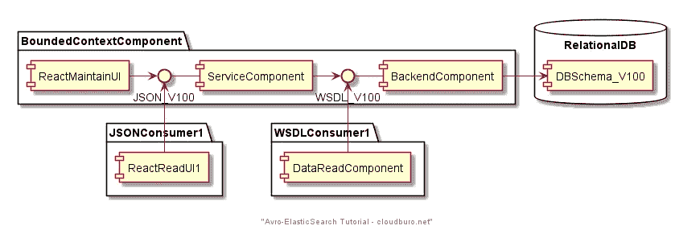

版本示例 Classic 1

*   当应用程序最初发布时，以下接口和数据库模式版本被冻结，供消费者使用。`JSON_V100`、`WSDL_V100`以及`DBSchema_V100`。所有这些工件都代表了消费应用程序的约定契约，无论是在 BoundedContext 中管理的应用程序(通常在您的控制之下)，还是第三方组件。
*   现在假设我们的有界上下文应用程序在短时间内有多个发布周期，引入了新的特性和可选的数据属性。这是敏捷设置中的一个典型例子，您可以从一个最小可行产品(MVP)开始，并在一个短的发布周期内增强应用程序。
*   在我们的例子中，我们发布了一个新版本`V101`，它通过`ReactMaintainUI`请求额外的可选数据属性

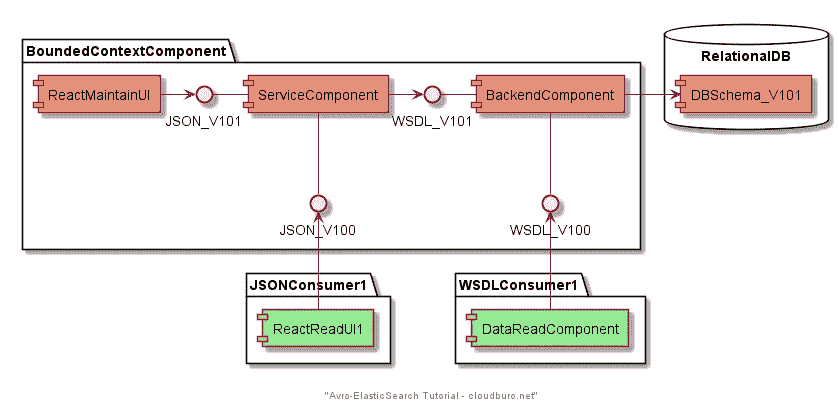

版本示例经典 2

*   我们为有界上下文应用程序添加了一个新的接口和模式版本:`JSON_V101`、`WSDL_V101`和`DBSchema_V101`。这导致红色成分的变化。
*   我们现有的第三方消费者`JSONConsumer1`和`WSDLConsumer1`(绿色的)，对当前的接口很满意(不需要新数据)，并且没有任何发布计划，仍然停留在初始版本`JSON_V100`和`WSDL_V100`。
*   你现在在这里。作为有界上下文应用程序的所有者，您现在必须开始管理您的接口版本，并向您的数据消费者提供潜在的多个版本。
*   尤其是如果多个其他应用程序需要您的数据(即 CRM 数据)，这种需求将随着应用程序的变化而快速增长。这可能导致同一服务的多个版本，相信我，迫使第三方消费者迁移到新版本是一项艰巨的任务。
*   迁移到新的接口版本意味着代码更改(至少重新编译您的客户端绑定)、测试和组件发布。从消费者的角度来看，他们试图尽可能避免这种情况

## 新一代应用

现在让我们用新的有界上下文应用程序来检查这个场景。在它的`BackendComponent`中使用了支持模式进化的 Avro 消息接口，以及 NoSQL 数据存储。

新一代应用程序版本示例

*   我们仍然有一个显式的接口契约`JSON_V100`，它作为一个基于 REST 的接口暴露给 UI。
*   `BackendComponent`为消费者提供了一个简单的 JSON 接口，以二进制编码的单对象格式传递 Avro 消息。
*   一个非常简单的 JSON 接口将允许我们传入一个 Base64 编码的字符串，它代表我们的二进制单对象编码的 Avro 消息。

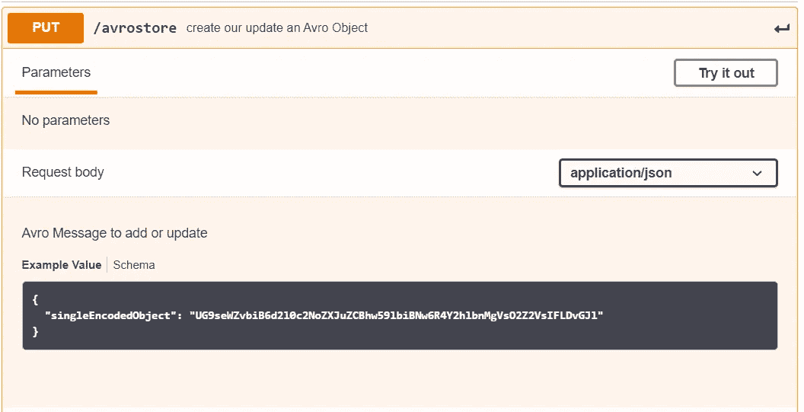

Avro 消息的简单 JSON 接口(输入)

作为回报，服务将返回 Avro 对象的唯一标识符，以及`BackendComponent`作者的指纹。这将允许接口消费者检测他是否在同一个版本上工作。

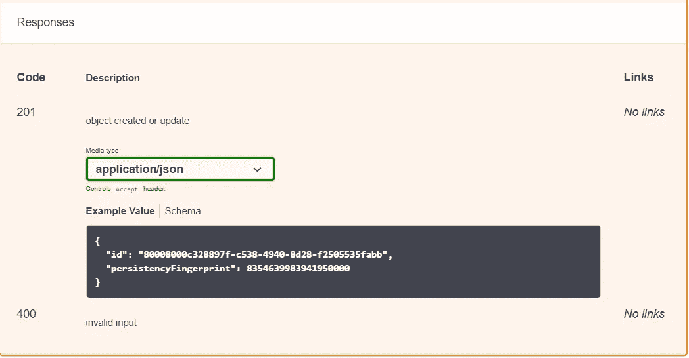

Avro 消息的简单 JSON 接口(输出)

*   考虑到本教程已经足够了，我们将在后续文章中研究这种接口的细节。
*   正如您在上面的图表中所看到的，`BackendComponent`接口以及`EsIndex1`模式没有被明确地版本化。只要我们的接口增强在 Avro 模式演进规则的约束范围内，版本控制将被透明地管理。

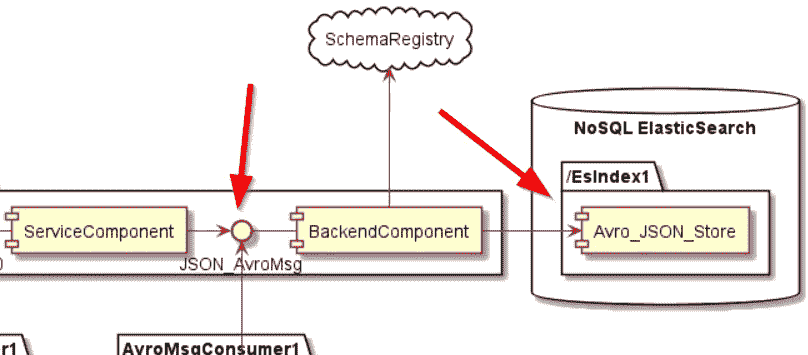

我们的后端组件不需要显式版本控制

*   现在添加额外的可选属性只会导致`ReactMaintainUI`组件和相应的`ServiceComponent`组件的变化，这提供了一个更新的符合 OpenAPI 的 JSON 接口。

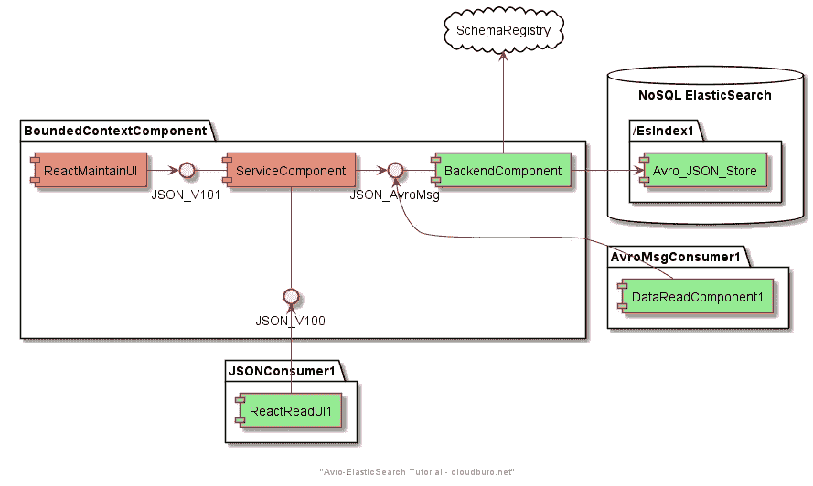

版本示例新一代 2

*   Out `BackendComponent`和 persistence schema `Avro_JSON_Store`可能不受影响(或者最低限度，我们必须在 ES 上运行一个重建索引，以防我们需要一些特定的模式设置)。
*   我们最终可以将我们的`BackendComponent`从演进的`ServiceComponent`中分离出来，减少开发和测试的工作量，以及我们应用程序的整体复杂性。

照片由[张秀坤·贝德纳尔兹](https://unsplash.com/@betno?utm_source=unsplash&utm_medium=referral&utm_content=creditCopyText)在 [Unsplash](https://unsplash.com/s/photos/workers?utm_source=unsplash&utm_medium=referral&utm_content=creditCopyText) 上拍摄

这最终会导致更快的交付周期，以及在组件中引入新特性的更少的变更成本。

# 把它包起来

所以你该去看看教程了，可以在 Github 上找到:[https://github.com/talfco/tutorial-apache-avro](https://github.com/talfco/tutorial-apache-avro/blob/tutorial-1/README.md)(一个基于 Maven 的教程)。

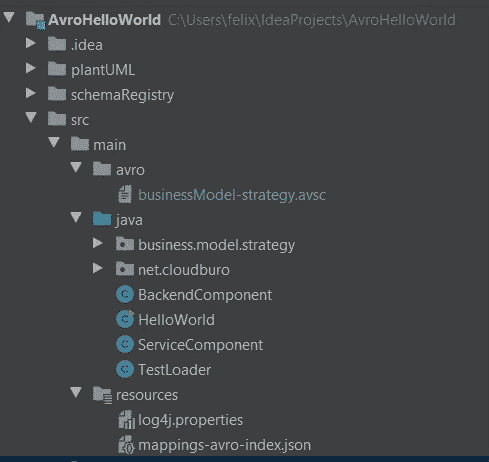

*   从`HelloWorld`类开始，它建立并模拟了`ServiceComponent`和`BackendComponent`之间的交互流。
*   从那里，您可以深入到轻量级支持类，这为您提供了一个整体方法的良好概览。
*   唯一的先决条件是存在一个弹性搜索测试集群。简单来说就是在 https://www.elastic.co/网站上创建一个 14 天的测试账户，这个账户能满足你的所有需求(还能让你体验 ElasticSearch 的一些漂亮功能)
*   `HelloWorld`程序排除了 ElasticSearch 实例端点，以及用户和密码(可以在 ElasticSearch 管理 GUI 中创建)

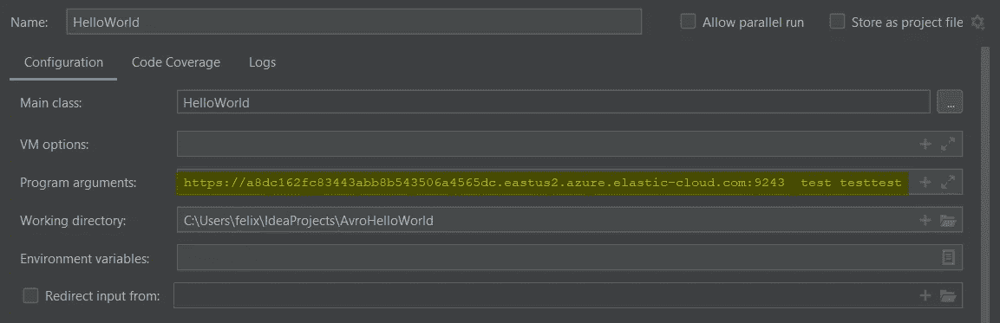

必需的“Hello World”程序参数

玩得开心！