# 候选资格& 2020 年的参议院

> 原文：<https://towardsdatascience.com/electability-the-senate-in-2020-a69622a04881?source=collection_archive---------31----------------------->

## 模拟民主党竞争者之间的差异

目前，有 12 个主要竞争者争夺民主党的总统候选人。压在选民心头的一个重要问题是:那些候选人在大选中能有多出色？

第二个同样重要的问题:*参议院的组成会发生什么变化？*这可能是民主党总统政策变化的主要限制因素，而且无论哪个政党控制总统职位，这也可能对司法部门的权力平衡产生重大影响。

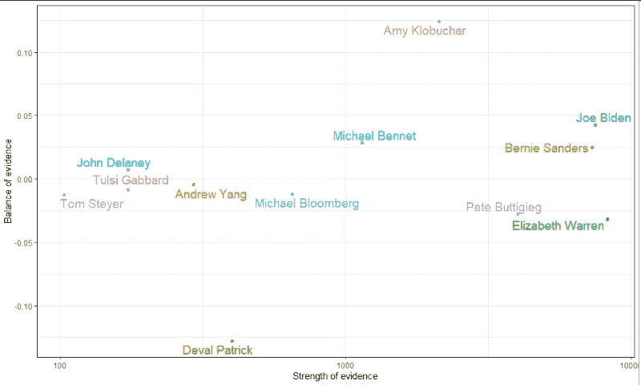

一个图表，显示每个候选人的候选资格的证据平衡(正面是好的，负面是坏的)，以及根据可用信息量计算的证据强度。

我将尝试用一个简单的数据驱动的开源[模型](https://github.com/tmcintee/electability-2020-pub/)来回答这些问题，使用民调数据(来自 [FiveThirtyEight 的民调跟踪](https://data.fivethirtyeight.com/))和过去的选举数据(参议院和总统数据来自[莱普的图集](https://uselectionatlas.org/))；来自维基百科、Ballotpedia 和各种州网站的同州内比较数据)。

即使对民主党赢得 2020 年总统大选的机会持乐观态度的人，也有理由对民主党获得参议院多数席位的机会持悲观态度。民主党人要么需要一个有巨大影响力的总统候选人，要么需要一个比他们的总统候选人表现更好的参议院候选人。

# 建立选举的基线模型

模拟选举的第一步是建立一个基线估计，粗略估计 2020 年选举在一个通用的民主党候选人的情况下会是什么样子。为了做到这一点，我将把以前选举的数据放在一起，创建一组合理的基线模型。

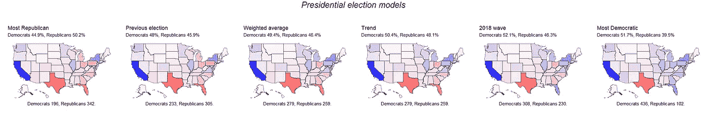

六个基线模型，总结了这些模型对民众投票百分比和选举人投票总数的预测。“最民主党”和“最共和党”的模型是基于从 1992 年到现在最强的总统差额。

模拟 2020 年选举的第一个也是最明显的方法是假设它将与 2016 年选举一样。加权平均模型根据近期(每四年选举权重减半)和票数(平方根)对过去的选举进行加权。因此，投票率较高的选举权重更大，该模型给出的预测与 2016 年相似。

趋势模型基于五次选举(1996 年至 2016 年)，使用线性回归对每个州的前六次选举进行推断。2018 年波浪模型将 2018 年众议院选举添加到趋势模型中。当我们从左到右，模型从更多的共和党转向更多的民主党。

普遍接受的观点是，长期趋势有利于民主党；另一方面，美国历史充满了周期性和反周期性的潮起潮落。

## 针对候选人之间的差异调整模型

下一步是为每个候选人调整模型*。基线模型被视为对民主党候选人表现的估计。*

为了进行这种调整，我使用了同一州、同一年或同一民意调查中候选人和典型(中间)民主党人之间的差异。每一个都被认为是对该候选人和普通民主党候选人之间差异的估计。

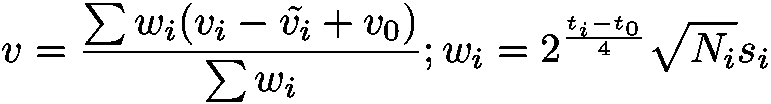

一个州的候选人的预测投票份额的基本控制方程。这是基于选举中的投票份额、同一投票或选举中的中值投票份额，并基于投票或选举的规模、2020 年选举前的时间以及地理相关性(s_i)进行加权。

然后，使用投票的大小及其日期对这些投票进行加权，经过加权平均模型中用于过去选举的相同的精确加权函数。然后，基线模型以固定的权重重新加入，如果缺乏证据，这使得预测稍微保守一些。

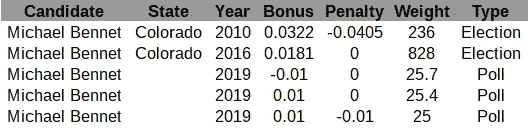

已处理数据的快照。“奖金”是指贝内特增加的民主党份额，而“惩罚”是指贝内特的对手增加的共和党份额。

因此，例如，2010 年麦克·班尼在科罗拉多州获得了 48.1%的选票，而普通民主党人获得了 44.7%的选票，这一事实让我们估计，与普通民主党人相比，麦克·班尼将获得额外的 3.2%的选票。这些信息与所有其他可用信息相结合——在这种情况下，是 2016 年的另一次选举和最近的三次全国民调——以产生对麦克·班尼和普通民主党人之间差异的特定州估计。

为了模拟科罗拉多州的总统选举，Bennet 以前在科罗拉多州的选举和民意调查都被计算在内，以及我们在科罗拉多州的基线模型。全国民意测验的权重被打了 0.25 的折扣。对于邻近的州，如新墨西哥州，该模型将全国民调和科罗拉多州选举的权重都乘以 0.25。对于更远的州，如佛罗里达州，科罗拉多州的选举乘以 0.05 的权重。

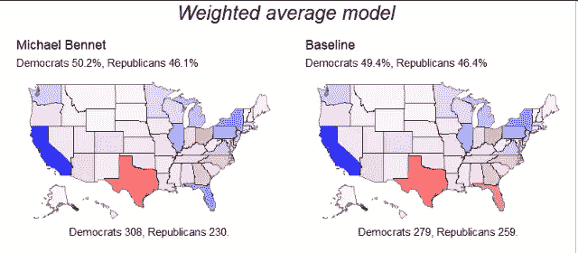

在麦克·班尼的例子中，我们仅有的一点信息是积极的，因此模型预测他将比一般的民主党人获得更多。

包括麦克·班尼在内的许多候选人在他们的家乡州比典型的民主党人做得更好，因此在模型中获得了家乡州的优势——这符合传统智慧(例如，见[本文](http://citeseerx.ist.psu.edu/viewdoc/download?doi=10.1.1.948.5060&rep=rep1&type=pdf))。

# 候选人

一般来说，我们可以根据信息的强度将候选人分成三组。

## 拥有许多民意测验的候选人

首先，我们有一些候选人已经在许多面对面的投票中表现突出:乔·拜登、伯尼·桑德斯、伊丽莎白·沃伦和皮特·布蒂吉格。根据上述方法，对这些候选人来说，投票数据比他们过去的选举表现起着更大的作用。

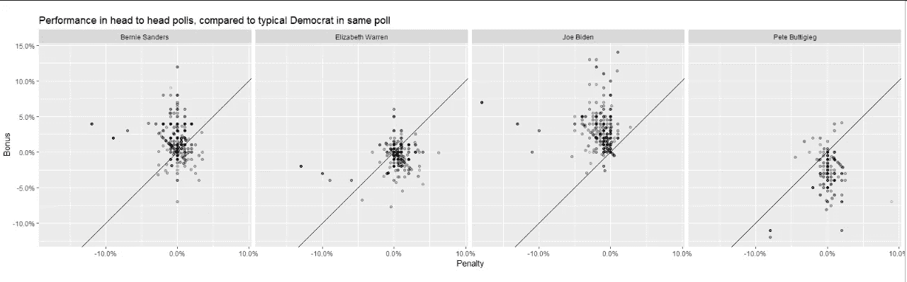

与同一民调中的民主党中值相比，这些群体的紧张程度相当明显。Buttigieg 和 Biden 之间的加权平均差异在 5 个点的数量级。民意测验用具有较高权重的较暗阴影绘制；权重依次基于样本大小和新近性。

拜登和桑德斯的民意测验比沃伦和布蒂吉格好。这种差异随着时间的推移一直非常一致——远远超过民主党候选人和特朗普之间的差距，这种差距随着时间的推移和不同众议院效应的民意调查而显著变化。

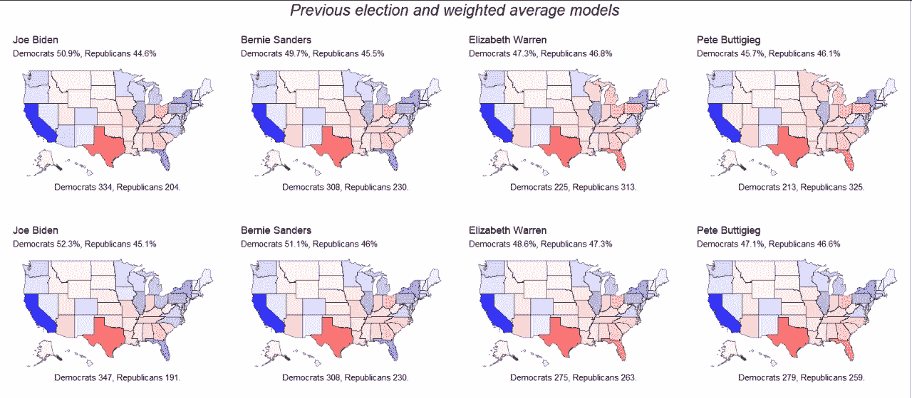

顶行中的上一个选举模型；最下面一行是加权平均模型。

由于拜登和桑德斯在过去的选举中也比典型的民主党人做得更好，而沃伦和 Buttigieg 做得更差，该模型毫不含糊地预测拜登和桑德斯会比沃伦和 Buttigieg 做得更好。

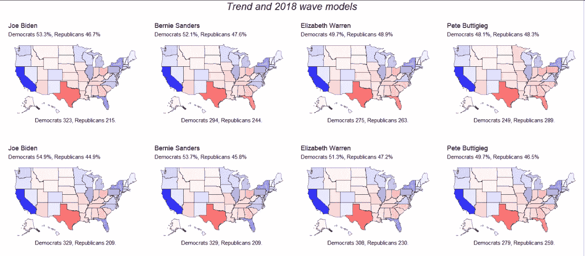

顶行中的趋势模型；底排 2018 款 wave 车型。

任何民主党候选人都可能赢得或输掉选举，值得注意的是，即使是我们最好的估计也有很多不确定性，特别是在这种情况下。可能这些候选人中的一些人有隐藏的弱点或隐藏的优势，而这些还没有在投票中显现出来。选举团是混乱的，这里和那里的几个点可以产生非常大的差异。

可能这些候选人中的一些人有隐藏的弱点或隐藏的优势，而这些还没有在投票中显现出来。同样值得注意的是，在皮特·布蒂吉格表现的模型中，大量未承诺的投票者与较低的知名度成对出现。相应地，我们应该减少对模型根据民意测验预测其表现的能力的信任:许多选民尚未形成对 Buttigieg 的看法。

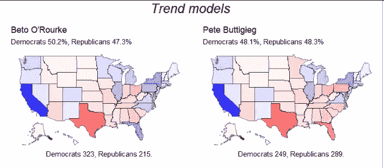

这种差异在趋势模型中最为显著。

然而，虽然名字认知度在扭曲民调数字方面发挥了作用，但名字认知度类似或更低的其他候选人在面对面的民调中比皮特·布蒂吉格获得了更好的民调——最明显的是贝托·奥罗克(Beto O'Rourke)，尽管全国的名字认知度类似，但他的面对面民调显然更好。

# 竞选全州公职的候选人

在 12 名主要候选人中，有 7 人过去竞选过全州的公职，包括在许多激烈的民意调查中表现突出的四名领先者。

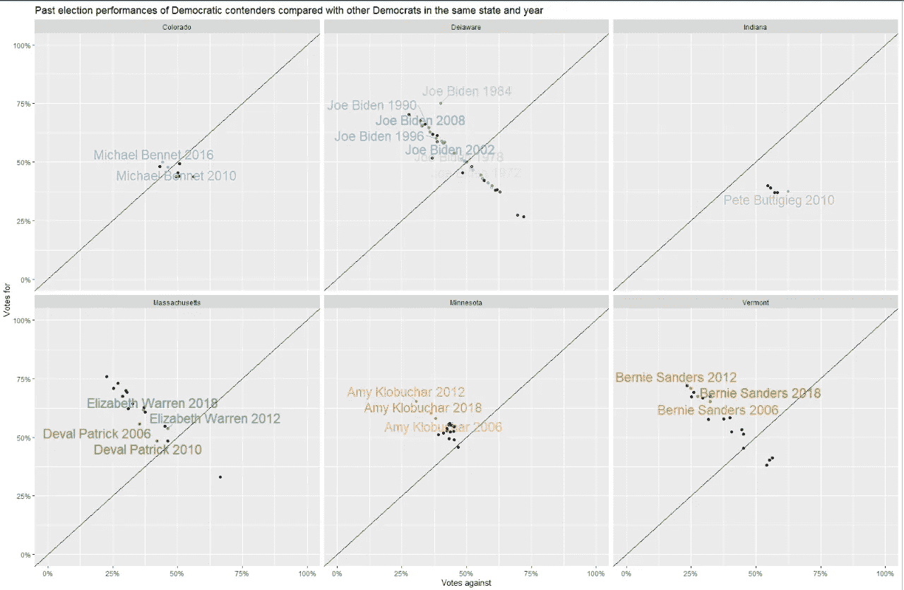

民主党候选人在过去选举中的表现。更久远以前的选举逐渐变得透明。

第二，我们有一些候选人没有在很多全国性的民意调查中出现过，但他们竞选过全州的公职:艾米·克洛布查尔、麦克·班尼和德瓦尔·帕特里克。对于这些候选人，我的模型主要依靠他们家乡州过去的选举表现来推断全国的表现。

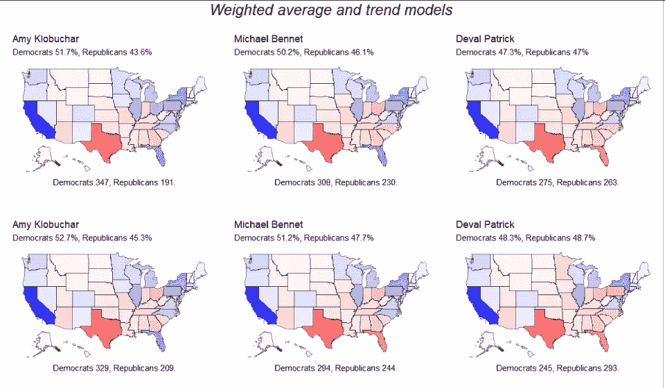

正如我们在上面的图表中看到的，这产生了对麦克·班尼有利的结果，对 Amy Klobuchar 非常有利的结果，对 Deval Patrick 不利的结果。Klobuchar 在明尼苏达州选举中的表现确实非常出色，大大超过了与她一起竞选的所有其他民主党人。此外，明尼苏达州靠近几个战场州——爱荷华州、威斯康星州和密歇根州。

## 其他候选人

还有另外五位著名的候选人，他们以前从未竞选过州级职位，也没有在很多面对面的民意调查中出现过。这包括杨安泽，塔尔西·加巴德，汤姆·斯泰尔，迈克尔·彭博，约翰·德莱尼。在这种情况下，我们的模型没有说太多——没有足够的信息。更糟糕的是，我们仅有的一点点信息可能会受到低知名度的严重影响。

在同一次民意调查中，与典型的民主党人相比的加权平均民意调查，结合了支持和反对票数的变化，根据进行的民意调查的数量绘制。前候选人包括在内，以显示一个更完整的画面。

从历史上看，提名一个从未竞选过州级职位的候选人是不寻常的。我个人认为，杨安泽和塔尔西·加巴德最有能力吸引那些通常不会投票给民主党人的人。由于她所吸引的负面媒体和她在党内地位显赫的敌人，加巴德可能很难保住民主党的选票。

## 添加统计噪声以增强鲁棒性

现在，我们所看到的是一个非常大而复杂的可能结果空间中的一个非常稀疏的样本。这些结果有多可靠？也就是说，在对单个模型进行小改动的情况下，它们的表现如何？选举团是一个混乱的系统，一小部分选票的变化可以产生惊人的大变化。

我们可以进行多次模拟，对数据进行随机调整。如果这些调整将邻近的州联系起来，我们就能捕捉到这些地区经常一起移动的方式。

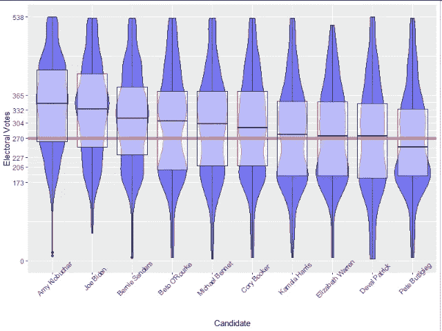

选举人投票结果的小提琴图，每个候选人在六个基线模型中各有 100 个模拟。基准选举人票总数包括 270 张(获胜)以及麦凯恩、罗姆尼、希拉里、川普和奥巴马最近的选举表现。前候选人贝托·奥罗克、卡玛拉·哈里斯和科里·布克都包括在此图中，以创建一个更广泛的比较基础。

看待这个问题的一个方法是观察每个候选人的结果分布。艾米·克洛布查尔被评为更强的事实并不是基线选择的一个怪癖；这是因为该模型包括了过去的选举记录，而 Klobuchar 有着非同寻常的选举历史。

事实上，当我们在模拟中加入噪音时，我们在六个特定模型中观察到的差异并没有消失。可能的全国总支持度只有几个百分点的差异，就可能导致选举团选举结果的巨大差异。

# 参议院

总统任期内的参议院选举受到总统提携的强烈影响。民主党总统候选人将对参议院的构成产生影响；从逻辑上讲，一个更强大的候选人将有助于赢得更多的参议院席位。

## 从基线模型中选择。

有 35 个席位等待选举，包括乔治亚州的两个席位；大多数席位的上一次选举是在 2014 年。共和党拥有其中的 23 个席位。原则上，这意味着共和党是脆弱的；然而，大多数共和党现任者强烈支持连任。

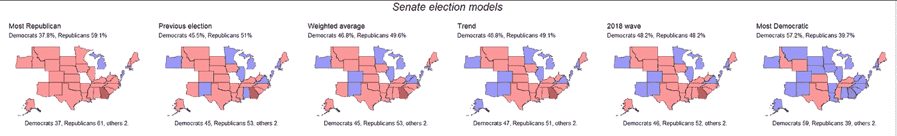

作为一个群体，四个中间基线模型(共和党赢得 51 至 55 个席位范围内的大多数席位)符合由[拉里·萨巴托](http://crystalball.centerforpolitics.org/crystalball/2020-senate/)、[政治](https://www.politico.com/2020-election/race-forecasts-and-predictions/senate/)、[库克政治报告](https://cookpolitical.com/ratings/senate-race-ratings)和大多数其他专家预测者提供的专家预测。然而，只有 2018 年波浪模型避免了任何不寻常的基线预测；西弗吉尼亚、阿拉巴马和阿拉斯加对民主党来说都是困难的州。

值得注意的是，这个模型也是关于总统选举最乐观的模型之一:2018 年 wave 模型预测，即使是最弱的民主党总统候选人也可能赢得总统竞选。

## 2018 年波浪模型的预测

即使民主党人在与 2018 年中期选举类似的选举中赢得总统大选——这一点绝不是确定的——他们也很难在参议院赢得哪怕是微弱的多数。

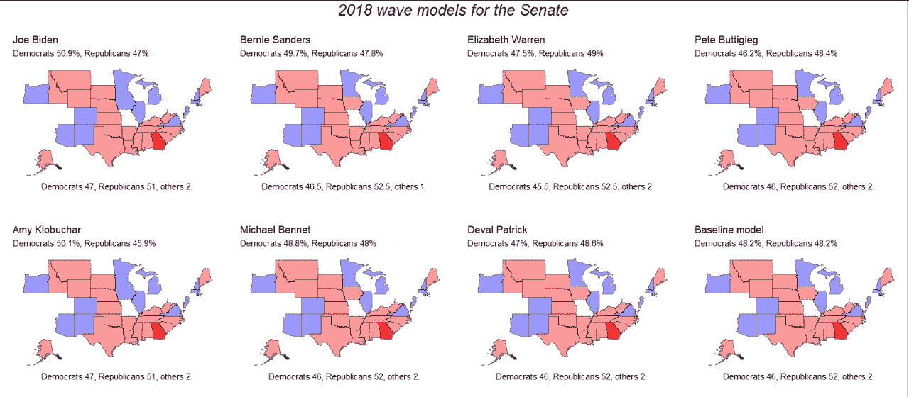

有一个重要的通配符值得注意:伊丽莎白·沃伦和伯尼·桑德斯代表着共和党州长的州——这意味着如果他们离开参议院，他们可能会被共和党任命的人取代，至少暂时是这样。这两个州都有可能在特别选举中选出民主党的替代者，但这种特别选举特别难以提前预测(参见马萨诸塞州 2010 年，[阿拉巴马州 2017 年](https://en.wikipedia.org/wiki/2017_United_States_Senate_special_election_in_Alabama))；为了报告选举结果，我把这算成了两大政党各占一半的席位。

这些预测非常可信——尽管投票总数有显著差异，但就赢得的席位而言，所有候选人都非常相似。为了赢得参议院多数席位，民主党需要超越近期历史建立的预期，特别是在南方。

## 给参议院模式增加噪音

有了合理基线模型的明确选择，很容易给参议院模型添加噪声——这最终会在候选人之间产生更明显的差异。大多数候选人的中值结果略高于噪声前的基线预测，这是一个值得解释的事实。

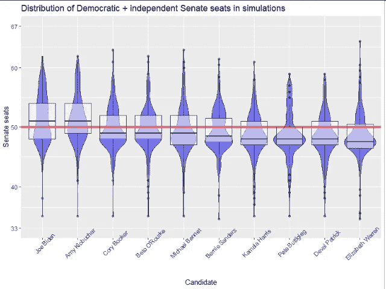

我们注意到的差异都没有消失；然而，加入噪音会让新的差异出现。

在 2018 年的基线模型中，预计大多数战场州将以微弱优势再次选举共和党参议员。给模型增加噪音表明民主党很可能在某个地方获得额外的席位——也许是蒙大拿州，也许是缅因州，也许是北卡罗来纳州。

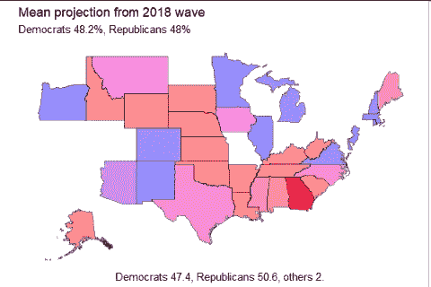

在系统中具有数据的所有候选者上的平均噪声添加预测。

值得重复的是，总体而言，2018 年的 wave 模型对民主党人来说是一个相当乐观的模型。这一模型表明，民主党有机会在德克萨斯州等州赢得参议院席位，在德克萨斯州，几十年来没有民主党人赢得过全州选举。

这不是唯一的——也不是最复杂的——可能的选举结果模型；但是它强调了在整个国家投票中仅仅几个百分点的差异的巨大影响。

# 结束语

我们试图比较民主党竞选者赢得选票的能力。选举人团和参议院都是由州一级的赢家通吃选举决定的，因此全国范围内几个百分点的微小变动都会产生巨大影响。

领先者之间有一个清晰的模式。乔·拜登和伯尼·桑德斯在他们家乡的选举中表现得比典型的民主党人更好，在面对面的民意调查中也比典型的民主党人表现得更好。伊丽莎白·沃伦和皮特·布蒂吉格在过去的全州选举和民调中表现更差。

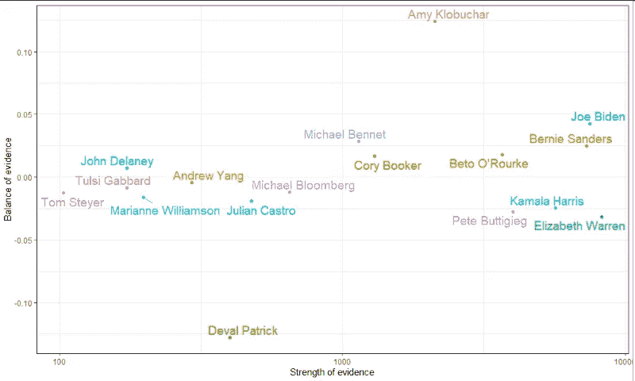

强度被估计为投票者或投票应答者数量的时间衰减平方根之和。证据平衡是一个加权和。前候选人包括在内，以提供一个更完整的画面。

对于其他候选人，我们掌握的信息更少。Amy Klobuchar 在明尼苏达州的全州选举中一贯表现强劲，确实非常出色，但这与全国民调结果并不相符。麦克·班尼当选的证据是积极的，尽管有限。

对于那些以前没有竞选过州级职位，也没有在许多全国性民调中出现过的候选人，比如杨安泽，我们只是还没有太多好的信息。