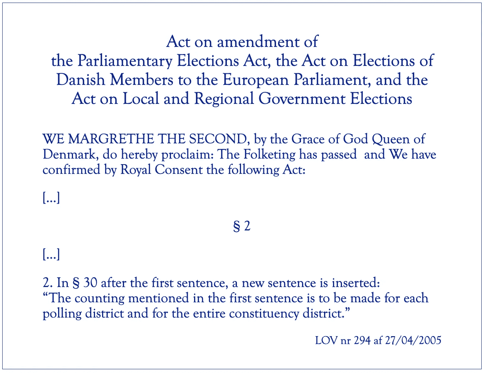

# 选举审计:发现重新计票中的错误

> 原文：<https://towardsdatascience.com/election-audit-finding-errors-in-recounts-3886685a9948?source=collection_archive---------38----------------------->

作者插图

选举是我们民主的基石，对我们社会的发展具有深远的影响。这都是关于数据的。这是一个故事，讲述了二十年前我们如何在丹麦解决了一个关键的数据质量问题，我们的解决方案直到今天仍在使用。

我们认为我们应该使用复杂的分析，但最终归结为正确指标的设计。

# 问题是

在丹麦，选举用纸质选票卡进行。投票站从早上 8 点到晚上 8 点开放。投票结束后立即开始计票。在选举当晚，随着计票的进行，每个投票站都会报告每个政党的票数，从而可以计算出每个政党获得的授权数，并由此生成选举产生的政治格局的图像。第二天进行重新计票，确定候选人的人数，从而确定哪些候选人获得了哪些授权。

显然，将一个政党的候选人的候选人票相加，应该会给出该政党在选举当晚的数字，从而提供对计票的检查。然而，负责选举的内政部怀疑存在未被发现的错误。

作者插图

独立政党计票员很容易发现选票卡从一个政党的候选人转移到另一个政党的候选人(图中的 1)。但如果候选人来自同一个政党(图中为 2)，则情况并非如此。计票时，选票卡以 25 张为一捆，4 捆在一起，100 张为一捆。束可以在党内的候选人之间移动(图中的 2)。当你投票时，你可以为一个政党或候选人投票。政党的选票可能会转移给政党的候选人(图中的 3)，反之亦然。空白选票也可能被篡改，变成候选人(图中的 4)或政党的选票。

我当时在一家小型咨询公司 BusinessMinds(已经不存在)工作，我们的任务是开发一种方法来检测这种错误。首先，我们认为我们应该引入来自分析或数据挖掘的奇特方法，这在当时是一个大肆宣传的术语。我们手头有前几次选举的选举数据，但每次选举都有很大的变化。在原子层面上，即每个投票站的每个候选人，根本没有可识别的趋势。因此，只能在一次选举中进行分析。

# 方法

不仅投票会随着时间的推移而改变，而且在地理上也会有所不同:一些政党在城市中的地位更高，而其他政党则在农村地区。通过研究这些数据，我意识到，在缩小投票区范围时，一个相当稳健的模式将是总体指标变化的单调性。为了澄清这一点，我们需要看看丹麦的选举制度。

丹麦选举按地理等级组织(括号中的描述参见下图):

—国家
— — 3 个选举省(蓝线和文字)
——10 个多议员选区(红线和文字)
——92 个提名区(绿色区域，黑色文字)
———1384 个投票区(未描绘)

来自[丹麦的议会选举制度](https://www.thedanishparliament.dk/-/media/pdf/publikationer/english/the-parliamentary-system-of-denmark_2011.ashx)(一个选区没有画出来:博恩霍尔姆岛)

党组织在提名区一级提名候选人。地方组织将在他们的提名区宣传他们自己的候选人，但候选人可以在整个选区，即在许多提名区当选。

为了应对政党受欢迎程度的地区差异，候选人票数与政党票数的比率按不同的地理级别计算:

这里的政党选票指的是投给该党的所有选票，或者投给该党的个别候选人，或者投给该党。这个比例叫做候选比例。如果一个候选人在整个选区中同样受欢迎(或不受欢迎),那么这个比例在各个地理级别上是不变的。

与此同时，候选人在党内的突出地位与该党在地区的受欢迎程度无关:在该党获得许多选票的地区，20%的政党选票与在该党获得很少选票的地区一样具有代表性。

然而，候选人的受欢迎程度通常因地域而异。通常候选人住在提名区，离家近的人比离家远的人更出名。因此，在投票区一级观察候选人比例，通常会发现候选人在当地投票站的比例最高。为了衡量对候选人的额外关注，候选人的比例在不同的地区进行了比较:投票地区的候选人比例除以提名地区的候选人比例。

如果候选人在各个地区的受欢迎程度相同，那么这个比率在任何地方都是 1。因此，偏离 1 表示候选人受欢迎程度的地理变化。为了获得更对称的测量，应用对数。在这里，这个度量被称为亲和力:

亲和力与 0 的偏差是候选人以及政党的受欢迎程度的局部变化的度量。可以在分母中使用选区/地区候选人比率，这将产生更清晰的候选人衡量标准。但这里的目的是确定来自同一政党的候选人之间，即同一选区的候选人之间可能的选票转移。

显然，亲和力将分布在 0 附近。这种模式相当稳健，在候选人的家乡投票区有一个峰值，从那里开始下降。这是最近一次大选中所有候选人在丹麦的分布情况(分成 50 个箱):

作者插图

可以看出，分布被避开，这是一个边界问题。许多候选人获得的选票相对较少，因此负面亲和力的变化有限。

人们发现，这种避开的钟的尾部末端是误差的良好指示器。钟的反面更敏感。如果在一个投票区的一个政党中的两个候选人之间存在投票偏移，则可以识别出两个相应的异常值:一个是一个候选人的钟形负侧，一个是另一个候选人的钟形正侧。

我们查看了电子表格中的简单描述，并创建了一个列表，列出了所有投票区一级的投票，按亲缘关系的*平方降序排列。然后，我们从顶部开始搜索同一投票区同一政党的记录对。就这么简单。*

# 调查的结果

这个方法证明是成功的。我们参与了两次大选和一次欧洲议会选举。从那以后，整个地区都被内政部外包出去了，我们再也不参与了。

在每次选举中，我们都会发现潜在的错误，然后教育部会评估这些错误，以决定是否应该再次重新计票。如果是这样的话，当地的市长将被联系并被告知重新计票。在所有选举中，这种重新计票导致数百张选票的数量级调整。

尽管我们不再是这一过程的一部分，但这一方法成为了丹麦选举的标准工具。当我们开始时，点票的法律规定是政党选票应在投票区一级进行，而候选人选票应在选区一级进行。实际上，候选人的投票是在投票区一级报告的，这使我们能够进行分析。但是为了确保这些数字的可用性,《选举法》进行了修订。

作者插图

从这个项目中主要学到的是，在分析数据时选择合适的指标至关重要。这项任务并不简单，但是开发亲和力测量使分析变得尽可能简单。数据准备的目的是获得尽可能强的信号以进行探索，事实证明，亲和力检查足以识别选举重新计票中的错误

# 细节

## 亲和力的定义

更具体地说，由于 log(0)以及 0/0 和∞/∞未定义，有必要处理一些异常:

1.  如果*投票区*中的*政党计票*为 0，即*候选人计票*也为 0，则亲和力设置为 0。
2.  如果*提名区*中的*政党计票*为 0，即*候选人计票*也为 0，则亲和力设置为 0。这不太可能发生。
3.  如果*提名区*中的*候选人票数*为 0，这不是错误，因为这涵盖了多个投票区。因此，亲和力被设置为 0。
4.  如果*投票区*中的*政党计票*不为 0，并且*候选人计票*为 0，则:如果*政党计票* > β(其中β是某个阈值)，则*候选人计票*被设置为 1，否则亲和度被设置为 0。

第三个规则背后的推理是在候选人在投票区没有获得任何选票的情况下获得亲和力的指示。不能忽视候选人投票数为 0，但我们需要处理 log(0)问题。这是通过使用可能的最低票数 1 来实现的。使用小于 1 的(十进制)数是没有意义的。所得的相似性将是替换规则的特征，而不是低投票计数的特征。然而，如果政党票数非常低，这种替换将导致不成比例的大候选人比例。为了避免引入阈值，低于该阈值的情况被忽略，即相似性被设置为 0。阈值通常设置为 10。

## 投票站

如上所述，共有 1384 个投票站。下图显示了每个投票点的投票数。这反映了人口密度的明显变化。本文中的所有数字都是基于上次大选。

作者插图

## 政党名单投票和个人投票

一个选民可以投票给一个政党(政党名单投票)或一个候选人(个人投票)。两者在各缔约方的分布情况有所不同。

作者插图

对于两个大党 A(社会民主党)和 V(自由党)来说，大多数选票是个人选票。这些是传统的政府政党。通常总理来自这两个政党中的任何一个。他们有强大的地方组织。丹麦政府几乎总是少数党政府，通常是两到四个政党的联盟，然后依靠支持他们的政党来确保他们的政治的多数。实际上，上次大选的结果是产生了一个极不寻常的一党政府(A ),三个支持党(F 和 B)在议会中占了一半以上的席位。

与两大政党相反，还有更理想主义的政党，如(大多数左翼社会主义者)和 D(右翼)。政党名单投票占优势。

e 基本都是单人党。然而，它拥有最大比例的政党名单选票。原因是，这个人只是十个选区中的一个选区的候选人，因此在另一个选区，有一些鲜为人知的地方“替身候选人”。因此，在这些地区，绝大多数选票是政党名单选票。

无论是 K(基督教民主党)，E(单一牧师，中间自由派)还是 P(民粹主义，反移民)都没有获得足够的选票来赢得议会席位。

## 亲和力

下图显示了以上定义的八名候选人(此处称为 a-h)在多个以颜色标识的投票区的相似性。因此，每个颜色段代表一个投票区，八个条形代表特定政党的八名候选人。

作者插图

该图给出了α值变化的印象。但事实上，我篡改了数据:对于用粉色标识的投票区，我将候选人 a 的 20 张选票转移到了候选人 T2 的 g 的 T3。有明显的迹象表明， *a* 现在得到的选票太少，而不清楚哪个候选人得到了太多的选票。有时只能识别非自愿捐献者，有时可以区分捐献者和接受者。

**延伸阅读**

[丹麦的议会选举制度](https://www.thedanishparliament.dk/-/media/pdf/publikationer/english/the-parliamentary-system-of-denmark_2011.ashx)，内政和卫生部与丹麦议会，哥本哈根，2011 年

[修正法](https://www.retsinformation.dk/eli/lta/2005/294)(丹麦语)