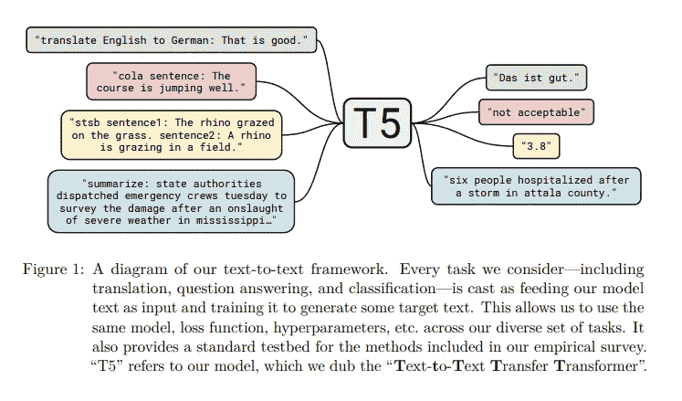
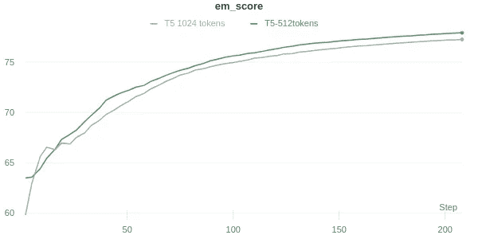

# 选举特辑:使用变形金刚检测假新闻

> 原文：<https://towardsdatascience.com/election-special-detect-fake-news-using-transformers-3e38d0c5b5c7?source=collection_archive---------36----------------------->

## 用数据做很酷的事情

# 介绍

美国 2020 年大选在即。在选举前后，社交媒体上发布的假新闻是一个巨大的问题。虽然有些假新闻是为了歪曲选举结果或通过广告赚快钱而故意制作的，但虚假信息也可以由被误导的个人在其社交媒体帖子中分享。这些帖子可以迅速成为病毒模糊。大多数人相信被很多人喜欢的帖子一定是真的。

对于机器学习模型来说，检测假新闻并不是一件容易的事情。这些故事中有许多写得非常好。机器学习仍然有帮助，因为:

*   它可以检测到该书写风格与它的数据库中被标记为假的相似
*   故事中事件的版本与已知的真实情况相矛盾

在这篇博客中，我们使用 BERT 和 T5 变压器模型构建了一个假新闻检测器。T5 模型在检测 2016 年选举前后发布的真实假新闻方面表现非常好，准确率高达 80%。

“假新闻检测器”的完整代码在我的 Github [*这里*](https://github.com/priya-dwivedi/Deep-Learning/tree/master/T5-Fake-News-Detector) 公开。

在[深度学习分析](https://deeplearninganalytics.org/)，我们非常热衷于使用数据科学和机器学习来解决现实世界的问题。请联系我们，与我们讨论 NLP 项目。


Unsplash 的免版税—[https://unsplash.com/photos/EQSPI11rf68](https://unsplash.com/photos/EQSPI11rf68)

# 数据集

对于这篇博客，我们使用了 [Kaggle 数据集](https://www.kaggle.com/mrisdal/fake-news)——了解假新闻的真相。它包含被 BS Detector 标记为虚假或有偏见的新闻和故事，BS Detector 是 Daniel Sieradski 的 Chrome 扩展。BS 检测器将一些网站标记为假网站，然后从这些网站上抓取的任何新闻都被标记为假新闻。

数据集包含大约 1500 个新闻故事，其中大约 1000 个是假的，500 个是真的。我喜欢这个数据集的原因是，它包含了在 2016 年大选最后几天捕捉到的故事，这使得它与检测选举期间的假新闻非常相关。然而，给假新闻贴上标签的挑战之一是，需要花费时间和精力来审查故事及其正确性。这里采用的方法是认为所有来自标有 BS 的网站的故事都是假的。情况可能并不总是如此。

标记为真实的故事的一个例子是:

```
ed state  \nfox news sunday reported this morning that anthony weiner is cooperating with the fbi which has reopened yes lefties reopened the investigation into hillary clintons classified emails watch as chris wallace reports the breaking news during the panel segment near the end of the show \nand the news is breaking while were on the air our colleague bret baier has just sent us an email saying he has two sources who say that anthony weiner who also had coownership of that laptop with his estranged wife huma abedin is cooperating with the fbi investigation had given them the laptop so therefore they didnt need a warrant to get in to see the contents of said laptop pretty interesting development \ntargets of federal investigations will often cooperate hoping that they will get consideration from a judge at sentencing given weiners wellknown penchant for lying its hard to believe that a prosecutor would give weiner a deal based on an agreement to testify unless his testimony were very strongly corroborated by hard evidence but cooperation can take many forms  and as wallace indicated on this mornings show one of those forms could be signing a consent form to allow   the contents of devices that they could probably get a warrant for anyway well see if weiners cooperation extends beyond that more related
```

一个假的故事是:

```
for those who are too young or too unwilling to remember a trip down memory lane \n  debut hillary speaks at wellesley graduation insults edward brooke senates lone black member \n  watergate committee says chief counsel jerry zeifman of hillarys performance she was a liar she was an unethical dishonest lawyer she conspired to violate the constitution the rules of the house the rules of the committee and the rules of confidentiality \n  cattlegate as wife of arkansas governor she invests  in cattle futures makes  \n  whitewater clintons borrow money to launch whitewater development corporations several people go to prison over it clintons dont \n  bimbo eruptions bill and hillary swear to steve kroft on  minutes bill had nothing to do with gennifer flowers \n  private investigators we reached out to them hillary tells cbs steve kroft of bills women i met with two of them to reassure them they were friends of ours they also hire pis to bribe andor threaten as many as twodozen of them \n  health care reform hillary heads secret healthcare task force sued successfully for violating open meeting laws subsequent plan killed by democraticcontrolled house \n  ....
```

这些故事平均有 311 个单词，有些故事超过 1000 个单词。

# 模特培训

在这个练习中，我们训练了来自 [HuggingFace](https://github.com/huggingface/transformers) — 1 的两个模型。具有序列分类头的 BERT 和具有条件生成头的第二个 T5 变换器模型。BERT 模型在验证集上检测假新闻的准确率为 75%，而 T5 模型能够达到 80%的准确率。因此，我们将在博客的其余部分集中讨论如何训练 [T5 模型](https://arxiv.org/abs/1910.10683)。

T5 是文本到文本模型，这意味着它可以被训练成从一种格式的输入文本到一种格式的输出文本。这使得该模型非常通用。我个人用它来训练文本摘要。在这里查看我的博客。并使用它来建立一个琐事机器人，它可以在没有任何上下文的情况下从内存中检索答案。点击查看这篇博客[。](https://medium.com/analytics-vidhya/build-a-trivia-bot-using-t5-transformer-345ff83205b6)



T5 —文本到文本转换转换器。图片来自 [T5 纸。](https://arxiv.org/pdf/1910.10683.pdf)

## 将我们的分类问题转换为文本到文本的格式

[Huggingface T5](https://huggingface.co/transformers/model_doc/t5.html) 实现包含一个条件生成头，可以用于任何任务。对于我们的任务，我们的输入是真实的新闻故事，输出是文本——真实的/虚假的。

对于输入文本，我们将最大标记长度设置为 512。如果故事小于 512，那么将在结尾添加一个<pad>标记。如果故事比较大，那么它们会被截断。对于输出，令牌长度设置为 3。下面是它的代码片段。请在这里找到我的 Github [上的完整代码。](https://github.com/priya-dwivedi/Deep-Learning/tree/master/T5-Fake-News-Detector)</pad>

```
source = self.tokenizer.batch_encode_plus([input_], max_length=self.input_length, 
                                                padding='max_length', truncation=True, return_tensors="pt")

targets = self.tokenizer.batch_encode_plus([target_], max_length=3, 
                                                     padding='max_length', truncation=True, return_tensors="pt")
```

## 定义 T5 模型类

接下来，我们定义 T5 模型微调类。模型正向传递与其他变压器模型相同。因为 T5 是文本-文本模型，所以输入和目标都被标记化，并且它们的注意力屏蔽被传递给模型。

```
**def** forward(self, input_ids, attention_mask=**None**, decoder_input_ids=**None**, decoder_attention_mask=**None**, lm_labels=**None**):
        **return** self.model(
                input_ids,
                attention_mask=attention_mask,
                decoder_input_ids=decoder_input_ids,
                decoder_attention_mask=decoder_attention_mask,
                labels=lm_labels
            )
```

在生成步骤中，解码器的输出被限制为令牌长度 3，如下所示:

```
**def** _generative_step(self, batch) :

        t0 = time.time()
        *# print(batch)*
        inp_ids = batch["source_ids"]

        generated_ids = self.model.generate(
            batch["source_ids"],
            attention_mask=batch["source_mask"],
            use_cache=**True**,
            decoder_attention_mask=batch['target_mask'],
            max_length=3

        )
        preds = self.ids_to_clean_text(generated_ids)
        target = self.ids_to_clean_text(batch["target_ids"]
```

该模型通过检查生成的标签(假/真)是否与实际标签匹配来测量准确度分数。

# 模型训练和结果

使用 8 的批量大小训练 t5 small 30 个时期。这个模型花了大约一个小时来训练。权重和偏差用于监控训练。在线 Github 代码已经将 wandb 集成到 Pytorch Lightning 中用于培训。

我在令牌长度 512 和 1024 上训练了一个 T5 small。这两个模型表现相似，准确率接近 80%



T5 小型假新闻检测器— Val 集合准确度分数

在 val 集上测试 T5 表明，该模型具有令人印象深刻的检测假新闻的能力。

```
Input Text: classify: russias most potent weapon hoarding gold shtfplancom this article was written by jay syrmopoulos and originally published at the free thought project editors comment he who holds the gold makes the rules fresh attempts at containing russia and continuing the empire have been met with countermoves russia appears to be building strength in every way putin and his country have no intention of being under the american thumb and are developing rapid resistance as the us petrodollar loses its grip and china russia and the east shift into new currencies and shifting
world order what lies ahead it will be a strong hand for the countries that have the most significant backing in gold and hard assets and china and russia have positioned themselves very
well prepare for a changing economic landscape and one in which selfreliance might be all we have russia is hoarding gold at an alarming rate the next world war will be fought with currencies by jay syrmopoulos with all eyes on russias unveiling their latest nuclear intercontinental ballistic missile icbm which nato has dubbed the satan missile as tensions with the us increase moscows most potent weapon may be something drastically different the rapidly evolving geopolitical weapon brandished by russia is an ever increasing stockpile of gold as well as russias native currency the
ruble take a look at the symbol below as it could soon come to change the entire hierarchy of the international order potentially ushering in a complete international paradigm shift...

Actual Class: Fake

Predicted Class from T5: Fake
```

# 结论

T5 是一款很棒的车型。有了足够的数据，针对任何 NLP 问题微调转换器变得很容易。这篇博客表明 T5 可以很好地检测假新闻。

我希望您尝试一下代码，并训练自己的模型。请在下面的评论中分享你的经历。

在[深度学习分析](https://deeplearninganalytics.org/)，我们非常热衷于使用机器学习来解决现实世界的问题。我们已经帮助许多企业部署了创新的基于人工智能的解决方案。如果你看到合作的机会，请通过我们的网站[这里](https://deeplearninganalytics.org/contact-us/)联系我们。

# 参考

*   [T5 变压器](https://arxiv.org/abs/1910.10683)
*   [拥抱脸变形金刚](https://huggingface.co/transformers/model_doc/t5.html)
*   真实新闻与假新闻