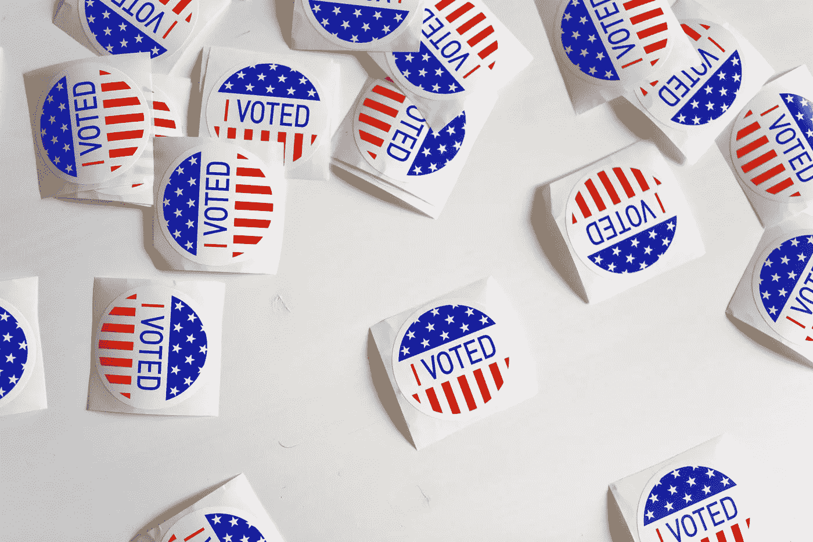

# 选举特辑:训练一台 GPT-2 生成唐纳德·川普的演讲

> 原文：<https://towardsdatascience.com/election-special-train-a-gpt-2-to-generate-donald-trump-speeches-b66fc3aa92b9?source=collection_archive---------39----------------------->

## 用数据做很酷的事情



来自 Unsplash 的免版税—[https://unsplash.com/photos/ls8Kc0P9hAA](https://unsplash.com/photos/ls8Kc0P9hAA)

# 介绍

在这篇关注美国 2020 年大选的第二篇博客中，我们根据唐纳德·特朗普的演讲训练了一个 GPT-2 模型。通过最少的训练，GPT-2 模型成功地复制了他的风格，并开始以他的风格写作。参见 GPT-2 生成的 Donald Trump 演讲样本。听起来确实像他！

```
As president, I kept my promise. Nobody else did. We set records. We set records. Thank you very much. Great job. We set records. And by the way, there's two really greats, right? There's Sonny Perdue and there's Barack Hussein Obama. The two greats. Really great. One has become the most powerful president in the history of our country. I said, "How powerful is that?"
```

[GPT-2 模型](https://openai.com/blog/better-language-models/)去年由 Open AI 发布。这是一个已经在 40GB 互联网文本上训练过的语言模型。该模型可以在任何文本样本上进行微调，以根据输入文本调整其生成样式。在这篇博客中，我们使用 [HuggingFace repo 的](https://huggingface.co/transformers/model_doc/gpt2.html)实现 GPT-2，看看你如何调整它来为 DT 写演讲稿。

我们还写了一篇关于使用 T5 模型检测假新闻的选举专题博客。点击查看[。](/election-special-detect-fake-news-using-transformers-3e38d0c5b5c7)

在[深度学习分析](https://deeplearninganalytics.org/)，我们非常热衷于使用数据科学和机器学习来解决现实世界的问题。请联系我们，与我们讨论 NLP 项目。

# 数据集

对于这篇博客，我们使用了 [Kaggle 数据集](https://www.kaggle.com/christianlillelund/donald-trumps-rallies)——唐纳德·特朗普的集会。这个数据集有他的 35 次演讲。一半的演讲来自去年年底，其余的来自今年。最新的演讲来自他 2020 年 9 月在塞勒姆、费耶特维尔和亨德森的集会。

在我们开始根据这些数据训练语言模型之前，我们需要以 GPT 新协议要求的格式获取数据。GPT-2 需要逐句传递数据。

作为数据预处理的一部分，我们执行以下操作:

1.  把演讲分成句子
2.  将前 85%的句子保留在训练集中，其余的放在验证集中。验证集将用于测量困惑分数

实现这一点的代码片段如下。NLTK 库用于将语音句子标记成句子。

```
train_sentences = []
val_sentences = []
for filename in sorted(glob.glob(os.path.join('DT_speeches', '*txt'))):
    print(filename)
    f = open(filename, 'r')
    file_input = f.readlines()
    for cnt, line in enumerate(file_input):
        sentences = nltk.sent_tokenize(line)
        for i , sent in enumerate(sentences):
            if i <= len(sentences)*0.85:
                train_sentences.append(sent)
            else:
                val_sentences.append(sent)
```

训练和赋值语句列表被写入文本文件。GPT-2 模型将使用这些文本文件进行训练。

# 微调 GPT-2 语言建模

让我们从 Giphy 训练它 GIF—[https://media.giphy.com/media/g0Kzu8bTbGPPEH0hSm/giphy.gif](https://media.giphy.com/media/g0Kzu8bTbGPPEH0hSm/giphy.gif)

GPT-2 是一种语言模型，可以在许多下游任务上进行微调，包括语言建模、摘要等。要了解更多关于语言建模的知识，请阅读我的这个[博客](/train-a-gpt-2-transformer-to-write-harry-potter-books-edf8b2e3f3db)。

要微调你的模型，首先克隆最新的拥抱脸变形金刚回购。

```
git clone [https://github.com/huggingface/transformers](https://github.com/huggingface/transformers)
```

语言模型微调脚本位于 examples/language-modeling 下。使用以下命令开始训练:

```
python run_clm.py \
    --model_name_or_path gpt2 \
    --train_data_file <path to your train text file> \
    --eval_data_file <path to your val text file> \
    --do_train \
    --do_eval \
    --output_dir output-gpt2 \
    --block_size=200\
    --per_device_train_batch_size=1\
    --save_steps 5000\
    --num_train_epochs=5 \
```

上面的主要超参数是:

*   model_name_or_path: gpt2 将训练 gpt2 小模型。如果要训练中等型号，请指定 gp T2-中等
*   块大小:输入训练集将被截断成这个大小的块用于训练。该参数是注意窗口。在我个人的 GPU 上，200 的块大小是我可以训练的最大值。
*   save_steps:保存检查点之前的持续时间

除此之外，我们还有批量大小和次数。

我能在大约 20 分钟内在 GTX-1080 Ti 上用上述配置训练 GPT-2 小型飞机。经训练的模型在验证集上具有 14 的困惑分数。这还不错。我认为，如果你有更多的计算，你可以尝试更长的块大小和 GPT-2 中等模型，以进一步提高困惑分数。

# 测试训练好的 GPT-2 模型

为了测试训练好的模型，我们导航到 transformers repo 中的 examples/text-generation 文件夹。为了生成文本，我们需要将路径传递给训练好的模型。我们也可以通过一个提示来给生成指明方向。运行生成的命令如下。

```
python run_generation.py \
 --model_type gpt2 \
 --model_name_or_path output-gpt2/ \
 --length 300 \
 --prompt "It's a fine Tuesday morning."
```

我微调的模型生成了以下有趣的片段。

```
It's a fine Tuesday morning. Democrats want to give illegal immigrants free healthcare, free education, and even free healthcare to their children. Republicans want to give all citizens the right to self-defense. Today, we've added a great new provision to the US healthcare law called Obamacare. That means if you go to the doctor, you're protected from having to pay a fortune for the plan of your choice. You're not going to have to worry about premiums.
```

可以看出，GPT-2 了解到民主党人更喜欢开放移民和免费医疗。

```
I think we are going to have the greatest year we've ever had. We're going to have the greatest year in the history of our country. Can you believe it? And I say that because for years and years, these guys in the back were saying, "We love this guy." I'm talking about Donald Trump, he's great. Remember all those debates when you couldn't see the crowd? Well, it was like the H1NI infected people getting small amounts of water. He was very weak. It wasn't quite as strong. I guess he should have never been given the treatment. Remember all those debates? I was in the middle of debating him and he went, "Well, this is going to be short." He was just beginning. Now they have him talking all over. I was watching him. He was talking about himself. "Well, it's true. I'll never be able to compete with you, Donald Trump."
```

在这里，GPT-2 正在复制他自我鼓掌的风格——“我们爱这个家伙。”，“嗯，是真的。我永远无法和你竞争，唐纳德·特朗普。”

# 结论

在唐纳德·特朗普的演讲上微调 GPT2 模型既有趣又容易。令人鼓舞的是，只需很少的训练，该模型就能够复制 DT 词汇表中的风格和关键词。

我希望您尝试一下代码，并训练自己的模型。请在下面的评论中分享你的经历。

在[深度学习分析](https://deeplearninganalytics.org/)，我们非常热衷于使用机器学习来解决现实世界的问题。我们已经帮助许多企业部署了创新的基于人工智能的解决方案。如果您看到合作的机会，请通过我们的网站[这里](https://deeplearninganalytics.org/contact-us/)联系我们。

# 参考

*   [开启艾 GPT-2](https://openai.com/blog/better-language-models/)
*   [拥抱脸变形金刚](https://huggingface.co/transformers/model_doc/t5.html)
*   唐纳德·特朗普演讲