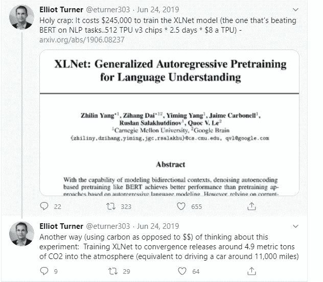
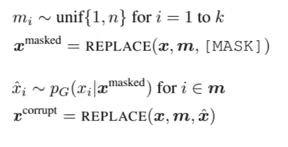
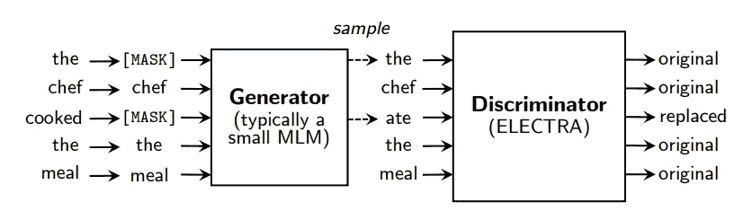
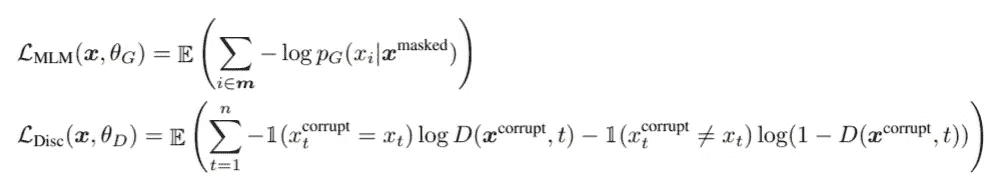
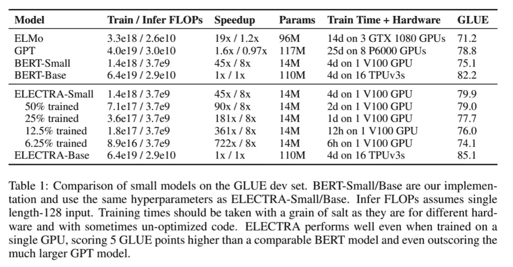
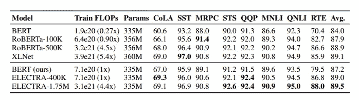

# 伊莱克特拉:掩蔽语言模型的发展

> 原文：<https://towardsdatascience.com/electra-developments-in-masked-language-modelling-3cf1c25fc61a?source=collection_archive---------43----------------------->

## 这是 ELECTRA 的主要功能概述，此处描述了一个模型:

[https://arxiv.org/pdf/2003.10555.pdf](https://arxiv.org/pdf/2003.10555.pdf)

有了 BERT 和 BERT 衍生的变形金刚(XLNet，RoBERTa，ALBERT，任何以芝麻街人物命名的变形金刚)，我清楚地知道，作为一个拥有单个 GPU 和没有行业支持的个人爱好者，我自己不可能训练一个深度学习语言模型。当我在 XLNet 上为 [AISC](https://ai.science/) 准备现场演示时(在 YouTube 上[这里](https://www.youtube.com/watch?v=Mgck4XFR9GA&t=2166s)，我看到了埃利奥特·特纳的这条推文:

埃利奥特·特纳发的这条推文的截图

我训练自己模特的模糊梦想破灭了。这是回到 2019 年，即之前的时代。我指的是在 GPT-3 之前，它使用了如此惊人的计算资源，以至于目前只有在你身后有八位数的情况下才能训练。这个模型引起了我的兴趣，理论上，在单个 GPU 上训练四天之后，ELECTRA-small 可以胜过 GPT-1。他们认为完整模型(ELECTRA-base)的性能与 XLNet 和 RoBERTa 相当，而使用的资源只有它们的大约四分之一。很有趣。这是什么方法论？

该模型的架构和大多数超参数与 [BERT](/bert-explained-state-of-the-art-language-model-for-nlp-f8b21a9b6270) 中的相同，因此这里不再赘述。

*替换令牌检测*是他们选择的预训练方法。BERT 用[MASK]有选择地替换序列中的记号，而 ELECTRA 使用生成器用看似合理的替代单词替换记号。

输入序列是记号列表**x**=【x1，… xn】。MLM 试图用其他似是而非的词来替换 k 个符号，得到一个 k 个掩码的列表[m1，…，mk]。对于这篇论文，他们建议屏蔽掉大约 15%的输入令牌。

这个过程产生了 **x** ^corrupt，这是一个在 m 个位置插入了看似合理的备选单词的记号列表。

然后，鉴别者的工作就是确定句子中的单词是原词还是改词。

MLM 和鉴别器的损失函数如下:

虽然这看起来很像一个甘，发电机是最大的可能性，而不是敌对训练。另一个区别是，如果生成器生成一个与原始令牌相同的令牌，该令牌将被标记为原始令牌，而不是生成令牌。

# 实验

这里的基本模型的预训练数据与 BERT 相同，是来自维基百科和图书语料库的 33 亿个标记。伊莱克特-拉奇在 XLNet 数据上接受训练，XLNet 数据通过 ClueWeb、CommonCrawl 和 GigaWord 添加到 BERT 数据中。

模型的评估是在 GLUE benchmark 和 SQuAD 上完成的，两者都在这里解释了。

**车型扩展**

伊莱克特做了一些改进，提高了模型的准确性。

**权重共享:**生成器和鉴别器中使用的嵌入是共享的。这在训练相同数量的时期时，在没有重量约束的情况下，使用相同的模型参数，在准确性上产生了小的提升。只有嵌入权重是共享的，共享所有权重具有要求两个网络大小相同的显著缺点。为什么这在这里工作得如此好的一个理论是，利用屏蔽语言建模，要被区分的输入记号和被破坏的记号驻留在相同的向量空间中。在这种情况下，生成器学习一个嵌入空间，鉴别器有效地学习一个嵌入空间和嵌入空间之间的变换是没有意义的。

**小型发电机:**

这在很大程度上是前面扩展的必然结果，因为如果生成器和鉴别器共享所有权重并且大小相同，则模型每个训练步骤需要的计算量是仅使用纯[掩码]令牌时的两倍。在这个模型中，他们探索使用一个 unigram 生成器来生成屏蔽令牌。由于使用了各种尺寸的发生器，他们选定的发生器大约是鉴频器尺寸的 0.25-0.5 倍。

**训练算法:**

Clark 等人从整体上为 ELECTRA 尝试了多种高级训练算法，并确定了以下内容:

1.  仅训练发生器(最大可能性)进行 *n* 步。
2.  用生成器的权重初始化鉴别器的权重。然后在 *n* 步中用鉴频器损失函数训练鉴频器，保持发电机的重量不变。

**大型型号:**

为了与典型尺寸的 SOTA 模型相比较，基本的 ELECTRA 必须相当大。他们使用与 ELECTRA-400k 相同的超参数和训练时间来训练自己的 BERT-Large 模型。

我很好奇的一点是，在这篇论文中，模型相对于彼此需要多长时间来训练是一个有点困惑的问题。他们说的是 ELECTRA-Large 和 BERT-Large 大小一样，但是他们也用和 ELECTRA-400k 一样的超参数和训练时间训练了自己的 BERT。他们描述的 ELECTRA 的卖点是使用更少的物理计算资源，但我希望他们在其他大型模型旁边更明确地概述这些物理和时间资源，以便进行比较。他们确实列出了 train FLOPs(每秒浮点运算次数)，这通常可以作为衡量他们的 GPU 计算速度的指标——但在附录中，他们澄清了“运算”被算作数学运算，而不是机器指令(通常是这样)。如果能对所使用的资源以及培训前和培训所花费的时间进行比较，我们将不胜感激。

胶水开发组的结果。

他们自己的模型使用 ELECTRA-400k 中使用的相同超参数进行训练。

**效率分析:**

他们怀疑，必须分析字符串中的所有记号，而不是填补显式掩码造成的空白，这导致了伊莱克特的效率提高。他们创造了伊莱克特 15%，它只计算被屏蔽掉的 15%令牌的鉴别器损耗。基地伊莱克特在胶水任务上得分 85%，而伊莱克特 15%得分 82.4%，与伯特的 82.2%不相上下。

**阴性结果**:

在这项研究中，他们尝试了许多训练范式，如模型大小、生成器架构、重量捆绑，有些范式普遍不成功，因此没有出现在论文的主体中。

1.  战略性地对稀有令牌应用屏蔽。与常规的 BERT 相比，这并没有导致任何显著的加速。
2.  提高发生器的温度，或不允许正确的字输出并没有改善结果。
3.  添加一系列句子级别的对比标记，就像 SpanBERT 的蒙面语言建模版本。这实际上降低了胶水和小队任务的模型分数。

**结论:**

虽然这不是对抗性训练，但它是对比学习如何有效应用于语言的一个例子。从广义上讲，对比学习包括区分观察到的数据点和虚构的例子。BERT、Ernie、XLNet、ELMo、RoBERTa 和 SpanBERT 都引入或扩展了屏蔽语言建模范例，其中模型猜测单个屏蔽标记的正确标记，伊莱克特通过引入屏蔽可能是鉴别器接收的序列中的任何标记的可能性来进一步扩展它。伊莱克特拉现在是拥抱脸和简单变形金刚的一部分。